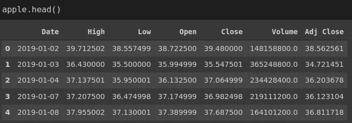
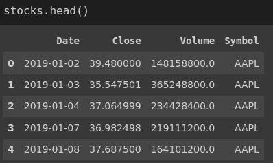
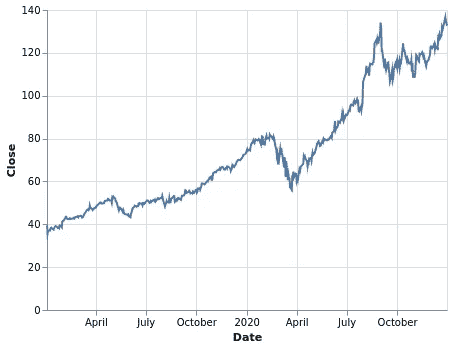
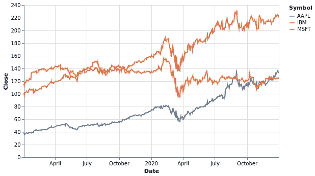
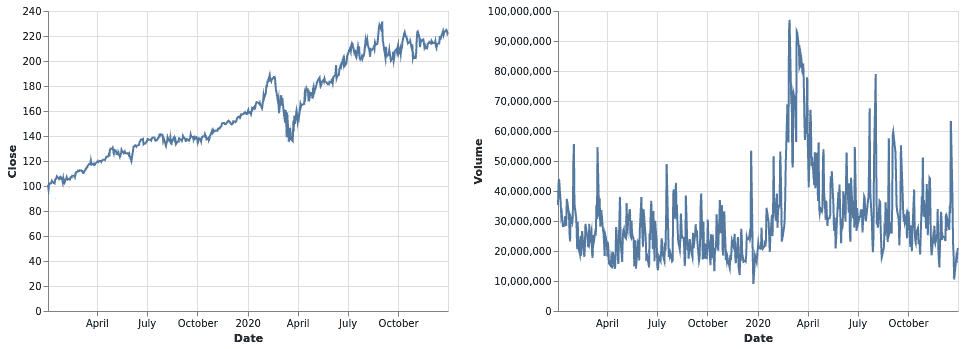
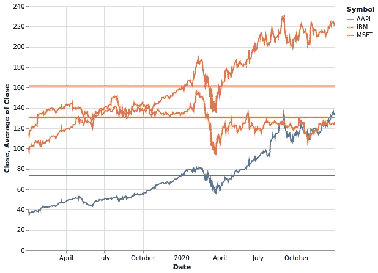

# 熊猫和牛郎星的股价分析

> 原文：<https://towardsdatascience.com/stock-price-analysis-with-pandas-and-altair-ef1e178cc744?source=collection_archive---------16----------------------->

## 熊猫和牛郎星实用指南


马库斯·温克勒在 [Unsplash](https://unsplash.com/s/photos/stock-price?utm_source=unsplash&utm_medium=referral&utm_content=creditCopyText) 上的照片

股票价格分析是时间序列分析的一个例子，时间序列分析是预测分析的主要领域之一。时间序列数据包含附加到连续时间戳的测量值或观察值。对于股票价格，时间戳可以是秒、分钟或天，这取决于任务。

这篇文章是一个实践指南，涵盖了股票价格分析中的一些基本和必要的操作。我们将使用 Pandas 进行数据操作，使用 Altair 进行数据可视化。两者都是数据科学中常用的 Python 库。

获取股价数据的资源有很多。我们将使用熊猫的数据阅读器 API。我们首先导入依赖项。

```
import numpy as np
import pandas as pd
from pandas_datareader import data
import altair as alt
```

我们现在可以使用数据读取器来创建包含股票价格数据的 Pandas 数据框架。

```
start = '2019-1-1'
end = '2020-12-31'
source = 'yahoo'apple = data.DataReader("AAPL", start=start ,end=end, data_source=source).reset_index()ibm = data.DataReader("IBM", start=start ,end=end, data_source=source).reset_index()microsoft = data.DataReader("MSFT", start=start ,end=end, data_source=source).reset_index()
```

我们使用 DataReader 函数来获取股票价格。股票名称、开始和结束日期以及来源是必需的参数。

该函数返回如下数据帧:



(图片由作者提供)

对于苹果、IBM 和微软，我们有一个单独的数据框架。最好将它们结合起来，但是我们需要一个列来指定股票的名称。

```
apple['Symbol'] = 'AAPL'
ibm['Symbol'] = 'IBM'
microsoft['Symbol'] = 'MSFT'
```

每个数据帧中的符号列表示名称。我们现在可以使用 Pandas 的 concat 函数将它们组合起来。

```
stocks = pd.concat(
    [apple[['Date','Close','Volume','Symbol']],
     ibm[['Date','Close','Volume','Symbol']],
     microsoft[['Date','Close','Volume','Symbol']]],
     axis=0)
```



(图片由作者提供)

我只包括了日期、收盘、成交量和符号栏。我们先创建一个苹果股价的基本线图。

```
(alt.
  Chart(stocks[stocks.Symbol == 'AAPL']).
  mark_line().
  encode(x='Date', y='Close'))
```



(图片由作者提供)

代码中的第一行是顶级图表对象。我们将要绘制的数据传递给这个对象。使用 symbol 列应用了一个筛选器，只包含属于 Apple 股票的数据。

在下一行中，指定了绘图的类型。编码功能指示要绘制的列。我们在 encode 函数中作为参数写入的任何内容都必须链接到传递给 Chart 对象的数据。

除了偶尔的几次下跌，苹果的股票价格似乎一直在上涨。2020 年 4 月的一次可能与冠状病毒引起的全球疫情有关。

我们可以在一个视图中显示所有三家公司的股票价格。

```
(alt.
  Chart(stocks).
  mark_line().
  encode(x='Date', y='Close', color='Symbol').
  properties(height=300, width=500)))
```



(图片由作者提供)

区分这些公司的是符号栏。它作为参数传递给 encode 函数的 color 参数。苹果和微软的股价也遵循类似的趋势。IBM 似乎受疫情的影响更大。

在最后一行，我们使用属性函数来改变图形的大小。

我们可以通过重新采样数据来平滑这条线。重采样基本上意味着用不同的频率表示数据。一种选择是使用重采样功能 Pandas。它根据指定的频率和聚合函数聚合数据。

```
msft_resampled = stocks[stocks.Symbol == 'MSFT'].resample('7D', on='Date').mean().reset_index()
```

上面的代码基于 7 天周期的平均值对 Microsoft 股票价格进行重新采样。

```
(alt.
  Chart(msft_resampled).
  mark_line().
  encode(x='Date', y='Close').
  properties(height=300, width=500))
```


(图片由作者提供)

唯一的区别是我们将重采样的数据传递给图表对象。这条线现在看起来顺畅多了。

Altair 使得在一个可视化中拥有多个图变得非常简单。例如，我们可以将微软股票的收盘价和成交量绘制如下。

```
price = (alt.
 Chart(stocks[stocks.Symbol == 'MSFT']).
 mark_line().
 encode(x='Date', y='Close'))volume = (alt.
 Chart(stocks[stocks.Symbol == 'MSFT']).
 mark_line().
 encode(x='Date', y='Volume'))price | volume
```



(图片由作者提供)

我们将每个图分配给一个变量。逻辑运算符可以很容易地组合变量。例如，“|”将它们并排放置，而“&”将第二个图放在第一个图的下面。

Altair 提供了许多选项，通过传达更多信息来丰富可视化效果。例如，我们可以添加一条线来表示平均值。

```
line = (alt.
         Chart(stocks).
         mark_line().
         encode(x='Date', y='Close', color='Symbol').
         properties(height=400, width=500))avg = (alt.
         Chart(stocks).
         mark_rule().
         encode(y='average(Close)', color='Symbol',   
                size=alt.value(2)))line + avg
```

第一个图是一个线图，就像前面创建的图一样。第二个图是计算每行平均值的规则。用 Altair 转换数据非常简单。例如，在第二个图的编码函数中，聚合用字符串(' average(Close)')表示。



(图片由作者提供)

在我们的例子中，我们可以直观地比较平均值，因为值之间有很大的差距。然而，当值接近时，指出平均值可能是有用的。

## 结论

时间序列数据有许多定义，所有这些定义都以不同的方式表示相同的含义。一个直截了当的定义是，时间序列数据包括附加到连续时间戳的数据点。

我们已经介绍了熊猫和牛郎星的一些基本操作。时间序列分析涵盖了更多的内容。事实上，这是一个非常复杂的话题，在这个领域已经做了大量的研究。

也就是说，理解基础知识然后开始更高级的话题几乎是有益的。

感谢您的阅读。如果您有任何反馈，请告诉我。