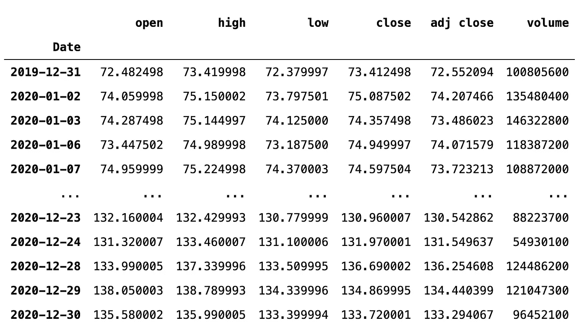
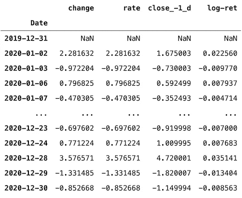
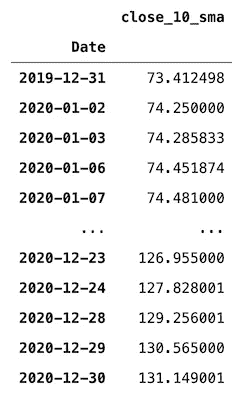
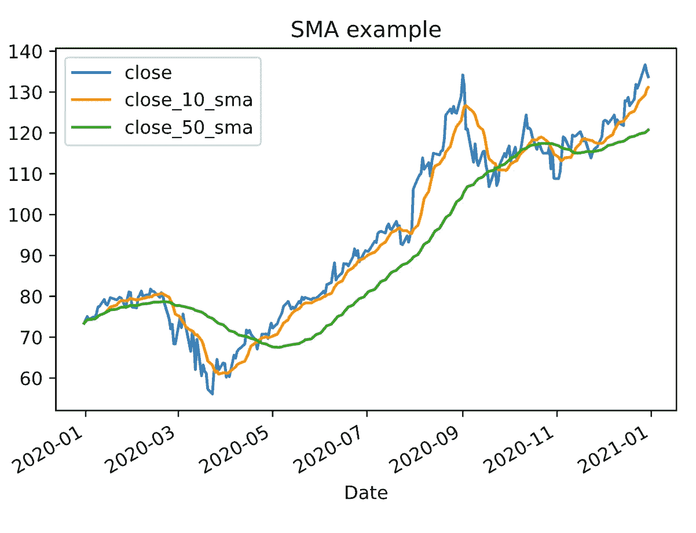
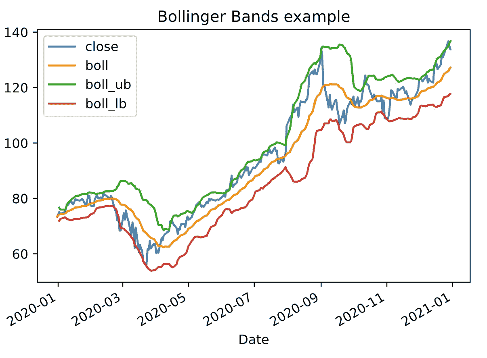
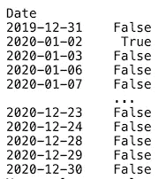

# stock stats——一个方便的面向股票的熊猫数据框架包装器

> 原文：<https://towardsdatascience.com/stockstats-a-handy-stocks-oriented-pandas-dataframe-wrapper-a879a06d9c3f?source=collection_archive---------8----------------------->


丹尼尔·劳埃德·布兰克-费尔南德斯在 [Unsplash](https://unsplash.com/s/photos/wall-street?utm_source=unsplash&utm_medium=referral&utm_content=creditCopyText) 上的照片

## 只需调用列名即可访问各种技术指标！

在这篇文章中，我想简单描述一下我最近遇到的另一个有趣的库— `stockstats`。它是一个位于`pandas`数据框架之上的包装库，其主要目标是提供对与股票价格相关的各种度量和技术指标的即时访问。让我们直接开始吧！

# 准备

在能够看到`stockstats`能提供什么之前，我们需要导入库并下载数据。

使用`yfinance`，我们从 2020 年开始下载苹果的 OHLC 价格(+成交量)。关于库的更多细节，请参考我的[其他文章](/a-comprehensive-guide-to-downloading-stock-prices-in-python-2cd93ff821d4)。

这些数据足以展示`stockstats`的特色。该库的主类是`StockDataFrame`，它是位于`pandas`数据框架之上的一个包装器。使用下面的代码片段，我们可以很容易地将后者转换成前者。

```
stock_df = StockDataFrame.retype(df)stock_df
```



作者图片

到目前为止，没有什么真正的变化，新的 DataFrame 包含了与以前完全相同的列，只是现在名称是小写的。

`stockstats`提供了一种非常有趣的方法来计算不同的度量——我们只需要选择我们想要看到的列，库将使用底层方法来计算请求的值。

让我们从一些可以用于分析的基本信息开始——股票回报。

```
stock_df[["change", "rate", "close_-1_d", "log-ret"]]
```



作者图片

使用正常的`pandas`选择列的方式，我们获得了请求的值，这非常方便。简单地说，对色谱柱的简短描述如下:

*   `change`/`rate` ——这些是简单回报，即股票价格之间的每日百分比变化。数值以百分比表示。
*   `close_-1_d` —这是时间 *t* 和 *t-1* 的差价。我们稍后将回到这个请求值的特殊方式是`stockstats`。
*   `log-ret` —日志返回。

值得一提的是，当我们像上面那样请求这些列时，我们只获得请求的输出。然而，完全相同的列被附加到源对象`stock_df`。

在小标题里我承诺了技术指标，那么我们来创建一个非常简单的——10 日简单移动平均线(SMA)。

```
stock_df[["close_10_sma"]]
```



作者图片

我们再次使用了请求定制指标的特殊方式。为了充分理解它，我们可以使用下面的模式`{columnName_window_statistics}`来查看所请求的列名，其中:

*   `columnName` —我们要计算指标的列的名称。在上面的例子中，我们使用了收盘价。
*   `window` —需要考虑多少观察结果。我们在上面使用了 10 天的窗口。
*   `statistics` —我们要计算的度量。在上面的例子中，我们使用了简单移动平均线(`sma`)。要获得所有可用指标及其对应列名的列表，您需要检查`stockstats`的 [GitHub repo](https://github.com/jealous/stockstats) 。

我们现在将结合一些我们已经看到的元素来创建一个收盘价和两条移动平均线的简单图。



作者图片

另外，`StockDataFrame`仍然保留了`pandas`数据帧的功能。所以使用一个方括号来请求一个列会产生一个`pandas`系列。我们可以使用 pandas 索引来分割数据帧，例如:

这个图与第一个图非常相似，但是它只包含从`2020–06–01`开始的数据。

另一个我们很容易计算和绘制的 TI 是布林线[。](https://www.investopedia.com/terms/b/bollingerbands.asp)



作者图片

还有很多技术指标可用，如相对强弱指数(RSI)，移动平均线收敛发散(MACD)，随机振荡器，威廉超买/超卖指数，平均真实范围(ATR)，等等。

所有这些指示器都使用一些基于行业标准的硬编码窗口值。例如，使用 20 天移动平均线(`BOLL_PERIOD`)计算布林线，布林线位于 2 个标准差处(`BOLL_STD_TIMES`)。我们可以通过访问`StockDataFrame`的相应元素来覆盖它们。

最后，当我们玩弄技术指标时，我们经常想要创造信号——这是一个买入/卖出的信号。一些简单而流行的策略包括检查一个值是否在另一个值的上方/下方交叉。`stockstats`也提供这样的功能。

```
stock_df["close_xu_close_20_sma"]
```



作者图片

我们得到一个布尔序列，表明收盘价是否越过了相同收盘价的 20 天 SMA。我们还可以请求更复杂的交叉，例如两个 SMA 的交叉。

```
stock_df["close_10_sma_xd_close_50_sma"]
```

在这种情况下，当 10 日均线穿过 50 日均线时，我们得到一个信号，两者都是用收盘价计算的。

# 意见

`stockstats`绝对是一个有趣的库，在做一些股票价格的快速分析时可以派上用场。它还提供了一种独特的方法，通过选择适当的列名来计算所请求的指标。熟悉用于访问组合指标的模式可能需要一段时间。

然而，该库的文档记录很少。大部分信息可以从[回购](https://github.com/jealous/stockstats)中的`README`文件中获得，或者直接通过检查[代码](https://github.com/jealous/stockstats/blob/dd823d3a1c4c2c0de12c99a1140476e5362f3fac/stockstats.py#L77)获得。但这也提供了一个窥视技术指标是如何计算的可能性，这是一个很好的学习经历。

# 外卖食品

*   `stockstats`是一个位于`pandas`数据框架之上的包装器，提供对各种股票相关指标的便捷访问。
*   该库提供了广泛的流行技术指标，如 SMA、EMA、RSI、MACD 等。
*   您可以通过调用所需的列名来计算指标，所有这些都将在幕后处理。

您可以在我的 [GitHub](https://github.com/erykml/medium_articles/blob/master/Quantitative%20Finance/stockstats.ipynb) 上找到本文使用的代码。此外，欢迎任何建设性的反馈。你可以在推特上或者评论里联系我。

如果你对学习如何使用 Python 进行量化金融感兴趣，你可能想看看 [Quantra](https://www.quantra.quantinsti.com/?ref=eryklewinson) ( *免责声明:附属链接*)，它提供了关于这个主题的各种不同的课程。

***注来自《走向数据科学》的编辑:*** *虽然我们允许独立作者根据我们的* [*规则和指导方针*](/questions-96667b06af5) *发表文章，但我们不认可每个作者的贡献。你不应该在没有寻求专业建议的情况下依赖一个作者的作品。详见我们的* [*读者术语*](/readers-terms-b5d780a700a4) *。*

如果您喜欢这篇文章，您可能还会对以下内容感兴趣:

[](/quantra-a-python-coding-platform-to-learn-quantitative-finance-8e5e88c89120) [## quantra——学习量化金融的 Python 编码平台

towardsdatascience.com](/quantra-a-python-coding-platform-to-learn-quantitative-finance-8e5e88c89120) [](/introduction-to-the-hurst-exponent-with-code-in-python-4da0414ca52e) [## 赫斯特指数简介 Python 代码

towardsdatascience.com](/introduction-to-the-hurst-exponent-with-code-in-python-4da0414ca52e) [](/5-free-tools-that-increase-my-productivity-c0fafbbbdd42) [## 5 个提高我工作效率的免费工具

### 这不是一个好的 IDE，尽管它很有帮助！

towardsdatascience.com](/5-free-tools-that-increase-my-productivity-c0fafbbbdd42)