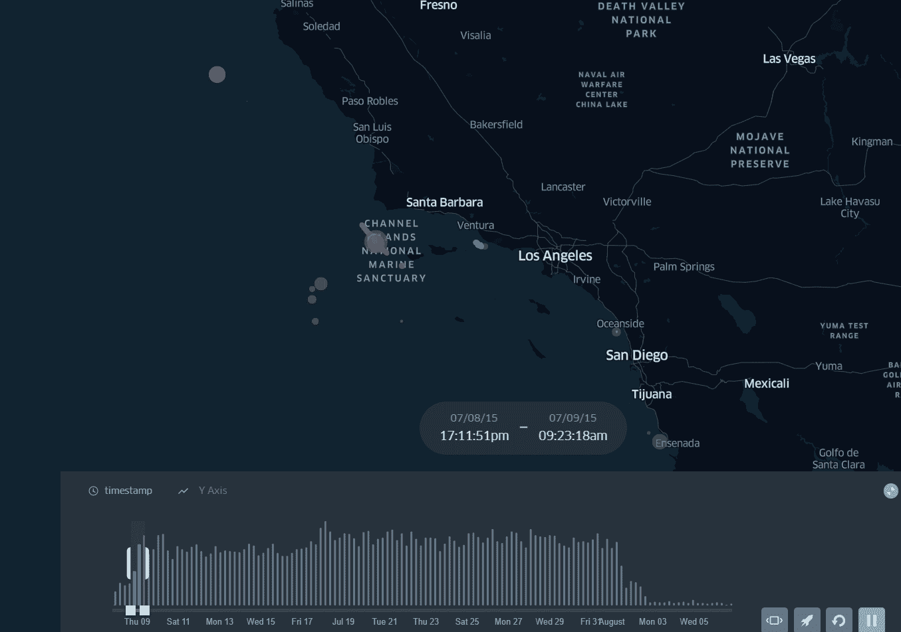
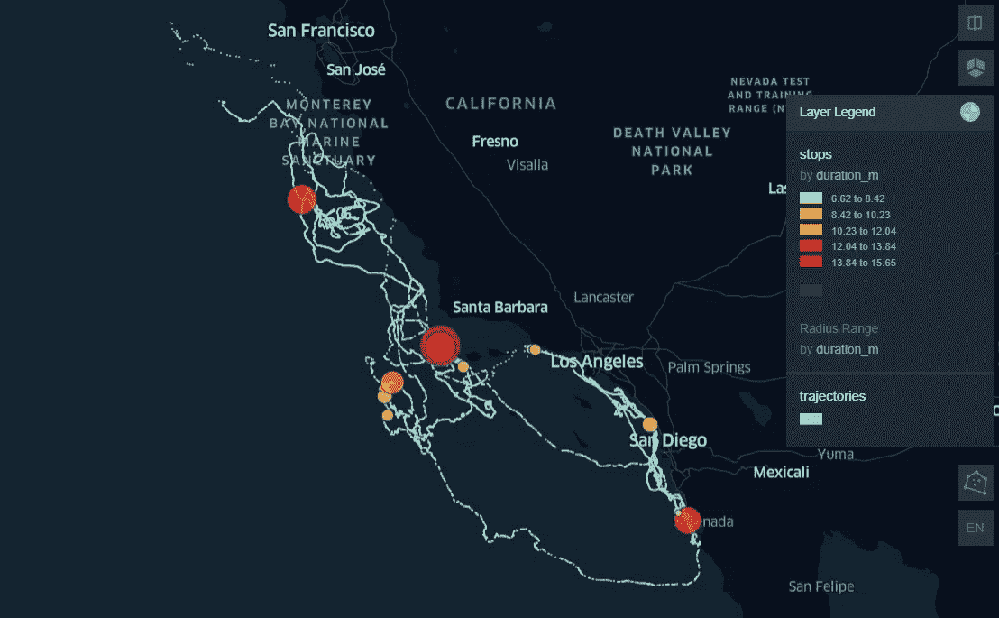
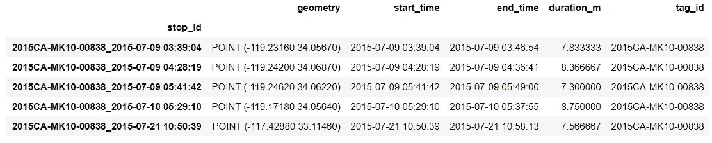
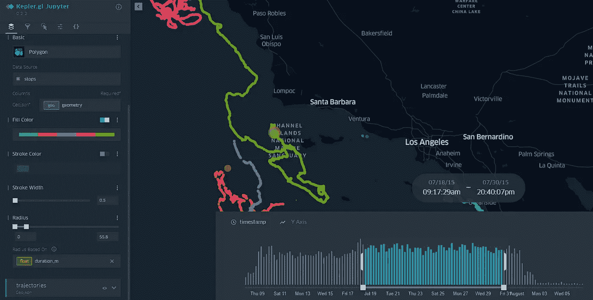

# 蓝鲸 GPS 追踪中的停止检测—移动熊猫 0.6

> 原文：<https://towardsdatascience.com/stop-detection-in-blue-whales-gps-tracking-movingpandas-0-6-55a4b893a592?source=collection_archive---------33----------------------->

## 如何用 KeplerGL 中的海洋巨型动物 GPS 轨迹创建地图动画



图片由作者提供。GPS 轨迹的地图动画。

我们又来了移动熊猫。由 [**Anita Graser**](https://anitagraser.com/) 开发的 python 库是分析运动数据的有力工具。在后期的帖子里，我发表了[如何创建*地图动画*以及如何用鸟类迁徙数据](/stop-detection-in-gps-tracks-movingpandas-keplergl-point-map-with-stops-duration-in-bird-664064b3ccbc) (GPS 追踪)提取*停靠点*作为点。Movingpandas 0.6 新版本中的 ***停靠点检测算法*** 直接将停靠点作为点返回，这绝对是我想要包含在带有移动数据的工作流中的，因为它大大简化了编码。尤其是带着一个`TrajectoryCollection`。

对于本教程/工作流，我使用 GPS 数据在南加州跟踪蓝鲸，以创建一个[地图动画与停止的持续时间](https://bryanvallejo16.github.io/stop-detection-whale-tracking/)。收集数据集是为了研究海洋巨型动物的深潜行为对定位误差的影响。为了更好地理解，您可以查看 Irvin 等人(2020)在动物生物遥测学上发表的[论文，并在 Movebank 中查看](https://animalbiotelemetry.biomedcentral.com/articles/10.1186/s40317-020-00207-x) [GPS 数据集](https://www.movebank.org/cms/webapp?gwt_fragment=page=studies,path=study943824007)的详细信息。

这个 demo 最后的地图动画是 [**这里！**](https://bryanvallejo16.github.io/stop-detection-whale-tracking/)按下播放，探索！
此处储存有分析工作流[和**！**](https://github.com/bryanvallejo16/stop-detection-whale-tracking)



图片由作者提供。鲸鱼追踪，以分钟为单位的停止持续时间

鲸鱼运动数据集包含了从 2014 年 8 月到 2015 年 8 月收集的*鲸豚*和*鲸豚*的 13 条鲸鱼轨迹。在这个演示练习中，我将只使用时间范围为 2 个月的 5 条轨迹:2015.07 到 2015.08 *。*请记住，在移动熊猫 中使用 ***停止检测算法时，您必须参照持续时间和搜索电台指定停止参数。在这种情况下，我将 ***指定为最小 5 分钟，并将搜索无线电指定为 30 米*** 。但是，您可以指定您认为适合您的研究的内容。如果你正在研究鲸鱼的进食行为，那么考虑一下它们在同一个地方一跳就能捕捉到食物。我决定在 30 米的搜索收音机上选择 5 分钟，因为这足以找到车站。我会考虑关于浮游植物的重叠信息，这样我们就能确认鲸鱼提供午餐的地点。***

让我们把手放在。你可以在本帖 的 [***库中查看材料，但这里的分析示例将分为三个部分进行说明:
1)将移动数据集格式化为移动熊猫。写一个函数，在移动熊猫 0.6 中返回停止点。
3)开普勒 GL 中的地图动画。***](https://github.com/bryanvallejo16/stop-detection-whale-tracking)

***1)将运动数据集格式化为运动熊猫***

这个过程是在 Jupyter 笔记本中完成的，所以首先，我们导入所有需要的库。请确保您使用的是移动熊猫 0.6。

```
import pandas as pd
import geopandas as gpd
from datetime import datetime, timedelta
from keplergl import KeplerGlimport movingpandas as mpd
print(mpd.__version__)import warnings
warnings.simplefilter(“ignore”)
```

然后，我们读取包含在地理数据框架`df`的存储库中的鲸鱼运动数据集。在运行过程中，用我们在本演示中使用的 5 头鲸鱼(标签 ID)对表进行分组。

```
# opening file
cd = r’data/whale-movement.geojson’
file = open(cd)
df= gpd.read_file(file)# subset of 5 whales
fiveset = ['2015CA-MK10-00838', '2015CA-MK10-00840', '2015CA-MK10-04177', '2015CA-MK10-05650', '2015CA-MK10-05654']
df = df.loc[df['tag_ident'].isin(fiveset)]
```

为了使移动数据集准备好用于移动熊猫，有必要将索引格式化为*日期时间格式。*接下来是 *:*

```
# preparing the data for movingpandas
df[‘t’] = pd.to_datetime(df[‘timestamp’])
df = df.set_index(‘t’).tz_localize(None)
```

至于建议。确保您的地理数据框架`df`具有 CRS `WGS84`。目前，我们已经用`DateTime index`和 5 只鲸鱼的子集格式化了表格。新子集的时间范围从 2015 年 7 月到 2015 年 8 月。现在我们打算用它来移动熊猫。

***2)在移动熊猫 0.6*** 中返回停止点的功能

在本节中，我将创建一个函数，该函数返回一个以停靠点为点的 ***地理数据框*** ，并包含一个以**分钟**为单位的停靠持续时间列和另一个以鲸鱼的**标签 id** 为单位的列。请注意，该函数使用以分钟为单位的参数。你可以在我最近的帖子中找到以小时为单位的[参数的例子，在](/stop-detection-in-gps-tracks-movingpandas-keplergl-point-map-with-stops-duration-in-bird-664064b3ccbc)[安妮塔·格拉泽库](https://mybinder.org/v2/gh/anitagraser/movingpandas/master?filepath=tutorials/3-stop-detection.ipynb)中找到以秒为单位的例子。停靠点代表轨迹的一段，而作为点的停靠点是该段轨迹的起点。

该函数的参数有:***moving _ df<geodata frame>***，***traject _ id _ column<string>***，***minutes<number>***，***search radio<number>***。笔记本中对它们进行了解释，但这里只是简单地说明如下:

```
def get_stop_point_traj_collection(moving_df, traject_id_column, minutes, searchradio):

    all_stop_points = gpd.GeoDataFrame()

    # create a traj collection with movingpandas
    traj_collection = mpd.TrajectoryCollection(moving_df, traject_id_column)

    for i in range(len(traj_collection)):# create a stop detector
        detector = mpd.TrajectoryStopDetector(traj_collection.trajectories[i])

        # stop points
        stop_points = detector.get_stop_points(min_duration=timedelta(minutes=minutes), max_diameter=searchradio)

        # add duration to table
        stop_points['duration_m'] = (stop_points['end_time']-stop_points['start_time']).dt.total_seconds()/60

        # add ID
        stop_points['tag_id'] = [tag.split('_')[0] for tag in stop_points.index.to_list()]

        all_stop_points= all_stop_points.append(stop_points)

    return all_stop_points
```

然后，我们将它与带有 GPS 记录的地理数据框架`df`一起使用，我们将鲸鱼的标签 id 包含在列`tag_ident`中，将`5`分钟用于停止检测，将`30`米作为搜索无线电。

```
%%time
whale_stops = get_stop_point_traj_collection(df, ‘tag_ident’, 5, 30)
```

如果您用行`whale_stops.head()`检查最终表格`whale_stops`，您将看到一个如下所示的漂亮表格:



图片由作者提供。将鲸鱼停靠点作为移动熊猫分析的点的表

***3)开普勒 GL*** 中的地图动画

在 KeplerGL 中工作的第一步是避免列中的 ***日期时间格式*** 。我们将移除地理数据框中的 ***日期时间格式*** 以及所有 GPS 轨迹`df`和地理数据框`whale_stops`。使用下一个代码:

```
# remove datetime format for GPS tracks
df = df.reset_index(drop=True) # remove datetime format for whale stops
whale_stops[[‘start_time’, ‘end_time’]] = whale_stops[[‘start_time’, ‘end_time’]].astype(str)
whale_stops= whale_stops.reset_index(drop=True)
```

然后，我们创建一个 KeplerGL 实例，并添加两个地理数据框:`df`和`whale_stops`，代码如下:

```
# Create KeplerGl instance
m = KeplerGl(height=600)# Add stop durations
m.add_data(whale_stops, ‘stops’)# Add gps records
m.add_data(df, ‘trajectories’)
```

现在你可以通过 [KeplerGL](https://kepler.gl/) 调用实例来格式化贴图动画。

```
m
```



图片由作者提供。在 KeplerGL 中格式化地图动画

我们可以观察到鲸鱼是如何偏好停在海峡群岛国家海洋保护区附近的。也许附近有个喂食的好地方。

最后，保存用下一行格式化的地图:

```
# Save map as html
m.save_to_html(file_name=’index.html’)
```

这就是全部！现在你可以[可视化你的鲸鱼 GPS 轨迹的移动](https://bryanvallejo16.github.io/stop-detection-whale-tracking/)。
本教程/帖子主要关注移动熊猫 0.6 的使用和停止检测算法。如果您有任何问题，请随时通过[联系我，我在 LinkedIn 上的个人资料](https://www.linkedin.com/in/bryanrvallejo/)。