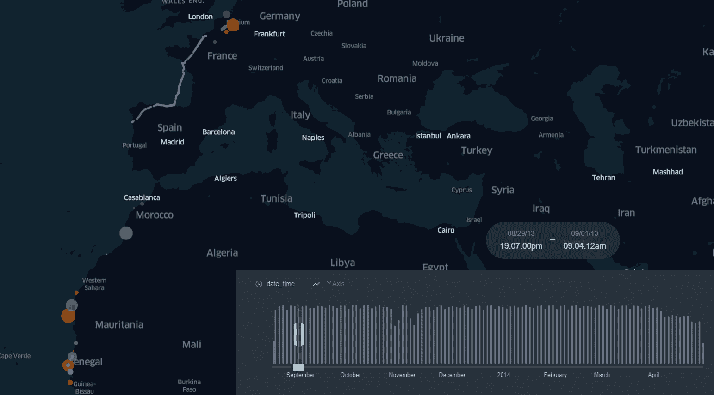
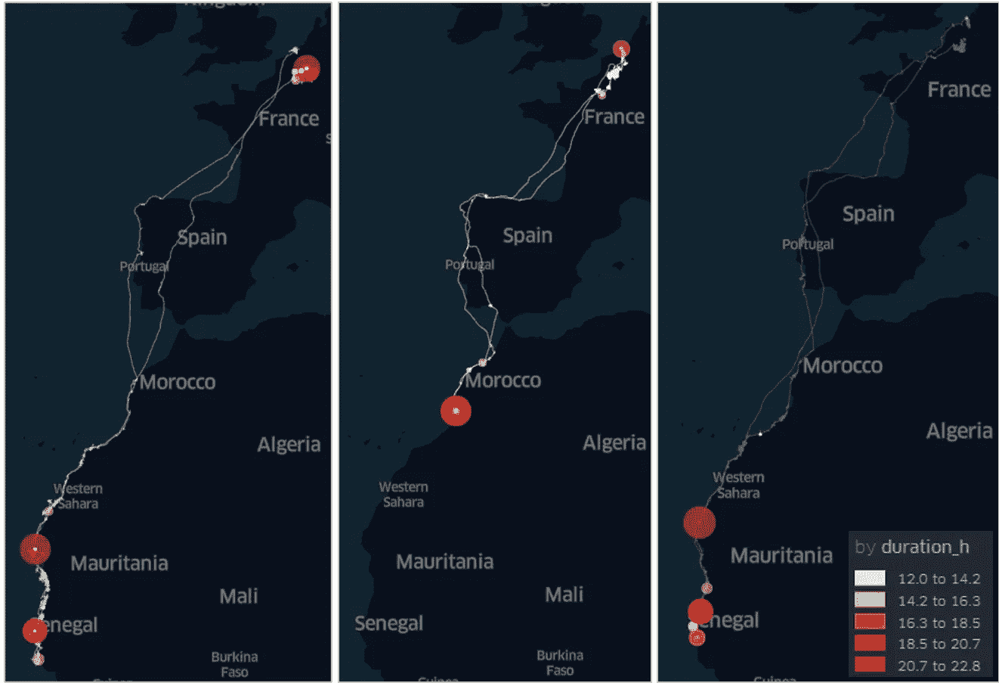
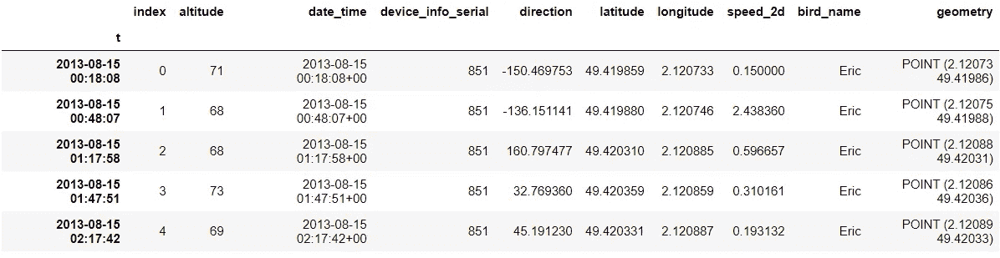
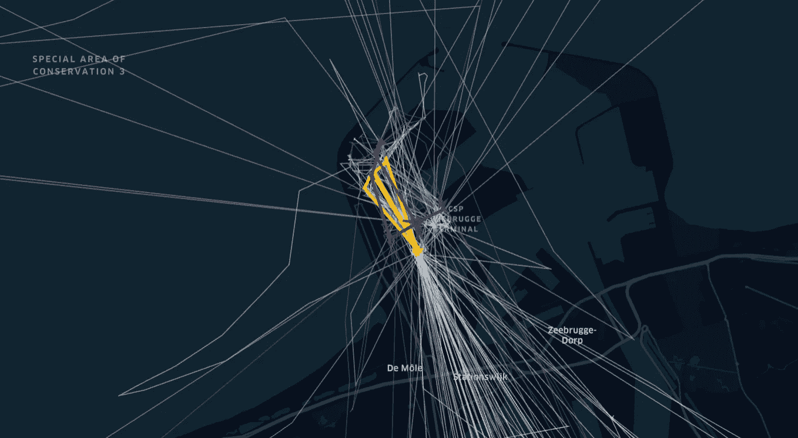
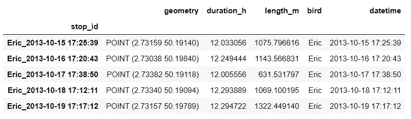
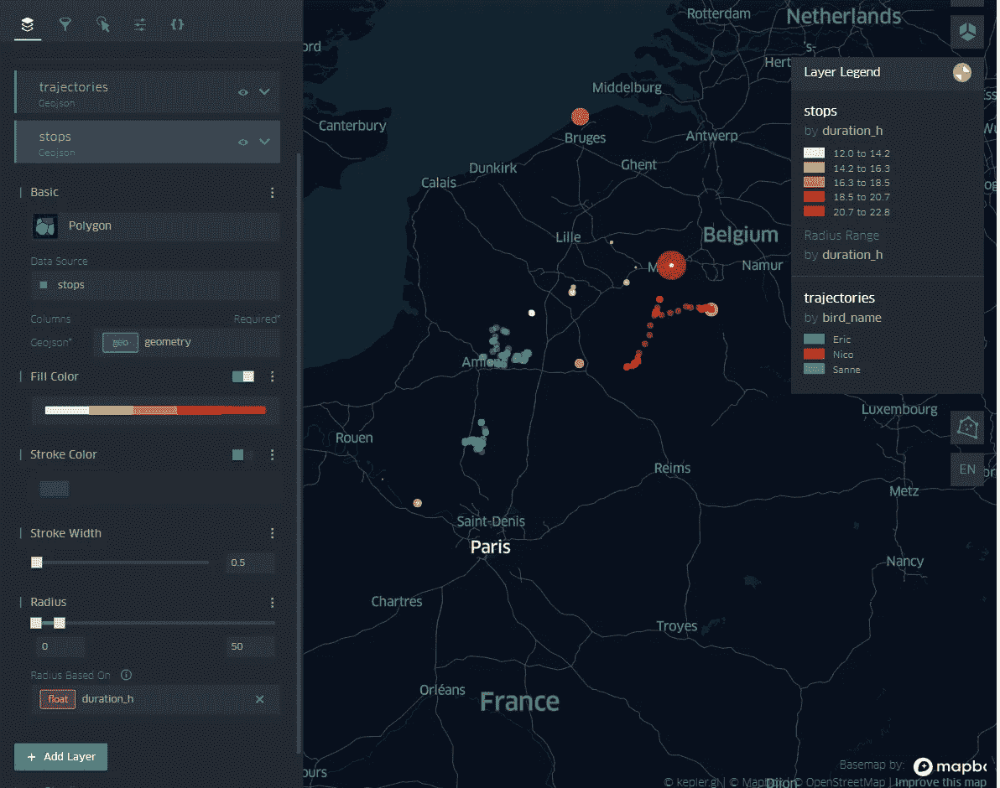

# GPS 轨迹中的停止检测—移动熊猫和开普勒

> 原文：<https://towardsdatascience.com/stop-detection-in-gps-tracks-movingpandas-keplergl-point-map-with-stops-duration-in-bird-664064b3ccbc?source=collection_archive---------14----------------------->

## 如何在鸟类迁徙追踪中创建带有停留时间的点地图



图片由作者提供，GPS 轨迹的地图动画。

在过去的几个月里，我通过分析移动数据(GPS 跟踪数据)发现了 [**移动熊猫**](https://github.com/anitagraser/movingpandas) 的力量。由 [**Anita Graser**](https://anitagraser.com/) 开发的这个 python 库包含了让以非常方便的方式操作运动数据的算法。提出运动分析的问题与旅行行为模式有关，并找出被跟踪对象以特定方式运动的原因。真正抓住我并最吸引我的是 ***停止检测算法*** ，它在特定的搜索半径(即邻域)内找到被跟踪的对象在轨迹中具有特定持续时间(停止)的路段。在这一点上，使用这种算法的想法可以在例如交通分析中的城市应用、繁殖行为的生物学应用、迁移分析的地理学应用中得到推广，你可以找到更多。关键的一点是，作为一名分析师，你必须在时间和搜索半径上保持明确和合理的参数。时间将揭示你可能想要发现的活动，例如在娱乐中心花费的时间和搜索半径社区/城市的大小。

本帖最终地图动画可以在 [**这里**](https://bryanvallejo16.github.io/stop-detection-bird-tracking/) ！
按下播放，探索！
这里分析 [**这里分析**](https://github.com/bryanvallejo16/stop-detection-bird-tracking) ！



图片由作者提供，鸟类轨迹中带有停留时间的点地图。

让我们把手放在它上面。在这个分析示例中，我使用了来自[全球生物多样性信息中心](https://www.gbif.org/)的数据集，其中包含三只黑背鸥的 GPS 记录:Eric、Nico 和 Sanne。你可以在 GBIF 网站上找到有更多海鸥的[整个数据集](https://www.gbif.org/occurrence/download/0220376-200613084148143)，这三种鸟类的数据集在本文 的 [***资源库中。该过程分为三个部分进行解释:1)使用 Geopandas 创建图层，2)使用移动 pandas 进行停止检测，3)使用 KeplerGl 进行点地图可视化。***](https://github.com/bryanvallejo16/stop-detection-bird-tracking)

***1。使用 Geopandas* 创建图层**

我们将在一个 Jupyter 笔记本中完成整个分析，因此导入我们将要使用的所有 python 库是非常有效的。

```
import pandas as pd
import geopandas as gpd
import movingpandas as mpd
from shapely.geometry import Point
from pyproj import CRS
from keplergl import KeplerGl
from datetime import datetime, timedelta
```

然后，过程变得简单。读取 CSV 文件，添加几何列，在 WGS84 中创建地理数据框。是这样的:

```
# Reading file
fp = r'data/bird_tracking_data.csv'
data = pd.read_csv(fp)# Creating a geometry column as Point geometry
data['geometry'] = [Point(long, lat) for long, lat in zip(data['longitude'].to_list(), data['latitude'].to_list())]# Creating a Geodataframe. Be aware it is CRS 4326 WGS84
geodata = gpd.GeoDataFrame(data, crs = CRS.from_epsg('4326'))
```

现在我们有了`geodata`我们可以开始下一个使用移动熊猫的部分。

**②*。停止侦测移动的熊猫***

在创建移动熊猫的轨迹之前，第一个主要步骤是在`geodata`中添加*时间戳*作为索引

```
# Create timestamp with Pandas datetime. Inclue None as timezone
geodata['t'] = pd.to_datetime(geodata['date_time']).dt.tz_localize(None)# Set timestamp as Index
geodata = geodata.set_index('t')geodata.head()
```

你会有一张漂亮的桌子，如下图所示:



图片由作者提供，表格准备好用于移动熊猫分析

此时，您可以分析数据集的一些特征，如长度(61920 条记录)和本例中的鸟总数:Eric、Nico 和 Sanne。跟踪的时间范围从 2013 年 8 月 15 日开始，到 2014 年 4 月 30 日结束，共 9 个月。

对于移动熊猫，您可以创建一个`TrajectoryCollection`,指定轨迹的 ID，在本例中是带有鸟的名字的列。

```
# Create a Trajectory Collection with Movingpandas
traj_collection = mpd.TrajectoryCollection(geodata, 'bird_name')
```

在 Anita Graser 的资源库中，您可以探索这个`TrajectoryCollection`的属性，但在这里我将直接继续讨论 ***停止检测算法*** 。当我们探索 9 个月的鸟类轨迹数据集时，我将在 1000 米的局部水平上以适度的*搜索*半径识别鸟类的停留，停留持续时间*为 12 小时或更长。*

```
# Define parameters in Hours and Search radius in meters
Hours = 12
SearchRadio = 1000# stop detection
stops = mpd.TrajectoryStopDetector(traj_collection).get_stop_segments(min_duration=timedelta(hours=Hours), max_diameter=SearchRadio)
```

注意！关于 ***停止检测算法*** 的一些有趣的事情是，每一次停止代表一段轨迹。所以，这一段是海鸥在 1 公里搜索半径内花了 12 个小时的地方。从逻辑上讲，作为一段轨迹的停止点具有持续时间、长度、起点、开始时间、终点和结束时间(以及其他属性，如速度)。作为一个快速视图，您可以看到下一个捕捉中的停靠点:



作者图片，停止可视化(轨迹段)

为了得到一个点地图作为最终输出，我们将使用停止的起点。在这一点上，我们汇总了停止持续时间，这基本上意味着在停止(轨迹段)中花费的总时间。为了聚合点中的停止持续时间，我们创建了一个新的地理数据框，其中包含了该属性。接下来是代码:

```
# Create a new Geodataframe and define geometry column
stops_start = gpd.GeoDataFrame(columns = ['geometry'])
stops_start = stops_start.set_geometry('geometry')# Add the ID of each stop track and define it as index
stops_start['stop_id'] = [track.id for track in stops.trajectories]
stops_start= stops_start.set_index('stop_id')# Iteration over the Stop Trajectories
for stoptrack in stops.trajectories:

    # add stop duration in hours
    stops_start.at[stoptrack.id,’duration_h’] =stoptrack.get_duration().total_seconds()/3600

    # add length
    stops_start.at[stoptrack.id, 'length_m’]=stoptrack.get_length()

    # add bird name
    stops_start.at[stoptrack.id, 'bird’]=stoptrack.id.split(’_’)[0]

    # add datetime
    stops_start.at[stoptrack.id, 'datetime’]= pd.to_datetime(stoptrack.id.split(’_’)[1]).tz_localize(None)

    # geometry with start point
    stops_start.at[stoptrack.id, 'geometry’] = stoptrack.get_start_location()

stops_start.head()
```

你会有一张漂亮的桌子，看起来像这样:



图片由作者提供，停止持续时间表已准备好进行可视化

请记住，在接下来的步骤中，KeplerGl 不接受时间戳类型，为了避免混淆，我们必须重置索引`geodata` 和`stops_start`。您只需运行这些行:

```
# Reset indexes
stops_start = stops_start.reset_index(drop=True)
geodata= geodata.reset_index(drop=True)
```

***3。用开普勒 Gl*** 实现点地图可视化

KeplerGl 是由优步开发的一个强大的 python 库，它有助于以一种非常有效的方式可视化大量的点。我发现适合运动数据的是，你可以添加一个时间窗口，并将其作为地图动画播放。运动数据中的动画有助于可视化之前提到的旅行行为，这篇文章旨在让您可视化鸟类的轨迹，它们在哪里停留了多久。

从 KeplerGl 开始，首先创建一个实例:

```
# Create KeplerGl instance
m = KeplerGl(height=600)
```

然后将数据添加到实例中。我们想要可视化的是停止和轨迹。因此，您添加了下一个地理数据框:

```
# Add stop durations
m.add_data(stops_start, 'stops')# Add gps records
m.add_data(geodata, 'trajectories')
```

调用实例后，您可以在 KeplerGl 控制台中编辑可视化，并放置颜色、大小、过滤器等。请记住，我们需要一个基于持续时间的点地图，所以我们在点大小中添加了以小时为单位的持续时间。您还可以添加时间过滤器。

```
m
```



一旦找到了最佳的可视化效果，就可以将地图保存为 Html 格式以供发布。在这里你可以查看 [**这张最终地图**](https://bryanvallejo16.github.io/stop-detection-bird-tracking/) 。用下一行:

```
# Save map as html
m.save_to_html(file_name='index.html')
```

仅此而已！
在您自己的研究中使用 stop 检测算法找到最佳见解。如果你需要工作流自动化方面的支持，我可以支持你。[查看我的简介](https://www.linkedin.com/in/bryanrvallejo/)。