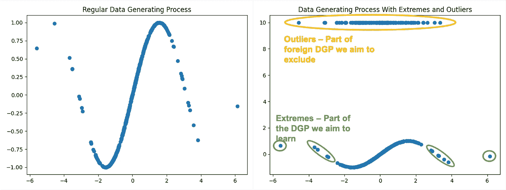
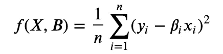
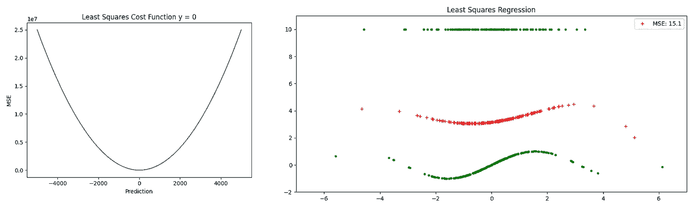
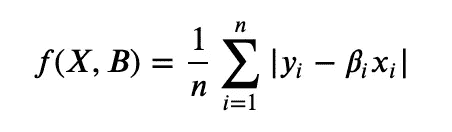
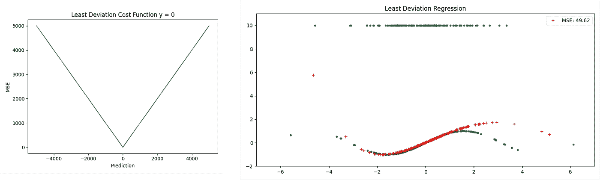
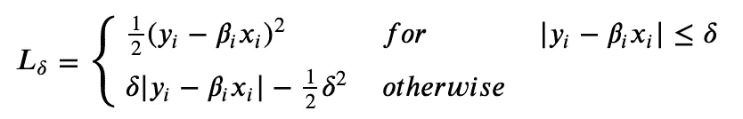
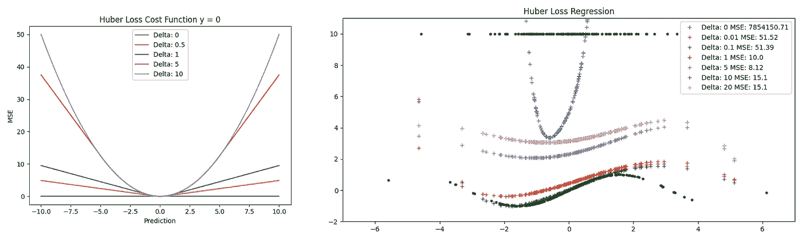
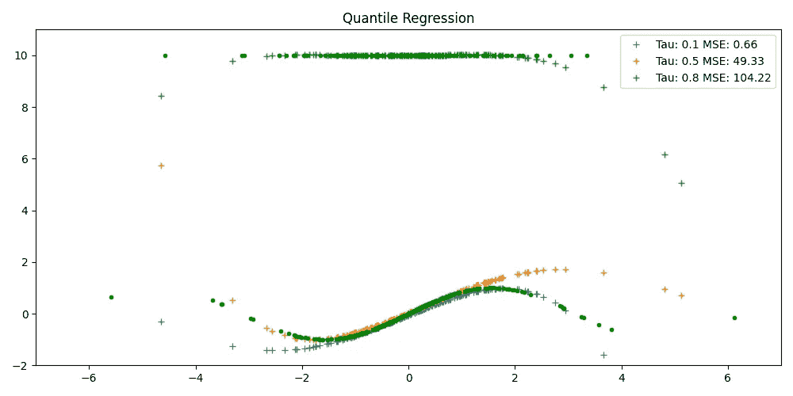

# 停止丢弃离群值！3 次升级，让你为现实世界的线性回归做好准备

> 原文：<https://towardsdatascience.com/stop-dropping-outliers-3-upgrades-that-prepare-your-linear-regression-for-the-real-world-37693a5fc0bb?source=collection_archive---------31----------------------->

## 如何教你的回归区分相关异常值和无关噪声

威尔·梅尔斯在 [Unsplash](https://unsplash.com?utm_source=medium&utm_medium=referral) 上拍照

你是巴塞罗那足球俱乐部的数据科学家，负责构建一个模型，预测未来 2 年、5 年和 10 年年轻人才的价值增长。您可能希望回归一些有意义的指标的值，如助攻数或进球数。有些人现在可能会应用这个标准程序，从数据集中删除最严重的异常值。虽然你的模型可能平均预测得不错，但不幸的是，它永远也不会理解是什么造就了梅西(因为你把梅西和所有其他“离群值”放在了一起)。

在回归问题中丢弃或替换异常值的想法来自于这样一个事实，即简单的线性回归比较容易在数据中出现极端值。然而，这种方法对您作为 Barcelona 的数据科学家没有太大帮助。简单的信息:**离群值并不总是坏的！**

我们通常希望了解真实数据生成过程的每一个细节(DGP)。因此，我们需要应用足够稳健的回归方法来区分有意义的极端值和无意义的异常值。以下案例说明了这些问题。我们将比较几种稳健回归技术在一个简单回归问题上的表现。在本文中，所有方法都是从零开始实现的。

## 简单回顾一下线性回归

有大量优秀的文章详细描述了线性回归背后的数学和直觉。如果你需要详细的复习检查[这里](/linear-regression-from-scratch-cd0dee067f72)或者[这里](/everything-you-need-to-know-about-linear-regression-b791e8f4bd7a)。为了我们的缘故，让我们只是提醒我们，我们的目标是预测一个给定的目标 y 的数据点 x。

我们回归的一般形式和矩阵形式如下:

线性回归的一般形式

我们训练回归模型的目标是学习图示的参数向量β。为了达到这个目的，我们最小化一个预定义的成本函数，这个函数描述了任何可能的 beta 向量的残差。

## 数据生成

为了测试现有回归技术的稳健性，我们首先需要一个数据集来说明极端值和异常值的概念。我们选择了一组具有 4 个自由度的 Student-t 分布的点，用正弦变换作为我们的基本真理 DGP。然后，我们在 y 方向添加一些强异常值。

## (普通)最小二乘法

您正在 Excel、Python 或任何其他工具中应用开箱即用的线性回归函数？那么 OLS 很可能就是你正在使用的。事实上，最小二乘法确实是一个很好的选择，因为它的成本函数是凸的，并且在 0 处可微。这使得优化变得非常容易。下图直观地显示了最小化简单的抛物线最小二乘损失函数是高中数学。另外，[普通最小二乘](https://en.wikipedia.org/wiki/Ordinary_least_squares#:~:text=In%20statistics%2C%20ordinary%20least%20squares,in%20a%20linear%20regression%20model.&text=Under%20these%20conditions%2C%20the%20method,the%20errors%20have%20finite%20variances.)捷径给出了你解的一步估计。

最小平方损失函数

听起来天衣无缝？可悲的是，简单是有代价的。在等式中，我们看到残差的非负性是通过平方来保证的。这导致了一个平滑的函数，但也增加了我们对大残差的权重。实际上，我们教导我们的回归线认为异常值对接近拟合的值更重要。这使得最小二乘法特别容易出现异常值。在数据集上运行简单的最小二乘回归时，我们可以看到毁灭性的结果。那么我们能做些什么来改善这种情况呢？

最小二乘损失(左)；带有“+”标记的最小二乘回归线和带有“o”标记的基础训练数据(右)

*你可以在我的 Repo* *中找到从零开始实现最小二乘回归的* [*或本文常用的库如*](https://github.com/jakobap/Methods-of-Robust-Linear-Regression/blob/d8c55ea1c382e8384531484b63dfe2c05fd07388/main.py#L110-L111)[*Scikitlearn*](https://scikit-learn.org/stable/modules/generated/sklearn.linear_model.LinearRegression.html)*或*[*stats models*](https://www.statsmodels.org/stable/generated/statsmodels.regression.linear_model.OLS.html)*。*

# 升级#1:最小绝对偏差

鉴于我们对最小二乘的讨论，简单地抛弃平方残差惩罚是直接的。最小绝对偏差通过评估绝对残差而不是平方残差来确保积极性。这种影响在下面的成本函数中是可见的。

绝对偏差损失函数

与上面的最小二乘法相比，关于可微性的不利性质通过观察是可见的。然而，在许多情况下，这是有区别的。在我们的例子中，这取决于我们选择的性能指标。从均方误差(MSE)来看，LS 回归优于最小二乘约 3.3 倍。然而，就平均绝对误差(MAE)而言，最小二乘优于最小二乘约 5.1 倍。我们现在必须分清轻重缓急。目测回归线我们的选择将落在最小偏差回归上。但是视觉剧情分析应该不是模型决定因素…所以我们再深入一点！

最小偏差损失(左)；带有“+”标记的最小偏差回归线和带有“o”标记的基础训练数据(右)

*你可以在我的回购* *中找到* [*从零开始实现的最小偏差回归。*](https://github.com/jakobap/Methods-of-Robust-Linear-Regression/blob/d8c55ea1c382e8384531484b63dfe2c05fd07388/main.py#L114-L122)

# 升级#2:胡伯损失

平方损失和绝对离差各有优缺点。现在，如果我们有一种将两者结合在一起的技术会怎么样？瑞士统计学家彼得·胡伯也有同样的想法。

Huber 损失将小误差的二次损失与大误差的线性损失结合起来。用哪一个来惩罚我们的残差取决于新的超参数增量。Delta 是决定对给定数据点应用哪个惩罚的阈值。这种机制导致混合损失函数。该函数变得越来越线性，在 0 处仍然可微，并且取决于超参数δ。为了形象化，检查下面的图。

胡伯损失函数

Delta 是一个绝对测量值。因此，不存在可以确保良好性能的通用默认值。选择完全取决于基础数据和我们愿意接受的偏差。

在我们的数据中，评估 MSE 和 MAE 的最佳回归线符合 Delta = 1。其结果是 MSE 为 10.0，MAE 为 0.75。但是我们可以做得更好！

取决于 delta 的 Huber 损耗(左)；带有“+”标记的 Huber 回归线和带有“o”标记的基础训练数据(右)

*再看看* [*从零开始在我的回购*](https://github.com/jakobap/Methods-of-Robust-Linear-Regression/blob/d8c55ea1c382e8384531484b63dfe2c05fd07388/main.py#L125-L173) 中实现这一亏损函数*为本文或常用库如*[*Scikitlearn*](https://scikit-learn.org/stable/modules/generated/sklearn.linear_model.HuberRegressor.html)*或*[*stats models*](https://www.statsmodels.org/stable/generated/statsmodels.robust.norms.HuberT.html#statsmodels.robust.norms.HuberT)*。*

# 升级#3:分位数回归

我们已经看到如何使用绝对值可以超过最小二乘。我们还发现，一个基于具体情况决定应用哪种惩罚的灵活公式可以进一步提高性能。最后，让我们看看分位数回归。

如果你愿意，分位数回归是最小偏差的一个特例。细心的读者可能已经注意到，最小偏差技术有效地估计我们的 DGP 的条件中值。既然中位数只不过是中间分位数，为什么不灵活设计呢？分位数回归估计由新的超参数 Tau 指定的分位数。为了提高您的直觉，Tau = 0.5 的分位数回归线应该非常类似于我们在应用简单的最小偏差时看到的回归线。同样，良好的 Tau 取决于我们正在使用的数据集。

应用于我们的例子，分位数回归赢得了奖金。在 Tau=0.1 时，我们获得了 0.66 的均方误差和 0.2 的 MAE。

带“+”标记的分位数回归线和带“o”标记的基础训练数据(右)

*看一下* [*从零开始实现的分位数回归在我的回购*](https://github.com/jakobap/Methods-of-Robust-Linear-Regression/blob/a865c99e52b0f00f0fb76bed14387ee9ac9c66e7/main.py#L179-L238) 为本文或看看常见的库如[*stats models*](https://www.statsmodels.org/stable/generated/statsmodels.regression.quantile_regression.QuantReg.html)*。*

# 结论与展望

如果我们对真实世界的数据建模，丢弃超出某个置信范围的异常值很容易出错。在我们寻找更可靠的选择时，我们讨论了几种显著改进开箱即用线性回归的技术。具体来说，我们专注于教导我们的模型区分我们不希望我们的模型学习的异常值和我们努力理解的潜在过程中承载有价值信息的极值。

在我们的例子中，分位数回归胜出。然而，正如简单性一样，性能也是有代价的。分位数回归没有连续损失函数，但要求我们优化线性规划。在实践中，模型选择总是众多变量中的一个。这个集合为您提供了一系列工具，帮助您更好地认识到哪些离群值可以丢弃，哪些可能包含有价值的信息。

**我很想和你聊聊这些和其他话题，所以** [**不要犹豫，伸出手**](https://www.linkedin.com/in/jakob-poerschmann/) **。**

## 一些进一步的阅读和参考资料

[鲁瑟夫(1984)](http://web.ipac.caltech.edu/staff/fmasci/home/astro_refs/LeastMedianOfSquares.pdf)
[鲁瑟夫&范·德里森(2005)](https://link.springer.com/article/10.1007%2Fs10618-005-0024-4)
[柯恩克(2008):分位数回归](https://www.cambridge.org/core/books/quantile-regression/C18AE7BCF3EC43C16937390D44A328B1)
伯勒斯:迭代重加权最小二乘法

[https://stats.idre.ucla.edu/r/dae/robust-regression/](https://stats.idre.ucla.edu/r/dae/robust-regression/)
[https://scikit-learn . org/stable/modules/Linear _ model . html # robustness-regression-outliers-and-modeling-errors](https://scikit-learn.org/stable/modules/linear_model.html#robustness-regression-outliers-and-modeling-errors)
[https://docs . pymc . io/notebooks/robust-with-outliers-detection . html # Load-Data](https://docs.pymc.io/notebooks/GLM-robust-with-outlier-detection.html#Load-Data)
[https://jermwatt . github . io/machine _ learning _ refined/notes/5 _ Linear _ regression/5 _ 5](https://jermwatt.github.io/machine_learning_refined/notes/5_Linear_regression/5_3_Absolute.html)