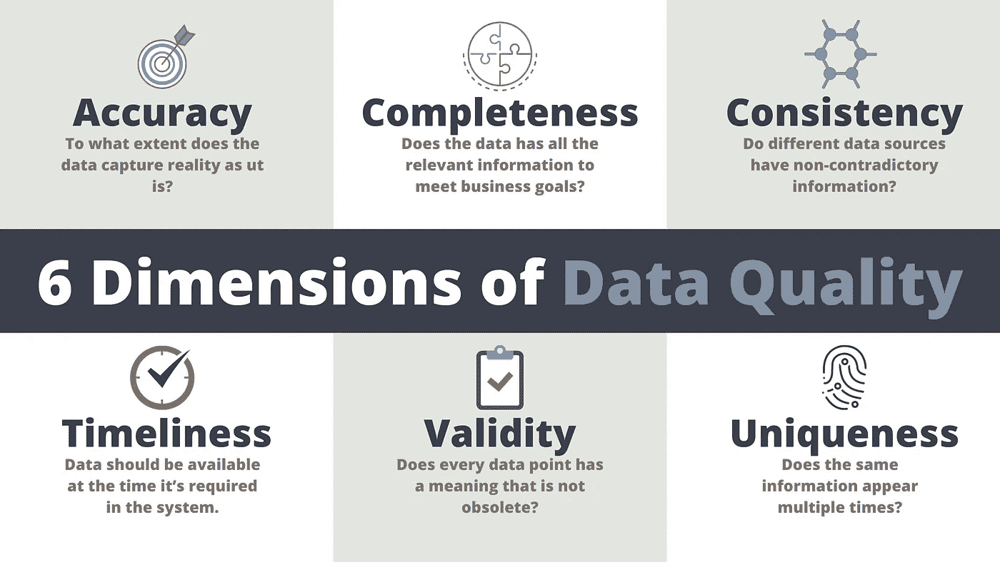
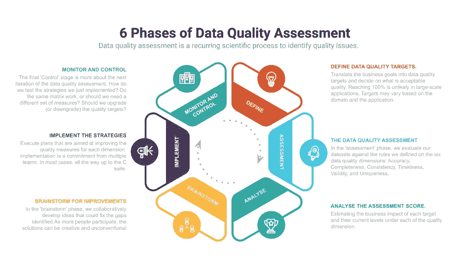

# 停止解决数据质量问题

> 原文：<https://towardsdatascience.com/stop-firefighting-data-quality-issues-4c064bcbbb53?source=collection_archive---------29----------------------->

## 创建竞争性数据质量评估的快速指南

消防数据质量问题—照片由[黑光媒体](https://www.pexels.com/@black-light-media-3598688?utm_content=attributionCopyText&utm_medium=referral&utm_source=pexels)从 [Pexels](https://www.pexels.com/photo/man-people-woman-group-9073254/?utm_content=attributionCopyText&utm_medium=referral&utm_source=pexels) 拍摄

数据质量评估是评估您的数据是否符合标准的连续科学过程。这些标准可能与您的业务或项目目标相关联。

随着获取数据的多种不同方式的出现，确保数据质量的需求也在增加。

单独处理单个数据源有时会很有挑战性。比方说，一个客户调查。即使使用在线调查工具，通常也很难将每个受访者的信息标准化。现在想象一下整合和标准化来自 ERP、CRM、HR 系统的数据，更不用说我们现在使用的许多不同的传感器了。如果没有数据质量评估，这将是一辈子的问题。

但是有好消息！我们已经沿着围绕数据获取和管理的复杂性发展。

数据质量评估在数据治理中发挥着至关重要的作用。它们有助于我们在数据管道的各个层面发现不正确的数据问题。它们还帮助我们量化业务影响，并尽快采取纠正措施。

# 质量差的数据会产生严重的后果。

以医疗保健行业的数据质量问题为例。假设数据录入人**复制了**一个病人的记录；病人将接受两剂药物，而不是一剂。后果可能是灾难性的。

不管什么行业，上述质量问题都会产生可怕的影响。但是重复只是数据质量问题的一种。我们还需要担心一系列其他质量问题。

让我们假设你正在解决一个库存优化问题。库存通过自动化系统进行监控。如果你的一个传感器发送的数值是原来频率的两倍会怎么样？**不可靠的数据**会让你囤积已经在仓库里的物品，却错过了所有高需求的东西。

# 从不同角度看你的数据采集和管理流程。

数据质量有六个维度:**准确性、完整性、一致性、及时性、有效性、唯一性。**我们还可以将数据责任及其有序性视为其他关键特征。

数据质量的 6 个维度—由作者创建。

这里讨论的不同维度是我们评估数据质量的尺度。在庞大的数据湖中保持 100%的质量几乎是不可能的。数据质量容忍度是我们必须尽早做出的战略决策。但那是为了以后的帖子。

## **数据准确性。**

数据准确性是一个普遍的质量方面，每个人都在努力做到正确。但是数据准确性到底意味着什么呢？

数据准确性是指现有数据对现实的捕捉程度。表面上的原因是数据输入——姓名输入错误和年龄值错误。

但是还有更多灾难性的问题。

[NASA 曾经损失了一艘价值 125 美元的飞船](http://edition.cnn.com/TECH/space/9909/30/mars.metric.02/)。洛克希德·马丁公司，一个英国工程团队，正与美国宇航局合作运行该计划。两个小组使用的不同测量单位导致了与航天器的通信中断。

测量单位是数据不准确的最常见原因。

## **数据的完整性**

数据完整性指的是您的数据集在每条记录上都有所有必需的信息。这些要求取决于应用程序和业务需求。例如，电话号码对于机器学习模型来说只有很少的用处，而对于递送系统来说却是至关重要的。

表单验证和数据库约束有助于减少完整性错误。然而，规划错误通常会对数据质量产生巨大影响。

数据完整性是一种权衡。你在球场上越严格，记录就越少。

这种折衷对于手动和自动数据采集都是有效的。如果您将调查中的所有字段都设置为必填项，您得到的回复不会像预期的那么多。在自动化方面，假设您为来自远程摄像机的数据流设置了 GPS 坐标约束。您安装了一套可能不支持 GPS 的新设备，并向您的数据湖发送不会被接受的数据。

这是一个具有挑战性的维度。随着您从更多来源获取数据，复杂性会越来越高。

## **数据一致性**

数据一致性是指从不同来源收到的数据没有矛盾。因为每个数据源可能有独特的信息度量方式，所以它们有时与其他数据源不匹配。

假设您想要了解某个特定产品的日销售量。您的库存管理会根据剩余的商品跟踪销售情况。您的 POS 会根据售出的商品进行跟踪。退回的商品可能会偷偷进入库存系统，而在 POS 中没有记录。

在集成时，这两个系统会显示不同的日销售量数字。

在理想世界中，这两个系统都应该考虑到回报。但鉴于大规模组织的复杂性，这种情况很少发生。

## **数据质量的时间线**

数据应该在系统需要的时候可用。假设您每周五生成一个报告，但您的所有数据还没有到达；这将严重改变你的组织的决策和方向。

影响数据及时性的原因有几个:

1.  有网络问题。如果你认为城市有像样的互联网连接，没有什么可担心的，读读边缘计算。整个概念旨在减少网络延迟。
2.  可能存在操作问题。产品退货和每日销售计算也是缺乏及时性的好例子。
3.  我们在数据收集方面出现了问题。它们可能是错误的数据输入、传感器故障等。

## **无效数据**

大约 12 年前，我高中毕业。但是我仍然会收到一些针对在校儿童的机构寄来的小册子。这是一个拥有无效数据的极好例子。

无效数据是一组不再有意义的记录。它们毫无用处地占据了空间。而且，当他们被使用的时候也可能是危险的。

无效数据的成本很高，但在某些情况下，使数据无效的规则很模糊。例如，除非你是医生或病人本人，否则我们如何知道病人是否已经完全康复？一些死者可能有一个平均恢复时间范围。但不是全部。在这种情况下，您将无效数据保存在数据存储中，并基于它们做出痛苦(有时是有害的)的决策。

## **独特性**

数据的唯一性是指同一信息没有两次或更多次的复制。它们以两种形式出现；多处记录重复，信息重复。

重复的记录通常很容易挑选。它们只是在相同的数据集中出现不止一次，并且自动移除它们相对简单。

一个好的做法是使用一个键列来施加唯一性约束，而不是整个记录。因为某些重复的条目可能包含一些不再唯一的字段。大多数事务条目都有时间戳，这是一个很好的例子。如果我们不使用一个或几个字段的组合进行重复数据消除，它们就不会显示为重复项。

信息复制是将相同的信息存储在不同的地方。例如，患者的年龄可能在入院表和手术表上。不仅仅是好的设计。

重复的信息是其他质量问题的入口。未能更新所有记录会造成不一致。至少其中一个是不准确的。

另一个不太明显的重复是派生信息。记录年龄和出生日期。一个足以找出另一个。但是存储两者会产生歧义。

# 如何进行数据质量评估？

我们需要对数据存储中的每个关键领域进行数据质量评估。你能去的最细的地方是字段级。但是您也可以一直检查到数据库级别。

数据质量评估的步骤-由作者创建。

数据质量评估是一个反复验证数据是否符合要求标准的过程。每个迭代将有以下六个阶段。

## **1。定义数据质量目标。**

在“定义”阶段，我们将业务目标转化为数据质量目标，并决定什么是可接受的质量。该矩阵应根据数据质量的六个维度进行衡量。

在大规模应用中达到 100%是不太可能的。但是如果你在处理更小的数据集，你可以对它们更加严格。

如果您是一个发送后续剂量警报的医疗保健应用程序，您需要维护患者服用的每次剂量的日志。每条记录中的时间戳字段对于下一次用药都是至关重要的信息。因此，它应该有一个针对所有六个维度的接近 100%的阈值。

但如果你拥有一家蛋糕店，并且想每年都寄一张生日贺卡，你的规则可以灵活得多。地址或电话号码字段应该具有较高的准确性阈值(比如大约 90%)。然而，他们可以有一个适度的独特性目标(大约 60%)，因为人们有时会在购买时给出他们的替代电话号码。

这些阈值也取决于域。正如在最后两个例子中所看到的，与医疗保健相比，第二种情况下的错误成本微乎其微。

这些规则可以是多粒度的。例如，地址列可以有一个唯一的阈值。但是我们也可以设置一个完整性阈值，因为每个记录都应该有电话号码或邮寄地址。

## **2。数据质量评估**

在“评估”阶段，我们根据我们在六个数据质量维度上定义的规则来评估数据集。每一个都会以一个可以接受的分数结束。接受分数是满足条件的记录的百分比。

在小型数据集或数据库上，手动进行这些实验非常容易。然而，在庞大的数据仓库中，您需要一些自动化来验证数据质量。

## 3.分析评估分数。

数据质量评估不会随着评估阶段的结束而结束。数据质量评估旨在尽早识别业务影响并实施纠正措施。评估业务影响是这个阶段的目标。

这是一项复杂的工作，而且不是领域不可知的。一个组织汇总评估分数的方式与其他组织不同。

但是阶段的目标是显而易见的。我们正在寻找数据质量泄漏的最大漏洞，并将修复它。

## 4.集思广益寻求改进

在“头脑风暴”阶段，我们合作开发可以弥补我们发现的差距的想法。最好有一个包括来自每个团队的成员的单元，以便计划

*   对它负责的人所希望的；
*   技术上可行；
*   经济上可行。

合意性、可行性和生存能力可以成就或摧毁一个想法。

这里有一个例子。

假设我们在分析阶段发现患者没有在前台调查中填写一些关键信息。您的技术团队可能会建议将调查电子化。电子调查可以实施难以绕过的验证检查。小组中的医生或护士可能会说，这种解决方案是不可取的，因为人们急于进入治疗。前台工作人员可能会说他们很着急，甚至在退房的时候。因此，您的最终解决方案可能是在入院时填写一份初级表格，并在治疗后进行详细的电子调查。

你可能已经注意到解决方案并不总是技术性的。仅仅修复数据管道并不能提高数据质量。有时，它可能需要不明显的非常规策略。

然而，一些最常想到的答案也会有所帮助。这里有几个。

自动化数据收集。

大量的[质量问题可以通过这个简单的技巧得到解决](https://www.ncbi.nlm.nih.gov/pmc/articles/PMC5983060/)。它提高了所有六个维度的质量。如果系统能做到，就让它去做。

**尽可能创建电子表格。**

当自动化不可行时，下一个最好的解决方案是创建一个带有验证的电子表单。与纸质调查相比，在电子调查中很难跳过关键问题。通过避免数字化你的收藏，你也节省了大量的时间。

**创建最新的元数据并与相关方共享。**

元数据是数据集的描述。它们包括除数据本身之外的所有内容，以帮助用户理解该数据集存在的原因。通常，元数据包括字段类型、字段验证和约束。

[维护更新的元数据有助于](https://searchitchannel.techtarget.com/feature/The-benefits-of-metadata-and-implementing-a-metadata-management-strategy)加速自动化，并在团队之间清晰地交流需求。

## 5.实施提高数据质量的策略。

与本评估中的其他五项任务相比，实施需要更多的时间和精力。但是在分析和集思广益阶段花更多的时间可以减轻这里的工作。

我们知道提高数据质量的策略可以是非传统的。做调查的好时机是至关重要的，因为要对电子表格进行验证。因此，这些想法的实现是来自多个团队的承诺。在大多数情况下，一直到 [C 组](https://silo.tips/download/an-effective-data-management-strategy-starts-with-the-c-suite)。

## 6.控制

最后的“控制”阶段更多的是关于数据质量评估的下一次迭代。我们如何测试我们刚刚实现的策略？做同样的矩阵工作，或者我们应该需要一套不同的措施？我们应该提高(或降低)质量目标吗？下一次迭代的合理时间框架是什么时候？

# 最后的想法

在这篇文章中，我讨论了数据质量维度和评估的基础。

数据质量评估是维护可靠数据源的关键。它们对于数据驱动的决策至关重要。根据应用程序的领域和类型，低质量数据的影响可能从微不足道到灾难性不等。

为了理解数据质量评估，我们必须首先理解数据质量的六个维度。我们根据这六个维度进行质量评估。

数据质量评估本身是一个循环过程。每个迭代可以有六个阶段，以确保正确地识别质量差距，并采取措施来实现它们。一次迭代的学习有助于调整下一次迭代的目标。

> *谢谢你的阅读，朋友。看来你和我有许多共同的兴趣。* ***向我问好*** *上* [*领英*](https://www.linkedin.com/in/thuwarakesh/) *，* [*推特*](https://twitter.com/Thuwarakesh) *，以及* [*中*](https://thuwarakesh.medium.com/subscribe) *。我会为你打破僵局。*

还不是中等会员？请使用此链接 [**成为会员**](https://thuwarakesh.medium.com/membership) 因为我为你免费推荐赚取佣金。