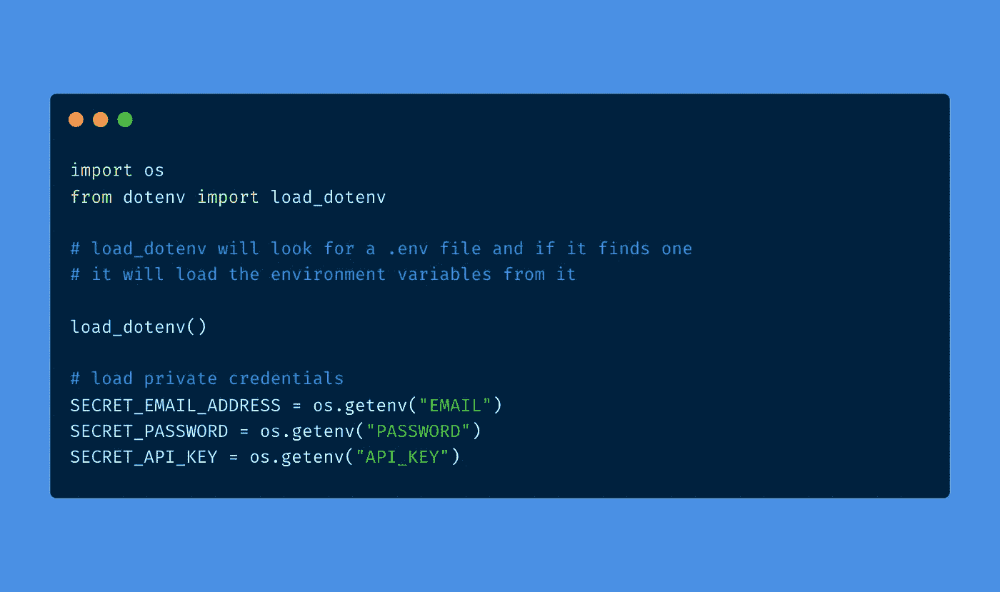
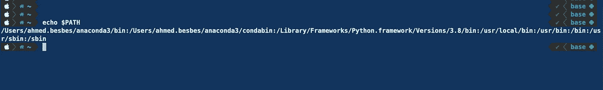
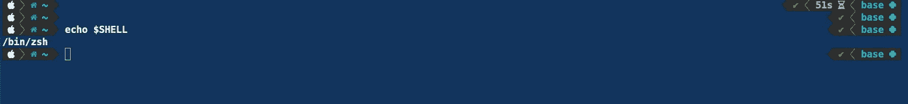

# 停止在 Python 应用程序中硬编码敏感数据

> 原文：<https://towardsdatascience.com/stop-hardcoding-sensitive-data-in-your-python-applications-86eb2a96bec3?source=collection_archive---------0----------------------->

## 使用将您的设置和凭据保密。环境文件



作者制作的图像

作为一名数据科学家，我每天使用 Python 来构建依赖于**凭证**和**敏感设置的应用程序。**

下面是一些例子，我想了想:

*   **访问第三方服务的 API 密钥**
*   **密码和凭证**
*   **电子邮件地址或个人数据(姓名、年龄、社会保险号等。)**
*   **调试标志**
*   **主机，网址，URI**

很明显，更多的事情。

其中一些设置本质上是私有的。其他人很敏感，因为他们可以提供对网络攻击或威胁的见解。

## ️️️️⚠️️This 不言而喻，但我们还是要说出来 ***:这些数据永远不应该被硬编码到你的 python 文件中。你必须找到一种方法来保持它的私密性，永远不要与世界分享(尤其是 Github)***

> ***在这篇快速的帖子中，我们将看到如何使用环境变量和一个名为*** `***.env***` ***的特殊文件来解决这个问题。
> 我们还将学习如何使用*** `***python-dotenv***` ***模块与该文件交互，并使您的敏感数据隐藏起来。***

事不宜迟，我们来看看🔍

# 什么是环境变量？

环境变量是保存您不想硬编码到程序中的数据的变量。它们被抽象出来，从代码中删除。

它们的值存在于你的操作系统中；它们可以是内置的，也可以通过自定义应用程序来设置。

## **一些内置的环境变量**



“PATH”环境变量—作者截图



“SHELL”环境变量—作者截图

环境变量由键/值对组成，您可以使用它们来存储不同类型的数据。

*   域名
*   执行模式(生产、开发、暂存)
*   认证密钥、登录或密码等凭证
*   电子邮件地址等。

# **如何使用 Python 访问环境变量？**

要访问环境变量，您需要使用`os`模块，该模块提供了读写这些值的实用程序。

这似乎是隐藏敏感数据的一种简便方法，对吗？

想象一下，您需要在代码中使用一个 API 键，而不泄露它的值。您需要做的就是从环境变量中加载它:

```
**api_key = os.gentenv("SECRET_API_KEY")** 
```

**但是等等，我不记得把我的 API 键设置为环境变量了。我该怎么做？**

有两种常见的方式:

*   通过键入以下命令:

```
**export SECRET_API_KEY=XXXXXXXXXXXX**
```

*   或者在你的`.**zshrc**`、`.**bashrc**`或`.**bash_profile**`中添加相同的行，并对其进行采购

> 如果你需要只在特定项目中使用的环境变量，我不推荐这两种方法。其实，

*   如果你使用你的终端，你需要记住每次在运行你的程序之前设置你的环境变量，这似乎是不对的。
*   如果每次需要添加新的环境变量时都要修改`.zshrc`或`.bashrc`，这些文件很快就会被大量不必要的信息弄得乱七八糟。如果您的环境变量与非常具体的项目相关联，那么将它们设置在一个可以随时随地访问的全局范围内是没有意义的。

**但愿，** `**.env**` **文件似乎能解决这个问题。**

# 。env 文件:在局部范围内设置环境变量的一种方式

`**.env**` 文件首先是文本文件，包含应用程序所需的所有环境变量的键/值对。

它们使您能够在不污染全局环境名称空间的情况下使用环境变量。事实上，每个单独的项目都可以有自己的`.env`文件。

这里有一个例子:

文件通常放在项目的根目录下。要访问其中列出的值，您需要安装`**python-dotenv**`库。

```
**pip install python-dotenv**
```

然后，您只需要添加两行代码:

*   **一个要导入的库:**

```
**from dotenv import load_dotenv**
```

*   **寻找一个** `**.env**` **文件并从中加载环境变量**

```
**load_dotenv()**
```

👉当这两行代码被执行时，环境变量被注入到项目运行时。当项目终止时，它们被刷新，并且在任何时候都没有被添加到全局命名空间中。

正在访问。python 中的 env 文件

# 🔴永远不要承诺。env 文件或将它们推送到 Git

一个`.**env**`文件的全部意义在于将敏感数据从代码库中具体化

因此你不应该将这个文件版本化或者推送到 Github。

您可以将它保存在您的本地开发环境中进行测试，并且永远不要与公众共享它。

避免这种不必要情况的一个简单方法是将`.env`添加到您的`.gitignore`文件中:

```
**.env**
```

# 让我们结束它

Python 应用不仅仅是一系列指令和代码。它们还与数据和配置设置相关联。

大多数时候，这些配置数据是敏感的，需要以保密的方式访问。

希望环境变量和`.env`文件能够处理这种情况。

要开始使用`.env`文件，您可以这样做

*   使用 pip 安装`python-dotenv`模块
*   使用项目中适当的环境变量创建`.env`文件
*   将它添加到`.gitignore`文件中以防止 git 提交它
*   使用`python-dotenv`模块将设置加载到 Python 文件中

# 资源

虽然这个主题并不复杂，但我浏览了一些很棒的资料，并学到了一些我不知道的关于环境变量和使用`.env`文件的知识。

这是一些资源的精选列表。

*   `python-dotenv` [文档](https://pypi.org/project/python-dotenv/)
*   [https://better programming . pub/getting-rid-of-hard coded-python-variables-with-the-dotenv-module-d 0 aff 8 ce 0 c 80](https://betterprogramming.pub/getting-rid-of-hardcoded-python-variables-with-the-dotenv-module-d0aff8ce0c80)
*   [https://dev . to/Jake witcher/using-env-files-for-environment-variables-in-python-applications-55a 1](https://dev.to/jakewitcher/using-env-files-for-environment-variables-in-python-applications-55a1)
*   [https://www.askpython.com/python/python-dotenv-module](https://www.askpython.com/python/python-dotenv-module)
*   https://www.youtube.com/watch?v=YdgIWTYQ69A&ab _ channel =乔纳森·索玛
*   https://www.youtube.com/watch?v=rKiLd40HIjc
*   一个漂亮的网站生成。gitignore 文件:[https://www.toptal.com/developers/gitignore](https://www.toptal.com/developers/gitignore)

也许你也会学到一些东西😉

# 感谢阅读🙏

如果你已经做到这一步，我真的很感谢你的时间。

今天就这些了。直到下一次的其他编程技巧👋


由 [Unsplash](https://unsplash.com?utm_source=medium&utm_medium=referral) 上的 [Karsten Winegeart](https://unsplash.com/@karsten116?utm_source=medium&utm_medium=referral) 拍摄

# 新到中？你可以订阅每月 5 美元，并解锁无限的文章——[点击这里。](https://ahmedbesbes.medium.com/membership)