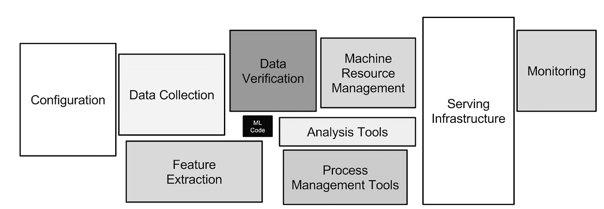

# 停止雇佣“数据科学家”

> 原文：<https://towardsdatascience.com/stop-hiring-data-scientists-e1e851c81e48?source=collection_archive---------25----------------------->

## 意见

## 将人工智能模型投入生产需要一系列技能

照片由 [Unsplash](https://unsplash.com?utm_source=medium&utm_medium=referral) 上的[米娜 FC](https://unsplash.com/@mina_fc?utm_source=medium&utm_medium=referral) 拍摄

想实现一个 AI 项目？这不仅仅是建立一个伟大的模型。这篇文章描述了为什么生产数据科学需要一个以上的人来扮演“数据科学”的角色。

# "如何将人工智能模型投入生产？"

有无数这样的例子，公司已经开发出了模型——只是让它们坐在炼狱里，永远无法投入生产。在人工智能社区中有很多关于这个话题的讨论。

**人们并不是不知道如何将人工智能模型投入生产。太糟糕了。**

为什么？

## 很难。

将一个模型投入生产(并保持)和构建它需要同样多的工作。

部署模型通常需要有人
—监控管道的可用性
—监控模型随时间的准确性
—不断用新的数据点重新训练模型
—版本代码、模型，甚至可能是数据集
—等等。

## 很复杂。

如果你是一名知道如何调整学习率和辍学值的数据科学家，你是否也有信心使用 DevOps 工具，如 [Terraform](https://www.terraform.io/) 、 [Kubernetes](https://kubernetes.io/) 、 [Slurm](https://slurm.schedmd.com/overview.html) 、[普罗米修斯](https://prometheus.io/)、 [Nomad](https://www.nomadproject.io/) 或[芹菜](https://docs.celeryproject.org/en/stable/index.html)？

大概不会。

## 数据科学家大概不会感兴趣。

有些人当然对 DevOps 的工作非常感兴趣，也非常熟练。你通常可以在像“开发工程师”这样的角色中找到这些人

这些类型的人擅长构建稳定的、可伸缩的、易于维护的基础设施。他们擅长自动化流程。他们关注为他们最终用户(开发人员)执行怪异的角落案例的计划的细节。他们写测试。

对一些人来说，这绝对是令人着迷的，但它与传统的“数据科学家”活动(如模型开发)截然不同。这是一种维护心态，而不是重复概念证明的创新心态。

## 让专家成为专家。

人工智能的开发和生产都很复杂。对于人工智能(甚至比传统的软件开发更是如此)，最佳实践仍在开发中。这是一种投资，投入其中，找出当前做事情的最佳方式。

致力于磨练其模型构建技能的数据科学家不应该因为学习 100 多种 DevOps 技术而削弱他们的专业知识。从事平台工作的数据科学家不会像从事数据科学的数据科学家那样高效。

同样，您的 DevOps 工程师可能没有时间成为您的数据科学家所做工作的专家。有人必须对基础设施/维护/监控任务有深入的了解。

不要试图让一个人扮演所有的角色。我们需要这个难题各个方面的专家。

# 行动呼吁

## 公司，不要试图雇佣数据科学家来填补所有的角色。

如果你还没有看到，这里有一个来自谷歌的机器学习中[隐藏技术债务的伟大图表(来自 2015 年，但消息是永恒的)。](https://papers.nips.cc/paper/2015/file/86df7dcfd896fcaf2674f757a2463eba-Paper.pdf)

只有一小部分真实世界的 ML 系统由 ML 代码组成，如中间的小黑框所示。所需的周边基础设施庞大而复杂。”——图片和说明来自[谷歌](https://papers.nips.cc/paper/2015/file/86df7dcfd896fcaf2674f757a2463eba-Paper.pdf)

中间那个小黑框是 ML 代码。对于该项目，您有多少工作需求？其他箱子你开了多少？

“数据科学家”不应该是一个实现人工智能平台不同组件的包罗万象的角色。**没有所谓的“全栈数据科学家”**

没有预算雇佣一个以上的人？不是借口。加入众多人工智能服务公司之一。

## 开发者们，不要再试图成为数据科学家了。

除了“如何制作一个更好的 XYZ 模型”，还有一系列有趣的人工智能工作这些地区需要帮助！通过专攻与模型开发稍微接近的东西，您有机会形成最佳实践。

教育可能会更难，因为培训资源更少，但这是值得的，因为你的需求量很大。

(对教育团体大声疾呼:我们需要更多关于 MLOps 的材料，尤其是全面的真实世界培训。)

## 人工智能初创公司，有助于使人工智能的 DevOps 方面更容易。

最近有一堆文章提出了人工智能平台架构。他们试图将众多组件收集到一个视图中。这是一个很好的起点，但是由此产生的计划写起来比实现起来容易得多。

*(几个铺天盖地的例子:* [*A16Z 的“*现代数据基础设施的新兴架构”](https://a16z.com/2020/10/15/the-emerging-architectures-for-modern-data-infrastructure/)*&*[*现代数据工程师路线图 2021*](https://github.com/datastacktv/data-engineer-roadmap)*”*

对于一般的组织来说，实现这些由 20 个部分组成的流程图太复杂、太困难了。尤其是当我们还没有雇佣一系列专家来构建这个平台的时候。

我们需要简化管理人工智能管道的工具。

# 结论

组织经常对部署他们的人工智能模型所付出的努力感到惊讶。但我们仍处于将人工智能部署到现实世界场景的早期，因此公司应该计划这是一项艰巨的任务，不能捆绑到现有的角色中。创建一个单独的工作流来设计人工智能项目的 DevOps 方面，并让数据科学家不断建立模型。