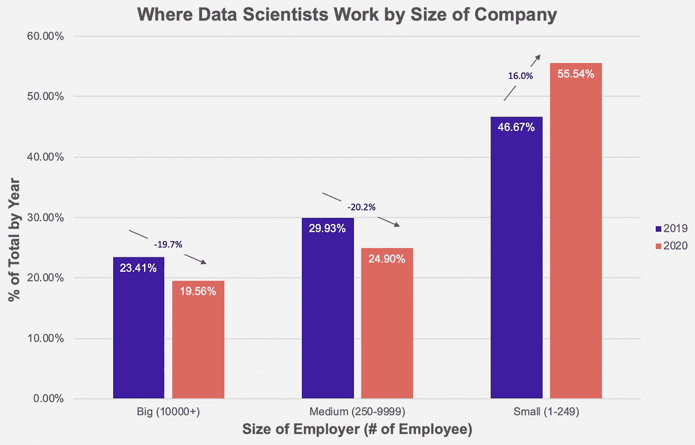
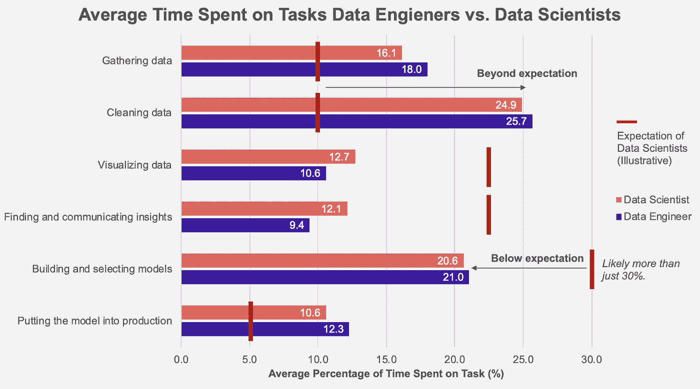
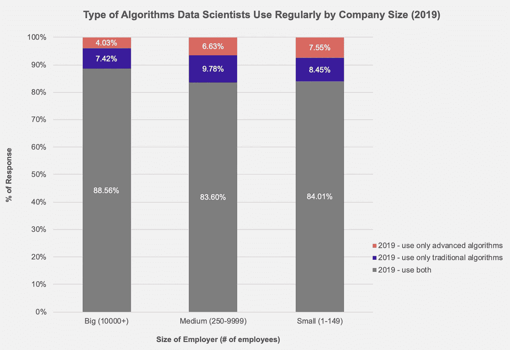

# 停止(并开始)雇佣数据科学家

> 原文：<https://towardsdatascience.com/stop-hiring-data-scientists-improve-ml-product-team-retention-8ae04dac406e?source=collection_archive---------25----------------------->

## 提高人才保留率的三种“停停走走”策略

来自[的](https://icons8.com/illustrations/) [Pixeltrue](https://www.pixeltrue.com/illustrations) 插图哎哟！

**TL；大公司的许多数据科学家正在流失到小公司。高管和经理应该怎么做？我提出了三个“停停走走”的策略来帮助定义一种新的招聘和工作方式。**

***免责声明*** *:所有观点均为本人观点；它们并不反映我的雇主。本文所用数据全部来自* [*Kaggle 数据科学调查*](https://www.kaggle.com/c/kaggle-survey-2020) *。所有的观察都来自我在大公司和小公司的数据科学团队工作的经历。*

***喜欢读什么？*** *跟我上* [*中*](https://medium.com/@ianxiao)*[*LinkedIn*](https://www.linkedin.com/in/ianxiao/)*，以及*[*Twitter*](https://twitter.com/ian_xxiao)*。如果您想获得经过处理的调查数据集，请联系我。**

## *发生了什么事？*

*大公司正在失去大约 20%的数据科学家；他们中的许多人可能去了创业公司，而一些人可能已经离开了这个行业。与科技行业 13%的平均离职率相比，大公司的数据科学团队显然面临着严重的人员流失问题。*

**

*2021 年 5 月 8 日提取的 Kaggle 调查数据；2020 年 n=4033，2019 年 n=3502，跨主要国家。仅包括自称为“数据科学家”或“机器学习工程师”的受访者*

## *数据科学家为什么要跳槽？*

*数据科学家辞职主要是因为期望与现实之间存在差距。*

*大多数数据科学家希望将大部分时间花在与建模和洞察发现直接相关的工作上，而数据工程师则准备干净的数据集并构建管道。然而，他们花了将近 50%的时间在数据收集和清理上，就像数据工程师一样。*

**

*2021 年 5 月 8 日提取的 Kaggle 调查数据；2018 年 n=584，主要国家都有。仅包括自称为“数据工程师”或“数据科学家”的受访者预计花费的时间基于作者的观察和对 Udacity、Coursera、Udemy 和 Youtube 上数据科学课程相关内容建模的粗略估计时间。*

*大多数数据科学家希望用尖端的解决方案来解决复杂的问题。与大公司的同行相比，小公司的数据科学家更有可能**只定期使用高级算法****。***

******

***2021 年 5 月 8 日提取的 Kaggle 调查数据；2019 年 n=3502，主要国家都有。仅包括自称为“数据科学家”或“机器学习工程师”的受访者传统算法包括线性和逻辑回归以及随机森林。高级算法包括梯度推进法、贝叶斯法、CNN / RNN 和变压器网络。***

# ***我们做什么呢***

***我们需要接受流动，因为这很正常。但是，比流失率最高的行业高出 55%的人员流动率意味着我们现在需要采取一些措施。***

***对于大公司的招聘经理和高管来说，让我们培养一种新的、可持续的招聘和工作方式。加乒乓球台有帮助，但解决不了问题。***

1.  *****招人。停止雇佣那些只关心酷的东西的数据科学家，开始雇佣那些以和别人一起制造和运输东西为荣的数据科学家。**我们应该利用招聘流程重新设定数据科学家的期望和角色——从校园活动、职业网络研讨会到实际面试。让来自业务、产品管理、数据工程和软件开发的团队参加面试。这将引发连锁反应，帮助有抱负的数据科学家培养正确的期望和技能。***
2.  *****激励。停止关注“科学”，开始一起庆祝“数据+科学+工程”。**自 Kaggle 早期以来，这是一个受欢迎的数据科学竞赛平台，它将数据科学纳入了主流职业道路，我们一直过度关注数据科学个人的算法工作和成功。事实上，要在现实世界中取得成果，需要数据工程师和软件开发人员的团队努力，包括大量艰苦(和聪明)的工作。他们构建了承载科学家开发的模型数据的应用程序的主干。可悲的现实是，许多用户看不到也不理解后端；因此，他们低估了无名英雄的工作。数据、科学和工程(以及商业战略、UX 设计和产品管理)必须走到一起，共享聚光灯。***
3.  *****交货。停止在孤岛中运行数据科学团队，开始创建数据产品平台。**很多大公司会雇人到专门的数据科学团队；这筑起了墙，强化了错误的期望。我们应该采用已被证明成功的产品开发团队模式——他们按照核心产品类别或功能进行组织。在这种情况下，我们应该组织并雇佣人员进入**数据产品舱**。每个 pod 是一个专门的或临时的团队，由了解数据并拥有设计和运输可行产品的所有技能的人组成*统称*。基本角色包括产品经理、数据工程师、数据科学家和全栈开发人员。最重要的是，成功归功于产品的质量和整个团队的贡献，而不是某个特定的角色或个人。***

******喜欢读什么？*** *跟我上* [*中*](https://medium.com/@ianxiao)*[*LinkedIn*](https://www.linkedin.com/in/ianxiao/)*，以及*[*Twitter*](https://twitter.com/ian_xxiao)*。如果您想获得经过处理的调查数据集，请联系我。还有，看看我的《* [*对机器学习的影响*](https://www.bizanalyticsbootcamp.com/influence-with-ml-digital) *》指南。它帮助数据科学家更好地解决问题、设计和交流。*****

******对数据科学职业和劳动力市场趋势感兴趣？阅读我关于这个话题的其他文章。******

****</the-most-realistic-data-science-career-guide-d12c4af87cc8>  </how-to-get-a-data-science-interview-job-referral-5bb9ff2ed8c9>  </the-best-data-science-transition-routes-e809254934d0> ****