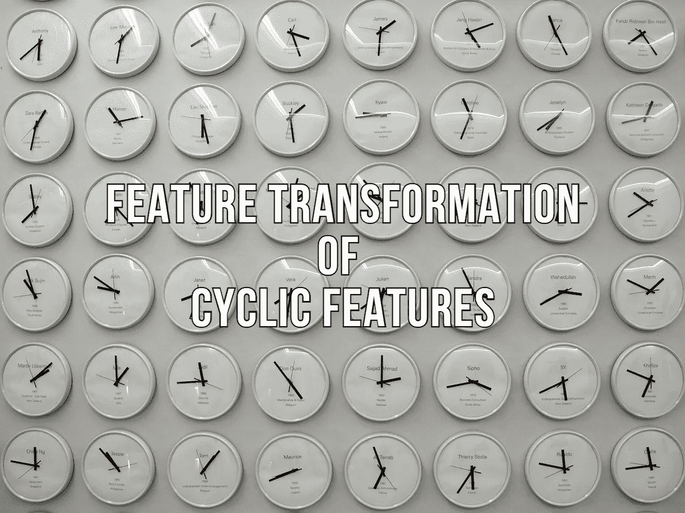
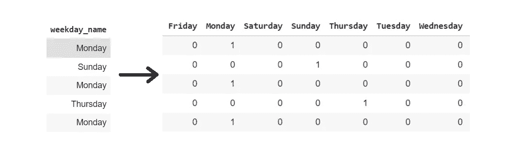
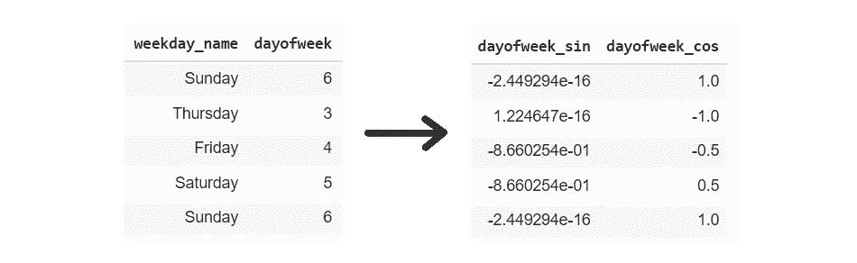
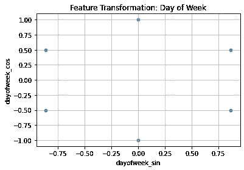
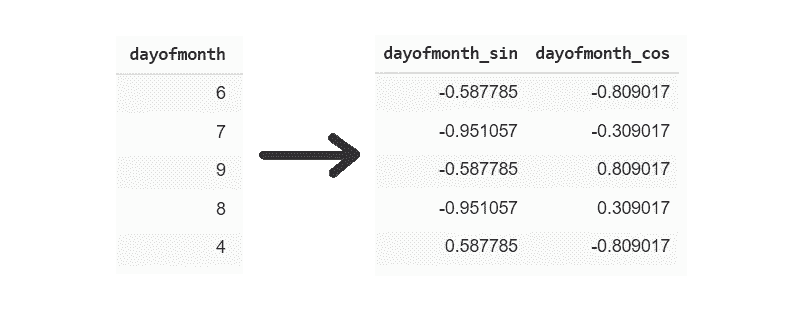
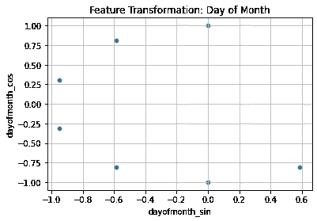
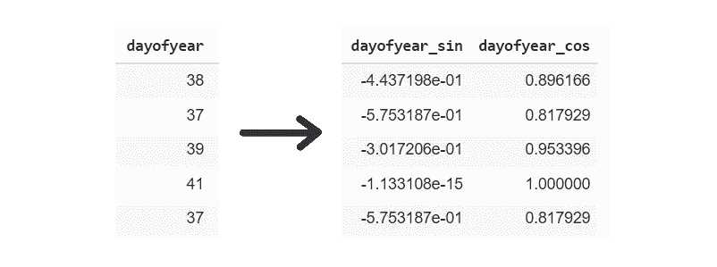
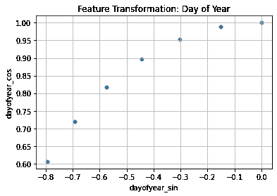

# 停止一次性编码基于时间的要素

> 原文：<https://towardsdatascience.com/stop-one-hot-encoding-your-time-based-features-24c699face2f?source=collection_archive---------9----------------------->

## 循环特征的特征转换基本指南

来自 [Pixabay](https://pixabay.com/?utm_source=link-attribution&amp;utm_medium=referral&amp;utm_campaign=image&amp;utm_content=2500991) 的[莎拉·罗彻](https://pixabay.com/users/sarah_loetscher-4248505/?utm_source=link-attribution&amp;utm_medium=referral&amp;utm_campaign=image&amp;utm_content=2500991)的图片

特征工程是数据科学模型开发流程的重要组成部分。数据科学家将大部分时间用于分析和准备要素，以训练稳健的模型。原始数据集由各种类型的要素组成，包括分类要素、数值要素和基于时间的要素。

机器学习或深度学习模型只理解数字向量。分类和基于时间的特征需要编码成数字格式。对分类特征进行编码的特征工程策略多种多样，包括一键编码、计数矢量器等等。

基于时间的特性包括`**day of month**`、`**day of week**`、`**day of year**`、`**time**`。基于时间的特征本质上是周期性或季节性的。在本文中，我们将讨论为什么对于循环特性应该避免使用一键编码或哑编码，而是讨论并实现一个更好、更优雅的解决方案。

## 为什么不是一次性编码？

独热编码是一种将分类特征转换成数字向量的特征编码策略。对于每个特征值，一键转换创建一个新的特征来区分特征值的存在与否。

(图片由作者提供)，一键编码示例图

一键编码为每个实例创建 d 维向量，其中 d 是数据集中特征值的唯一数量。

对于具有大量唯一特征值或类别的特征，一键编码不是一个好的选择。还有各种其他技术来编码分类(序数或名义)特征。

> 阅读下面提到的文章，了解分类特征的几种特征编码策略:

 [## 停止一次性编码你的分类特征——避免维数灾难

### 用许多级别/类别对分类特征进行编码的技术

medium.com](https://medium.com/swlh/stop-one-hot-encoding-your-categorical-features-avoid-curse-of-dimensionality-16743c32cea4) 

基于时间的特征，如`**day of month**`、`**day of week**`、`**day of year**`等，具有周期性，并且具有许多特征值。一键编码`**day of month**`特征产生 30 维向量，`**day of year**` 产生 366 维向量。一次性编码这些特征并不是一个好的选择，因为这可能会导致维数灾难。

## 想法:

对这些循环特征进行编码的优雅解决方案可以是使用数学公式和三角学。在本文中，我们将使用三角学的基本公式，通过计算特征的正弦和余弦来对循环特征进行编码。

(作者代码)

`**day of week**` 该特征有 7 个唯一的特征值。取特征值的正弦和余弦将创建二维特征。

(图片由作者提供)，计算星期特征的正弦和余弦

现在，代替使用一键编码创建 7 维特征向量，2 维变换的特征向量将用于表示整个特征的目的。现在，让我们用散点图来可视化新的二维变换特征向量。

(图片由作者提供)，星期几特征的正弦和余弦散点图

散点图清楚地显示了`**day of week**` 特征的循环性质。这 7 个特征值(从 0 到 6)现在被编码成一个二维向量。

`**day of month**` 和`**day of year**` 本质上是循环的，分别具有 31 和 366 个特征值。对它们进行一次性编码将增加最终数据集的维数。因此，使用特征值的三角变换将达到编码分类特征的目的。

(图片由作者提供)，**左:**计算正弦和余弦，**右:**正弦和余弦散点图；一个月中的某一天功能

(图片由作者提供)，左:计算正弦和余弦，右:正弦和余弦的散点图；一年中的某一天功能

# 结论:

所讨论的基于三角学的特征变换可以在任何循环出现的特征上实现。一次热编码适用于相对少量的分类值，但不建议对具有许多特征值或类别的要素进行一次热编码。

> 阅读我以前的一篇关于特征编码的文章:

 [## 停止使用 Pandas get_dummies()进行特征编码

### 熊猫 get_dummies()和 Sklearn One-hot 编码器基本指南

towardsdatascience.com](/stop-using-pandas-get-dummies-for-feature-encoding-5d2cd07cb4fc)  [## 停止一次性编码你的分类特征——避免维数灾难

### 用许多级别/类别对分类特征进行编码的技术

medium.com](https://medium.com/swlh/stop-one-hot-encoding-your-categorical-features-avoid-curse-of-dimensionality-16743c32cea4) 

# 参考资料:

[1] Scikit-learn 文档:[https://sci kit-learn . org/stable/modules/generated/sk learn . preprocessing . onehotencoder . html](https://scikit-learn.org/stable/modules/generated/sklearn.preprocessing.OneHotEncoder.html)

> 感谢您的阅读