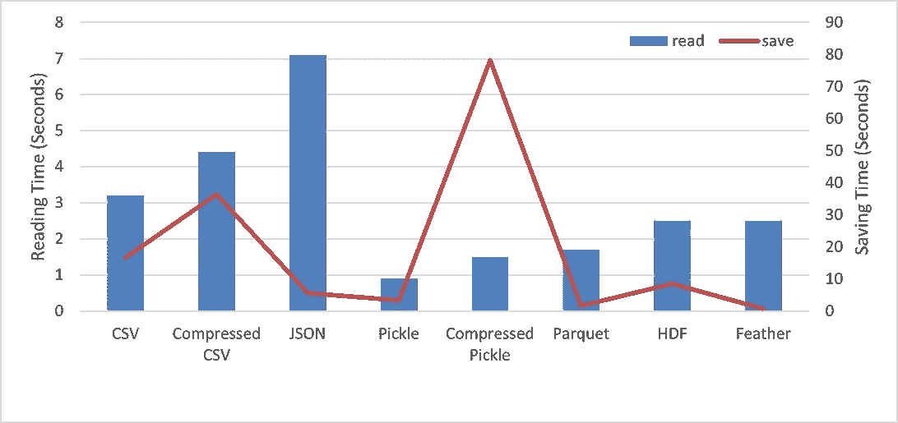
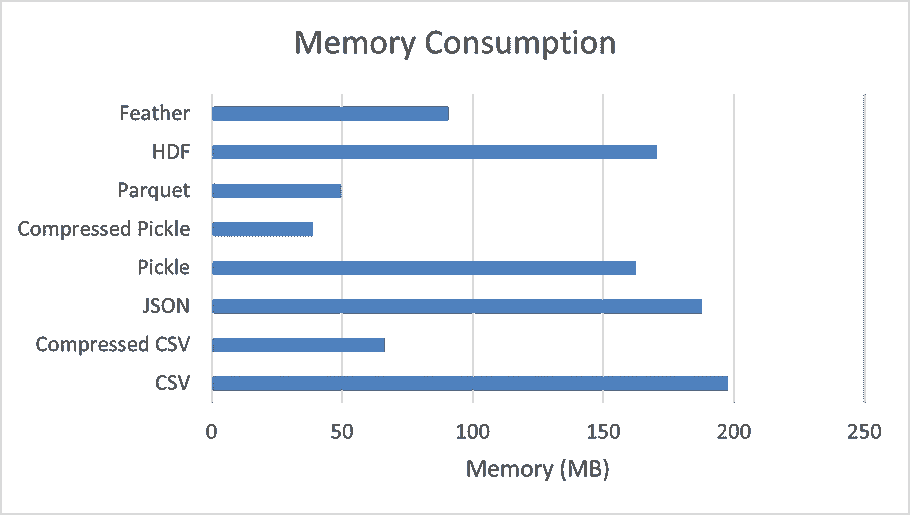

# 停止以 CSV 格式保存数据框

> 原文：<https://towardsdatascience.com/stop-saving-your-data-frame-in-csv-format-7823d3873ba2?source=collection_archive---------5----------------------->

## 使用各种数据格式进行读取和保存操作的基准时间比较

图片来自 [Pixabay](https://pixabay.com/?utm_source=link-attribution&amp;utm_medium=referral&amp;utm_campaign=image&amp;utm_content=1841158) 的[像素](https://pixabay.com/users/pexels-2286921/?utm_source=link-attribution&amp;utm_medium=referral&amp;utm_campaign=image&amp;utm_content=1841158)

数据科学就是与数据打交道。整个数据科学模型开发流程包括数据争论、数据探索、探索性数据分析、特征工程和建模。读取和保存中间文件是模型开发管道中的一项常见任务。数据科学家通常喜欢以 CSV 格式读取和保存熊猫的数据帧。处理小规模或中等规模的数据非常容易，不需要太多的开销，但当处理大规模数据集时，由于资源的限制，工作流会变慢。

CSV、Excel 或其他文本文件格式在处理大型数据时失去了吸引力，或者您的工作流涉及频繁的读取和保存操作。有各种二进制数据格式可以优于 CSV 文件格式，熊猫包支持使用这种数据格式。在本文中，我们将比较各种数据格式的内存消耗、保存和读取操作次数，并进一步总结每种用例可以使用的数据格式。

# 要比较的数据格式:

在本文中，我们将比较下面提到的 ***8 种数据格式*** 的指标，包括 ***与熊猫******的读取时间，与熊猫******的节省时间，以及*** 的磁盘内存消耗。

*   CSV(逗号分隔值)
*   压缩 CSV
*   JSON
*   泡菜
*   压缩泡菜
*   镶木地板
*   HDF
*   羽毛

## 数据:

> 我将使用来自 Kaggle 的[纽约市出租车持续时间数据集来比较基准数据，该数据集有 1，458，644 条记录和 12 个特征。](https://www.kaggle.com/c/nyc-taxi-trip-duration/data)

# 基准:

(图片由作者提供)，**左:**读取和保存时间对比(秒)，**右:**内存消耗(MB)

## 建议:

通过观察上述每种文件格式的读取和保存操作以及内存消耗的基准数，我们可以针对不同的用例遵循以下建议:

*   要保存会话之间的数据或中间文件，请使用 ***【泡菜】*** 、 ***羽毛*** 或 ***拼花*** 格式。**酸洗**为最优先推荐，因为它的读数最低，节省时间。
*   要以最小的大小保存数据或优化内存消耗，请使用压缩 pickle、parquet 和压缩 CSV 格式。最推荐使用 ***压缩泡菜*** ，因为它的内存消耗最少(比 CSV 格式优化了 78%)。
*   压缩 pickle 格式占用的内存最少，但是在保存数据时需要很多时间。人们可以使用 ***拼花*** 格式，这种格式具有相对更快的读取和节省时间，并且比标准 CSV 格式优化了 70%。
*   要保存非常大的数据帧，使用 ***HDF*** 格式。
*   要读取不支持其他格式的另一个平台(非 Python)上的数据，使用 ***CSV*** ， ***压缩 CSV*** 格式**。**
*   要使用 Excel、Google Sheets、记事本查看和观察数据，请使用 ***CSV*** 格式。

# 结论:

在本文中，我们讨论了可用于保存原始数据和中间数据的 8 种数据格式，并比较了基准时间数和内存消耗。上面讨论的建议是通过观察基准数字和领域知识得出的。没有遵循特定数据格式的经验法则，但它取决于用例。

拼花、压缩泡菜、压缩 CSV、羽毛数据格式可用于优化数据的内存消耗。与标准 CSV 格式相比，使用这些文件格式可以优化高达 78%的内存。

Pickle、Parquet、Feather 文件格式优于标准 CSV 格式，因为它们具有更快的读取和保存能力。

读取熊猫数据框中的数据后，可以通过降级每个要素的数据类型来优化内存使用。阅读下述文章中的[以了解实现和用法:](/optimize-pandas-memory-usage-while-reading-large-datasets-1b047c762c9b)

</optimize-pandas-memory-usage-while-reading-large-datasets-1b047c762c9b>  

# 参考资料:

[1]熊猫文献:【https://pandas.pydata.org/docs/reference/io.html 

> 感谢您的阅读