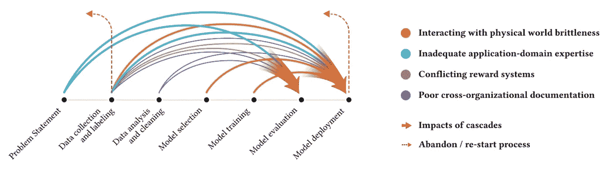
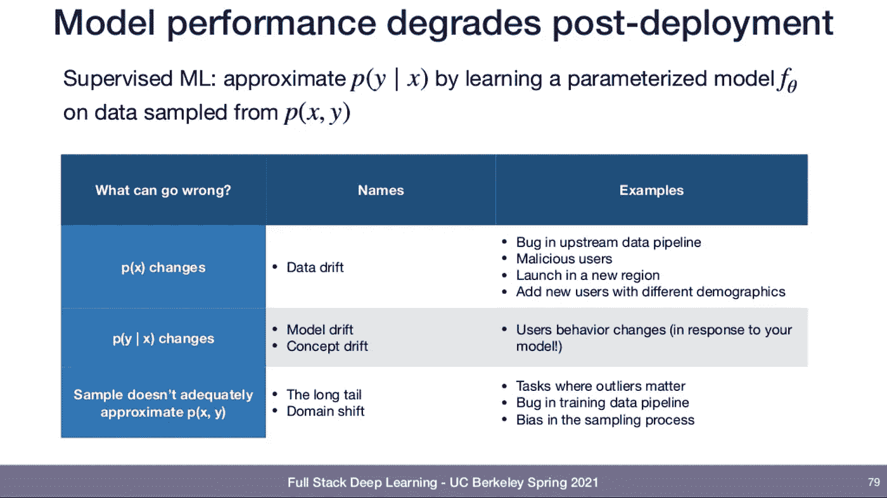
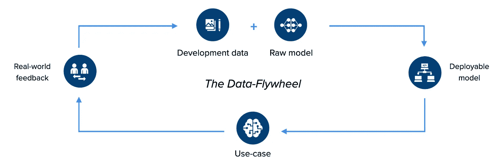

# 停止将数据视为商品

> 原文：<https://towardsdatascience.com/stop-treating-data-as-a-commodity-ee2ac23fa578?source=collection_archive---------36----------------------->

## 为什么 87%的应用 ML 项目从未进入生产——从超过 50，000 个模型的培训中学到的

弗兰基·查马基在 [Unsplash](https://unsplash.com?utm_source=medium&utm_medium=referral) 上拍摄的照片

当你在“走向数据科学”上阅读这篇文章时，我可能不需要告诉你在 ML 研究中发生的所有令人惊讶的事情。我也不需要告诉你人工智能应用于现实世界用例的潜力。然而，87%的应用深度学习项目仍然在概念验证阶段失败，永远无法投入生产[1]。

在这篇文章中，我将更深入地探讨我们在 [hasty.ai](http://hasty.ai/?utm_source=blog&utm_medium=medium&utm_campaign=tds) 与我们的用户一起工作于超过 10，000 个项目和培训超过 50，000 个视觉模型的经验。我总结了我们观察到的许多应用 ML 项目失败的原因，并提出了解决问题的方法。

TL；我们需要从以模型为中心到以数据为中心的 ML 开发的范式转变。

*免责声明:在这里，在*[*hasty . ai*](http://hasty.ai/?utm_source=blog&utm_medium=medium&utm_campaign=tds)*，我们正在为以数据为中心的 visionAI 构建一个端到端的平台。因此，我使用的所有例子都来自视觉空间。然而，我相信提出的概念仍然与人工智能的其他领域相关。*

# 许多应用 ML 团队模仿研究思维

为了理解为什么 87%的应用 ML 项目会失败，我们需要后退一步，了解今天大多数团队是如何构建 ML 应用程序的。这是由 ML-research 的工作方式决定的。

研究团队大多试图为特定的任务重新定义艺术(SOTA)的状态。SOTA 是通过在给定数据集上达到最佳性能分数来衡量的。研究团队保持数据集固定不变，并试图改进现有方法的一部分，以实现. x%的性能提升，因为这将使他们得以发表。

由于研究中的每一次炒作都是由这种追逐 SOTA 的心态产生的，许多致力于应用 ML 的团队都采用了这种心态，相信这也会引领他们走向成功。他们投入大量资源开发模型，将数据视为已知或易于外包的东西。

# 在应用 ML 中追逐 SOTA 是一个失败的秘诀

然而，这种想法是有缺陷的。

首先，研究和应用 ML 的目标明显不同。作为一名研究人员，你希望确保你的工作是前沿的。另一方面，如果你在应用 ML 中工作，你的主要目标应该是让它在生产中工作——如果你使用一个五年前的架构，那又怎么样？

第二，你在现实世界中遇到的情况与研究环境大相径庭，使事情变得更加复杂。

在研究中，团队在完美的条件下处理干净的结构化数据。然而，在现实中，数据看起来非常不同，团队面临着一系列全新的挑战。图片由作者提供，由[imgflip.com](http://imgflip.com)创作。

让我告诉你一个我最喜欢的城市神话，从自动驾驶的世界来说明这一点:

和大多数 ML 研究一样，原型是在海湾地区开发的。在中西部进行首次试驾之前，车队花了数年时间调整模型。当最终开车到中西部时，模型坏了，因为所有的训练数据都是在阳光明媚的加利福尼亚收集的。模型无法应对中西部恶劣的气候，因为突然路上有雪，相机上有雨滴，让模型感到困惑。

*附注:我一遍又一遍地听到这个故事，但从未找到可引用的来源。如果你知道一个，如果你能和我分享，我会非常感激。*

这个轶事对于一个更大的问题来说是一个完美的象征:你在研究环境中会遇到相当愉快的条件，就像加利福尼亚的好天气一样。然而，在实践中，条件更加艰苦，事情变得更具挑战性；你不能应用所有理论上可能的东西。

如果你想做应用 ML，这意味着一系列全新的挑战。不幸的是，仅仅通过改进底层架构和重新定义 SOTA 是无法解决这些问题的。

# 应用 ML ≠研究

更准确地说，这里有 5 种应用型 ML 环境与研究型 ML 环境的不同之处:

## 1—数据质量变得重要

在应用 ML 中，有这样一句话:

> “垃圾进，垃圾出。”

这意味着你的模型将只和你训练它们的数据一样好。大多数研究人员忽略了跨领域的 10 个最常用的基准数据集对于训练**和**验证数据的误分类率为 3.4%[2]。

最常用的基准数据集的标签错误率为 3.4% [2]。尽管在比较模型架构时可以忽略这一点，但在应用 ML 时，这可能会产生严重的后果。

许多研究人员认为，不要太关注这一点是合理的，因为您仍然可以通过比较模型架构获得有意义的见解。然而，如果你想在你的模型上建立一些业务逻辑，举一个例子，确定你看到的是狮子还是猴子是非常关键的。

## 2—通常情况下，您需要自定义数据

研究中使用的大多数基准数据集都是巨大的通用数据集，因为目标是尽可能地一般化。另一方面，在 applied ML 中，您最有可能遇到公开的通用数据集中没有表示的特殊用例。

因此，您需要收集和准备自己的数据，以恰当地代表您的特定问题。通常，选择正确的数据对模型性能的影响比选择哪种架构或如何设置超参数更大。

在 ML 开发过程早期做出的决策对最终结果有着巨大的影响。特别是，开始时的数据收集和标记策略至关重要，因为级联随着每一步而累积。图片摘自[3]。

在论文“每个人都想做模型工作，而不是数据工作:高风险人工智能中的数据级联”[3]中，谷歌人工智能实验室的一个团队令人印象深刻地展示了在项目开始时选择错误的数据策略会如何对模型后来的性能产生不利影响。我真的推荐阅读整篇论文。

## 3—有时，您需要处理小数据样本

在研究中，对低模型性能的一个常见回答是:“只需收集更多数据。”通常，当你试图向一个只有几百个例子的会议提交论文时，他们很可能会拒绝你。即使你实现了高性能，争论也会是你的模型过度拟合。

然而，在应用 ML 中，收集大量的数据集通常是不可能的或者太昂贵了，所以你必须利用现有的资源。

然而，过度拟合的论点在这里并不重要。如果您试图解决一个明确定义的问题，并且在一个相当稳定的环境中行动，那么训练一个过度拟合的模型可能是可行的，只要它产生正确的结果。

## 4—不要忘记数据漂移

为了使应用 ML 中的事情更加复杂，您很可能会遇到某种数据漂移。一旦模型投入生产，当现实世界中要素或目标变量的基础分布发生变化时，就会发生这种情况。

<https://medium.com/hasty-ai/dealing-with-data-shift-44280ce6ea59>  

一个明显的例子是，您在夏天收集了初始训练数据并部署了您的模型，但在冬天，世界看起来完全不同，模型崩溃了。另一个更难预料的例子是当你的用户在与你的模型交互后开始改变他们的行为。

伟大的 Josh Tobin 的幻灯片总结了最常见的数据漂移[4]。

一小部分研究集中在这个问题上(见上面伟大的乔希·托宾的幻灯片)，但是大多数研究人员在他们追逐 SOTA 的工作中忽略了这一点。

## 5—你会遇到计算限制

您是否尝试过将深度模型部署到德州仪器的 ARM 设备上？我们做到了。最终，我们让它工作了，但这是一个非常疯狂的过程。

根据您的情况，您可能需要在 edge 上进行推理，并行和实时地服务数百万用户，或者您根本没有预算来无限消耗 GPU。所有这些原因都限制了研究环境中理论上的可能性。研究人员习惯在 GPU 项目上花费 20，000 多美元。

# 解决方案:从模型到以数据为中心的 ML

如上所述，应用 ML 中截然不同的环境提出了一系列全新的挑战。只专注于改进模型(因为这在研究中很常见)无法应对这些挑战-模型和数据之间的关系比模型本身重要得多！

然而，应用 ML 中的大多数团队采用研究的思维方式，进行 STOA 追踪。他们将数据视为可以外包的商品，并将所有资源投入到模型工作中。根据我们的经验，这是如此多的应用 ML 项目失败的最重要的原因。

然而，应用 ML 中越来越多的人认识到，只关注模型会产生令人失望的结果，倡导应用 ML 新方法的运动正在兴起:他们正在推动从模型到以数据为中心的 ML 开发的转变。

要了解更多，我真的推荐你看下面吴恩达的演讲，他比我更雄辩地阐述了以数据为中心的 ML。

在这个演讲中，吴恩达给出了很多很好的例子来说明为什么在应用 ML 中以数据为中心的方法优于以模型为中心的方法。

但总而言之，主要论点是:当你做应用 ML 时，你不应该太担心 SOTA。即使是几年前的模型对于大多数用例来说也足够强大了。调整数据并确保您的数据适合您的用例并且是高质量的具有更大的影响。

为了让这一点更具体，让我来和你分享一个演讲的趣闻:

Andrew 和他的团队在从事制造业缺陷检测项目时，准确率停留在 76.2%。然后他解散了团队。一组保持模型不变并添加新数据/提高数据质量，另一组使用相同的数据但试图改进模型。处理数据的团队能够将准确率提高到 93.1%，而另一个团队根本无法提高性能。

我们看到的大多数成功的团队都遵循类似的方法，我们试图将这一点放在我们交谈的每个用户的心中。具体来说，根据我们的经验，以数据为中心的 ML 开发可以归结为以下几点:

## 1—数据飞轮:串联开发模型和数据

在上面的谈话中，Andrew 提到他的团队通常在项目的早期开发一个模型，而不会在最初花时间调整它。在第一批带注释的数据上运行后，他们通常会注意到数据中的一些问题——类的代表性不足，数据有噪声(例如，图像模糊)，数据标记不佳等等

然后，他们花时间修复他们的数据，只有当模型的性能不再通过修复数据而提高时，他们才回到模型工作，比较不同的架构并进行微调。

我们还利用一切机会倡导这种方法。我们称之为**数据飞轮。**这是一个 ML 管道的想法，允许你快速迭代模型和数据。您应该能够快速构建模型，向它们展示新数据，获取预测不佳的样本，对这些样本进行注释，将它们添加到您的数据集中，重新训练您的模型，然后再次测试它。这是构建应用 ML 最快最可靠的方法。

数据飞轮是一个 ML 管道，允许您迭代地开发您的数据和模型，在真实世界条件下达到不断改进的性能。作者图解。

这篇文章不是为了宣传，而是为了向你表明我们在 [hasty.ai](http://hasty.ai/?utm_source=blog&utm_medium=medium&utm_campaign=tds) 对这个想法有多认真:我们实际上围绕这个想法建立了我们的整个业务，从我们所知的情况来看，我们是唯一这样做的人——至少在视觉领域是这样。当您使用我们的注释工具时，您会在我们的界面中得到一个现成的数据飞轮。

我们不断地在后台为你(重新)训练一个模型，而不需要你写一行代码，同时你给你的图像做注解。然后，我们使用该模型为您提供对下一张图像上标签的预测，您可以纠正哪些显著提高了模型的性能。您还可以使用我们的 API 或导出模型来构建带有您自己的(可能面向客户的)接口的飞轮。

一旦你通过提高你在 [Hasty](http://hasty.ai/?utm_source=blog&utm_medium=medium&utm_campaign=tds) 中的数据达到了性能的稳定期，你可以使用我们的[模型运动场](https://hasty.ai/model-playground/?utm_source=blog&utm_medium=medium&utm_campaign=tds)来微调我们的模型，达到 99.9%的准确率。

## 2—自己注释数据，至少在开始的时候

做以数据为中心的 ML 也意味着你应该自己注释你的数据。大多数陷入 SOTA 追逐思维的公司将数据视为商品，并将标签外包。

然而，他们发现，实际上，他们正在构建的数据资产是他们未来的竞争优势，而不是他们训练的模型。如何建立模型是众所周知的，并且(对于大多数用例)很容易复制。现在每个人都可以免费学习 ML 的基础。然而，建立一个大的地面实况数据集可能非常耗时和具有挑战性，并且不投入时间是不可复制的。

您的用例越复杂，构建数据资产就越困难。让我们来看看医学成像，这只是许多需要主题专家来创建高质量标签的例子中的一个。但是，即使外包明显简单问题的注释工作也会导致问题，正如下面的例子所示——*再次，它是从吴恩达的伟大演讲*中偷来的。

如何给物体贴标签并不总是很清楚。在注释的同时识别这样的边缘情况，可能会节省您在调试模型时搜索它们的时间。

这是来自 [ImageNet](https://www.image-net.org/index.php) 的一张图片。标签说明是“使用边界框来指示鬣蜥的位置”，乍一看，这听起来像是一个不容错过的说明。然而，一个注释者绘制了标签，使得边界框不重叠，并且忽略了尾部。相比之下，第二个也考虑了左鬣蜥的尾巴。

这两种方法本身都很好，但是当一半的注释是一种方式，另一半是另一种方式时，就有问题了。当您外包注释工作时，您可能会花费几个小时来发现这样的错误，而当您在内部做注释时，您可以调整得更好。

此外，遇到这样的问题可能会让您对可能导致模型在生产中崩溃的边缘情况有很好的见解。例如，鬣蜥看起来有点像没有尾巴的青蛙，您的模型可能会将两者混淆。

当然，这个例子是虚构的，但是当你注释自己的时候，你经常会碰到不知道如何标记的对象。一旦投入生产，你的模型也将与完全相同的图像发生冲突。尽早意识到这一点，可以让你采取行动，减轻潜在的后果。

通常，公司将注释工作外包出去，因为他们认为自己做太费力太痛苦。然而，越来越多的工具提供了高度的自动化，极大地加快了标签工作的速度。

为 [hasty.ai](http://hasty.ai/?utm_source=blog&utm_medium=medium&utm_campaign=tds) 工作，当然，我认为[我们的注释工具](https://hasty.ai/annotation/?utm_source=blog&utm_medium=medium&utm_campaign=tds)是最好的。不过，我并不是想说服你使用我们的工具。我想强调的是，检查可用的工具并观察哪一个最适合您的需求绝对是值得的。使用正确的注释工具可以使内部注释数据变得经济可行，为您带来我上面提到的所有好处。

## 3—使用工具尽可能减少 MLOps 的麻烦

遵循以数据为中心的方法会带来比仅仅标记数据更多的挑战。如上所述，构建数据飞轮在基础设施方面相当棘手。

做好这件事是 MLOps 的艺术。这是应用 ML 世界中的一个新术语，描述了管道管理，并确保您的模型在生产中正常运行。有点像传统软件工程的 DevOps。

如果你以前曾经潜入过 MLOps 的世界，你可能会看到谷歌论文“机器学习系统中隐藏的技术债务”中的下图。[5]

应用 ML 不仅仅是模型代码。所有其他任务组成了 MLOps。有越来越多的工具使 MLOps 变得简单。聪明一点，用其中的一些来解决应用 ML 的一些麻烦。图片摘自[5]。

它显示了 MLOps 的所有不同元素。在过去，能够实现这一点的公司建立了大型团队，并维护了一套工具，编写了无数行胶水代码来使其工作。大多数情况下，FAANG 公司是唯一能够负担得起的公司。

但是现在，越来越多的初创公司开始提供工具来简化过程，并允许您构建生产就绪的应用 ML，而无需 MLOps 忙乱。我们在 [hasty.ai](http://hasty.ai/?utm_source=blog&utm_medium=medium&utm_campaign=tds) 就是这些创业公司中的一员。我们提供端到端的解决方案来构建复杂的视觉应用，并为您处理飞轮的所有基础设施。

但是不管你是否最终使用了 [Hasty](http://hasty.ai/?utm_source=blog&utm_medium=medium&utm_campaign=tds) ，聪明的最终检查那里有什么，而不是试图自己处理所有的 MLOps。这样可以腾出时间来关注数据和模型之间的关系，从而增加任何应用项目的成功机会。

# 结论

将 ML 研究中发生的所有令人兴奋的事情应用到现实世界用例中的潜力是无穷的。然而，87%的应用 ML 项目仍然在概念验证阶段失败。

根据我们从事 10，000 多个项目和培训 50，000 多个生产模型的经验，我们认为从以模型为中心到以数据为中心的开发的范式转变是使更多这些项目成功的解决方案。带着这种想法，我们并不孤单，而是行业中快速发展运动的一部分。

许多应用 ML 团队还没有采用这种思维模式，因为他们追逐 SOTA，模仿 ML 在研究社区中的工作方式，忽视了你在应用 ML 中遇到的不同情况。

然而，无论如何，我不想贬低研究团体或者给人留下他们的方法毫无价值的印象。尽管对 ML 学术世界的批评是有道理的(在这篇文章中我甚至没有提到)[6]，但在过去的几年中产生了多少伟大的作品是令人着迷的。我期待学术界能有更多的开创性成果。

但这正是重点。学术界的目标是做好基础工作，为应用型 ML 铺平道路。然而，应用 ML 中的目标和环境是完全不同的，所以我们需要采用不同的、以数据为中心的思维方式来使应用 ML 工作。

根据我们的经验，以数据为中心的 ML 可以归结为以下三点:

1.  **数据飞轮:串联开发模型和数据**
2.  **自己注释数据，至少在开始的时候**
3.  **使用工具尽可能减少 MLOps 的麻烦**

谢谢你一直坚持到现在，并阅读这篇文章。我很乐意听到您的反馈，并了解您如何应对应用 ML 的挑战。你可以随时在 [Twitter](https://twitter.com/tobias_srosario) 或者 [LinkedIn](https://www.linkedin.com/in/tobias-schaffrath-rosario-060a23173/) 联系我。

如果你喜欢这篇文章，请分享它来传播数据飞轮和以数据为中心的 ML 思想。

如果你想阅读更多关于如何做以数据为中心的 visionAI 的实践文章，请确保在 Medium 上关注我。

<https://medium.com/hasty-ai/uncovering-hidden-biases-in-your-data-93e978daf432>  

# *关于 Hasty.ai🦔*

[*Hasty*](http://hasty.ai/?utm_source=blog&utm_medium=medium&utm_campaign=tds) *由工程师于 2018 年在柏林成立，他们希望更容易、更快、更便宜地将视觉人工智能应用到生产环境中。在为德国制造商从事广泛的人工智能项目后，我们发现自己花费了无数的时间为看似简单的用例做手工注释和 MLOps。*

*今天，我们将为您扫除所有干扰和障碍，以便您能够专注于重要的事情——将 visionAI 投入生产。*

# 来源

[1] " [为什么 87%的数据科学项目从未投入生产？](https://venturebeat.com/2019/07/19/why-do-87-of-data-science-projects-never-make-it-into-production/)(2019)，VentureBeat 杂志文章
[2] C. Northcutt，A. Athalye，J. Mueller，[测试集中的普遍标签错误破坏机器学习基准](https://arxiv.org/abs/2103.14749) (2021)，ICLR 2021 RobustML 和弱监督学习研讨会，NeurIPS 2020 关于数据集监管和安全的研讨会
[3] N. Sambasivan，S. Kapania，H. Highfill，D. Akrong，P. Paritosh，L. Aroyo
【4】s . Karayev，J. Tobin，P. Abbeel，[全栈深度学习](https://fullstackdeeplearning.com/) (2021)，加州大学伯克利分校课程
【5】d . Sculley，G. Holt，D. Golovin，e .达维多夫，T. Phillips，D. Ebner，V. Chaudhary，M. Young，J. Crespo，D. Dennison，[机器学习系统中隐藏的技术债务(2015)](https://web.kaust.edu.sa/Faculty/MarcoCanini/classes/CS290E/F19/papers/tech-debt.pdf) 的进展