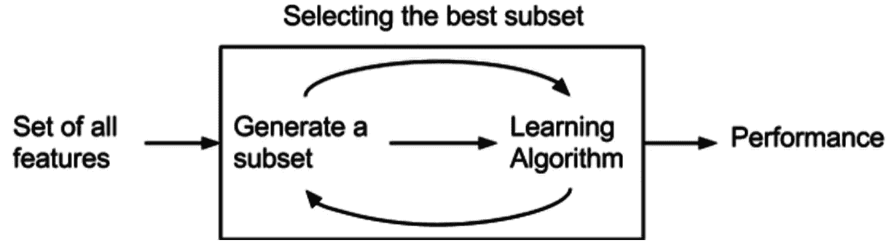

# 停止使用所有特征进行建模

> 原文：<https://towardsdatascience.com/stop-using-all-your-features-for-modeling-82d487ca8ddd?source=collection_archive---------23----------------------->

## 使用递归特征选择来选择最佳特征集


图片来自[皮克斯拜](https://pixabay.com/?utm_source=link-attribution&amp;utm_medium=referral&amp;utm_campaign=image&amp;utm_content=1690423)

真实世界的数据集包含大量相关和冗余的要素。的确，就实例或行数而言，更多数据的存在导致训练更好的机器学习模型。

在继续之前，我们必须知道为什么不建议使用所有的功能集。为了训练稳健的机器学习模型，数据必须没有冗余特征。特征选择之所以重要有多种原因:

*   **垃圾输入，垃圾输出:**用于训练模型的数据质量决定了输出模型的质量。真实世界的数据包含大量冗余特征，需要移除这些特征，以便训练稳健的模型。
*   **维数灾难:**随着数据维数或数据中特征数量的增加，特征覆盖的配置数量减少。如果与实例数量相比，数据包含更多的特征，则训练模型不会推广到新的样本。
*   **奥卡姆剃刀:**当输入数据具有大量特征时，模型的可解释性降低，因此难以解释模型。

因此，从数据集中移除不相关的要素至关重要。数据科学家应该选择他/她用于模型训练的特征。选择所有的特征组合，然后选择最佳的特征集是一个多项式解决方案。选择最佳特征集有各种技巧，阅读[这篇文章](/top-7-feature-selection-techniques-in-machine-learning-94e08730cd09)，就知道 7 种特征选择技巧。

在本文中，我们将讨论如何使用递归特征选择算法及其实现来选择最佳特征集。

# 什么是递归特征选择？



[来源](https://en.wikipedia.org/wiki/File:Feature_selection_Wrapper_Method.png)，特征选择包装方法

递归特征选择是一种包装方法，它使用贪婪优化算法来选择 k 个特征的最佳集合。它递归地训练模型，考虑越来越小的特征集，并消除不太相关的特征。逐步递归特征选择算法；

1.  估计器在所有初始特征集上被训练。
2.  使用 sklearn 库中的特定属性，如`**coef_**` 或`**feature_importance_**` **，计算每个特征的重要性。**
3.  从特征集中删除最不重要的特征。
4.  递归地重复步骤 2 和 3，直到获得所需数量的特征。

## 实施:

Sklearn 提出了 RFE(递归特征消除)实现。开发人员只需要指定估计器并更新参数。

```
**Some important Parameter of RFE function:****estimator:** Supervised learning estimator**n_features_to_select:** The final number of features to select. If 'None', then 50% of features are selected.**step:** If step>=1 thenNumber of features to remove at each iteration. els if step in [0,1) then percentage (rounded down) of features to remove at each iteration.**importance_getter:** If 'auto', uses the feature importance either through a *coef_* or *feature_importances_*attributes of estimator.
```

# 结论:

在本文中，我们讨论了如何使用递归特征选择技术来选择 k 个特征的最佳集合。Sklearn 用一行代码实现了 RFE。

还有其他各种包装器方法，包括 [**SelectKBest**](https://scikit-learn.org/stable/modules/generated/sklearn.feature_selection.SelectKBest.html) ，这也是 Sklearn 实现的一部分。SelectKBest 算法根据 k 个最高分选择相关特征。每个数据科学家都应该知道各种其他的特征选择技术，阅读下面提到的文章[来了解 7 种这样的特征选择技术。](/top-7-feature-selection-techniques-in-machine-learning-94e08730cd09)

</top-7-feature-selection-techniques-in-machine-learning-94e08730cd09>  

# 参考资料:

[1] RFE 文档:[https://sci kit-learn . org/stable/modules/generated/sk learn . feature _ selection。RFE.html](https://scikit-learn.org/stable/modules/generated/sklearn.feature_selection.RFE.html)

> 感谢您的阅读