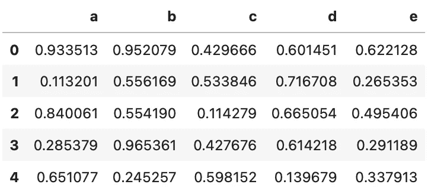
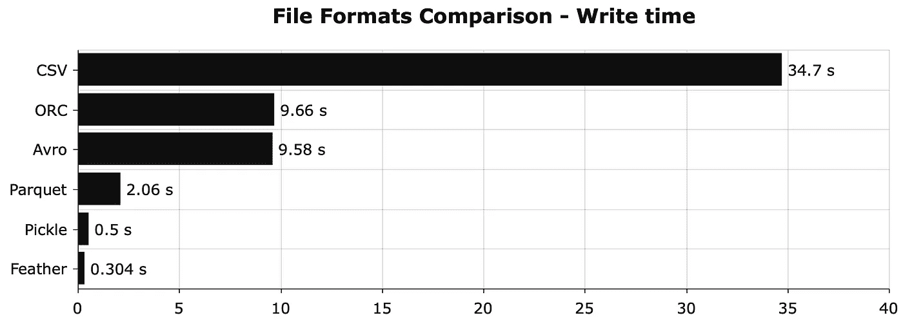
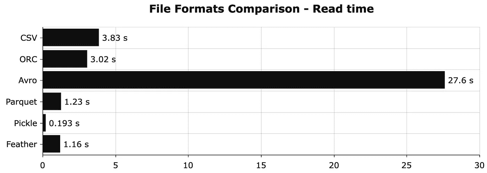
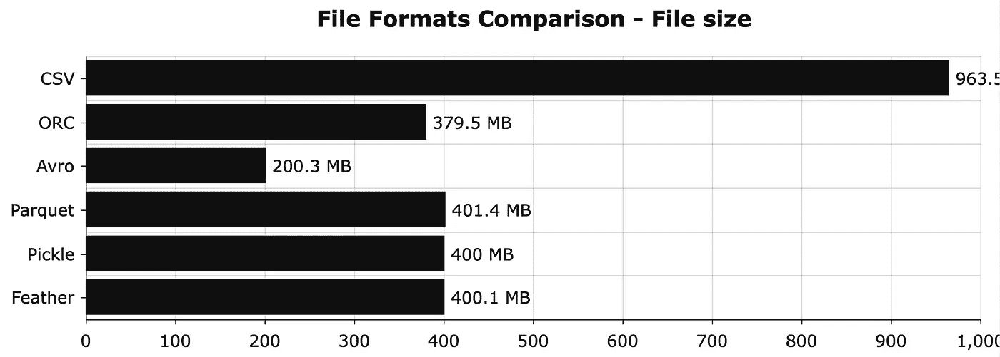

# 停止使用 CSV 存储—以下是 5 大替代方案

> 原文：<https://towardsdatascience.com/stop-using-csvs-for-storage-here-are-the-top-5-alternatives-e3a7c9018de0?source=collection_archive---------2----------------------->

## CSV 耗费您的时间、磁盘空间和金钱。以下是每个数据科学家都必须知道的五种选择。


照片由[杰基尚·帕特尔](https://unsplash.com/@magictype?utm_source=unsplash&utm_medium=referral&utm_content=creditCopyText)在 [Unsplash](https://unsplash.com/?utm_source=unsplash&utm_medium=referral&utm_content=creditCopyText) 拍摄

每个人和他们的祖母都知道 CSV 文件是什么。*但这是存储数据的最佳方式吗？不，如果你不打算实时查看或编辑数据，这可能是最糟糕的存储格式。*

如果您要存储大量数据，选择 CSV 将耗费您的时间和金钱。

今天，您将了解五种 CSV 替代方案。无论是在读/写时间还是在文件大小方面，两者都各有优势。有些甚至各方面都更好。

在查看文件格式之前，让我们先设置一下环境。

# 入门—环境设置

您将需要几个库来跟进。最佳实践是将它们安装在虚拟环境中，这正是您要做的。下面的代码片段通过 Anaconda 创建了一个新的虚拟环境，并安装了每个必需的库:

```
conda create --name file_formats python=3.8
conda activate file_formats

conda install -c conda forge numpy pandas fastavro pyarrow feather-format jupyter jupyterlab
```

安装完成后，您可以执行以下命令来启动 JupyterLab 会话:

```
jupyter lab
```

下一步是导入库并创建任意数据集。您将创建一个 5 列 10M 行的数据库:

```
import numpy as np
import pandas as pd

import feather
import pickle
import pyarrow as pa
import pyarrow.orc as orc 
from fastavro import writer, reader, parse_schema

np.random.seed = 42
df_size = 10_000_000

df = pd.DataFrame({
    'a': np.random.rand(df_size),
    'b': np.random.rand(df_size),
    'c': np.random.rand(df_size),
    'd': np.random.rand(df_size),
    'e': np.random.rand(df_size)
})
df.head()
```

它看起来是这样的:



图片 1-随机虚拟数据集(图片由作者提供)

现在，您已经具备了开始尝试不同数据格式所需的一切。先来盖 ORC。

# 妖魔

ORC 代表*优化行列*。这是一种针对 Hive 中的读写而优化的数据格式。由于 Hive 慢得令人痛苦，Hortonworks 的人决定开发 ORC 文件格式来加速它。

在 Python 中，可以使用 Pandas 的`read_orc()`函数来读取 ORC 文件。不幸的是，没有替代函数来编写 ORC 文件，所以您必须使用 PyArrow。

这里有一个写熊猫数据帧的例子:

```
table = pa.Table.from_pandas(df, preserve_index=False)
orc.write_table(table, '10M.orc')
```

下面是读取 ORC 文件的命令:

```
df = pd.read_orc('10M.orc')
```

你可以在这里了解更多关于兽人的信息:

[](/stop-using-csvs-for-storage-this-file-format-is-faster-and-lighter-8fec7ebad6fc) [## 停止使用 CSV 存储—这种文件格式更快、更轻便

### 编辑描述

towardsdatascience.com](/stop-using-csvs-for-storage-this-file-format-is-faster-and-lighter-8fec7ebad6fc) 

# Avro

Avro 是一个开源项目，为 Apache Hadoop 提供数据序列化和交换服务。它用一个类似 JSON 的模式存储数据，所以正确的数据类型是预先知道的。这就是压缩发生的地方。

Avro 对每一种主流编程语言都有 API，但是默认不支持熊猫。

下面是将熊猫数据帧保存到 Avro 文件的一组命令:

```
# 1\. Define the schema
schema = {
    'doc': 'Float data',
    'name': 'Data',
    'namespace': 'data',
    'type': 'record',
    'fields': [
        {'name': 'a', 'type': 'float'},
        {'name': 'b', 'type': 'float'},
        {'name': 'c', 'type': 'float'},
        {'name': 'd', 'type': 'float'},
        {'name': 'e', 'type': 'float'},
    ]
}
parsed_schema = parse_schema(schema)

# 2\. Convert pd.DataFrame to records - list of dictionaries
records = df.to_dict('records')

# 3\. Write to Avro file
with open('10M.avro', 'wb') as out:
    writer(out, parsed_schema, records)
```

读取 Avro 文件也不容易:

```
# 1\. List to store the records
avro_records = []

# 2\. Read the Avro file
with open('10M.avro', 'rb') as fo:
    avro_reader = reader(fo)
    for record in avro_reader:
        avro_records.append(record)

# 3\. Convert to pd.DataFrame
df = pd.DataFrame(avro_records)
```

您可以在此了解有关 Avro 的更多信息:

[](/csv-files-for-storage-absolutely-not-use-apache-avro-instead-7b7296149326) [## 用于存储的 CSV 文件？绝对不行。请改用 Apache Avro

### 编辑描述

towardsdatascience.com](/csv-files-for-storage-absolutely-not-use-apache-avro-instead-7b7296149326) 

# 镶木地板

Apache Parquet 是一种为提高效率而设计的数据存储格式。这背后的原因是列存储架构，因为它允许您快速跳过不相关的数据。这样，查询和聚合都更快，从而节省了硬件。

最好的消息是——Pandas 完全支持拼花文件。

下面是将熊猫数据帧写入拼花文件的命令:

```
df.to_parquet('10M.parquet')
```

这是阅读的对等词:

```
df = pd.read_parquet('10M.parquet')
```

你可以在这里了解更多关于拼花地板的信息:

[](/csv-files-for-storage-no-thanks-theres-a-better-option-72c78a414d1d) [## 用于存储的 CSV 文件？不用了，谢谢。有更好的选择

### 编辑描述

towardsdatascience.com](/csv-files-for-storage-no-thanks-theres-a-better-option-72c78a414d1d) 

# 泡菜

您可以使用`pickle`模块来序列化对象并将它们保存到一个文件中。同样，您可以反序列化该序列化文件，以便在需要时将其加载回去。Pickle 与其他格式相比有一个主要优势——可以用它来存储任何 Python 对象。最广泛使用的功能之一是在训练完成后保存机器学习模型。

最大的缺点是 Pickle 是特定于 Python 的，所以不能保证跨语言支持。例如，对于任何需要 Python 和 R 之间的数据通信的项目来说，这可能是一个障碍。

以下是如何将熊猫数据帧写入 Pickle 文件:

```
with open('10M.pkl', 'wb') as f:
    pickle.dump(df, f)
```

读取 Pickle 文件时，您只需更改文件模式:

```
with open('10M.pkl', 'rb') as f:
    df = pickle.load(f)
```

你可以在这里了解更多关于泡菜的信息:

[](/stop-using-csvs-for-storage-pickle-is-an-80-times-faster-alternative-832041bbc199) [## 停止使用 CSV 进行存储——泡菜是速度快 80 倍的替代品

### 编辑描述

towardsdatascience.com](/stop-using-csvs-for-storage-pickle-is-an-80-times-faster-alternative-832041bbc199) 

# 羽毛

羽化是一种用于存储数据帧的数据格式。它是围绕一个简单的前提设计的—尽可能有效地将数据帧推入和推出内存。它最初是为 Python 和 R 之间的快速通信而设计的，但是您并不局限于这个用例。

您可以使用`feather`库来处理 Python 中的羽毛文件。这是目前最快的选择。

以下是将熊猫数据帧保存到羽毛文件的命令:

```
feather.write_dataframe(df, '10M.feather')
```

下面是读取的命令:

```
df = feather.read_dataframe('10M.feather')
```

你可以在这里了解更多关于羽毛的信息:

[](/stop-using-csvs-for-storage-this-file-format-is-150-times-faster-158bd322074e) [## 停止使用 CSV 进行存储—这种文件格式速度快 150 倍

### 编辑描述

towardsdatascience.com](/stop-using-csvs-for-storage-this-file-format-is-150-times-faster-158bd322074e) 

# 比较时间-您应该使用哪种数据格式？

如果您需要即时更改甚至查看数据，许多高度优化的文件格式都是无用的。如果不是这样，你通常应该避免 CSV。

下面是 CSV 和其他提到的数据格式在写入时间上的比较。目标是在本地保存之前创建的 10Mx5 数据集:



图 2 —以秒为单位的写入时间比较(CSV:34.7；兽人:9.66；avro:9.58；拼花:2.06；泡菜:0.5；羽毛:0.304)(图片由作者提供)

差异是巨大的。对于存储相同的数据集，Feather 比 CSV 快大约 115 倍。即使您决定使用更兼容的产品，如拼花地板，写入时间仍然会减少 17 倍。

接下来说说阅读次数。目标是比较读取不同格式的相同数据集所需的时间:



图 3 —以秒为单位的读取时间对比(CSV:3.83；ORC: 3.02，Avro:27.6；拼花:1.23；泡菜:0.193；羽毛:1.16)(图片由作者提供)

CSV 在这里没那么可怕。由于需要解析，Apache Avro 绝对是最糟糕的。Pickle 是最快的，所以如果你只使用 Python，它看起来是最有前途的选择。

最后，让我们比较一下磁盘上的文件大小:



图 4 —以 MB 为单位的文件大小比较(CSV:963.5；ORC:379.5；avro:200.3；拼花:401.4；咸菜:400；羽毛:400.1)(图片由作者提供)

CSV 的情况看起来不妙。文件大小减少了 2.4 倍到 4.8 倍，具体取决于文件格式。

总而言之，如果您每天存储千兆字节的数据，选择正确的文件格式至关重要。如果你只使用 Python，Pickle 是不会错的。如果你需要更通用一点的东西，就用其他提到的格式。

您对这些 CSV 替代品有什么想法？如果不需要实时查看和编辑数据，您会使用哪一种？请在下面的评论中告诉我。

*喜欢这篇文章吗？成为* [*中等会员*](https://medium.com/@radecicdario/membership) *继续无限制学习。如果你使用下面的链接，我会收到你的一部分会员费，不需要你额外付费。*

[](https://medium.com/@radecicdario/membership) [## 通过我的推荐链接加入 Medium-Dario rade ci

### 作为一个媒体会员，你的会员费的一部分会给你阅读的作家，你可以完全接触到每一个故事…

medium.com](https://medium.com/@radecicdario/membership) 

# 保持联系

*   在[媒体](https://medium.com/@radecicdario)上关注我，了解更多类似的故事
*   注册我的[简讯](https://mailchi.mp/46a3d2989d9b/bdssubscribe)
*   在 [LinkedIn](https://www.linkedin.com/in/darioradecic/) 上连接