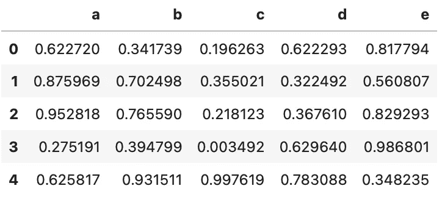
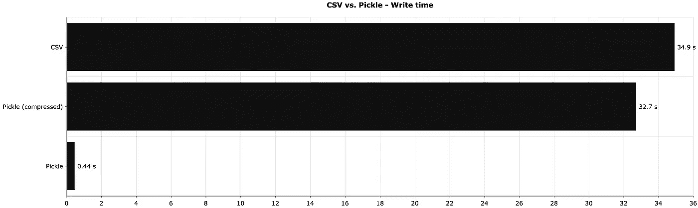
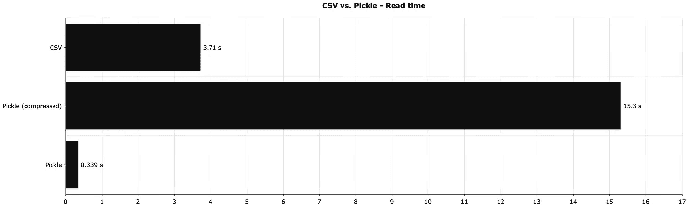
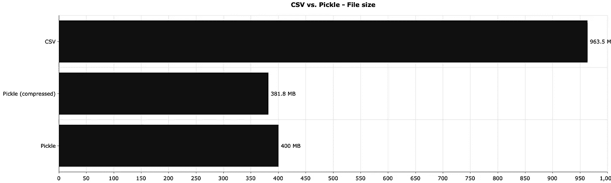

# 停止使用 CSV 进行存储——泡菜是速度快 80 倍的替代品

> 原文：<https://towardsdatascience.com/stop-using-csvs-for-storage-pickle-is-an-80-times-faster-alternative-832041bbc199?source=collection_archive---------4----------------------->

## 它还轻了 2.5 倍，并提供了每个数据科学家都必须知道的功能。


由 [KTRYNA](https://unsplash.com/@ktryna?utm_source=unsplash&utm_medium=referral&utm_content=creditCopyText) 在 [Unsplash](https://unsplash.com/?utm_source=unsplash&utm_medium=referral&utm_content=creditCopyText) 拍摄的照片

将数据存储在云中会花费你一大笔钱。很自然，您会希望远离最广为人知的数据存储格式— CSV —并选择稍微轻松一些的格式。也就是说，如果您不关心动态查看和编辑数据文件。

今天，您将了解在 Python 中存储几乎任何东西的最简单的方法之一——Pickle。Pickling 不仅限于数据集，您很快就会看到，但是本文中的每个示例都基于数据集。

# 泡菜到底是什么？

在 Python 中，可以使用`pickle`模块来序列化对象并将它们保存到文件中。然后，您可以反序列化该序列化文件，以便在需要时重新加载它们。

Pickle 与其他格式相比有一个主要优势——可以用它来存储任何 Python 对象。没错，你不限于数据。最广泛使用的功能之一是在训练完成后保存机器学习模型。这样，您就不必在每次运行脚本时重新训练模型。

我也多次使用 Pickle 来存储 Numpy 数组。这是一个在代码中设置某种检查点*的简单解决方案。*

听起来是一种完美的存储格式？嗯，沉住气。Pickle 有几个你应该知道的缺点:

*   **不能保证跨语言支持**——Pickle 是特定于 Python 的，所以没人能保证你能阅读另一种编程语言的 Pickle 文件。
*   **pickle 文件是特定于 Python 版本的**——当在一个 Python 版本中保存文件而在另一个版本中读取它们时，您可能会遇到问题。如果可能的话，尽量使用相同的 Python 版本。
*   **酸洗不会压缩数据** —酸洗一个对象不会压缩它。当然，与 CSV 相比，该文件会更小，但是您可以手动压缩数据以获得最大效率。

您将很快看到一个压缩数据的解决方案。接下来让我们看看如何在 Python 中使用 Pickle。

# 如何在 Python 中使用 Pickle？

让我们从导入所需的库并创建一个相对较大的数据集开始。你需要熊猫、熊猫、泡菜和 BZ2。您将使用最后一种方法进行数据压缩:

```
import numpy as np
import pandas as pd
import pickle
import bz2

np.random.seed = 42
df_size = 10_000_000

df = pd.DataFrame({
    'a': np.random.rand(df_size),
    'b': np.random.rand(df_size),
    'c': np.random.rand(df_size),
    'd': np.random.rand(df_size),
    'e': np.random.rand(df_size)
})
df.head()
```

以下是数据集的外观:



图片 1-随机虚拟数据集(图片由作者提供)

接下来就本地保存吧。您可以使用以下命令来清理数据帧:

```
with open('10M.pkl', 'wb') as f:
    pickle.dump(df, f)
```

文件现在保存在本地。您也可以用类似的方式阅读——只需将模式从`wb`更改为`rb`

```
with open('10M.pkl', 'rb') as f:
    df = pickle.load(f)
```

太棒了。如前所述，默认情况下，Pickle 不会进行任何压缩。您必须手动处理。Python 让`bz2`模块变得非常简单:

```
with open('10M_compressed.pkl', 'wb') as f:
    compressed_file = bz2.BZ2File(f, 'w')
    pickle.dump(df, compressed_file)
```

这只是一行额外的代码，但它可以为您节省一些磁盘时间。储蓄过程会明显更长，但这是你必须接受的权衡。

读取压缩文件需要一行额外的代码:

```
with open('10M_compressed.pkl', 'rb') as f:
    compressed_file = bz2.BZ2File(f, 'r')
    df = pickle.load(compressed_file)
```

只需确保不要弄乱文件模式，因为读取文件时提供`wb`会删除其所有内容。最好为读写操作编写助手函数，这样就不会把它们搞砸。

下一节将介绍与 CSV 文件格式在文件大小、读取和写入时间方面的比较。

# CSV 与泡菜-您应该使用哪一种？

回答这个问题并不像看起来那么容易。当然，CSV 提供了查看和编辑权限，任何人都可以打开它们。出于明显的原因，这也可能被视为一个不利因素。此外，您不能将机器学习模型保存到 CSV 文件中。

不过，让我们在文件大小、读取和写入时间方面比较一下这两者。

下图显示了在本地保存最后一部分的数据帧所需的时间:



图像 2-CSV 与 Pickle 本地保存时间(秒)(CSV:34.9；泡菜(压缩):32.7；泡菜:0.44)(作者图片)

如果你不在乎压缩，这大约是速度增加的 80 倍。

接下来，我们来比较一下读取时间—读取不同格式的相同数据集需要多长时间:



图像 3-CSV 与 Pickle 读取时间(秒)(CSV:3.71；泡菜(压缩):15.3；泡菜:0.339)(作者图片)

泡菜在没有压缩的情况下，这次大约快 11 倍。在读取和保存文件时，压缩是一个巨大的难点。但是，让我们看看它能节省多少磁盘空间。

这就是以下可视化的答案:



图像 4-CSV 与 Pickle 文件大小对比，单位为 MB(CSV:963.5；泡菜(压缩):381.8；泡菜:400)(作者图片)

与 CSV 相比，文件大小显著减小，但在这种情况下，压缩并没有节省太多磁盘空间。

概括地说，从 CSV 到 Pickle 有明显的优势。不完全明显的是，Pickle 允许您存储其他对象——任何内置于 Python、Numpy 数组甚至机器学习模型中的对象。CSV 和其他纯数据格式不具备这种能力。

*你对泡菜有什么想法和经历？这是您对 Python 生态系统的常用格式吗？*以下留言请告知。

喜欢这篇文章吗？成为 [*中等会员*](https://medium.com/@radecicdario/membership) *继续无限制学习。如果你使用下面的链接，我会收到你的一部分会员费，不需要你额外付费。*

<https://medium.com/@radecicdario/membership>  

# 保持联系

*   在[媒体](https://medium.com/@radecicdario)上关注我，了解更多类似的故事
*   注册我的[简讯](https://mailchi.mp/46a3d2989d9b/bdssubscribe)
*   在 [LinkedIn](https://www.linkedin.com/in/darioradecic/) 上连接