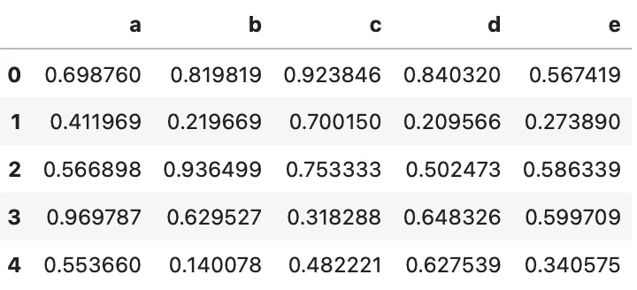
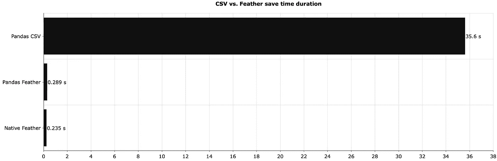
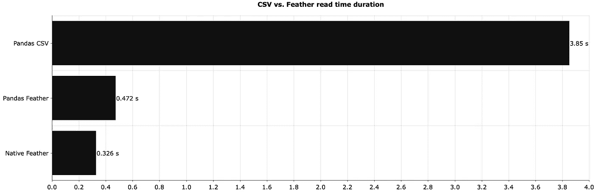
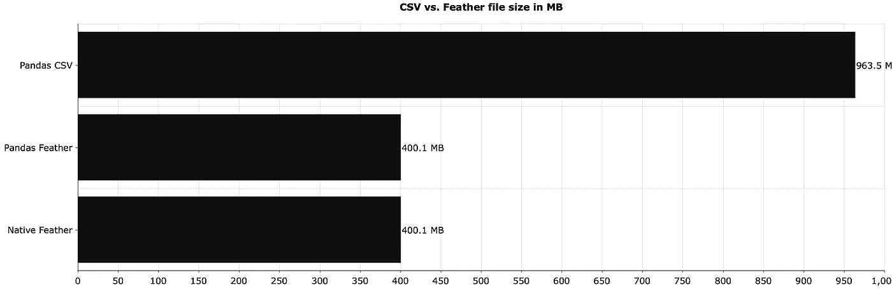

# 停止使用 CSV 进行存储—这种文件格式速度快 150 倍

> 原文：<https://towardsdatascience.com/stop-using-csvs-for-storage-this-file-format-is-150-times-faster-158bd322074e?source=collection_archive---------0----------------------->

## CSV 耗费您的时间、磁盘空间和金钱。是时候结束了。


汤姆·斯温宁从派克斯[拍摄的照片](https://www.pexels.com/photo/selective-focus-photograph-of-black-crow-946344/?utm_content=attributionCopyText&utm_medium=referral&utm_source=pexels)

CSV 不是唯一的数据存储格式。事实上，这可能是你应该考虑的最后一个。如果你不打算手动编辑保存的数据，坚持这样做是在浪费时间和金钱。

想象一下，你收集了大量的数据，并将它们存储在云中。您没有对文件格式做太多的研究，所以您选择了 CSV。你的费用高得惊人！一个简单的调整可以减少一半，如果不是更多的话。这个调整就是——你已经猜到了——选择不同的文件格式。

今天，您将了解羽毛数据格式的来龙去脉，这是一种用于存储数据帧的快速、轻量级二进制格式。

# 羽毛到底是什么？

简单来说，就是一种存储数据帧的数据格式(想想熊猫)。它是围绕一个简单的前提设计的—尽可能有效地将数据帧推入和推出内存。它最初是为 Python 和 R 之间的快速通信而设计的，但是您并不局限于这个用例。

所以，不，Feather 并不局限于 Python 和 R——你可以使用每一种主流编程语言中的 Feather 文件。

数据格式不是为长期存储而设计的。最初的意图是 R 和 Python 程序之间的快速交换，以及一般的短期存储。没人能阻止你把羽毛文件转储到磁盘上，然后保存几年，但是有更有效的格式。

在 Python 中，你可以通过 Pandas 或一个专用库来使用 Feather。本文将向您展示如何使用这两者。你需要安装`feather-format`来跟随。下面是终端命令:

```
# Pip
pip install feather-format

# Anaconda
conda install -c conda-forge feather-format
```

这就是你开始工作所需要的一切。打开 JupyterLab 或任何其他[数据科学 IDE](/top-4-python-and-data-science-ides-for-2021-and-beyond-3bbcb7b9bc44?source=user_profile---------0----------------------------) ，因为下一节将介绍 Feather 的基础知识。

# 如何在 Python 中使用羽毛？

让我们从导入库和创建一个相对较大的数据集开始。你将需要羽毛，Numpy 和熊猫跟随。数据集将有 5 列和 10M 行随机数:

```
import feather
import numpy as np
import pandas as pd

np.random.seed = 42
df_size = 10_000_000

df = pd.DataFrame({
    'a': np.random.rand(df_size),
    'b': np.random.rand(df_size),
    'c': np.random.rand(df_size),
    'd': np.random.rand(df_size),
    'e': np.random.rand(df_size)
})
df.head()
```

以下是数据集的外观:



图片 1-随机虚拟数据集(图片由作者提供)

接下来就本地保存吧。您可以使用以下命令将数据帧保存为带有熊猫的羽化格式:

```
df.to_feather('1M.feather')
```

下面是如何用羽毛库做同样的事情:

```
feather.write_dataframe(df, '1M.feather')
```

没多大区别。这两个文件现在都保存在本地。你可以用熊猫或者专用图书馆来阅读它们。首先是熊猫的语法:

```
df = pd.read_feather('1M.feather')
```

如果您正在使用羽毛库，请将其更改为以下内容:

```
df = feather.read_dataframe('1M.feather')
```

这涵盖了你应该知道的一切。下一节介绍了与 CSV 文件格式的比较，包括文件大小、读取和写入时间。

# CSV 与 Feather——您应该使用哪一个？

如果您不需要即时更改数据，答案很简单—您应该使用 Feather over CSV。尽管如此，让我们做一些测试。

下图显示了在本地保存上一部分的数据帧所需的时间:



图 2 — CSV 与 Feather 本地保存时间(秒)(CSV:35.6；羽毛(熊猫):0.289；羽毛:0.235)(图片由作者提供)

这是一个巨大的差异——native Feather 比 CSV 快 150 倍左右。如果您使用 Pandas 来处理羽毛文件，这没有太大关系，但是与 CSV 相比，速度的提高是显著的。

接下来，让我们比较一下读取时间—读取不同格式的相同数据集需要多长时间:



图 3 — CSV 与以秒为单位的羽毛读取时间(CSV:3.85；羽毛(熊猫):0.472；羽毛:0.326)(图片由作者提供)

再一次，显著的差异。CSV 的读取速度要慢得多。当然，它们会占用更多的磁盘空间，但是具体会多多少呢？

这就是下一个可视化的答案:



图 4 — CSV 与 Feather 文件大小(CSV:963.5 MB；羽毛:400.1 MB)(图片由作者提供)

如您所见，CSV 文件占用的空间是羽化文件的两倍多。

如果您每天存储千兆字节的数据，选择正确的文件格式至关重要。在这方面，Feather 击败了 CSV。如果你需要更多的压缩，你应该试试 T4 拼花地板。我发现这是迄今为止最好的格式。

综上所述，将`to_csv()`改为`to_feather()`，将`read_csv()`改为`read_feather()`可以为你节省大量的时间和磁盘空间。在您的下一个大数据项目中考虑这一点。

*喜欢这篇文章吗？成为* [*中等会员*](https://medium.com/@radecicdario/membership) *继续无限制学习。如果你使用下面的链接，我会收到你的一部分会员费，不需要你额外付费。*

[](https://medium.com/@radecicdario/membership) [## 阅读达里奥·拉德契奇(以及媒体上数以千计的其他作家)的每一个故事

### 作为一个媒体会员，你的会员费的一部分会给你阅读的作家，你可以完全接触到每一个故事…

medium.com](https://medium.com/@radecicdario/membership) 

# 保持联系

*   在 [Medium](https://medium.com/@radecicdario) 上关注我，了解更多类似的故事
*   注册我的[简讯](https://mailchi.mp/46a3d2989d9b/bdssubscribe)
*   在 [LinkedIn](https://www.linkedin.com/in/darioradecic/) 上连接