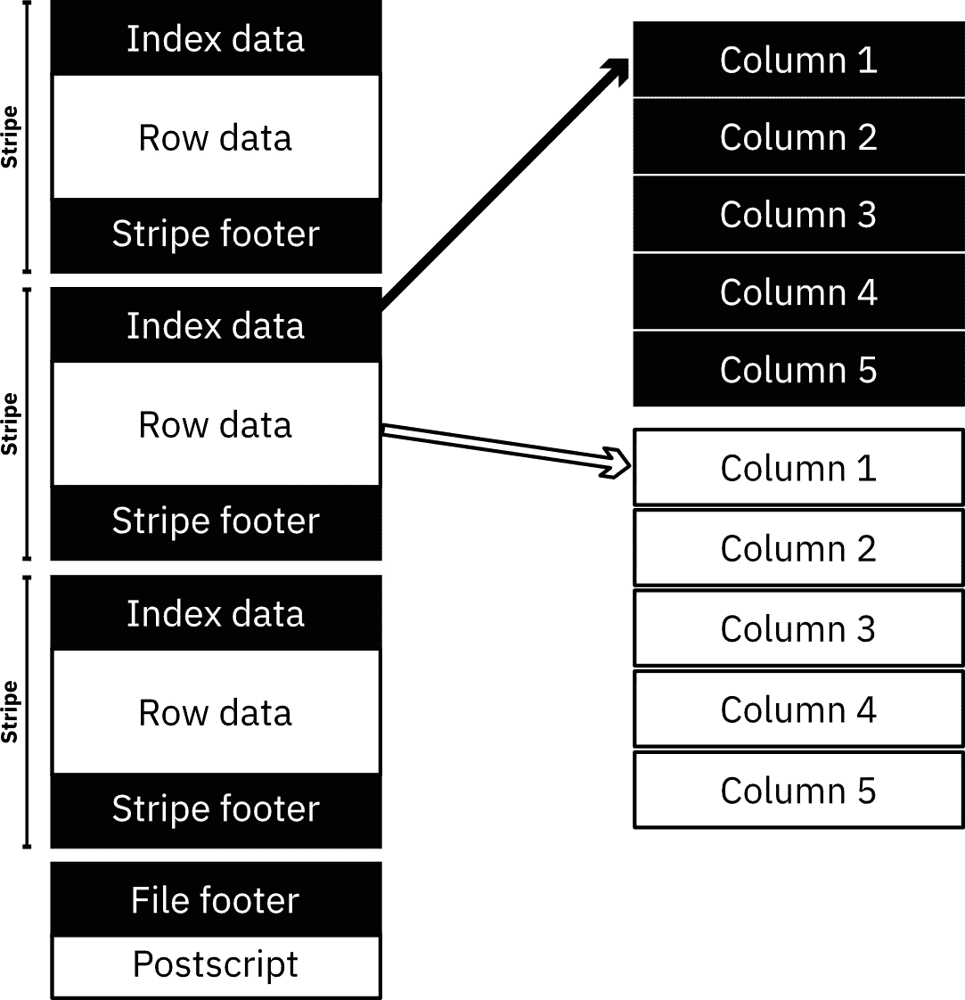
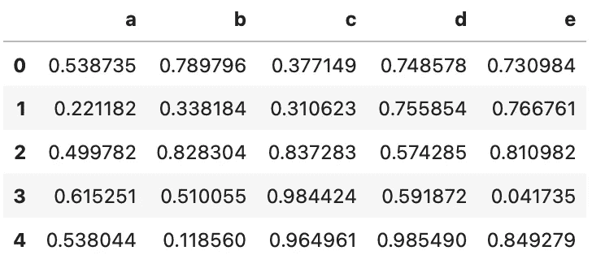
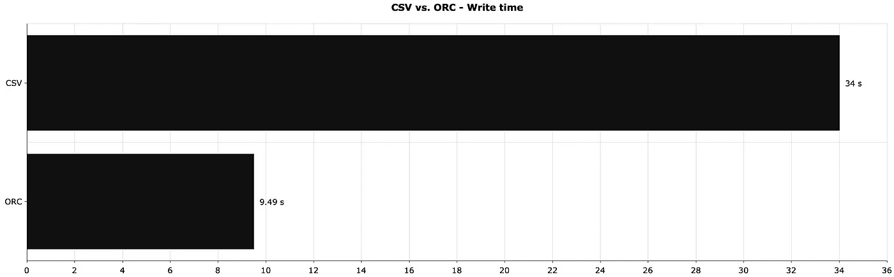
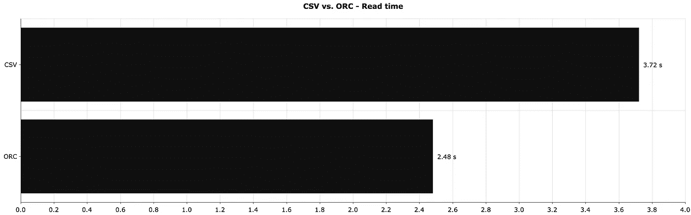
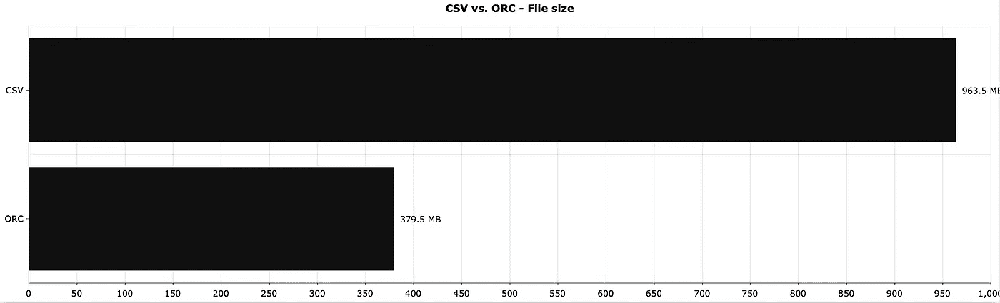

# 停止使用 CSV 存储—这种文件格式更快、更轻便

> 原文：<https://towardsdatascience.com/stop-using-csvs-for-storage-this-file-format-is-faster-and-lighter-8fec7ebad6fc?source=collection_archive---------18----------------------->

## CSV 耗费您的时间、磁盘空间和金钱。有一个解决办法。


照片由[克里斯蒂娜·莫里路](https://www.pexels.com/@divinetechygirl?utm_content=attributionCopyText&utm_medium=referral&utm_source=pexels)从[派克斯](https://www.pexels.com/photo/man-standing-infront-of-white-board-1181345/?utm_content=attributionCopyText&utm_medium=referral&utm_source=pexels)拍摄

CSV 不是唯一可用的数据存储格式。事实上，如果您不打算动态查看和编辑数据，这可能是您应该选择的最后一种方法。如果您计划转储大型数据集并使用自动化进行处理，那么使用 CSV 将是一个漫长且代价高昂的错误。

想象一下，你收集了大量的数据，并将它们存储在云中。您没有对文件格式做太多的研究，所以您选择了 CSV。你的费用高得惊人！一个简单的调整可以减少一半，如果不是更多的话。这个调整就是——你已经猜到了——选择不同的文件格式。

今天，您将了解 ORC 数据格式的来龙去脉，这是一种最初为加快 Hive 处理速度而开发的存储解决方案。不，你不需要一个大数据环境来跟进。

# 兽人——这是什么？

ORC 代表*优化行列*。这是一种针对 Hive 中的读写进行优化的数据格式，Hive 是一种针对大数据环境的数据查询和分析工具。

如果你有任何使用 Hive 的经验，你就会知道它的速度有多慢。无论数据集大小如何，即使是最简单的查询也要花费很长时间。Hortonworks 的人在 2013 年决定加快 Hive 的速度，这导致了 ORC 文件格式的开发。

ORC 文件由条带组成，这些条带包含索引数据、行数据和页脚。下图大致向您展示了 ORC 文件在表面之下的样子:



图 1 — ORC 文件格式结构(图片由作者提供)

每个条带的索引数据包括每列的最小值和最大值以及它们的行索引位置。此外，索引位置提供了偏移量，因此 ORC 可以在右*块*中进行搜索。换句话说，ORC 提供了行跳过功能，这使得读取速度比其他选择更快。

*文件页脚*包含 ORC 文件中的条带列表和关于每个条带的元数据，比如行数、数据类型和汇总统计数据。

在 Python 中，可以使用`read_orc`函数用熊猫读取 ORC 文件。不幸的是，对于编写 ORC 文件来说，没有替代函数。你将不得不使用`pyarrow`库来这样做。以下是安装方法:

```
# Pip
pip install pyarrow

# Anaconda
conda install -c conda-forge pyarrow
```

还有其他库可以使用 ORC，但是 PyArrow 可以在所有主流操作系统上运行——包括 M1 MAC 电脑。

现在，您已经具备了开始工作所需的一切。打开 JupyterLab 或任何其他[数据科学 IDE](/top-4-python-and-data-science-ides-for-2021-and-beyond-3bbcb7b9bc44?source=user_profile---------0----------------------------) ，因为下一节将介绍 ORC 的基础知识。

# 如何在 Python 中使用 ORC？

让我们从导入库并创建一个相对较大的数据集开始。你将需要 Numpy，熊猫和 PyArrow 跟随。数据集将有 1000 万行随机数，分布在五列中:

```
import numpy as np
import pandas as pd
import pyarrow as pa
import pyarrow.orc as orc 

np.random.seed = 42
df_size = 10_000_000

df = pd.DataFrame({
    'a': np.random.rand(df_size),
    'b': np.random.rand(df_size),
    'c': np.random.rand(df_size),
    'd': np.random.rand(df_size),
    'e': np.random.rand(df_size)
})
df.head()
```

以下是数据集的外观:



图片 2-随机虚拟数据集(作者提供的图片)

接下来就本地保存吧。您可以使用以下命令通过 PyArrow 将数据帧写入 ORC 文件格式:

```
table = pa.Table.from_pandas(df, preserve_index=False)
orc.write_table(table, '10M.orc')
```

正如你所看到的，保存数据到 ORC 文件需要更多的输入，因为还没有一个官方的 Pandas writer 函数。不过，阅读也是一样的。

您可以使用以下命令从您的计算机中读取 ORC 文件:

```
df = pd.read_orc('10M.orc')
```

不会变得更容易。您现在知道如何使用 Python 读取和保存 ORC 文件了。下一节介绍了与 CSV 文件格式的比较，包括文件大小、读取和写入时间。

# CSV 和 ORC——你应该使用哪一个？

如果您需要即时更改甚至查看数据，许多高度优化的文件格式都是无用的。如果不是这样，通常应该避免 CSV、XML 和 JSON 文件格式。接下来你会明白为什么。

下图显示了在本地保存我们的 10M 数据帧所需的时间:



图 3 — CSV 与 Feather 本地保存时间(秒)(CSV:34；兽人:9.49)(图片由作者提供)

没有与[羽毛](/stop-using-csvs-for-storage-this-file-format-is-150-times-faster-158bd322074e)的差别那么大，但还是很明显。

接下来，让我们比较一下读取时间—读取不同格式的相同数据集需要多长时间:



图 4 — CSV 与 ORC 读取时间(秒)的对比(CSV:3.72；ORC: 2.48)(图片由作者提供)

很接近了，但是 ORC 读起来还是更快。相比之下，读取[羽毛](/stop-using-csvs-for-storage-this-file-format-is-150-times-faster-158bd322074e)格式的相同文件只需要 0.326 秒。

CSV 读取速度较慢的部分原因是文件大小的增加。下面的图像向你展示了 ORC 到底有多小:



图 5 — CSV 与 ORC 文件大小(CSV:963.5 MB；ORC: 379.5 MB)(图片由作者提供)

如您所见，CSV 文件占用的空间是 ORC 文件的两倍多。

如果您每天存储千兆字节的数据，选择正确的文件格式至关重要。在这方面，ORC 是更好的 CSV。如果你需要更多的压缩，你应该试试镶木地板或 T2 羽毛。

总而言之，即使对 Python 代码进行最小的调整，也能显著减少磁盘使用量并节省时间。如果您将这些操作扩展到万亿字节的数据，就不难看到好处。

*喜欢这篇文章吗？成为* [*中等会员*](https://medium.com/@radecicdario/membership) *继续无限制学习。如果你使用下面的链接，我会收到你的一部分会员费，不需要你额外付费。*

<https://medium.com/@radecicdario/membership>  

# 保持联系

*   在[媒体](https://medium.com/@radecicdario)上关注我，了解更多类似的故事
*   注册我的[简讯](https://mailchi.mp/46a3d2989d9b/bdssubscribe)
*   在 [LinkedIn](https://www.linkedin.com/in/darioradecic/) 上连接