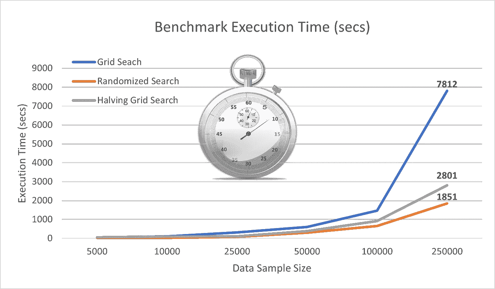
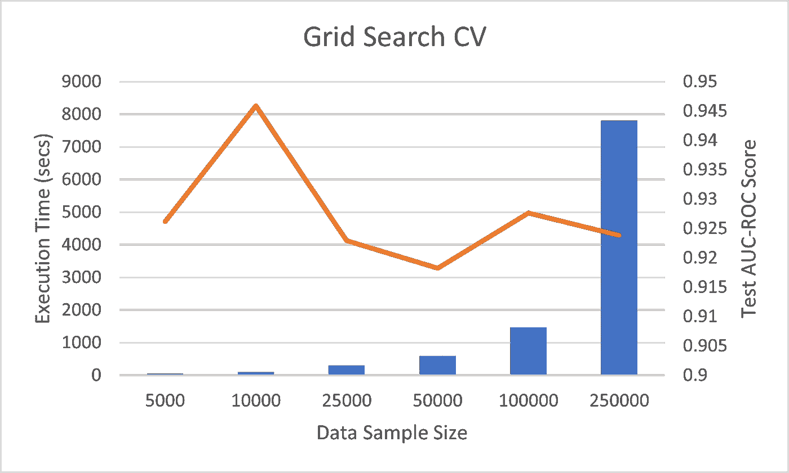
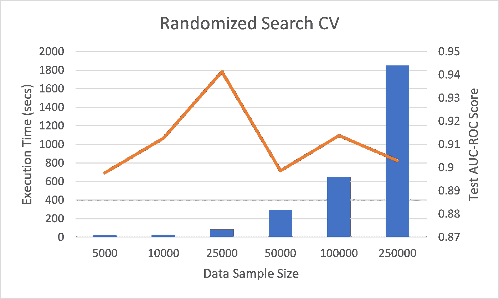
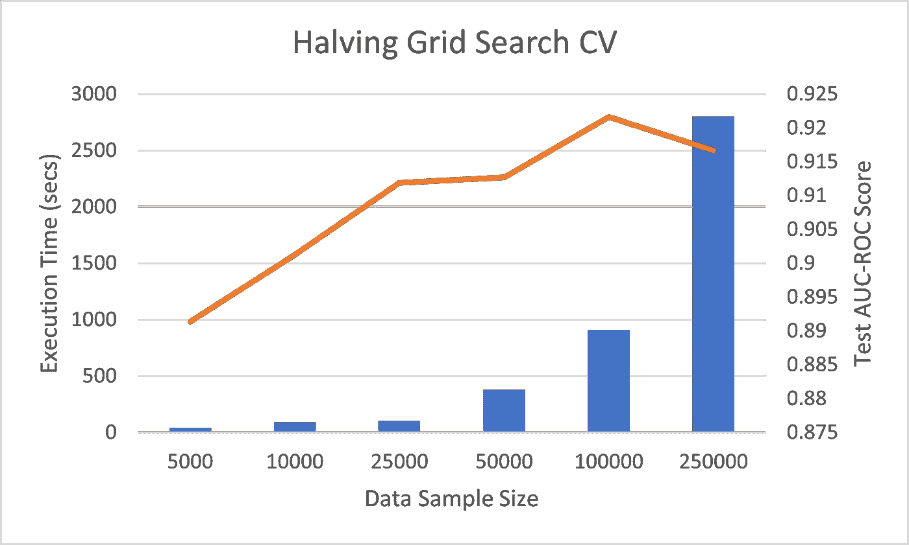
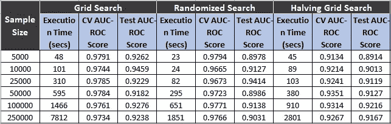

# 停止使用网格搜索交叉验证进行超参数调整

> 原文：<https://towardsdatascience.com/stop-using-grid-search-cross-validation-for-hyperparameter-tuning-b962160dd6ae?source=collection_archive---------12----------------------->

## 各种基于交叉验证的超参数调优技术的基准时间数



(图片由作者提供)，使用 [Pixlr](https://pixlr.com/x/) 编辑

为了训练健壮的机器学习模型，必须选择最合适的机器学习算法以及相应的超参数的最佳集合。为了找到最适合用例的方法，数据科学家需要用不同的超参数集手动训练数百个模型，以比较它们的性能。选择模型的手动搜索是一项繁琐的任务，并且会降低建模流水线的速度。

超参数调整是指为模型选择最佳参数集的过程。建议在超参数空间中搜索最佳交叉验证分数的估计量。各种交叉验证技术可用于优化估计量的超参数空间。网格搜索交叉验证是一种流行的技术，用于优化各种机器学习算法的超参数空间并选择稳健的模型。

本文将讨论超参数优化何时以及为什么应该避免网格搜索交叉验证，并讨论各种其他类似的技术及其运行时基准时间数。在我的上一篇文章中，我们已经讨论了 [7 超参数优化技术](/7-hyperparameter-optimization-techniques-every-data-scientist-should-know-12cdebe713da)，这里我们将比较时间

# 开始使用:

从 [Kaggle](https://www.kaggle.com/mlg-ulb/creditcardfraud) 下载的信用卡欺诈检测数据集将用于比较每种交叉验证技术的运行时间，以优化超参数。我们将使用**随机森林分类器模型**和具有 **100 个组件**的超参数空间来训练所有交叉验证技术。

```
***# Number of Components: 5*5*2*2 = 100*****param_grid** = 
**{**'**n_estimator**':[10,25,50,100,250],
'**max_depth**':[5,10,25,50,None],
'**max_features**':['auto',None],
'**min_sample_split**':[2,5]
**}**
```

在本文中，我们将讨论和比较以下各项的运行时间:

```
**CV based Hyperparameter Optimization Checklist: *1) Grid Search CV
2) Randomized Search CV
3) Halving Grid Search CV***
```

> *阅读*[*sci kit-了解交叉验证的文档*](https://scikit-learn.org/stable/modules/cross_validation.html) *以便更好地理解。*

# 1.网格搜索 CV:

网格搜索也可以称为手动超参数搜索的自动化版本。网格搜索 CV 在参数网格的所有组合上训练估计器，并返回具有最佳 CV 分数的模型。Scikit-Learn 包附带了 GridSearchCV 实现。

网格搜索交叉验证技术计算量很大。网格搜索 CV 的复杂性随着参数网格中参数数量的增加而增加。因此，网格搜索 CV 技术不推荐用于大尺寸数据集或具有大量组件的参数网格。



(图片由作者提供)，网格搜索 CV 执行时间和测试信用卡欺诈检测数据集的各种样本的 AUC-ROC 分数

> 在这里找到[的](https://gist.github.com/satkr7/120ee68901164ceadc0447985daec259#file-gridsearchcv-py)代码片段来实现网格搜索 CV。

# 2.随机搜索简历:

随机化搜索 CV 克服了网格搜索 CV 的局限性(时间复杂度高)。超参数组合随机子集上的随机搜索训练模型。与网格搜索相比，随机搜索训练估计器的组合总数较少。

Scikit-learn 包还附带了随机搜索 CV 的实现。可以采样的参数设置数量可以通过调整 **RandomizedSearchCV** 功能中的`**n_iter**` 参数来决定。`**n_iter**` 可以在解决方案的运行时间和性能之间进行权衡。



(图片由作者提供)，针对信用卡欺诈检测数据集的各种样本的随机搜索 CV 执行时间和测试 AUC-ROC 得分

> 在这里找到[的](https://gist.github.com/satkr7/f6ee02baec9bd6344ff1cdf2477a26c7#file-randomsearchcv-py)代码片段来实现网格搜索 CV。

# 3.减半网格搜索 CV:

网格搜索和随机搜索在全部数据的所有成分或成分的随机样本(参数网格的组合)上训练估计器，而等分网格搜索 CV 遵循连续等分方法。Scikit-Learn 包附带了[减半网格搜索 CV 实现](https://scikit-learn.org/stable/modules/generated/sklearn.model_selection.HalvingGridSearchCV.html)。

将网格搜索(HGS) CV 减半的步骤如下:

1.  HGS 将随机数据样本训练成超参数的组合。
2.  选择性能最佳的候选参数。
3.  一个相对较大的数据样本被训练在表现最好的候选人身上(来自步骤 2)。
4.  重复上述 3 个步骤，直到最佳超参数集保持不变。

> 阅读我之前的文章，描述如何使用 [HGS 将建模工作流程提高 20 倍](/20x-times-faster-grid-search-cross-validation-19ef01409b7c)。



(图片由作者提供)，将网格搜索 CV 执行时间减半，并测试信用卡欺诈检测数据集的各种样本的 AUC-ROC 分数

使用 HGS，对于每个经过的迭代，参数分量在减少，而训练数据集在增加。由于该算法遵循连续减半的方法，因此与网格搜索 CV 相比，该算法的时间复杂度相对较小。

# 基准性能:



(图片由作者提供)

# 结论:

在本文中，我们讨论了各种基于交叉验证的超参数优化技术，并比较了它们的执行时间和 ROC 分数。

从上述基准数据中，我们可以得出结论，整个数据集(250000 个样本)的测试 AUC-ROC 得分几乎相同。但是随机搜索 CV 的执行时间是网格搜索 CV 技术的五倍(T0)快(T1)，减半网格搜索是网格搜索 CV 技术的三倍(T3)。对于具有大量组件的大型数据集或参数格网，建议使用另一种讨论过的技术。

随着参数网格组件数量的增加，对半网格搜索 CV 的性能将进一步提高。阅读[这篇文章](/20x-times-faster-grid-search-cross-validation-19ef01409b7c)以获得更好的理解。

# 参考资料:

[1]sci kit-学习文档:[https://scikit-learn.org/stable/modules/grid_search.html](https://scikit-learn.org/stable/modules/grid_search.html#)

> 感谢您的阅读