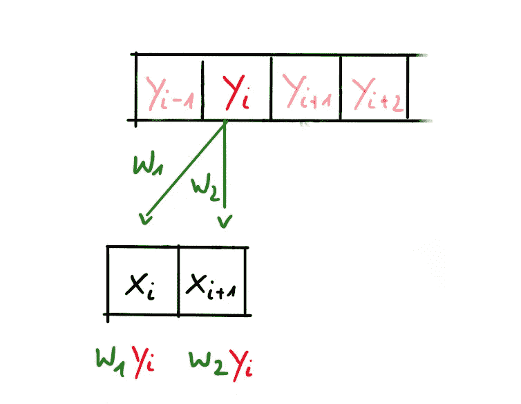
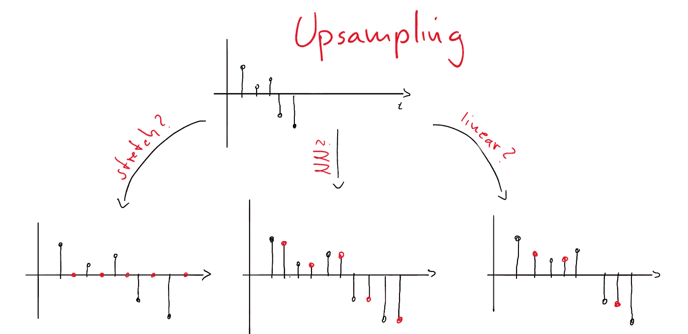
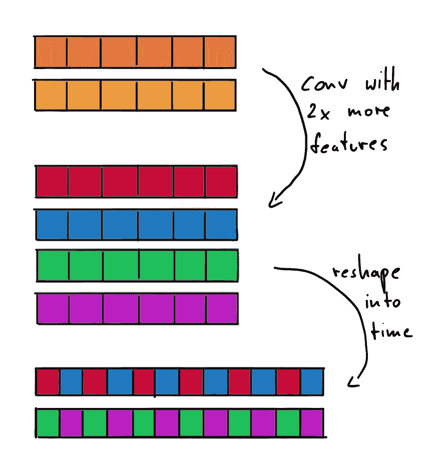
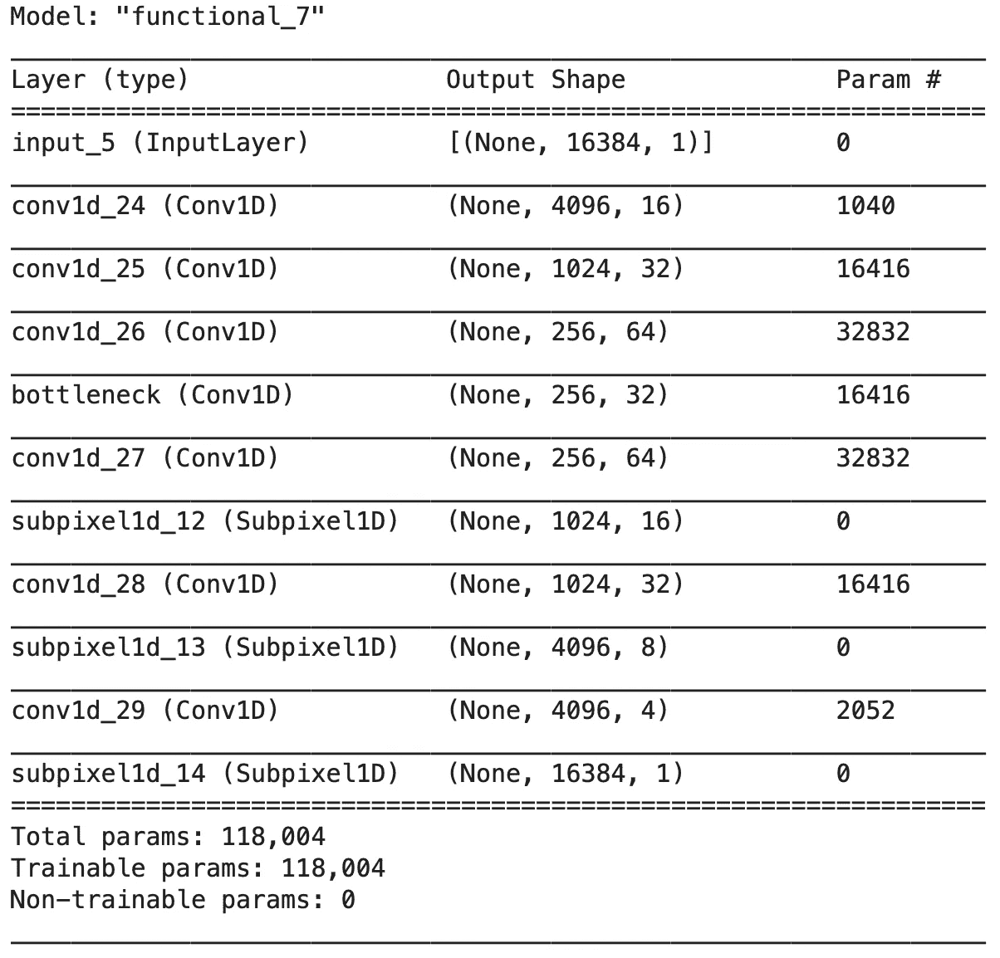

# 停止对神经音频合成使用图像插值

> 原文：<https://towardsdatascience.com/stop-using-image-interpolation-for-neural-audio-synthesis-224c909c8c8b?source=collection_archive---------41----------------------->

## [理解大数据](https://towardsdatascience.com/tagged/making-sense-of-big-data)

## 不同类型的神经上采样器，以及在深度学习音频合成项目中应该使用哪一种。

在这个故事中，我想提升你对音频合成背景下的神经上采样器的理解。并提供了一个简单的亚像素 1D Keras 层实现，作为我们今天讨论的许多任务的替代方案。

我们都知道上下采样在计算机视觉的深度学习中是一种重要的操作，例如，在像图像超分辨率或图像生成这样的任务中。使用 GANs、U-Nets 或自动编码器等流行架构的音频合成也是如此。虽然下采样是一种相对简单的操作，但总是很难找到一种不会导致图像或音频伪像的好的上采样策略。关于计算机视觉任务中的二维棋盘格工件的初级读本，请阅读[这篇伟大的文章](https://distill.pub/2016/deconv-checkerboard/)【1】。

现在让我们更深入地研究一维音频上采样。在音频领域，我们使用三种主要的上采样技术[2]:

1.  转置卷积(广泛使用)
2.  插值+卷积(常用)
3.  子像素卷积(很少使用，但在视觉任务中很突出)

它们的使用实例可以在许多出版物中找到，如 Demucs(音乐源分离)[3]，MelGAN(波形合成)[4]，SEGAN(语音增强)[5]，conv-塔斯内(语音分离)[6]或 Wave U-Net(源分离)[7]。

TensorFlow Keras 提供了第四种上采样解决方案，即[上采样 1D](https://www.tensorflow.org/api_docs/python/tf/keras/layers/UpSampling1D) 层，然而，截至目前(3 月 21 日)这一层在 GPU 上仍然非常慢，尽管[问题](https://github.com/tensorflow/tensorflow/issues/23948)已经解决。

## **转置卷积**



图 1:使用转置卷积的 2 倍上采样|作者图片

转置卷积是卷积的逆运算，Keras 提供了 1D、2D 和 3D 实现。您可以像使用 Conv1D 层一样使用 [Conv1DTranspose](https://www.tensorflow.org/api_docs/python/tf/keras/layers/Conv1DTranspose) 层，并且通过传递*stamps = 2*得到的张量将使其时间维度的大小加倍，如图 1 所示。在这种情况下，上采样由在训练期间学习的卷积运算的权重控制。

## 插入文字



图 2:采用不同插值方案的 2 倍上采样|作者图片

相比之下，插值本身没有可学习的参数，这就是为什么这种操作之后应该有一个神经网络层。否则我们只会对一些潜在空间的高级特征进行上采样。根据插值方案以及在神经网络中部署的结果，计算性能可能会有很大差异。稍后我们将看到为什么其他方法是有利的，但这里有一个在 1D 实现插值运算的简单方法:

```
x = tf.image.resize(x, [samples * stride, 1], method='nearest')
```

## 子像素



图 3:采用亚像素方法的 2 倍上采样|作者图片

这个很酷！想法是在信道维度而不是时间维度中执行上采样。通过用卷积将通道的大小加倍，我们可以应用整形操作，该操作周期性地将通道混洗到时间维度中。这比解释更好，所以请看图 3。子像素层有不同的实现方式，其计算复杂度也各不相同。

在接下来的部分中，我们将更深入地了解亚像素 1D 层的实现，但让我们先来谈谈目前为止这三种方法的优缺点。

# 上采样伪像

所有上面提到的上采样方法都会将伪像引入到神经音频合成模型中，然而，理论上，您的模型可以决定学习一种方法来最小化这些伪像。在 Jordi Pons 等人[2]最近的预印本中，该团队描述了神经上采样器如何引入音调和滤波伪像。如果你想更深入地研究这个主题，强烈推荐你读一读！然而，为了对实际使用的预定方法进行排序，这里有一个总结:

*   **转置卷积:**部分重叠的滤波器会导致更强的音调伪像，因此您应该将滤波器+步幅参数化为完全重叠或无重叠
*   **为了避免频谱复制**不要使用 ReLu-activation 并移除卷积层中的任何偏差。
*   **插值:**用最近邻插值代替线性插值。插值方法会导致滤波伪像。
*   **子像素和转置卷积**显示在类似 Demucs 的架构中**训练速度快了 25%**。它们还能获得最佳的信号失真比。
*   与音调伪像相比，滤波伪像在感觉上没有那么令人讨厌
*   目前，**从数据中学习是克服音调伪像的唯一方法**，尤其是通过随机权重初始化引入的那种

分析表明，转置卷积和子像素 CNN 是神经音频合成的发展方向。它们实现了更好的 SDR 分数，并且在计算上比使用图像插值方法更有效。然而，插值模型似乎更好地概括了看不见的数据，只引入了感觉上不那么烦人的滤波伪影。

# 实现子像素 1D

子像素 1D 的这种实现利用 *tf.batch_to_space()* 函数来执行周期性混洗。因此，我们首先置换维度，使得信道维度是第一个，在应用 batch_to_space 操作之后，我们只需要将维度置换回原位，以获得我们的上采样张量。我们假设子像素 1D 层的输入已经预先经历了卷积层，这适当地增加了信道维度。如果通道维度大小不能被上采样因子 *r* 整除，则会产生错误。

现在让我们通过为原始音频数据实现一个简单的自动编码器来实现这一层。我们假设模型的输入长度为 16384 个样本，因此我们可以轻松地以 4 倍的因子对层进行上下采样。

最后，我们可以让我们的神经上采样器工作，并将任意音频数据编码到我们的自动编码器的潜在空间中。当然，您可以用上面出版物中提到的任何模型来替换这个模型草图。查看图 4 中的模型总结，我们可以看到所提出的架构仅使用卷积层。这是伟大的，因为它保持了我们的模型简单和高性能，你的训练时间应该显着改善，如果你以前使用插值方法！



图 4:作者的亚像素 CNN 自动编码器图片摘要

# 恭喜

现在，您已经准备好为音频合成任务(以及任何其他时间序列数据)构建最先进的神经上采样器。通过决定所介绍的上采样方法的哪些属性更适合您的项目，您应该能够避开感知上令人讨厌的伪像的陷阱。此外，我们实现了一个子像素 1D 层，它在 CNN 架构中提供了最佳的计算性能，同时表现出与转置卷积相同的行为。

# 资源

[1] A. Odena 等人，反卷积和棋盘状伪像(2016)，【http://distill.pub/2016/deconv-checkerboard 

[2] J. Pons 等人，神经音频合成中的上采样伪像(2021)，[https://arxiv.org/pdf/2010.14356.pdf](https://arxiv.org/pdf/2010.14356.pdf)

[3] A. Défossez 等，波形域中的音乐源分离(2019)，[https://hal.archives-ouvertes.fr/hal-02379796/document](https://hal.archives-ouvertes.fr/hal-02379796/document)

[4] K. Kumar 等，MelGAN:用于条件波形合成的生成对抗网络(2019)，【https://arxiv.org/pdf/1910.06711.pdf 

[5] S. Pascual 等人，SEGAN:语音增强生成对抗网络(2017)，【https://arxiv.org/pdf/1703.09452.pdf 

[6] Y .罗，n .梅斯卡拉尼，-塔斯奈特:超越理想时频幅度掩蔽的语音分离(2019)，

[7] D. Stoller，S. Ewert 和 S. Dixon，Wave-U-Net:用于端到端音频源分离的多尺度神经网络(2018)，[https://arxiv.org/pdf/1806.03185.pdf](https://arxiv.org/pdf/1806.03185.pdf)

如果你正在阅读这篇文章，我们可能有相似的兴趣或者在同一个行业，欢迎你联系我。在[*LinkedIn*](https://www.linkedin.com/in/corvin-jaedicke-ab1341186/)*上找我。*