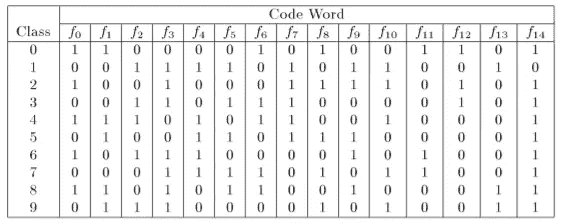
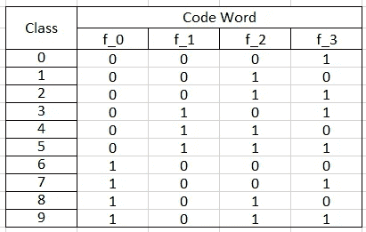
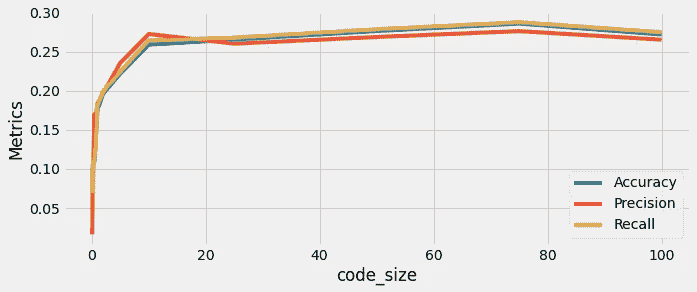

# 停止使用一对一或一对多分类任务

> 原文：<https://towardsdatascience.com/stop-using-one-vs-one-or-one-vs-rest-for-multi-class-classification-tasks-31b3fd92cb5e?source=collection_archive---------11----------------------->

## 纠错输出码基本指南(ECOC)

图片由 [Gerd Altmann](https://pixabay.com/users/geralt-9301/?utm_source=link-attribution&amp;utm_medium=referral&amp;utm_campaign=image&amp;utm_content=475664) 从 [Pixabay](https://pixabay.com/?utm_source=link-attribution&amp;utm_medium=referral&amp;utm_campaign=image&amp;utm_content=475664) 拍摄

诸如逻辑回归、支持向量机等机器学习算法可以对二进制类数据集进行分类，但在处理多类分类数据时，它会失败。多类分类任务具有超过 2 个基数的目标类标签。对于多类分类或多标签分类任务，我们需要使用某些技巧或技术以及机器学习算法来训练数据集。

[一对一](https://scikit-learn.org/stable/modules/generated/sklearn.multiclass.OneVsOneClassifier.html)和[一对一](https://scikit-learn.org/stable/modules/generated/sklearn.multiclass.OneVsRestClassifier.html)就是这样两种可以处理多类或多标签分类任务的技术。One-vs-Rest 分类器为目标类标签为`**‘c’**`基数的数据训练`**‘c’**`分类器，每个估计器适用于一个类，并针对所有其他类。而一对一分类器为每对类别训练一个分类器。纠错输出码(ECOC)与 OvO 和 OvR 分类器有很大不同。在本文中，我们将讨论 ECOC 如何在幕后工作，以及如何使用它来训练多类分类任务的模型。

# 什么是 ECOC？

纠错输出码(ECOC)是一种为多类分类问题设计的集成分类技术。[虹膜数据集](https://www.kaggle.com/uciml/iris)和 [MNIST 数字识别数据集](https://www.kaggle.com/c/digit-recognizer/data)是多类分类数据集的例子。ECOC、OvO 和 OvR 技术结合多个二元估计器来开发多类分类模型。

ECOC 将多类目标类标签预处理成二进制代码(0 和 1 的数组)。使用这种策略，目标类别标签在二进制码的欧几里德空间中表示，使用跟踪编码的码本。

(图片由作者提供)，15 位编码中 10 个类目标标签的表示

上面提到的图像显示了 10 类目标标签的 15 位编码。每个目标标签被分配一个唯一的 15 位编码。码本矩阵跟踪每个目标类的比特编码。

开发者可以控制比特编码的维度。如果位编码的维数大于目标类别标签的基数，则一些分类器的预测可以被其他分类器校正。在这种情况下，要训练的估计量的数量比一对其余技术要多。

如果我们保持比特编码的维数小于目标类标签的基数，那么它训练的估计器相对比一对其余分类器要少。理论上，`**log2(n_classes)**`足以明确地表示目标类标签。对于 10 类目标标签 log2(10)=4 应该是选择。

(图片由作者提供)，以 4 位编码表示 10 个类目标标签

在 d 维比特编码中对目标类标签进行编码之后，需要拟合“d”个估计量，一个二进制估计量用于编码的每个比特。在预测时，基本估计器预测编码目标类的每个相应比特，并且最接近这些点的目标嵌入类被认为是最终预测。

# 实施:

Scikit-learn 包附带了一个 [OutputCodeClassifier()](https://scikit-learn.org/stable/modules/generated/sklearn.multiclass.OutputCodeClassifier.html) 函数，该函数在一行 Python 代码中实现了 ECOC 分类器。参数 code_size 可用于决定目标类的位编码。介于 0 和 1 之间的值可以用于压缩模型，或者 code_size > 1 可以使模型对错误更鲁棒。

需要调整 code_size 的值:

*   0 < code_size <1: Train a compressed model where the number of estimators fitted is less than in the case of the One-vs-Rest classifier.
*   code_size> 1:训练误差校正模型，对误差稳健。拟合的估计量的数量多于一对其余分类器的情况。

(作者代码)，使用 Scikit-learn API 实现 ECOC

可以调整超参数 code_size 来改变目标类嵌入的维度。我使用带有逻辑回归模型的 OutputCodeClassifier 作为基本估计量，训练了一个 20 类分类数据集。

(图片由作者提供)，调优代码大小超参数上的性能指标分布

从上面的分布图中，我们可以观察到性能指标的增加，但随后，它变平了。代码大小= 10 的值可以被认为是一个阈值。对于代码大小= 10，我们得到了 25.9%的准确率、27.3%的精确度和 26.5%的召回率。进一步增加嵌入维数对模型的性能没有影响。

# 结论:

OutputCodeClassifier 是一个方便的函数，可用于拟合实现 ECOC 算法的多类分类数据集。开发人员可以控制基分类器的数量，这与一对一或一对其余技术相比是一个额外的优势，在一对一或一对其余技术中，基估计器的数量取决于目标类的基数。

模型的性能取决于基本估计量的数量。理论上，log2(n_classes)足以明确地表示目标类，但它可能不会导致健壮的模型。我们需要增加代码大小来适应一个不受错误影响的健壮模型。

> 遵循我以前的一篇文章，更好地理解多标签分类和多输出回归任务

 [## Python 中多类和多输出算法的基本指南

### 如何训练多学习任务的 ML 模型

towardsdatascience.com](/essential-guide-to-multi-class-and-multi-output-algorithms-in-python-3041fea55214) 

# 参考资料:

[1] Scikit-learn 文档:[https://sci kit-learn . org/stable/modules/generated/sk learn . multi class . output code classifier . html](https://scikit-learn.org/stable/modules/generated/sklearn.multiclass.OutputCodeClassifier.html)

[2]纽别杰夫文献:【https://newbedev.com/scikit_learn/modules/multiclass 

*喜欢这篇文章吗？成为* [*中等会员*](https://satyam-kumar.medium.com/membership) *继续无限制学习。如果你使用下面的链接，我会收到你的一小部分会员费，不需要你额外付费。*

 [## 加入我的推荐链接-萨蒂扬库马尔媒体

### 作为一个媒体会员，你的会员费的一部分会给你阅读的作家，你可以完全接触到每一个故事…

satyam-kumar.medium.com](https://satyam-kumar.medium.com/membership) 

> 感谢您的阅读