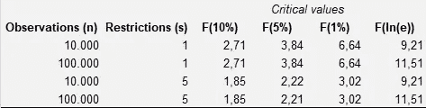

# 停止使用 p<0.05

> 原文：<https://towardsdatascience.com/stop-using-p-0-05-9743e5cddc21?source=collection_archive---------18----------------------->

## 应用统计学—数据科学

## 通过在统计测试中选择适当的显著性水平来改进您的预测模型和数据分析

作者迷因。模板来源:imgflip.com

使用 0.05 的固定 p 值临界值来确定显著性是各个领域的研究人员和应用统计方法的行业专家普遍存在的错误。

原因可能是显而易见的，解决方案也很简单。

> 使用 p<0.05 常常是一个错误

当统计学家、数据科学家和经济学家学习统计学时，95%的置信区间(对应于 0.05 的 p 值截止值)是传导假设检验的默认选项。

从 SAS 到 R 和 Python，这也是许多跨不同统计编程包的自动选择过程的默认设置(当然也有例外)。

但是正如在下面的文章中进一步详细解释的那样，使用 p<0.05 常常是一个错误。如上所述，数据集的大小决定了适当的置信区间(从而决定了正确的 p 值)。

</are-your-models-using-the-correct-significance-levels-c88367ee0544>  

假设检验中不当使用 p 值的问题由于错误地强调它们而被放大。

一个常见的误解是，在零假设统计检验(NHST)中，由于具有统计学显著性的 p 值而拒绝零假设等于零假设是错误的。

因此，使用正确的 p 值并不一定足以修复 NHST 的广泛滥用。但这仍然是重要的一步，而且很容易实施。

## 如何选择合适的 p 值

在 NHST 中确定截止 p 值时，了解 p 值的含义很有用。

p 值是在我们的假设下，我们观察到的结果至少与数据产生的统计数据一样极端的概率。

统计学的核心是小样本的处理。我们如何使用样本对整个人口进行推断。

对于小样本，我们愿意接受一些错误结论的风险，因为否则我们无法从数据中推断出任何东西。

但是随着样本量的增加，我们应该调整置信区间。

> 适当的 p 值各不相同

在大样本中，拒绝每一个 p 值小于 0.05 的显著性零假设会导致过度拒绝。

在现代，数据集通常由成千上万个数据点组成。在那种情况下，p<0.01 也不会切。

过度拒绝意味着我们经常会拒绝一个真正的零假设。拒绝一个真正的零假设也被称为 1 型错误。相反，类型 2 错误是错误的零假设的非拒绝。

如果 p 值没有根据数据集中的观测值进行调整，则增加观测值的数量只会减少第 2 类错误。最理想的情况是，我们希望两者都减少。

除了观察值的数量之外，决定给定检验的适当 p 值的是统计模型的选择、如何处理异常值和缺失数据、预测值的数量以及自由度。

因此，适当的 p 值[根据上下文](/are-your-models-using-the-correct-significance-levels-c88367ee0544)而变化。

## 几个例子

考虑一个有 j 个回归变量和 n 个观测值的线性回归模型。第一步自然是用零假设进行 f 检验，假设回归系数的一组独立线性限制 s 得到满足。

在真零假设下，相关的统计量将是具有 s 和(n-j)个自由度的 F 分布。

当数据集非常大时，j 在 n-j 中所占的份额很小。如果 F > (n / s)(ns/n — 1)，我们可以拒绝空值。

在大样本中，这是 F > ln(n)的近似值，其中 ln 是自然对数。

如果 n = 100.000 且 s 为 5，则 F 统计的适当临界值为 11.5，对应于 0.0000000000039(或 3.9e-11)的 **p 值。**

a 如下表所示，当观察次数增加时，上述 f 检验的正确 p 值远低于 0.05。

f 检验的临界值。按作者分类的表格。来源:[戴夫·贾尔斯](https://davegiles.blogspot.com/2019/10/everythings-significant-when-you-have.html)

很明显，使用 p <0.05 leads to way more frequent rejections of the null-hypothesis than what is deemed optimal.

Here’s another example, with the often-used t-test.

Assume instead (following an example from [Dave Giles](https://davegiles.blogspot.com/) ，你想要测试你的模型中的回归变量是否显著。这是通过进行 t 检验来完成的。

测试单个限制时，t 统计量 *t* 遵循自由度为 *1* 和 *v* 的 F 分布。如果| t |>√[n(n^(1/n)-1)]√ln(n)，我们可以拒绝针对双边备择假设的零假设。

因此，当 n = 100.000 时，检验单个回归变量的显著性意味着临界值为 3.394。

对应的 **p 值为 0.000345** 。

## 外卖

重要的是要记住 NHSTs 不是没有错误的。盲目使用 p 值会导致错误的数据分析和错误的模型选择。

但是在使用 NHSTs 时，首先要确保使用正确的临界值。相应的 p 值可能变化很大。如果您有幸处理大型数据集，使用正确的 p 值至关重要。

让 p 值随着观察值的数量而变化(就像它取决于检验统计量的分布、限制和自由度一样)。

在放大数据集时缩小 p 值临界值将有助于避免过度剔除，从而避免模型中有太多重要变量。

<https://medium.com/datadriveninvestor/the-cape-ratio-suggests-the-stock-market-is-attractive-7eb3fc22816b>  <https://medium.com/swlh/3-truly-disruptive-businesses-built-on-founder-knowledge-d71ab2482d13> 