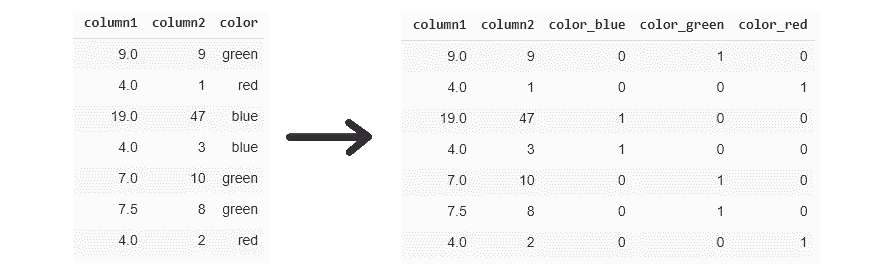
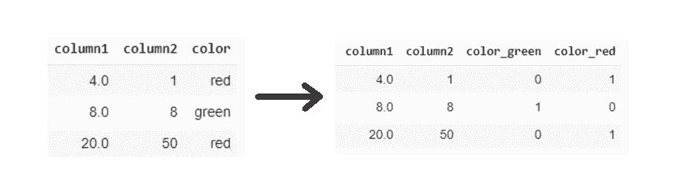
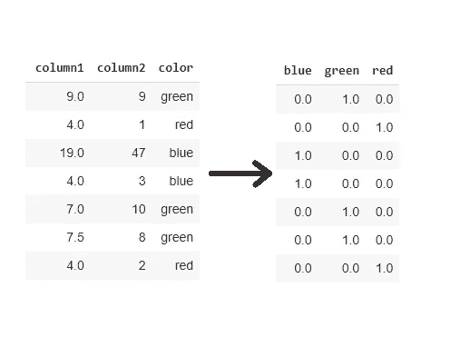
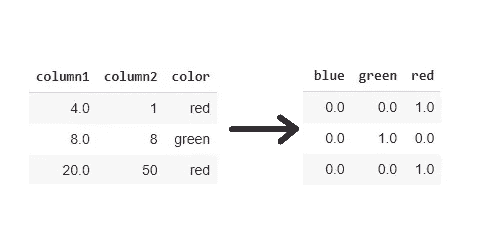

# 停止使用 Pandas get_dummies()进行特征编码

> 原文：<https://towardsdatascience.com/stop-using-pandas-get-dummies-for-feature-encoding-5d2cd07cb4fc?source=collection_archive---------5----------------------->

## 熊猫 get_dummies()和 Sklearn One-hot 编码器基本指南


图片由 [Mediamodifier](https://pixabay.com/users/mediamodifier-1567646/?utm_source=link-attribution&amp;utm_medium=referral&amp;utm_campaign=image&amp;utm_content=2108024) 来自 [Pixabay](https://pixabay.com/?utm_source=link-attribution&amp;utm_medium=referral&amp;utm_campaign=image&amp;utm_content=2108024)

机器学习算法需要特定格式的数字向量的输入数据源。特征工程是数据科学模型开发生命周期的重要组成部分，指的是将原始数据转换为适合训练稳健模型的数字格式。

一个数据科学家大约 80%的时间花在数据准备和特性工程上。模型的性能取决于特征工程策略。原始数据集包含各种数据类型的要素，包括数字、分类、日期时间等。有各种各样的特征工程技术将不同数据类型的数据特征转换成数字向量。

虚拟编码是指将分类特征转换成数字向量格式的编码策略。有各种其他技术来编码分类特征，包括计数编码器、单热编码器、Tf-Idf 编码器等。

`**pd.get_dummies()**`是 Pandas 的一个函数，它在一行代码中执行虚拟编码。数据科学家大多将此用于特征编码，但不建议在生产或 Kaggle 比赛中使用。在本文中，我们将讨论其背后的原因以及对于`get_dummies()`函数的最佳选择。

熊猫库中的`**get_dummies()**`函数可用于将分类变量转换成虚拟/指示变量。在某种程度上，它是一种静态的行为编码技术。

> 我们将采用一个随机数据集，其中包含 2 个数值特征和 1 个分类特征(“颜色”)，用于进一步演示。“颜色”分类变量有 3 个独特的类别:绿色、红色、蓝色。



(图片由作者提供)，训练数据的 get_dummies()使用结果

您可以观察到`pd.get_dummies()`的编码结果。不建议在生产或 Kaggle 上使用此函数，因为它的行为本质上是静态的。它不能从训练数据中学习特征，因此不能将其发现传播到测试数据集中。

分类特征颜色有 3 个特征值:绿色、红色、蓝色。这使得将颜色特征编码成 3 个特征类别。但是测试数据可能有也可能没有所有的特征值，这可能会在建模时导致数据不匹配的问题。



(图片由作者提供)，测试数据的 get_dummies()使用结果

颜色特征中缺少蓝色特征值，这导致编码数据中缺少蓝色特征列。这是因为`pd.get_dummies`没有学习训练数据的特征，在预测时会进一步造成特征不匹配。

## 实施:

```
#to print the encoded features for train data **pd.get_dummies(X_train)**#to print the encoded features for test data **pd.get_dummies(X_test)**
```

`pd.get_dummies()`的唯一优势是它的易解释性，以及它返回一个列名清晰的 pandas 数据框的事实。

# 一个热编码器:

一键编码器是一种流行的特征编码策略，其性能类似于`pd.get_dummies()`,但具有额外的优势。它通过为每个类别的每个分类特征分配一个二进制列来编码一个名义或分类特征。Scikit-learn 附带了一键编码器的实现。



(图片由作者提供)，一个热编码器结果，**左:**训练，**右:**测试

从一个用于训练和测试数据的 hot 编码器的上述结果中，可以观察到，在对训练数据的分类变量进行编码时，编码的特征被保存，并且在对测试数据进行编码时，其发现或特征值被传播。

虽然蓝色特征值没有出现在测试数据中，但是一个 hot 编码器为蓝色类别创建了一个特征列，因为它出现在训练管道中。

## 实施:

```
**from sklearn.preprocessing import OneHotEncoder**# one hot encoding **enc = OneHotEncoder(sparse=False)
color_onehot = enc.fit_transform(X_train[['color']])**#to print the encoded features for train data **pd.DataFrame(color_onehot, columns=list(enc.categories_[0]))****# tranform encoding for test data**
test_onehot = enc.transform(X_test[['color']])**#to print the encoded features for train data** pd.DataFrame(test_onehot, columns=list(enc.categories_[0]))
```

# 结论:

`**pd.get_dummies()**`在要素编码后返回具有干净列名的 pandas 数据框，但仍不建议将其用于生产或 Kaggle 竞赛。应该首选一键编码或计数矢量器策略，因为它具有每个分类特征的特征值特征。

新的特征类别也可以使用一个热编码器的`***handle_unknown=’ignore’***` 参数进行处理，这可能进一步导致`**pd.get_dummies()**`中的数据不匹配问题

# 参考资料:

[1] Scikit-learn 文档:[https://sci kit-learn . org/stable/modules/generated/sk learn . preprocessing . onehotencoder . html](https://scikit-learn.org/stable/modules/generated/sklearn.preprocessing.OneHotEncoder.html)

> 感谢您的阅读