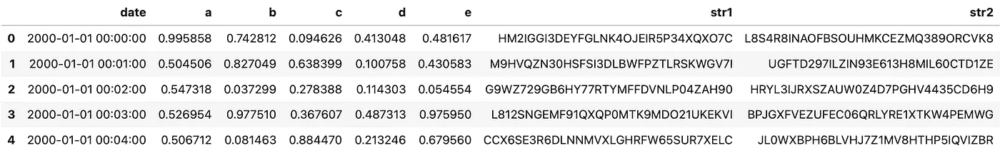
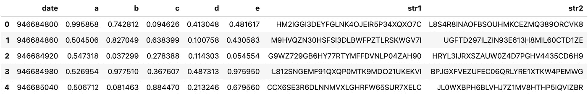
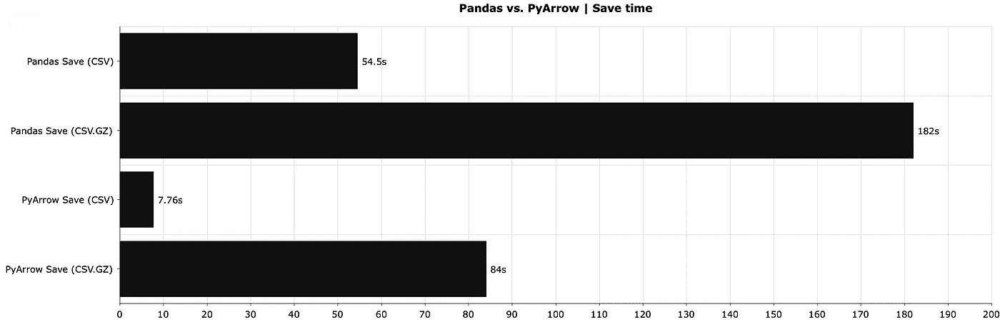
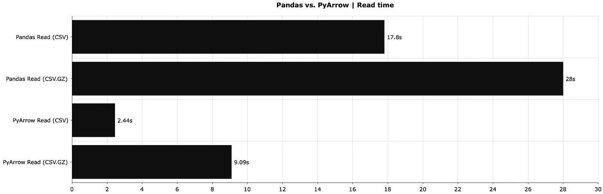
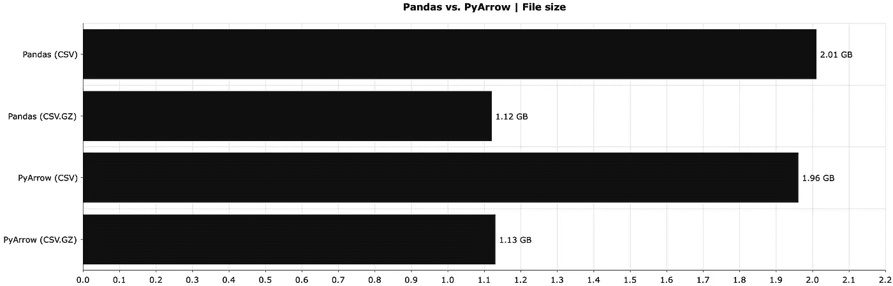

# 停止使用 Pandas 来读/写数据—这种替代方案速度快 7 倍

> 原文：<https://towardsdatascience.com/stop-using-pandas-to-read-write-data-this-alternative-is-7-times-faster-893301633475?source=collection_archive---------3----------------------->

## 读取和写入 CSV 数据集的速度比熊猫快 7 倍


凯西·霍纳在 [Unsplash](https://unsplash.com/s/photos/speed-of-light?utm_source=unsplash&utm_medium=referral&utm_content=creditCopyText) 上的照片

我喜欢 Python 的熊猫图书馆。这是我分析、转换和预处理数据的首选方式。但是当读取和保存数据文件的时候，它是慢的。这是一个巨大的时间浪费，特别是如果你的数据集的大小是千兆字节。

想象一下，您想要查看存储在本地或云上的千兆字节的 CSV 数据。您将使用 Pandas 进行分析，尽管您知道在读取 CSV 文件时速度非常慢。因此，大部分时间都在等待读写操作完成。有更好的方法。

它被称为 py Arrow——Apache Arrow 项目的一个惊人的 Python 绑定。它引入了更快的数据读/写时间，并且不会干扰您的数据分析管道。这是两全其美，因为你仍然可以使用熊猫进行进一步的计算。

您可以将 PyArrow 与 Pip 和 Anaconda 一起安装:

```
pip install pyarrow
conda install -c conda-forge pyarrow
```

找视频版？你很幸运:

# 让我们创建一个虚拟数据集

让我们从库导入开始。今天你会需要很多:

```
import random
import string
import numpy as np
import pandas as pd
import pyarrow as pa
import pyarrow.csv as csv
from datetime import datetime
```

接下来，我们将创建一个有点大的数据集。它将包含大约 1100 万个日期、浮点和字符串值。日期信息完全是虚构的，以分钟为间隔从 2000 年到 2021 年。其他列也是完全随机的:

```
def gen_random_string(length: int = 32) -> str:
    return ''.join(random.choices(
        string.ascii_uppercase + string.digits, k=length)
    )

dt = pd.date_range(
    start=datetime(2000, 1, 1),
    end=datetime(2021, 1, 1),
    freq='min'
)

np.random.seed = 42
df_size = len(dt)
print(f'Dataset length: {df_size}')

df = pd.DataFrame({
    'date': dt,
    'a': np.random.rand(df_size),
    'b': np.random.rand(df_size),
    'c': np.random.rand(df_size),
    'd': np.random.rand(df_size),
    'e': np.random.rand(df_size),
    'str1': [gen_random_string() for x in range(df_size)],
    'str2': [gen_random_string() for x in range(df_size)]
})
```

它看起来是这样的:



图片 1-虚拟数据集(作者提供的图片)

这是 11，046，241 行混合数据类型，因此生成的 CSV 文件将非常庞大。

# 用熊猫读/写 CSV 文件

我们将使用熊猫作为基线解决方案。如果像 PyArrow 这样的库不存在的话，你就会用到它。这一节只包含代码—您将在本文后面找到比较和图表。

使用以下代码将我们的数据集`df`保存到一个 CSV 文件:

```
df.to_csv('csv_pandas.csv', index=False)
```

如果你不在乎写速度，你可以节省一些磁盘空间。熊猫的`to_csv()`函数有一个可选参数`compression`。让我们看看如何使用它将数据集保存为`csv.gz`格式:

```
df.to_csv('csv_pandas.csv.gz', index=False, compression='gzip')
```

最后，您可以使用`read_csv()`功能阅读两个版本:

```
df1 = pd.read_csv('csv_pandas.csv')
df2 = pd.read_csv('csv_pandas.csv.gz')
```

这里没有什么新的或有趣的，但我想涵盖所有的基础。接下来看看 PyArrow 是怎么工作的。

# 用 PyArrow 读/写 CSV 文件

关于 PyArrow，您应该知道一件事——它不能处理日期时间列。您必须将`date`属性转换成时间戳。方法如下:

```
df_pa = df.copy()
df_pa['date'] = df_pa['date'].values.astype(np.int64) // 10 ** 9
```

这是数据集更改后的样子:



图 2 —时间戳转换后的虚拟数据集(图片由作者提供)

还是同样的信息，只是呈现方式不同。现在可以将 DataFrame 转换为 PyArrow 表。这是将数据集转储到磁盘之前的一个必要步骤:

```
df_pa_table = pa.Table.from_pandas(df_pa)
```

在我的机器(M1 MacBook Pro)上，转换需要 1.52 秒，并且将被包含到比较图表中。

使用 PyArrow 的`csv.write_csv()`函数转储数据集:

```
csv.write_csv(df_pa_table, 'csv_pyarrow.csv')
```

添加压缩需要更多的代码:

```
with pa.CompressedOutputStream('csv_pyarrow.csv.gz', 'gzip') as out:
    csv.write_csv(df_pa_table, out)
```

您可以使用`csv.read_csv()`功能读取压缩和未压缩的数据集:

```
df_pa_1 = csv.read_csv('csv_pyarrow.csv')
df_pa_2 = csv.read_csv('csv_pyarrow.csv.gz')
```

两者都将以`pyarrow.Table`格式读取，所以使用下面的命令将它们转换成 Pandas 数据帧:

```
df_pa_1 = df_pa_1.to_pandas()
```

这就是你今天应该知道的。让我们看看这些在性能上的比较。

# 熊猫和皮阿罗——你应该用哪一个？

如果你的数据很大，每次都用 PyArrow。就这么简单。原因如下。

下图显示了使用 Pandas 和 PyArrow 保存数据帧所需的时间，包括未压缩版本和压缩版本:



图 3 —熊猫 vs. PyArrow 以秒为单位节省时间(熊猫 CSV:54.5；熊猫 CSV。GZ: 182 人；py arrow CSV:7.76；皮阿罗 CSV。GZ: 84)(图片由作者提供)

未压缩文件的速度提高了约 7 倍，压缩文件的速度提高了约 2 倍。我知道会发生什么，我仍然印象深刻。

接下来，让我们比较一下读取时间——读取熊猫和 PyArrow 的 CSV 文件需要多长时间:



图 4 —熊猫 vs. PyArrow 阅读时间(秒)(熊猫 CSV:17.8；熊猫 CSV。GZ: 28 名；py arrow CSV:2.44；皮阿罗 CSV。GZ: 9.09 分)(图片由作者提供)

我们获得了类似的性能提升——未压缩数据集约为 7 倍，压缩数据集约为 3 倍。我说不出话来。看在上帝的份上，这是相同的文件格式。

最后，让我们看看文件大小有什么不同。这两个库之间应该存在任何差异:



图 5 — Pandas 与 PyArrow 文件大小(GB)(Pandas CSV:2.01；熊猫 CSV。GZ:1.12；py arrow CSV:1.96；皮阿罗 CSV。GZ: 1.13)(图片由作者提供)

在未压缩版本中略有不同，但这可能是因为我们用 Pandas 存储 datetime 对象，用 PyArrow 存储 integers。不出所料，没什么值得大书特书的。

# 结论

总而言之，如果你的应用程序经常从磁盘上保存/加载数据，那么把这些操作交给 PyArrow 是一个明智的决定。见鬼，对于相同的文件格式，速度快了 7 倍。想象一下，我们引入了[拼花](/csv-files-for-storage-no-thanks-theres-a-better-option-72c78a414d1d)文件格式。这是下一篇文章将要讨论的内容。

你对皮阿罗有什么看法？日常使用中有没有遇到什么痛点？请在下面的评论区分享你的想法。

喜欢这篇文章吗？成为 [*中等会员*](https://medium.com/@radecicdario/membership) *继续无限制学习。如果你使用下面的链接，我会收到你的一部分会员费，不需要你额外付费。*

<https://medium.com/@radecicdario/membership>  

# 保持联系

*   注册我的[简讯](https://mailchi.mp/46a3d2989d9b/bdssubscribe)
*   在 YouTube[上订阅](https://www.youtube.com/c/BetterDataScience)
*   在 [LinkedIn](https://www.linkedin.com/in/darioradecic/) 上连接