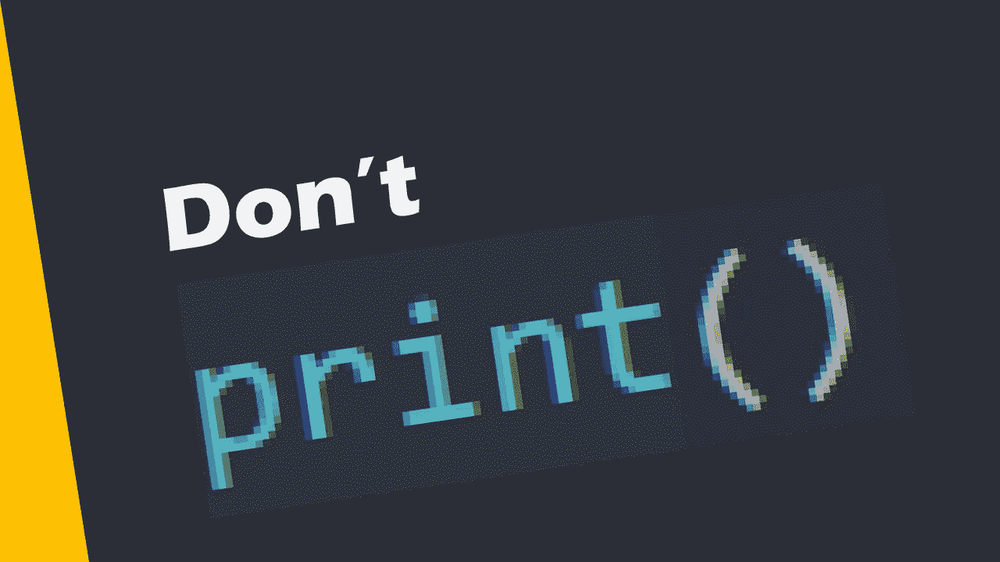
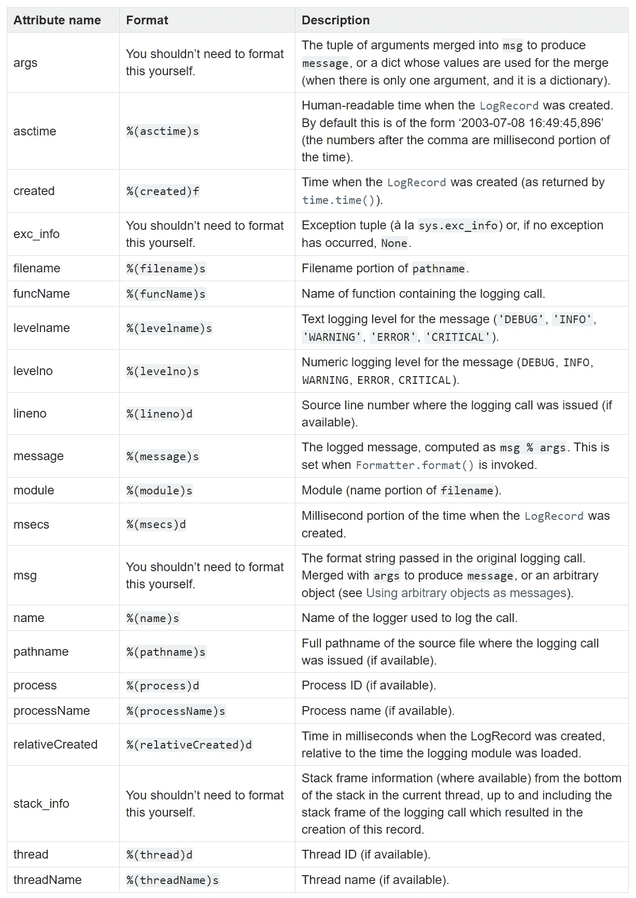

# 停止使用“打印”,开始使用“记录”

> 原文：<https://towardsdatascience.com/stop-using-print-and-start-using-logging-a3f50bc8ab0?source=collection_archive---------7----------------------->

## 编程；编排

## 如何使用 Python 日志库工具来跟踪代码事件和调试



图片由作者提供。

日志记录是跟踪代码中的事件或调试的一种流行解决方案。我们许多人(Python 程序员和数据科学家)都有使用 print()调试和跟踪代码中事件的坏习惯。

为什么使用 print()进行日志记录和调试不是一个好的做法？

1.  如果您的代码不能访问控制台，print()语句将失败。
2.  要定义基本的日志需求，需要几行代码。
3.  包含额外的日志信息并不容易。
4.  print()语句仅在控制台上显示消息。在文件中记录日志数据或通过互联网发送需要额外的工作。

跟踪代码事件和进行调试的更好方法是使用“日志”库(Python 标准库)。

日志库为您提供了五种工具来完成日志任务。

1.  调试(`logging.debug()`):为诊断问题提供信息。
2.  Info ( `logging.info()`):跟踪一个程序的正常运行。
3.  警告(`logging.warning()`):虽然代码仍然像预期的那样工作，但是发生了一些意想不到的事情。
4.  错误(`logging.error()`):代码无法运行某些部分。
5.  严重(`logging.critical()`):代码无法运行。

在使用这些工具之前，让我们了解一下 Python 中不同级别的日志记录。

# Python 中的日志记录级别

Python 中有六个日志记录级别。最高层很关键。如果将日志记录级别设置为严重，将只显示严重级别的日志记录消息。要将您的日志记录级别设置为 CRITICAL，您可以使用`logging.basicConfig()`。

```
logging.basicConfig(level=logging.CRITICAL)
```

或者

```
logging.basicConfig(level=50)
```

如您所见，`logging.basicConfig()`中的`level`参数采用一个整数(即`50`或常数`logging.CRITICAL`)并设置日志记录级别。从最低到最高的日志记录级别是 NOTSET=0、DEBUG=10、INFO=20、WARNING=30、ERROR=40 和 CRITICAL=50。

默认级别为`WARNING`(即`30`)，这意味着日志模块只显示/记录具有警告、错误或严重严重性的事件。同样，请记住，您可以使用`logging.basicConfig()`设置您的日志记录级别。

下面是显示不同级别日志消息的示例代码。注意，我将日志级别设置为最低(`logging.NOTSET`)，以显示所有消息。

输出是这样的:

```
DEBUG:root:Here you have some information for debugging.
INFO:root:Everything is normal. Relax!
WARNING:root:Something unexpected but not important happend.
ERROR:root:Something unexpected and important happened.
CRITICAL:root:OMG!!! A critical error happend and the code cannot run!
```

让我们将日志级别更改为 WARNING。

在这种情况下，输出是:

```
WARNING:root:Something unexpected but not important happend.
ERROR:root:Something unexpected and important happened.
CRITICAL:root:OMG!!! A critical error happend and the code cannot run!
```

如您所见，因为我将我的日志记录级别设置为警告(使用`logging.WARNING`常量值)，所以只显示严重性为警告或更高的消息。

好吧，使用日志工具来显示适当的消息是好的，但是我能更好地格式化我的消息来帮助我对我的代码进行日志记录吗？答案是肯定的。让我们阅读下一节来更好地格式化我们的日志消息(以一种更有意义的方式)。

# 格式化日志消息

使用日志模块来跟踪我们的代码的优势之一是能够根据我们的需要格式化消息。例如，在我的代码中，我希望用适当的消息记录日期和时间。这里有一个例子。

这是输出。

```
2021-02-14 23:02:34,089 | DEBUG: Here you have some information for debugging.
2021-02-14 23:02:34,089 | INFO: Everything is normal. Relax!
2021-02-14 23:02:34,090 | WARNING: Something unexpected but not important happend.
2021-02-14 23:02:34,092 | ERROR: Something unexpected and important happened.
2021-02-14 23:02:34,092 | CRITICAL: OMG!!! A critical error happend and the code cannot run!
```

如您所见，为了格式化我的日志消息，我需要向`logging.basicConfig()`传递一个字符串。格式化字符串可以混合包含字符和属性。例如，在我的格式化字符串中，属性是 as time(`%(asctime)s`)、levelname ( `%(levelname)s`)和 message ( `%(message)s`)。第一个属性 asctime 显示日志记录的日期和时间。levelname 属性输出日志级别(调试、信息等。).最后，我们有消息属性，这就是我们想要显示的消息。根据您的需要，您可以使用 20 个有用的属性。以下是他们的列表([来源](https://docs.python.org/3/library/logging.html#logrecord-attributes))。



Python 文档 LogRecord 属性 [](https://docs.python.org/3/library/logging.html#logrecord-attributes) ( [链接](https://docs.python.org/3/library/logging.html#logrecord-attributes))。

# 写入文件

到目前为止，我们已经将日志消息发送到控制台进行打印。有时，我们需要将日志消息和信息记录在一个文件中作为记录。从打印到控制台再到在文件上写东西，切换起来超级容易。我们只需要向`logging.basicConfig()`传递一个文件名，就可以开始登录一个文件。这里有一个例子。


照片由 [Aryan Dhiman](https://unsplash.com/@mylifeasaryan_?utm_source=medium&utm_medium=referral) 在 [Unsplash](https://unsplash.com?utm_source=medium&utm_medium=referral) 上拍摄

# 更好的记录方式

对于基本的日志记录，到目前为止提到的已经足够了。虽然如果你喜欢做更复杂的日志记录任务，你可能需要做得更专业。

在更高级的方法中，我们使用 logger 对象来跟踪代码中的事件。您需要通过 4 个简单的步骤来设置您的 logger 对象。

步骤 1)实例化一个记录器对象

步骤 2)设置日志记录的最低严重性

步骤 3)为您的日志设置一个目的地(也称为处理程序)(例如，控制台、文件或 HTTP。)

步骤 4)为处理程序设置消息格式

以下代码展示了所有 4 个步骤。

如您所料，这段代码的输出是:

```
2021-02-15 15:04:03,364 | ERROR: Something unexpected and important happened.
2021-02-15 15:04:03,364 | CRITICAL: OMG!!! A critical error happend and the code cannot run!
```

作为最后一个例子，让我们更进一步，假设您需要两个记录器。一个记录器只将重要消息(错误和更高)打印到控制台。第二个日志记录器在一个日志文件中记录更多的日志消息(INFO 和更高的信息)，并提供更多的细节(例如，它包括执行行号或`%(lineno)d`)。下面是处理这种情况的代码。

如果您运行此代码，您将在控制台中看到以下输出。

```
2021-02-15 15:04:25,349 | ERROR: Something unexpected and important happened.
2021-02-15 15:04:25,350 | CRITICAL: OMG!!! A critical error happend and the code cannot run!
```

但是在你的日志文件(`sample.log`)里，你会看到更详细的信息。

```
2021-02-15 15:04:25,340 | INFO | 22: Everything is normal. Relax!
2021-02-15 15:04:25,349 | WARNING | 23: Something unexpected but not important happend.
2021-02-15 15:04:25,349 | ERROR | 24: Something unexpected and important happened.
2021-02-15 15:04:25,350 | CRITICAL | 25: OMG!!! A critical error happend and the code cannot run!
```

正如您在代码中看到的，我只是创建了一个 logger 对象。然后，我开始创建我的控制台处理程序，并设置它的级别和格式。我将控制台处理程序添加到 logger 对象中。我对文件处理程序重复了类似的过程。最后，我开始日志记录，日志记录程序正确地管理了两个处理程序。非常简单明了。现在，您可以想象用 print()语句复制相同的功能有多难。

有许多高级工具和设置，您可以在您的记录器中使用。例如，您可以使用 HTTP 日志处理程序(`logging.HTTPHandler()`)通过 HTTP 将您的日志记录结果发送到一个中央 URL 地址。或者您可以使用过滤器来要求记录器对不同的事件做出不同的反应。

Python 日志库提供了许多用于处理不同日志任务的工具和设置。你可以在[日志记录手册](https://docs.python.org/3/howto/logging-cookbook.html)中了解更多关于所有可用工具和设置的信息。

# 摘要

使用 print()进行日志记录和调试是一种不好的做法。在 Python 中，我们在“日志”库中有专门的工具来处理不同的日志和调试任务。在本文中，我向您展示了如何使用基本的日志工具和设置。