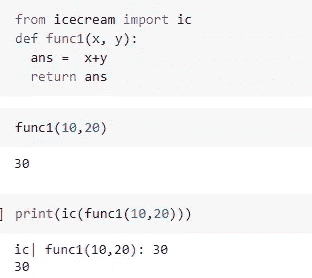
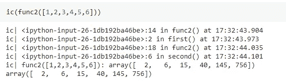

# 停止使用 Print 或 Logger 来调试 Python 代码

> 原文：<https://towardsdatascience.com/stop-using-print-or-logger-to-debug-your-python-code-ba6d076dab30?source=collection_archive---------15----------------------->

## 代码调试冰淇淋包基本指南


图片来自 [Pixabay](https://pixabay.com/?utm_source=link-attribution&amp;utm_medium=referral&amp;utm_campaign=image&amp;utm_content=4918185) 的 [Dhruvil Patel](https://pixabay.com/users/15548337-15548337/?utm_source=link-attribution&amp;utm_medium=referral&amp;utm_campaign=image&amp;utm_content=4918185)

对每个开发人员来说，调试代码是一项重要但令人厌倦的任务。当代码输出不符合预期或抛出错误时，执行代码调试是非常重要的。调试是发现并修复程序中错误的过程。

语法错误和语义错误是开发人员在程序中面临的两种错误。语法错误是由命令或代码的错误键入、缩进错误引起的，通过遵循 Python traceback 指令很容易修复。当代码输出不符合预期时，会导致语义错误，这可能是由于算法的错误实现造成的。

语法错误很容易处理，但有时处理语义错误是一项困难且耗时的任务。开发人员需要检查代码片段并修复错误。

通常，开发人员使用打印语句或在代码片段之间添加日志来进行调试。有各种用于调试的开源 Python 库。在本文中，我们将讨论这样一个库冰淇淋，它可以帮助调试您的 Python 代码，而无需插入大量的打印和日志语句。

# 冰淇淋:

冰淇淋？是的，它是一个帮助开发者调试 Python 代码的 Python 包的名字。Icecream 帮助开发人员在调试时摆脱编写多个打印和日志语句来修复 bug。相反，他们可以使用冰淇淋包中的`**ic**`类。

## 安装:

冰淇淋包可以从 PyPl 安装，使用

```
**pip install icecream**
```

并导入`**ic**` 类进行调试`**from icecream import ic**`

# 用法:

Icecream 可以打印表达式/变量名及其值。输出格式也可以被格式化，并且还可以包括程序上下文，例如文件名、行号和父函数。

## 检查变量和函数:

`**ic()**`冰淇淋包中的函数检查自身，并打印自己的参数和这些参数的值。



(图片由作者提供)

只要给`ic()`一个变量、表达式或函数，就大功告成了。

## 检查执行情况:

开发人员通常使用记录器或打印语句来了解正在执行的代码部分以及函数流。在每个函数调用或循环中使用 ic()函数可以用来在调试时跟踪代码的执行。

要检查 Python 函数的执行情况，请将自定义函数作为参数传递给 ic()。ic()返回自定义函数的参数，因此可以很容易地在预先存在的代码中实现。



(图片由作者提供)，带有 ic()的函数调用

通过观察 ic()函数的打印功能，可以很容易地跟踪函数的执行。

## 附加优势:

用户可以配置和定制`**ic()**`功能的输出。使用该函数，用户可以添加前缀、更改输出函数、定制输出语句的参数，以及包含或排除程序上下文，如文件名、行号和父函数。

```
**def unixTimestamp():
return '%i |> ' % int(time.time())**# add unix time stamp as prefix
**ic.configureOutput(prefix=unixTimestamp)**
```

完成代码调试后，您可以删除所有的 ic()函数调用，或者使用`**ic.disable()**`函数禁用输出。稍后可以使用`**ic.enable()**` 功能重新启用。

# 结论:

冰淇淋包可以用来代替编写多个打印或日志语句进行代码调试。输出格式的数据结构非常清晰，包括表达式/变量名及其值和其他程序上下文。在调试时编写打印语句或记录器来输出所有这些信息是一项单调乏味的任务，但是 ice cream 仅用几行代码实现就提供了所有这些。

除了 Python 之外，冰激凌包的实现还有 12 种编程语言，包括 [C++](https://github.com/renatoGarcia/icecream-cpp) 、 [Java](https://github.com/Akshay-Thakare/icecream-java) 、 [Ruby](https://github.com/nodai2hITC/ricecream) 、 [R](https://github.com/lewinfox/icecream) 、 [Go](https://github.com/WAY29/icecream-go) 等。

# 参考资料:

[1]冰淇淋 GitHub:[https://github.com/gruns/icecream](https://github.com/gruns/icecream)

> 感谢您的阅读