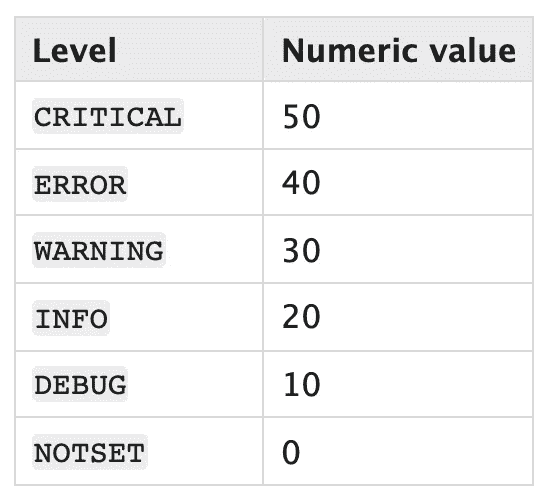

# 停止使用打印！面向数据科学家的 Python 日志记录

> 原文：<https://towardsdatascience.com/stop-using-print-python-logging-for-data-scientists-26be4981013c?source=collection_archive---------15----------------------->

## 大约 80%的您需要了解的关于 5 分钟内登录的内容

照片由[马雷克·奥孔](https://unsplash.com/@marekokon?utm_source=medium&utm_medium=referral)在 [Unsplash](https://unsplash.com?utm_source=medium&utm_medium=referral) 上拍摄

在每个生产数据科学项目中，都有代码变得复杂的时候，为了保持头脑清醒，重构是必要的。也许您希望将常用的代码抽象成包含类和函数的 Python 模块，以便可以通过一行代码重用它，而不是在项目中多次复制粘贴整个代码块。无论您的原因是什么，将信息性日志记录写入您的程序是至关重要的，以确保您可以跟踪它的操作，并在不可避免地出现问题时排除故障。

在本文中，我将分享我作为数据科学家需要了解的大约 80%的 python 日志功能。有了这些知识，我们可以实现以下两个要求:

1.  向终端记录一些消息:例如，记录程序执行步骤。
2.  同时将一些其他消息记录到一个文件中:例如，在模型训练和测试期间记录结果。

我的 [Github 账户](https://gist.github.com/stephenleo/fc48d08efaf98071d719c809900893bd)上有完整的代码

# Python 日志模块

我们将使用 Python 日志模块[ [链接](https://docs.python.org/3/library/logging.html) ]中的以下功能来解决我们的两个需求。

## 基本配置

`basicConfig`功能，顾名思义，用于设置测井系统的基本配置。我发现在设置 basicConfig 时指定以下三个参数是有利的

1.  `level`:表示记录消息的最低级别。下表显示了不同日志记录级别的值。例如，如果您设置了`level=logging.INFO`，则任何记录为`DEBUG`的消息都不会出现在您的日志中，而任何记录为`INFO`或以上的消息都会出现在您的日志中。
2.  `format`:日志信息出现的格式。我喜欢我的日志消息有时间(`asctime`)、级别名称(`levelname`)和实际的日志消息(`message`)。因此我指定`format='%(asctime)s %(levelname)s: %(message)s'`
3.  `datefmt`:时间出现的格式。我希望我的日志消息有一个完整的日期时间，所以我指定`datefmt='%Y-%m-%d %H:%M:%S'`以年-月-日小时:分钟:秒的格式记录时间。

设置日志记录的基本配置

Python 日志记录级别。图像来源[ [链接](https://docs.python.org/3/library/logging.html#logging-levels)

## 获取记录器

现在我们已经设置了基本配置，我们可以在所有我们希望记录器工作的`.py`文件中使用一个公共名称来实例化一个记录器对象。我发现将这个通用名称存储在一个外部的`constants.yaml`或`constants.py`文件中是很有利的，然后我可以将它们导入到我想要使用同一个日志记录器的每个`.py`文件中。

实例化记录器对象

## 文件处理器

到目前为止，我还没有提到将任何日志消息写到文件中。因此，我们所有的日志消息将只显示在终端上。因为我们的第二个需求是将某些消息记录到一个文件中，所以我们将使用`FileHandler`和一个我称之为`METRICS`的自定义日志级别，只用五行代码就实现了这一点！只需确保这个自定义日志记录级别大于级别`CRITICAL`，以确保没有其他日志记录消息被写入文件。

设置文件处理程序，将“METRICS”自定义级别的某些日志写入文件“metrics.log”

# 把所有的放在一起

以上三个概念基本上是我们在代码中设置出色的日志记录功能并满足我们的两个需求所需要知道的全部内容。下面的三个`.py`文件展示了所有这些是如何一起工作的。

1.  `constants.py`:该文件仅用于定义几个常量。一个用于自定义日志记录级别`METRICS`，另一个用于通用`LOGGER_NAME`，这样我们可以在多个其他`.py`文件中使用它们
2.  这是我们的主要 python 程序。请注意，我是如何使用上述概念来设置基本配置、实例化日志记录器和创建文件处理程序，以便仅将带有自定义`METRICS`级别的日志消息路由到文件`metrics.log`。要使用我们的 awesome logger 实际记录一条消息，如果我们想用`INFO`级别记录一条消息，我们将调用`logger.info`，或者如果我们想用自定义的`METRICS`级别记录一条消息，我们将调用`logger.log`，如下面的代码所示。
3.  `test_print.py`:这个文件展示了如何通过使用相同的`LOGGER_NAME`在另一个`.py`文件中实例化相同的记录器。这将把任何`METRICS`定制日志路由到同一个`metrics.log`文件。

定义常数

主程序

测试实例化和使用我们在主脚本中创建的相同记录器

# 结论:

将一些消息记录到终端并将一些其他消息记录到文件的能力对于数据科学程序来说是很方便的。我定期记录程序执行步骤，以跟踪程序到终端和模型训练的进度，在日常工作中将测试结果保存到文件中。如果您使用 [MLFLOW](https://mlflow.org/) ，您甚至可以使用`mlflow.log_artifact('metrics.log')`将此日志文件添加到您的 MLFLOW 服务器，以跟踪历史进度！

我希望这篇关于 Python 日志的文章对您有用。你也可以在我的 [Github 账号](https://gist.github.com/stephenleo/fc48d08efaf98071d719c809900893bd)上访问完整代码。感谢阅读！