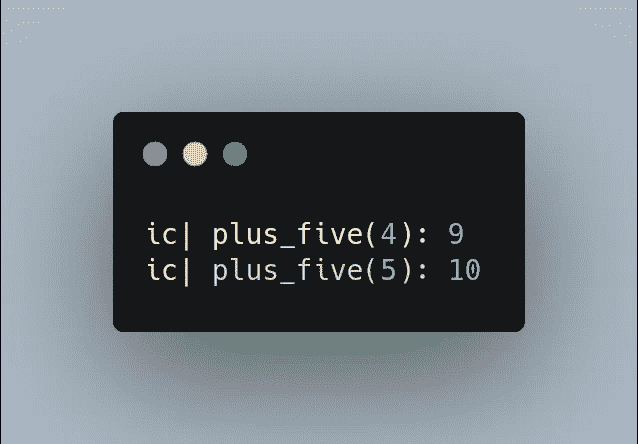
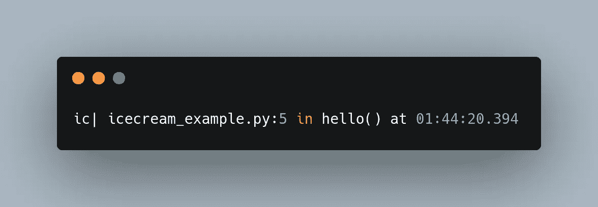
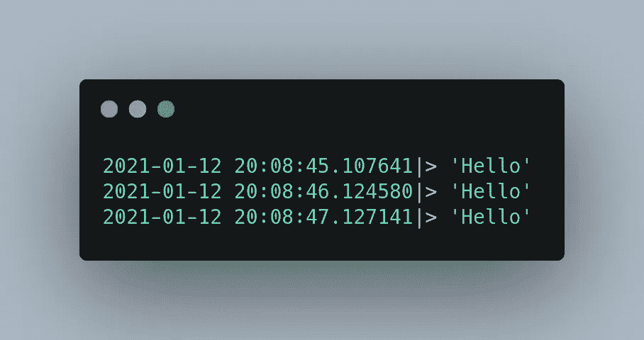
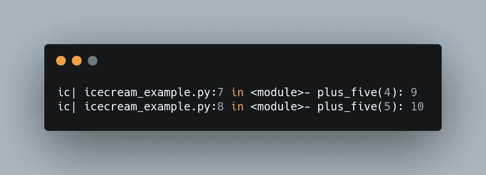
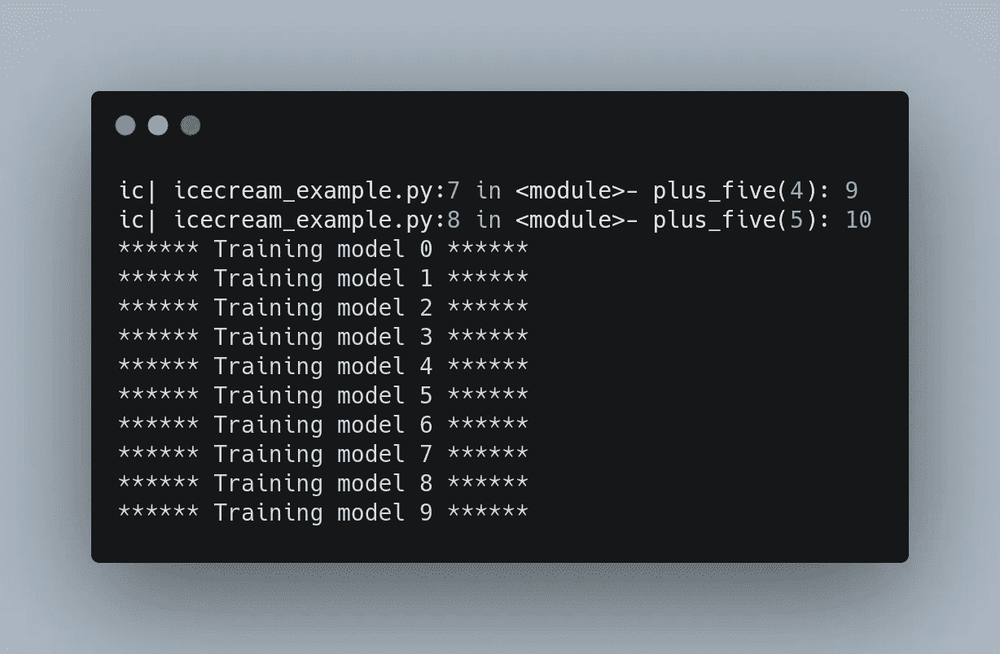
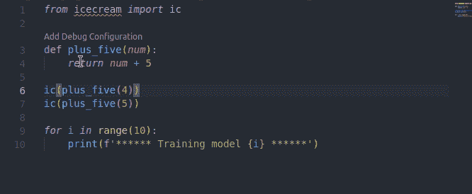

# 在 Python 中停止使用 Print 进行调试。用冰淇淋代替

> 原文：<https://towardsdatascience.com/stop-using-print-to-debug-in-python-use-icecream-instead-79e17b963fcc?source=collection_archive---------0----------------------->

## 你是使用打印还是日志来调试你的代码？用冰淇淋代替。


照片由 [Kenta Kikuchi](https://unsplash.com/@kentas_photography?utm_source=medium&utm_medium=referral) 在 [Unsplash](https://unsplash.com?utm_source=medium&utm_medium=referral) 上拍摄

# 动机

如果您使用 print 来调试代码，您可能会发现在终端上查看多行输出，然后试图找出每个输出属于哪个代码是令人困惑的。

例如，运行下面的脚本

会给你

```
30
40
```

这些输出哪一个是`num1`？这些输出哪一个是`num2`？找出两个输出可能没那么难，但是如果有超过 5 个不同的输出呢？试图找到负责输出的源代码可能很耗时。

您可以尝试在 print 语句中添加文本，以便更容易理解:

```
num1 30
num2 40
```

输出更容易阅读，但是同样，写出文本也很耗时。有没有一种方法可以打印出负责输出的代码，而不需要像下面这样的附加文本？

```
ic| num1: 30
ic| num2: 40
```

这时候冰淇淋就派上用场了。

# 什么是冰淇淋？

Icecream 是一个 Python 库，它用最少的代码使打印调试更具可读性。

要安装冰淇淋，请使用

```
$ pip install icecream
```

让我们通过打印 Python 函数的输出来尝试一下。



通过使用`ic`，我们不仅可以看到输出，还可以看到函数及其参数！多方便啊！您终端中的颜色也将和上面显示的输出一样丰富多彩。

# 检查执行情况

要定位代码执行的位置，您可以做如下所示的事情来查找哪个语句被执行了

```
I'm user
```

冰淇淋让你更容易做类似上面的事情，只需运行`ic()`而不需要额外的文本



现在你知道第 5 行的代码在函数`hello`中被执行了，而第 7 行的代码没有被执行。

# 自定义前缀

如果您想在打印语句中插入一个自定义前缀，比如代码执行的时间，icecream 也允许您这样做。



现在代码执行的时间会自动显示在输出中！多酷啊。

# 我能得到更多的上下文吗？

除了知道负责输出的代码之外，您可能还想知道代码是从哪一行和哪一个文件执行的。要了解代码的上下文，请将`includeContext=True`添加到`ic.configureOutput()`



现在您知道第一个输出是由文件`icecream_example.py`第 7 行的函数`plus_five`执行的。

# 调试完成后删除所有冰淇淋

您可以将冰淇淋仅用于调试，而将打印用于其他目的，如漂亮的打印



既然你可以区分调试打印和漂亮打印，那么你在调试后搜索和删除所有的`ic`语句就容易多了。



删除所有调试打印后，你的代码就干净了！

# 结论

恭喜你！您刚刚学习了如何使用 icecream 使打印调试更具可读性。冰淇淋对我来说是一个很好的调试工具，我希望你也会发现它很有用。

我喜欢写一些基本的数据科学概念，并尝试不同的算法和数据科学工具。你可以通过 [LinkedIn](https://www.linkedin.com/in/khuyen-tran-1401/) 和 [Twitter](https://twitter.com/KhuyenTran16) 与我联系。

如果你想查看我写的所有文章的代码，请点击这里。在 Medium 上关注我，了解我的最新数据科学文章，例如:

[](/how-to-create-and-view-interactive-cheatsheets-on-the-command-line-6578641039ff) [## 如何在命令行上创建和查看交互式备忘单

### 停止搜索命令行。用作弊来节省时间

towardsdatascience.com](/how-to-create-and-view-interactive-cheatsheets-on-the-command-line-6578641039ff) [](/introduction-to-hydra-cc-a-powerful-framework-to-configure-your-data-science-projects-ed65713a53c6) [## Hydra.cc 简介:配置数据科学项目的强大框架

### 尝试不同的参数和模型，而无需花费数小时来修改代码！

towardsdatascience.com](/introduction-to-hydra-cc-a-powerful-framework-to-configure-your-data-science-projects-ed65713a53c6) [](/introduction-to-schema-a-python-libary-to-validate-your-data-c6d99e06d56a) [## 模式介绍:验证数据的 Python 库

### 验证您的数据变得更加复杂！

towardsdatascience.com](/introduction-to-schema-a-python-libary-to-validate-your-data-c6d99e06d56a) [](/pytest-for-data-scientists-2990319e55e6) [## 数据科学家 Pytest

### 适用于您的数据科学项目的 Pytest 综合指南

towardsdatascience.com](/pytest-for-data-scientists-2990319e55e6)