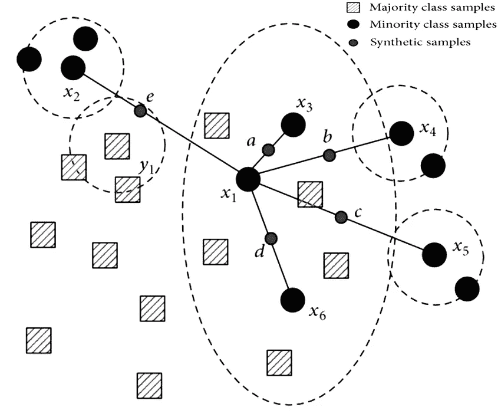

# 停止使用 SMOTE 处理所有不平衡的数据

> 原文：<https://towardsdatascience.com/stop-using-smote-to-handle-all-your-imbalanced-data-34403399d3be?source=collection_archive---------4----------------------->

## 过采样和欠采样技术的结合


弗兰基·查马基在 [Unsplash](https://unsplash.com?utm_source=medium&utm_medium=referral) 上拍摄的照片

在分类任务中，可能会遇到目标类别标签分布不均匀的情况。这样的数据集可以称为不平衡数据。数据中的不平衡可能会阻碍数据科学模型的训练。在不平衡类问题的情况下，模型主要在多数类上训练，并且模型变得偏向多数类预测。

因此，在进行建模管道之前，处理不平衡类是至关重要的。有各种类平衡技术通过生成少数类的新样本或移除一些多数类样本来解决类不平衡的问题。处理类平衡技术可以大致分为两类:

*   **过采样技术:**过采样技术是指创建人为的少数类点。一些过采样技术有[随机过采样](http://glemaitre.github.io/imbalanced-learn/generated/imblearn.over_sampling.RandomOverSampler.html#imblearn.over_sampling.RandomOverSampler)、 [ADASYN](http://glemaitre.github.io/imbalanced-learn/generated/imblearn.over_sampling.ADASYN.html#imblearn.over_sampling.ADASYN) 、 [SMOTE](http://glemaitre.github.io/imbalanced-learn/generated/imblearn.over_sampling.SMOTE.html#imblearn.over_sampling.SMOTE) 等。
*   **欠采样技术:**欠采样技术是指去除多数类点。一些过采样技术有 [ENN](http://glemaitre.github.io/imbalanced-learn/generated/imblearn.under_sampling.EditedNearestNeighbours.html#imblearn.under_sampling.EditedNearestNeighbours) 、[随机欠采样](http://glemaitre.github.io/imbalanced-learn/generated/imblearn.under_sampling.RandomUnderSampler.html#imblearn.under_sampling.RandomUnderSampler)、 [TomekLinks](http://glemaitre.github.io/imbalanced-learn/generated/imblearn.under_sampling.TomekLinks.html#imblearn.under_sampling.TomekLinks) 等。

> 阅读下面提到的文章中的[来了解处理类不平衡问题的 7 种过采样技术。](/7-over-sampling-techniques-to-handle-imbalanced-data-ec51c8db349f)

</7-over-sampling-techniques-to-handle-imbalanced-data-ec51c8db349f>  

使用欠采样技术的缺点是，为了平衡类，我们丢失了许多多数类数据点。过采样技术弥补了这一缺点，但在少数类中创建多个样本可能会导致模型过拟合。

SMOTE 是数据科学家社区中流行和著名的过采样技术之一，它在少数类样本的聚类中创建人工少数数据点。其思想是将过采样和欠采样技术结合起来，并且一起可以被认为是处理不平衡类数据的另一种采样技术。

# 过采样和欠采样技术的结合:

SMOTE 是著名的过采样技术之一，在处理类不平衡方面非常有效。其思想是将 SMOTE 与一些欠采样技术(ENN、托梅克)相结合，以提高处理不平衡类的效率。

SMOTE 和欠采样技术结合的两个例子是:

*   **击杀 ENN**
*   **用托梅克击杀**

在将 SMOTE 与欠采样技术结合起来之前，我们先来讨论一下什么是 SMOTE 以及它是如何工作的。

## 什么是击打？

SMOTE 代表合成少数过采样技术，是一种创建合成少数类数据点以平衡数据集的过采样技术。

SMOTE 使用 k-最近邻算法来创建合成数据点。SMOTE 算法的步骤是:

1.  识别少数类向量。
2.  决定最接近的数字(k)的数目，以供考虑。
3.  计算少数数据点与其任何相邻数据点之间的连线，并放置一个合成点。
4.  对所有少数数据点及其 k 个邻居重复步骤 3，直到数据平衡。



(图片由作者提供)，SMOTE

SMOTE 和一些欠采样技术的结合被证明是有效的，并且一起可以被认为是一种新的采样技术。

# SMOTE 与 Tomek 链接的组合:

Tomek 链接是一种欠采样启发式方法，它识别所有彼此最接近但属于不同类别的数据点对，这些数据点对(假设 a 和 b)被称为 Tomek 链接。Tomek Links 遵循以下条件:

*   a 和 b 是彼此最近的邻居
*   a 和 b 属于两个不同的类别

试探性地，这些 Tomek 链接点(a，b)出现在两个类别的分离边界上。因此移除 Tomek 链接点的多数类增加了类分离，并且还减少了沿着多数聚类的边界的多数类样本的数量。

## 想法:

SMOTE 是一种过采样技术，创建新的少数类合成样本，而 Tomek Links 是一种欠采样技术。

对于不平衡数据集，首先应用 SMOTE 创建新的合成少数样本以获得平衡分布。此外，Tomek 链接用于移除靠近两个类的边界的样本，以增加两个类之间的分离。

## 实施:

Imblearn 包实现了 SMOTE 和 Tomek 链接的组合。

您可以使用`**pip install imblearn**`从 PyPl 安装这个库

```
**from imblearn.combine import SMOTETomek****smt = SMOTETomek(random_state=42)
X, y = smt.fit_sample(X, y)**
```

# SMOTE 与 ENN 的组合:

ENN(编辑过的最近邻)是一种欠采样技术，用于移除边界或边界上的多数类实例，这些实例由 KNN 算法做出的预测不同于其他多数类点。

类似于 SMOTETomek，首先应用 SMOTE 来创建少数类样本的合成数据点，然后使用 ENN 来移除边界或边界上的数据点以增加两个类的分离。

## 实施:

imblearn 包中还提供了 SMOTE 和 ENN 算法的组合。

```
**from imblearn.combine import SMOTEENN****smt = SMOTEENN(random_state=42)
X, y = smt.fit_sample(X, y)**
```

# 结论:

SMOTE 和欠采样技术(ENN 和托梅克链接)的结合被证明是有效的。SMOTE 基本上用于创建少数类的合成类样本以平衡分布，然后欠采样技术(ENN 或托梅克链接)用于清除两个类的边界中的不相关点以增加两个类之间的分离。

Imblean 包附带了 SMOTETomek 和 SMOTEENN 的实现。有一条经验法则告诉我们哪种方法最有效。人们可以编写手动 Python 代码来组合一种过采样技术和一种欠采样技术，以获得最佳结果。

> 你也可以阅读下面提到的文章中的[来了解处理类不平衡的 7 种过采样技术。](/7-over-sampling-techniques-to-handle-imbalanced-data-ec51c8db349f)

</7-over-sampling-techniques-to-handle-imbalanced-data-ec51c8db349f>  

# 参考资料:

[1]不平衡学习 API 文档:[http://glemaitre.github.io/imbalanced-learn/api.html](http://glemaitre.github.io/imbalanced-learn/api.html)

> 感谢您的阅读