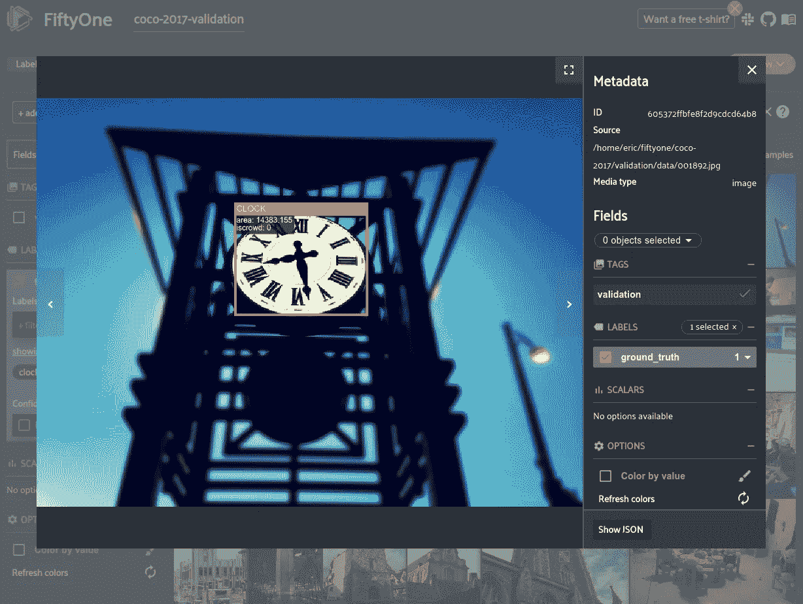
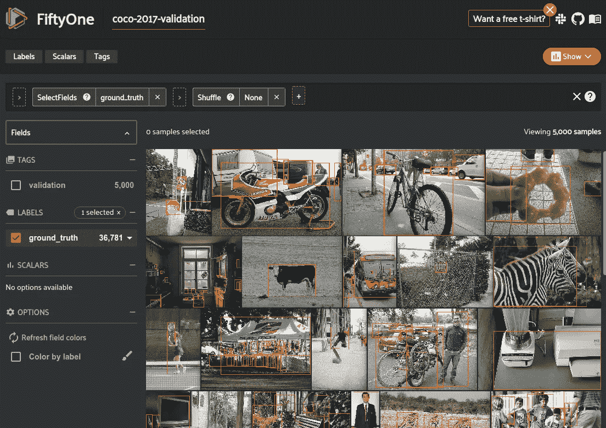
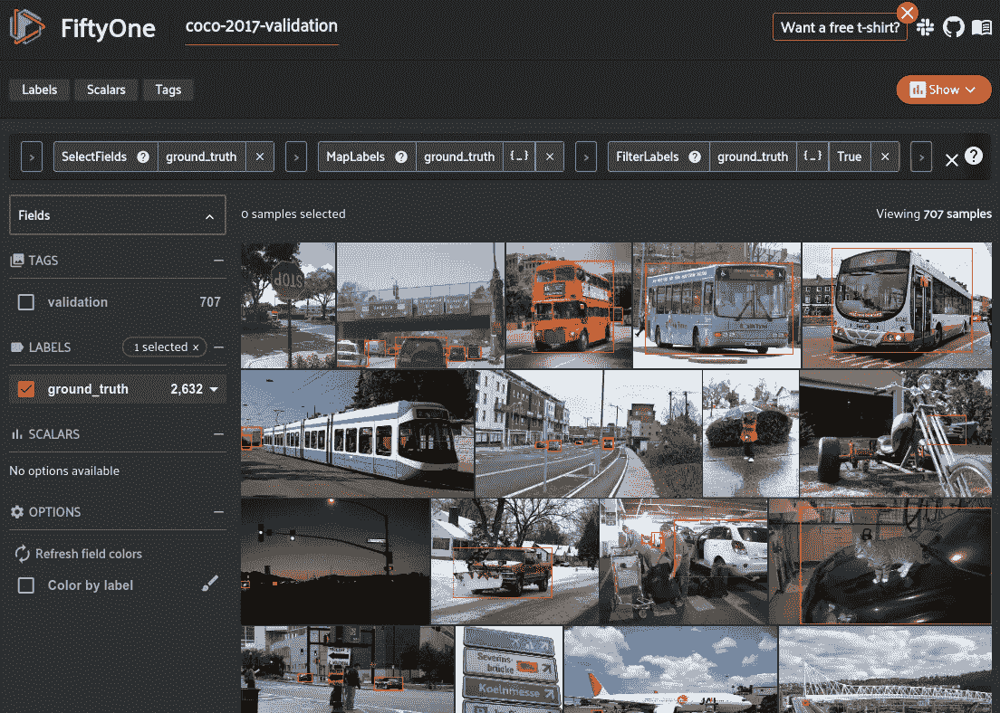
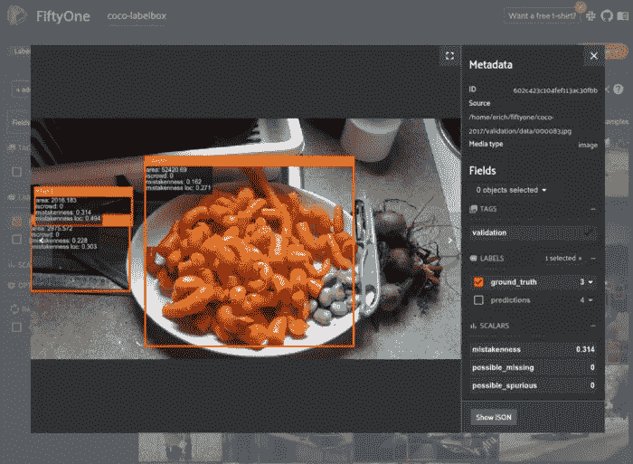
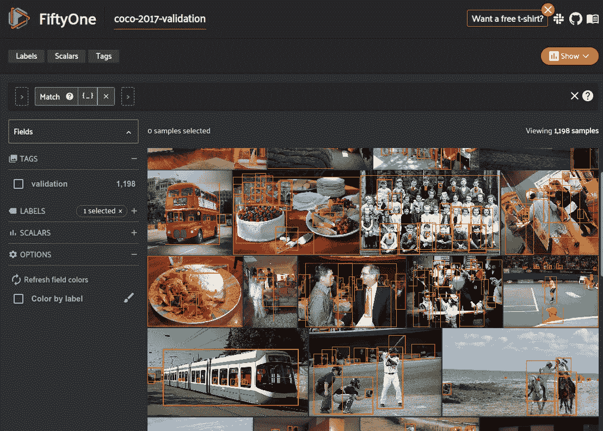
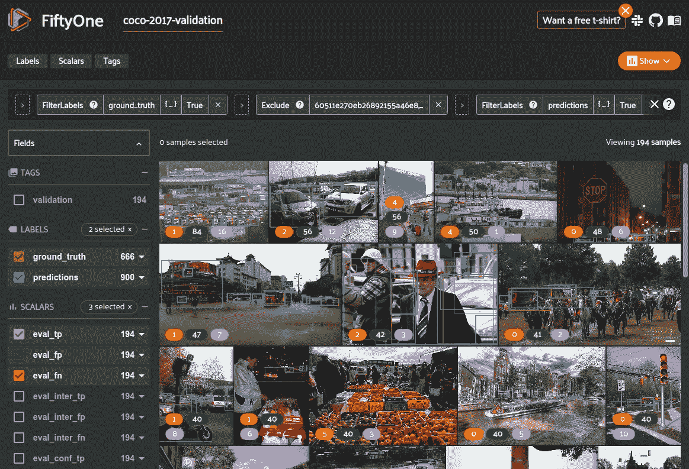
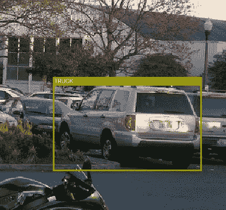
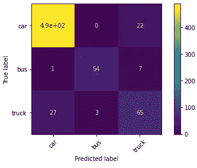

# 停止在 PyTorch 数据集上浪费时间！

> 原文：<https://towardsdatascience.com/stop-wasting-time-with-pytorch-datasets-17cac2c22fa8?source=collection_archive---------12----------------------->

## 使用 FiftyOne 加速和简化数据集工作流的指南



图片[217425.jpg](https://farm9.staticflickr.com/8534/8983888416_8e42406b95_z.jpg)([CC BY 2.0](https://creativecommons.org/licenses/by/2.0/))来自 [COCO 数据集](https://cocodataset.org/#home)在[五十一](http://fiftyone.ai/)中可视化

PyTorch 是最受欢迎的深度学习库之一。它在简单易学和快速创建和训练模型的强大框架之间提供了最佳平衡。像 py torch Lightning[这样的扩展使得编写和扩展网络变得更加容易。](https://www.pytorchlightning.ai/)

虽然您可以轻松地创建和训练复杂的模型是一件好事，但是构建模型架构只会让您在完成任务的过程中走得更远。

> 在您的任务中实现高性能不仅取决于您的模型架构的改进，还取决于您的数据的改进。

根据您的任务，细化数据集可能会变得困难。尤其是当您增加数据的维度时。处理表格数据通常比处理图像或视频数据集更简单，因为图像或视频数据集无法一次性加载到内存中。

[PyTorch 数据集](https://pytorch.org/docs/stable/data.html)为加载复杂的数据集提供了一个很好的起点，让您定义一个类来从磁盘加载单个样本，然后创建[数据加载器](https://pytorch.org/docs/stable/data.html#data-loading-order-and-sampler)来有效地向您的模型提供数据。当您想要开始迭代数据集本身时，问题就出现了。PyTorch 数据集是刚性的。他们有许多限制。首先，它们需要为任何更改进行大量的代码重写，这导致在项目的整个生命周期中浪费了几十个小时。其次，它们仅仅是从磁盘加载数据的一种方式，它们不支持任何可以帮助您构建更好的数据集的数据可视化或探索。

[五十一](http://fiftyone.ai)，我一直致力于开发的类似熊猫的开源可视化数据集工具，可以与 PyTorch(和许多其他工具)配合使用，帮助你更接近数据集并与之互动。它为图像和视频数据集提供了更加灵活的表示方式，允许您在[51 API](https://voxel51.com/docs/fiftyone/index.html)和[应用](https://voxel51.com/docs/fiftyone/user_guide/app.html)的帮助下搜索、切片和可视化它们，而无需因频繁更改而进行任何重写。虽然本文主要是关于 PyTorch 的，但是其他常见的框架，比如 TensorFlow，也面临类似的挑战。



第五十一个应用程序示例(图片由作者提供)

让 fiftone 如此灵活地克服这些 PyTorch 数据集限制的神奇之处在于[fiftone Views](https://voxel51.com/docs/fiftyone/user_guide/using_views.html)。基本上，从一个[通用 51 数据集](https://voxel51.com/docs/fiftyone/user_guide/using_datasets.html#datasets)，你可以用一行代码创建一个数据集的特定视图；然后，该视图直接用于创建 PyTorch 数据集。

例如，假设您训练了一个在汽车、卡车和公共汽车之间混淆的对象检测模型。首先训练模型以将它们都预测为“交通工具”可能是有益的。将 FiftyOne 整合到您的培训工作流程中可以让这变得像以下一样简单:



在第五十一个应用中可视化`vehicle_view`(图片由作者提供)

PyTorch 数据集与 51 个数据集很好地协同工作，解决困难的计算机视觉问题，如[分类](https://voxel51.com/docs/fiftyone/user_guide/using_datasets.html#classification)、[对象检测](https://voxel51.com/docs/fiftyone/user_guide/using_datasets.html#object-detection)、[分割](https://voxel51.com/docs/fiftyone/user_guide/using_datasets.html#semantic-segmentation)和[更多](https://voxel51.com/docs/fiftyone/user_guide/using_datasets.html#labels)，因为您可以使用 51 个数据集来可视化、理解和选择数据，然后使用这些数据来训练您的 PyTorch 模型。FiftyOne 数据集的灵活性使您可以轻松试验和微调用于训练和测试的数据集，从而更快地创建性能更好的模型。在这篇博文中，我将重点放在物体检测上，因为这是最常见的视觉任务之一，同时也相当复杂。然而，这些方法适用于大多数 ML 任务。具体来说，在这篇文章中，我将介绍:

*   将您的标注数据集加载到 51
*   编写 PyTorch 对象检测数据集，利用您加载的 51 个数据集
*   浏览 51 个数据集的视图以进行训练和评估
*   在 51 个数据集视图上训练火炬视觉对象检测模型
*   在 51 中评估您的模型以优化您的数据集
*   PyTorch 之外的 51 个数据集上的训练模型

# 跟随在科拉布

你可以通过[这款 Google Colab 笔记本](https://colab.research.google.com/github/voxel51/fiftyone-examples/blob/master/examples/pytorch_detection_training.ipynb)在你的浏览器中直接关注这篇博文！

# 把你的数据加到 51

[将数据放入 FiftyOne](https://voxel51.com/docs/fiftyone/user_guide/dataset_creation/index.html) 通常比放入 PyTorch 数据集更容易。此外，一旦数据达到 51，它将更加灵活，允许您轻松地查找和访问甚至是最具体的数据子集，然后您可以使用这些子集来训练或评估您的模型。

这篇博客的目标是训练一个物体检测模型，所以我只是用一个标准的物体检测数据集作为例子。具体来说，我使用的是 [COCO 2017 数据集](https://cocodataset.org/#home)，我可以直接从[五十一数据集动物园](https://voxel51.com/docs/fiftyone/user_guide/dataset_creation/index.html)中加载它。为了让这篇文章更容易理解，我只使用了 COCO 数据集的一个子集(5000 个验证图像和标签),然后从这个子集创建定制的训练和验证分割。



51 中加载的 COCO 数据集的图片(图片由作者提供)

我们在本文后面需要图像的高度和宽度，所以我们需要计算数据集中图像的元数据:

## 加载您的自定义数据

如果你在磁盘上有遵循某种格式的数据(例如用于分类的[目录树](https://voxel51.com/docs/fiftyone/user_guide/dataset_creation/datasets.html#imageclassificationdirectorytree)、 [COCO 检测格式](https://voxel51.com/docs/fiftyone/user_guide/dataset_creation/index.html)或[更多](https://voxel51.com/docs/fiftyone/user_guide/dataset_creation/datasets.html#supported-formats))，那么你可以在一行代码中将它加载到 FiftyOne 中:

如果你的数据集没有遵循标准格式，不要担心，把它放到第五十一个中仍然很容易。您只需要创建一个[51 个数据集](https://voxel51.com/docs/fiftyone/user_guide/using_datasets.html#datasets)，并迭代地将您的数据解析为[51 个样本](https://voxel51.com/docs/fiftyone/user_guide/using_datasets.html#samples)，然后将这些样本添加到数据集。

# 定义 PyTorch 数据集

PyTorch dataset 是一个类，它定义了如何通过一个简单的迭代器接口从磁盘加载一个静态数据集及其标签。它们不同于 51 数据集，51 数据集是面向可视化、查询和理解的数据的灵活表示。

这两种数据集表示之间的共生关系来自于这样一个事实，即 51 个数据集经过优化，可帮助您收集和整理用于训练的数据集，而 PyTorch 数据集旨在将静态数据集封装在一个标准接口中，该接口可在训练期间有效加载

> **使用 51 个数据集的灵活表示来了解和选择适合您任务的最佳训练数据，然后将该数据传递到 PyTorch 数据集，以便更快地高效加载更好的模型。**

## 选择一个模型

每个 PyTorch 模型都希望数据和标签以某种格式传递给它。在能够编写 PyTorch 数据集类之前，您首先需要理解模型所需的格式。也就是说，我们需要确切地知道数据加载器在遍历数据集时应该输出什么格式，这样我们就可以在 PyTorch 数据集中正确地定义`__getitem__`方法。

在这个例子中，我正在遵循 [Torchvision 对象检测教程](https://pytorch.org/tutorials/intermediate/torchvision_tutorial.html#defining-the-dataset)并构建一个 PyTorch 数据集来处理他们基于 RCNN 的模型。如果您正在学习，这段代码使用一些实用程序和方法进行培训和评估，因此您需要在 PyTorch git 存储库中克隆教程代码:

```
# Download TorchVision repo to use some files from
# references/detection
git clone [https://github.com/pytorch/vision.git](https://github.com/pytorch/vision.git)
cd vision
git checkout v0.3.0cp references/detection/utils.py ../
cp references/detection/transforms.py ../
cp references/detection/coco_eval.py ../
cp references/detection/engine.py ../
cp references/detection/coco_utils.py ../
```

这些对象检测模型期望我们的 PyTorch 数据集为每个样本输出一个`(image, target)`元组，其中`target`是包含以下字段的字典:

*   `boxes (FloatTensor[N, 4])`:`[x0, y0, x1, y1]`格式的`N`包围盒的坐标，范围从`0`到`W`和`0`到`H`
*   `labels (Int64Tensor[N])`:每个边界框的标签。`0`始终代表背景类。
*   `image_id (Int64Tensor[1])`:图像标识符。它在数据集中的所有影像之间应该是唯一的，并在评估过程中使用
*   `area (Tensor[N])`:包围盒的区域。这在评估 COCO 指标时使用，以区分小、中和大盒子之间的指标得分。
*   `iscrowd (UInt8Tensor[N])`:is crowd = True 的实例将在评估过程中被忽略。(如果你的数据集不支持群组，那么这个张量将总是`0`的)

以下代码使用 Torchvision 的 ResNet50 主干加载 Faster-RCNN，并根据我们正在训练的类的数量修改分类器:

*(* [*)上述*](https://pytorch.org/tutorials/intermediate/torchvision_tutorial.html#defining-the-dataset) *)* 的代码来源和字段描述

通常，无论您使用什么模型，相应的 PyTorch 数据集都需要输出加载的图像数据以及每个样本的相关注释和元数据。例如，对于分类任务,`target`将只是一个代表样本所属类别的整数。

## 编写 PyTorch 数据集

既然我们已经决定了模型并理解了加载的数据需要遵循的格式，我们可以编写一个 PyTorch 数据集类，它接受 51 个数据集作为输入并解析相关信息。由于 API 被设计为易于使用，因此从 51 数据集解析样本通常比从磁盘解析样本更容易。

数据集类的构造函数需要接受我们的 51 个数据集，创建一个`image_paths`列表，这个列表可以被`__getitem__`方法用来索引单个样本，还可以通过文件路径访问相应的 51 个样本。FiftyOne 将类标签存储为字符串，因此我们还需要将这些字符串映射回整数，以供模型使用。

然后`__getitem__`方法需要接受一个唯一的整数`idx`，并使用它来访问相应的 51 个样本。然后，由于这些模型是在 COCO 数据集上训练的，我们可以使用 FiftyOne 中的 COCO 实用程序将样本中的每个检测重新格式化为 COCO 格式，用于检测、标签、区域和人群。为了可用性，我们还添加了长度和`get_classes`方法。

# 构建一个 51 视图

一旦为您的数据和模型组合构建了 PyTorch 数据集，您就需要创建一个 PyTorch 数据加载器。这些数据加载器是使用您编写的数据集代码来导入数据的可迭代程序。它们相当简单，但是提供了一些有用的功能，比如混排、批处理和并行加载数据。

由于我们决定在 51 中备份我们的数据集，我们还可以通过[在我们的数据集中创建视图](https://voxel51.com/docs/fiftyone/user_guide/using_views.html)来执行像拆分和重组我们的数据这样的操作。第 51 个数据集上的`[take](https://voxel51.com/docs/fiftyone/api/fiftyone.core.collections.html?highlight=take#fiftyone.core.collections.SampleCollection.take)`方法返回一个子集，该子集包含数据集中的随机样本。`[exclude](https://voxel51.com/docs/fiftyone/api/fiftyone.core.collections.html?highlight=exclude#fiftyone.core.collections.SampleCollection.exclude)`方法阻止我们从验证分割的训练分割中提取任何样本:

现在，假设您想要更具体地了解用于训练和测试模型的数据。例如，您可能想要对特定的类子集进行训练或重新映射一些标注。如果您只是使用 PyTorch 代码，那么您需要返回并重写您的数据集类，甚至可能返回更改磁盘上的数据集文件。

**FiftyOne 可以做的远不止是** [**拆分**](https://voxel51.com/docs/fiftyone/user_guide/using_views.html#random-sampling) **和** [**混排**](https://voxel51.com/docs/fiftyone/user_guide/using_views.html#shuffling) **数据**而且可以很容易地得到你的模型所需要的数据。与您的 51 个数据集交互的主要方式之一是通过不同的 [*视图*](https://voxel51.com/docs/fiftyone/user_guide/using_views.html) 进入您的数据集。这些是通过应用类似于[过滤](https://voxel51.com/docs/fiftyone/user_guide/using_views.html#filtering)、[排序](https://voxel51.com/docs/fiftyone/user_guide/using_views.html#sorting)、[切片](https://voxel51.com/docs/fiftyone/user_guide/using_views.html#slicing)等操作构建的，这些操作会产生数据集的某些标签/样本的特定视图。这些操作使试验不同的数据子集变得更容易，并继续微调数据集以训练更好的模型。

例如，杂乱的图像使得模型很难定位对象。我们可以使用 FiftyOne 来创建一个视图，其中只包含超过 10 个对象的样本。您可以对视图执行与数据集相同的操作，因此我们可以从该视图创建 PyTorch 数据集的实例:



在第五十一个应用中可视化 busy_view(图片由作者提供)

另一个例子是如果我们想要训练一个主要用于道路车辆检测的模型。我们可以轻松地创建只包含类`car, truck,`和`bus`的训练和测试视图(以及相应的 PyTorch 数据集):


在第五十一个应用中可视化`vehicles_view`(图片由作者提供)

# 训练模型

既然我们已经决定了要用来训练和测试模型的数据，下一步就是构建训练管道。这取决于你想用你的模型完成什么。PyTorch 中构建和训练模型的细节超出了本文的范围，为此，我建议您参考其他资料[ [1](https://pytorch.org/tutorials/beginner/pytorch_with_examples.html) 、 [2](https://pytorch.org/tutorials/beginner/pytorch_with_examples.html) 、 [3](https://pytorch.org/tutorials/beginner/blitz/cifar10_tutorial.html) 、 [4](/how-to-code-a-simple-neural-network-in-pytorch-for-absolute-beginners-8f5209c50fdd) ]。

对于这个例子，我们正在按照 [PyTorch 对象检测教程](https://pytorch.org/tutorials/intermediate/torchvision_tutorial.html#defining-the-dataset)编写一个简单的训练循环。该函数将模型和我们的 PyTorch 数据集作为输入，并使用 Torchvision 对象检测代码中的`train_one_epoch()`和`evaluate()`函数:

让我们继续上一节中的车辆示例。我们可以使用`torch_dataset`和`torch_dataset_test`来定义和训练模型:

每个时期，这个训练循环在测试分割上打印评估度量。在我们从 COCO 数据集选择的样本上经过 4 个时期后，我们已经达到 36.7%的 mAP。这并不奇怪，因为这个模型是在 COCO 上预训练的(但不是这个类的子集)。

```
IoU metric: bbox
 Average Precision  (AP) @[ IoU=0.50:0.95 ] = 0.367
```

# 评估模型

打印评估指标在训练期间非常有用，这样您就可以看到模型学习的速度以及何时开始饱和。然而，这个 Torchvision 评估协议仅返回数据集范围的地图度量。为了更好地了解您的模型在哪里表现得好和不好，从而有希望改进它，需要您查看模型在单个样本上的表现。

51 的一个主要吸引人的地方是能够找到你的模型的故障模式。[内置评估协议](https://voxel51.com/docs/fiftyone/user_guide/evaluation.html#evaluating-models)告诉你你的模型哪里做对了，哪里做错了。在我们评估这个模型之前，我们需要在我们的测试集上运行它，并将结果存储在 FiftyOne 中。这样做相当简单，只需要我们对测试图像进行推理，获得它们对应的 51 个样本，并为每个样本添加一个名为`predictions`的新字段来存储检测结果。

返回的`[DetectionResults](https://voxel51.com/docs/fiftyone/api/fiftyone.utils.eval.detection.html#fiftyone.utils.eval.detection.DetectionResults)`对象存储像地图这样的信息，并包含让您[绘制混淆矩阵](https://voxel51.com/docs/fiftyone/api/fiftyone.utils.eval.detection.html#fiftyone.utils.eval.detection.DetectionResults.plot_confusion_matrix)、[精确召回曲线](https://voxel51.com/docs/fiftyone/api/fiftyone.utils.eval.coco.html#fiftyone.utils.eval.coco.COCODetectionResults.plot_pr_curves)等等的函数。此外，这些评估运行在 51 中被跟踪，并且可以通过像`[list_evaluations()](https://voxel51.com/docs/fiftyone/api/fiftyone.core.collections.html#fiftyone.core.collections.SampleCollection.list_evaluations)`这样的功能来管理。

然而，我们感兴趣的是，`[evaluate_detections()](https://voxel51.com/docs/fiftyone/api/fiftyone.core.collections.html#fiftyone.core.collections.SampleCollection.evaluate_detections)`用属性更新了`predictions`字段中的检测，这些属性表明它们是真阳性、假阳性还是假阴性。使用 51 个视图和应用程序，我们可以通过误报排序快速找到模型表现最差的样本:



假阳性最多的样本视图(作者图片)

通过查看这些样本，一个模式浮现出来。一些卡车和汽车的注释实际上是不正确的。像货车和 SUV 这样可以互换标注为轿车或卡车的东西，似乎有些混淆。



标注为“卡车”但预测为“轿车”的 SUV 图片(图片由作者提供)

看到这些类之间的混淆矩阵会很有趣。默认情况下，评估仅匹配具有相同类别(`classwise=True`)的基本事实对象的预测。我们可以使用`classwise=False`重新运行评估，并绘制混淆矩阵。



汽车和卡车分类混淆(图片由作者提供)

最好是重新标注这些[数据来修复这些错误](/managing-annotation-mistakes-with-fiftyone-and-labelbox-fc6e87b51102)，但同时，我们可以通过简单地创建一个新视图来重新映射标签`car`、`truck`和`bus`到`vehicle`，然后用它来重新训练模型，从而很容易地解决这个问题。由于我们的训练数据是由 51 个数据集支持的，这种转换很容易！

由于我们能够使用 FiftyOne 轻松地可视化和管理我们的数据集，我们能够发现数据集问题并采取措施，如果我们只关注数据集范围的评估指标和固定的数据集表示，这些问题可能会被忽视。通过这些努力，我们设法将模型的贴图增加到 43%。尽管这个示例工作流可能不是在所有情况下都有效，但是这种类合并策略在不需要更细粒度区分的情况下是有效的。

# 替代培训框架

如果您主要关注于开发一个新颖的模型架构，那么您可能希望直接从 PyTorch 开始。但是，如果您的目标是在自定义数据集和常见任务上训练模型，那么有许多训练框架可以让您更加轻松。

一些著名的目标检测训练框架是 [Detectron2](https://github.com/facebookresearch/detectron2) 和 [MMDetection](https://github.com/open-mmlab/mmdetection) 。但是无论您选择什么样的框架，它们都不会直接使用 PyTorch 数据集和数据加载器，而是要求您以某种方式格式化磁盘上的数据。例如，Detectron2 和 MMDetection 希望您的数据以[COCO 格式](/how-to-work-with-object-detection-datasets-in-coco-format-9bf4fb5848a4?source=your_stories_page-------------------------------------)存储。一旦您重新格式化了您的数据集，它就可以直接加载到这些框架中并进行训练。

即使你没有自己加载数据集，51 仍然可以帮助你完成这个过程。有了 FiftyOne，你加载到其中的任何数据集或视图都可以[导出成十几种不同的格式](https://voxel51.com/docs/fiftyone/user_guide/export_datasets.html)(包括 COCO)。这意味着您可以将数据集解析为 51 个，并在一行代码中导出，而不需要自己编写大量脚本来转换它。

# 摘要

PyTorch 和相关框架提供了快速简单的方法来引导您的模型开发和培训管道。然而，他们在很大程度上忽略了调整和微调数据集以有效提高性能的需要。 [FiftyOne](http://fiftyone.ai) 是一款 ML 开发工具，旨在轻松将数据集加载到灵活的格式中，这种格式与现有工具配合使用，允许您为训练和测试提供更好的数据。俗话说，“垃圾进，垃圾出”。

# 关于体素 51

高质量、有针对性的数据对于训练优秀的计算机视觉模型至关重要。在 [Voxel51](https://voxel51.com/) ，我们拥有超过 25 年的 CV/ML 经验，非常关心如何让社区将他们的 AI 解决方案带入生活。这就是为什么我们开发了 [FiftyOne](http://fiftyone.ai) ，一个帮助工程师和科学家更快更好地完成 ML 的开源工具。

想了解更多？请在 [fiftyone.ai](http://fiftyone.ai/) 查看我们的网站。