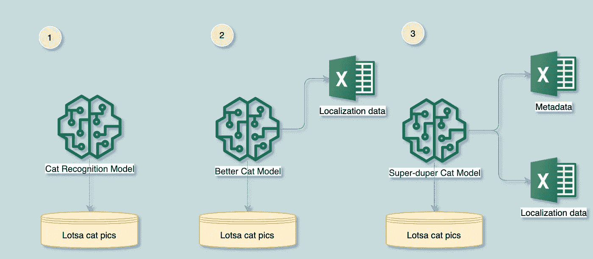
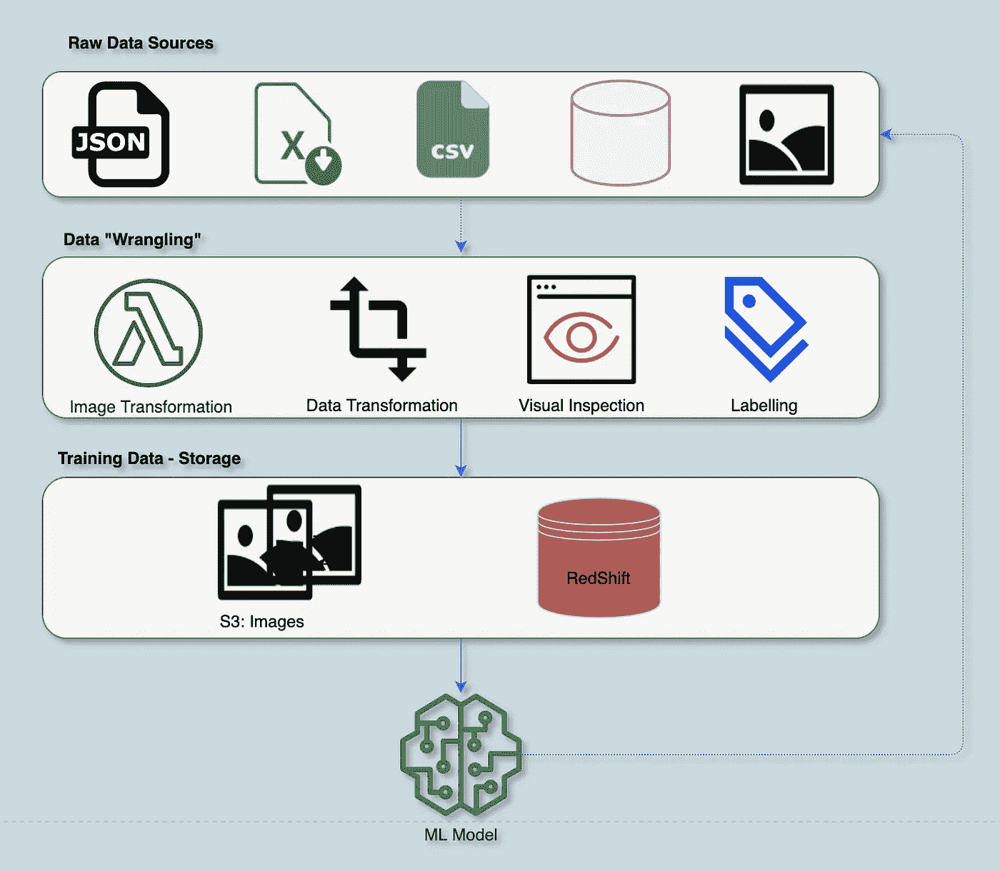

# 存储:构建机器学习模型的重要组成部分

> 原文：<https://towardsdatascience.com/storage-an-essential-component-of-building-machine-learning-models-8b941823ab46?source=collection_archive---------61----------------------->

照片由[萨贾德·诺里](https://unsplash.com/@sajad_sqs9966b?utm_source=unsplash&utm_medium=referral&utm_content=creditCopyText)在 [Unsplash](https://unsplash.com/t/experimental?utm_source=unsplash&utm_medium=referral&utm_content=creditCopyText) 上拍摄

在[之前的一篇](/so-you-want-to-build-ml-models-how-strong-are-your-data-jujitsu-skills-13fb3777c0ef)文章中，我提出了一个简单的框架来应对使用数据构建机器学习(ML)模型所涉及的各种挑战。这个框架如下图所示。

作者图片

上一篇文章讨论了数据收集的挑战，并展示了一个与数据收集问题相关的相对简单的基础设施栈。我们将从我们停下来的地方继续，更具体地说，尝试解决我们的 cat 识别应用程序的存储挑战。我还将描述我们在 [Kheiron](https://www.kheironmed.com/) 使用的存储层。

但首先，我们回到我们的猫识别应用程序！

在我们开展卡特彼勒识别工作的早期，存储可能并不是一个大问题。我们会得到一批图像，然后把它们存储在本地的某个地方，也许是在共享的网络驱动器上，也许是在 S3 的云中。我看到的第一个存储挑战是数据孤岛，尤其是在 ML 中。一个例子可以说明这一点。

你可能还记得，我们一开始提供了一个简单的猫识别应用程序。随着时间的推移，我们的应用程序变得非常成功，企业要求我们通过提供一个新功能来增强它:在照片中突出猫的位置(本地化)。这项功能需要对我们现有的数据集进行一些修改，并建立一个新的 ML 模型，一个可以识别和定位图像中的猫的模型。后来，公司要求我们建立模型，识别亚洲国家常见的猫的图像。

作者图片

当这些新的请求进来时，阻力最小的途径就是简单地复制我们已有的数据，并用它来构建更新的模型。一个复制品将用于识别猫的原始 ML 模型。具有附加数据的另一个复制品将被用于建立具有本地化的新 ML 模型。然而，另一个副本将在稍后用于亚洲猫模型。此外，这些请求中的每一个都伴随着增量数据更改。定位模型需要原始图像之外的数据——它需要猫在训练数据集中的坐标。同样，亚洲模型将需要亚洲常见的猫的图像和一些元数据。

这种复制方法本身没有任何问题。我们在软件中一直这样做:我们分支和分叉代码库。我们这样做的原因是为了给一个特性开发团队，或者一个发布版本一个自己的小天地。然而，传统软件([软件 1.0](https://karimfanous.substack.com/p/software-20-vs-software-10) )有一个非常丰富的工具生态系统来促进这一点。我们有 Git 和其他版本控制系统来帮助分支和版本控制。这些工具也提供这些服务，即无需进行[完整复制](https://git-scm.com/book/en/v2/Git-Branching-Branches-in-a-Nutshell)就可以进行分支。我应该注意到有一些新的工具，像 [DVC](https://dvc.org/) ，正在试图解决这个问题。我没有使用过，也没有体验过——目前还没有。这种复制方法的主要好处是原型开发和开发的速度，而明显的挑战是存储和可管理性方面的成本。那么，我们该怎么办呢？

在我深入介绍我们在 [Kheiron](https://www.kheironmed.com/) 的方法的细节之前，我将首先提供一点关于我们所做的事情和我们放松的一些约束的背景。凯龙为癌症检测，更具体地说是乳腺癌，建立 ML 模型。我们的数据集由乳房造影图像和关于这些图像的元数据组成。元数据包括人口统计和临床数据，如活检结果、癌症史、以前的乳腺癌检查等。前者对于理解我们的模型在各种人口分层中的有效性至关重要。后者形成了我们的地面真相的基础，这可以被简单地视为试图回答这个问题:“这个图像包含恶性肿瘤吗？”当我们建立 ML 模型时，我们依赖于原始图像以及元数据。

在考虑存储时，我们提出了一些有助于降低问题复杂性的要求和约束。这些是:

1.  我们将整合 AWS 上的所有数据，包括非结构化数据(图像)和结构化数据(元数据)。
2.  我们将对数据团队以外的任何人设置对此数据的只读权限。
3.  我们不关心数据的版本，尤其是图像。

第一个限制相当明显。我们选择的存储基础架构将是 AWS。稍后，我将深入探讨我们选择哪种存储介质的细节。选择 AWS 的主要动机是不需要管理任何内部存储基础架构，并且易于在 AWS 上扩展基础架构。我们还想让我们的数据靠近我们的计算集群。我们将在下一篇文章中讨论这个主题。

第二个约束设置数据存储层和它的所有消费者之间的接口:只读。消费者，大部分是 ML 工程师建立模型，只能读取数据，不能修改。从我们的数据层读取后发生的任何修改都是短暂的，不是持久的。最常见的例子是图像变换(开窗、过滤、旋转等)。如果我们确实遇到了常见的数据转换，我们会在将数据保存到存储层之前尝试这样做。我们的目标是使我们存储的数据无需任何修改即可用于 ML 训练。

其中，最微妙的是第三个限制。它消除了解决版本问题的需要。忽略数据版本控制的主要动机——至少现在——是一个重要的假设:更多的数据意味着更好的 ML 模型。简单地说，我们假设如果我们的数据集随时间变化，主要是通过数据添加，那么我们的模型将会改进。只要这个假设成立，我们就不需要担心版本、快照和回到过去。最近可用的数据应该产生“最佳”模型。在下一篇文章中有更多关于模型评估和选择的内容。在某些情况下，我们确实关心用于训练模型的数据集，并希望在一组实验中固定该数据集。例如，我们可能正在评估各种模型，并希望修复训练和测试数据集来比较模型，而不用担心不同数据集的影响。我们可以在不制作复制品的情况下实现这一点，这一点很快就会得到证实。

考虑到这些限制，我们决定使用 S3 和红移来构建我们的存储堆栈，这是一个惊喜。我们使用 S3 存储所有非结构化数据，其中大部分是图像。Redshift 是我们存储所有图像元数据的首选数据仓库。

作者图片

值得注意的是，我们还在原始数据存储层使用了 S3，这是下面堆栈中的最顶层。顾名思义，原始数据是我们尚未映射或转换为可用于训练和构建 ML 模型的数据。这些数据有多种格式，具体取决于其来源。原始数据层下面的一层——角力层——负责清理、映射并将其转换为我们可以用来训练 ML 模型的格式。这些转换是使用 lambda 函数和 Apache Airflow 的组合来完成的。我们还使用我们开发的定制工具来直观地检查原始数据，以捕捉图像中经常出现的任何异常。简而言之，角力层负责将杂乱的数据(原始数据)映射到一些通用的格式和模式中，这些格式和模式很容易被 ML 训练管道使用。我们将在下一篇文章中讨论这个主题，它涉及使用这些数据进行分析和 ML 训练。

我刚才介绍的存储堆栈很简单。可能太简单化了，但这就是重点。我们希望从最简单的堆栈开始，并通过放宽要求来做到这一点。当前的栈完成了它想要解决的工作，即促进 ML 模型的训练。

主图由[萨贾德·诺里](https://unsplash.com/@sajad_sqs9966b?utm_source=unsplash&utm_medium=referral&utm_content=creditCopyText)在 [Unsplash](https://unsplash.com/t/experimental?utm_source=unsplash&utm_medium=referral&utm_content=creditCopyText) 上拍摄

【https://karimfanous.substack.com】最初发表于**。**