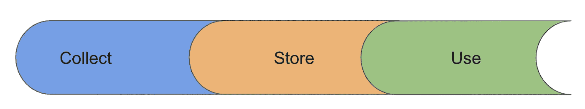
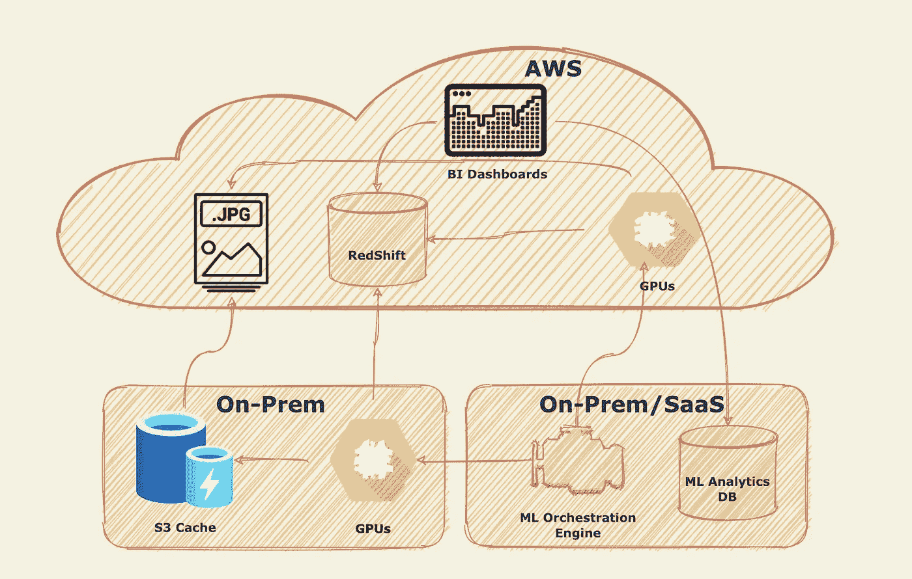

# 用于机器学习的存储和计算

> 原文：<https://towardsdatascience.com/storage-compute-for-ml-8ba488b91865?source=collection_archive---------23----------------------->

## 关于 GPU，有几个重要的限制需要记住。

由[熊伟·平托](https://unsplash.com/@vdapinto?utm_source=unsplash&utm_medium=referral&utm_content=creditCopyText)在 [Unsplash](https://unsplash.com/t/wallpapers?utm_source=unsplash&utm_medium=referral&utm_content=creditCopyText) 上拍摄的照片

在过去的两篇文章中，我们讨论了与数据[收集](/so-you-want-to-build-ml-models-how-strong-are-your-data-jujitsu-skills-13fb3777c0ef)和[存储](/storage-an-essential-component-of-building-machine-learning-models-8b941823ab46)相关的各种活动。这些是下面概述的 3 步过程的一部分。现在我们到了最后一步，这涉及到使用我们收集和存储的数据。

作者图片

使用数据是用它“做一些事情”的功能，为了这篇特别的文章，它将被限制在使用数据建立人工智能模型的范围内。为了建立这些模型，我们需要数据，我们已经讨论了如何获取和存储数据，更重要的是，需要计算资源来使用这些数据训练模型。

人工智能模型主要使用 GPU 进行训练。GPU 是训练模型的事实标准，因为它们可以同时处理多个计算。它们有大量的内核，这允许更好地计算多个并行进程，这是 ML 模型可以极大受益的特性。

关于 GPU，有几个重要的限制需要记住。

首先，它们也相当昂贵，其中一家厂商(Nvidia)占据了相当大的市场份额。如果你要建立人工智能模型，你很可能会使用英伟达图形处理器。其次，您会希望让您计算机靠近您的数据。让昂贵的 GPU 空闲等待 I/O 请求是没有意义的。第三，以天或周计算训练时间并不罕见。训练模型所需的时间取决于模型的架构，模型越复杂，训练所需的时间就越长，可用于训练的数据量和计算能力也越大。

你可能还记得我在[上一篇](https://karimfanous.substack.com/p/storage-an-essential-component-of)文章中提到，我们选择的存储介质是 S3 和红移，两者都托管在 AWS 上。因此，使用运行在 AWS 上的 GPU 实例是有意义的。问题是，这些可能很贵，尤其是如果你想全天候训练模特的话。美国东弗吉尼亚州/北弗吉尼亚州的 GPU 实例的 EC2 按需定价从约 0.50 美元/小时到约 32 美元/小时不等。

根据我的经验，完全依赖基于云的 GPU 实例可能会非常昂贵，你最好购买内部部署的 GPU，如[英伟达 DGX](https://www.nvidia.com/en-us/data-center/dgx-systems/) ，如果你需要更多的计算能力，可以使用云。值得注意的是，主要的云提供商正在构建自己的 ASICs，并以比 Nvidia 驱动的 GPU 低得多的价格提供这些芯片。例如，AWS 提供了推理实例( [Inf1](https://aws.amazon.com/ec2/instance-types/inf1/) )，并计划用像 [Trainium](https://aws.amazon.com/machine-learning/trainium/) 这样的新模型来补充这些实例。

故事还有一个转折。您不会希望昂贵的 GPU 闲坐着，要么等待 I/O，要么利用不足。你也不希望你的 ML 团队试图找出如何调度 ML 作业在一个 GPU 集群上运行。这就是像 [Polyaxon](https://polyaxon.com/) 这样的 MLOPs 引擎发挥作用的地方。Polyaxon 有许多替代品，有些是由 AWS Sagemaker 等云提供商提供的，有些是 Algorithmia 等云提供商提供的。在 Kheiron，我们选择了 Polyaxon，因为它具有丰富的功能集，并且能够在内部和云中运行。Polyaxon 还提供托管服务。

有了所有这些，我们的计算和存储架构如下图所示。在堆栈的顶部，您可以看到我们的存储层，它由临床数据和其他元数据的 S3(图像)和红移组成。我们还利用 AWS 上可用的 GPU 实例，如果我们需要超出可用的内部容量。

作者图片

我们的绝大多数计算集群都是内部部署的(英伟达 DGX)。为了减少我们的内部基础设施和 AWS 上托管的存储之间的 I/O 延迟，我们利用了像 [Minio](https://min.io/) 这样的 S3 缓存。我们缓存的存储介质是快速 NVMe 固态硬盘。我们选择的 MLOPs 平台是 Polyaxon，我们广泛使用它来分配 ML 作业可以在其上运行的 GPU 资源。这些资源默认为我们的内部 GPU，但我们也能够通过在 AWS 上启动 GPU 实例来爆发。当我们这样做时，我们可以直接从 S3 读取，而无需通过缓存层。Polyaxon 提供的不仅仅是管理和调度大型计算集群的能力。它的众多好处之一是跟踪它在本地 Postgres 数据库上运行的模型的大量历史数据。

最后，我们利用 BI 工具来评估存储在 S3 的训练数据和红移与模型性能之间的关系。后者储存在 Polyaxon 中。通过这一分析，我们想回答许多问题。虽然我们显然关心模型的整体性能，但我们也对了解训练数据集的分布感兴趣。例如，如果我们的数据集偏向于某个年龄组，例如 45 岁以下的女性，那么如果我们的模型遇到训练分布之外的数据(在这种情况下是 45 岁以上的女性)，则它们的性能可能不够好。我们关心训练数据的分布，以了解我们的模型的整体风险状况，以及这些数据在更广泛的分布中的推广情况。这种分析对于帮助我们找出训练数据中的差距也是非常宝贵的。我们的训练数据和总体数据(即人口)分布之间的重叠越大，模型的泛化能力就越好。模型泛化将是另一篇文章的主题。在一篇文章中简单地提到了这一点，但是我会在以后的文章中进一步充实它。

由[熊伟·平托](https://unsplash.com/@vdapinto?utm_source=unsplash&utm_medium=referral&utm_content=creditCopyText)在 [Unsplash](https://unsplash.com/t/wallpapers?utm_source=unsplash&utm_medium=referral&utm_content=creditCopyText) 上拍摄

*原载于*[*https://karimfanous.substack.com*](https://karimfanous.substack.com/p/storage-and-compute-key-ml-ingredients)*。*