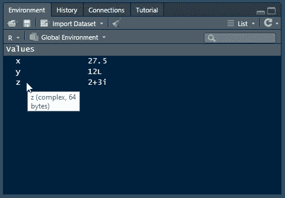
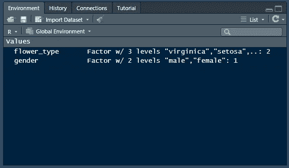
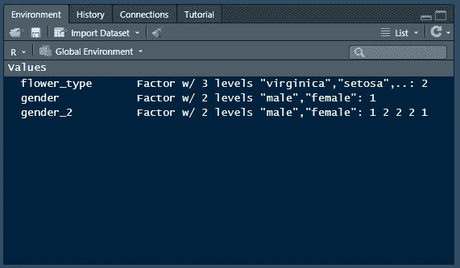

# 存储数据:R 数据类型

> 原文：<https://towardsdatascience.com/storing-data-in-r-data-types-d0fa076ba5ad?source=collection_archive---------46----------------------->

## 教程| R |数据类型和结构

## R 中数据科学的构建块


Iker Urteaga 在 [Unsplash](https://unsplash.com?utm_source=medium&utm_medium=referral) 上拍摄的照片

为了用 R 做数据科学，我们需要将数据存储在变量中。根据我们的数据是什么，我们需要给它正确的类型。通过选择不同的类型，我们能够在以后访问不同的工具来操作和使用该变量。有些更灵活，有些计算效率更高。让我们开始吧。

# 数据类型

让我们从不同类型的数据开始。虽然这不是一个全面的列表，但它将涵盖数据科学中使用的一些最重要的数据类型。

1.  数字的
2.  因素
3.  性格；角色；字母
4.  日期/时间

## 数字的

数字类型可以有多种形式，例如数字、整数和复数。数字可以是任何带或不带小数位的数字。在其他语言中，它们被称为浮点数。`31`、`-4.2`、`0.00324`都是数字。整数只包含整数。`3`和`-24`是整数的例子。复数有虚数部分，比如`2 + 3i`。

您可以像这样定义这些数值类型:

```
# Numeric
x <- 27.5# Integer
y <- 12L# Complex
z <- 2 + 3i
```

如果使用 RStudio，可以将鼠标悬停在环境窗格中的每个变量上，以查看其类型。



z 是“复杂”类型

`typeof()`函数也可以用来获取变量的类型。x 的`double`类型是处理数字数据时最常见的数字格式之一。

```
typeof(x)
# "double"typeof(y)
# "integer"typeof(z)
# "complex"
```

定义了一些数字数据后，就可以把 R 当作计算器使用了。所有的标准运算符都工作，如`+`、`-`、`*`和`/`。还有一些有用的函数，比如`abs()`，用于查找一个数字的绝对值，或者`exp()`，用于计算`e`到括号内的值。

```
x + y
# 39.5x * z
# 23+36iabs(x)
# 27.5exp(x)
# 877199251319
```

## 因素

因素是数据中的类别。在你的数据中，你通常会看到像雄性和雌性或者刚毛藻、杂色花、海滨草这样的东西(来自[鸢尾](https://archive.ics.uci.edu/ml/datasets/iris)数据集)。这些是分割你的数据的方法，它们会包含很多重复。因子将每个类别表示为一个数字，有助于更有效地存储这些信息。

```
gender <- factor("male", levels = c("male", "female"))flower_type <- factor("setosa", levels = c( "virginica", "setosa", "versicolor"))print(gender)
# male
# Levels: male femaleprint(flower_type)
# setosa
# Levels: virginica setosa versicolor
```

打印因子时，您会看到级别的名称。如果您在 RStudio 的环境窗格中查看，您会看到一个数字。通过将因子表示为变量的相应级别，节省了空间。



在幕后，flower_type 是 a 2，gender 是 a 1

当我们创建`gender_2`时，您可以开始看到这是如何节省空间的。我们将有 5 个因素，而不是 1 个因素。

```
gender_2 <- factor(c("male", "female", "female", "female", "male"), levels = c("male", "female"))print(gender_2)
# male female female female male
# Levels: male female
```

在我们的环境窗口中，我们现在看到在`gender_2`中有多个 1 和 2 来代表我们不同的性别。



在幕后，gender_2 只是一系列表示因子级别的数字

`table()`函数对于处理因子很有用。它给出了数据中每个级别的计数。

```
table(gender_2)
# gender_2
# male   female
#    2        3 
```

根据您需要了解的内容，`nlevels()`和`levels()`分别给出了因子中的级别数和级别名。

```
nlevels(gender_2)
# 2levels(gender_2)
# "male" "female"
```

## 特性

字符是 R 表示文本的方式。如果你来自另一种编程语言，这些通常被称为字符串。您可以将整本书存储在单个字符串变量中，或者从网站调查的文本条目中获得自由回答。

为了定义 R 中的字符，我们将文本放在引号中。可以用单引号(`'`)，也可以用双引号(`"`)。r 也是这么解释的。我发现双引号在 R 中更常见，但是单引号在其他编程语言中也经常使用，所以你可能也会遇到。

```
character <- 'string'
print(character)
# "string"text <- "This is also a string"
print(text)
# "This is also a string"
```

r 包含一些内置函数，在处理字符文本时很有用。`nchar()`给出字符变量中的字符数，而`paste()`将字符变量组合在一起，用空格分隔。

```
nchar(text)
# 21paste(character, text)
# "string This is also a string"
```

还有一个包`[stringr](https://stringr.tidyverse.org/)`，它允许文本操作技术，比如替换、获取字符可变长度，甚至用正则表达式(或 regex)查找文本。正则表达式非常灵活，对于掌握文本操作非常重要。

</a-gentle-introduction-to-regular-expressions-with-r-df5e897ca432>  </anchors-away-more-regex-concepts-in-r-f00fe7f07d52>  

## 日期和时间

在商业世界和[纵向研究](https://en.wikipedia.org/wiki/Longitudinal_study)中，相同的数据被定期收集，例如在月末、每天或每年。为了组织这些观察结果以便以后进行可视化和分析，我们需要日期和时间变量。

r 有一些内置的日期和时间变量，但是使用`[lubridate](https://lubridate.tidyverse.org/)`包使它们更容易解析和处理。您可以使用`lubridate`以多种不同的格式定义日期。它甚至可以自动处理日期中的分隔符，如斜线、破折号、冒号或空格！

```
library(lubridate)sample_date <- ymd("2020-01-21")
print(sample_date)
# "2020-01-21"sample_datetime <- mdy_hms("1/23/2021 2:53:22")
print(sample_datetime)
# "2021-01-23 02:53:22"
```

一旦你定义了日期和时间，你可以用它们做很多不同的事情。您可以提取日期时间的每个单独部分，添加一段时间，或者对它们进行舍入。

```
# Extract datetime components ----------------
month(sample_date)
# 1
second(sample_datetime)
# 21# Add a period of time -----------------------
sample_date + years(50)
# "2070-01-21"# Round a datetime down by month -------------
floor_date(sample_date, unit = "month")
# "2020-01-01"
```

你可以用日期和时间做很多其他的事情，如果你有兴趣了解更多，看看`lubridate` [备忘单](https://rawgit.com/rstudio/cheatsheets/master/lubridate.pdf)。

# 结论

通过对 R 中一些最常见的数据类型的简要概述，您可以了解如何存储变量以及不同类型的一些优点。为了继续学习 R 中的数据类型知识，您需要了解一下数据结构。这些是 R 中的变量集合，它们用于存储数据和更高级的分析。

<https://realdrewdata.medium.com/membership>  <https://realdrewdata.medium.com/storing-data-r-data-structures-717245c6bab8> 