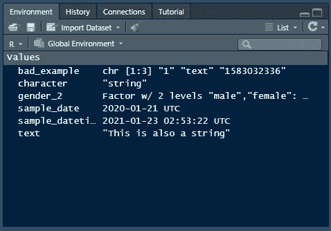
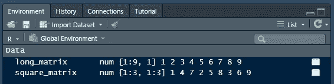
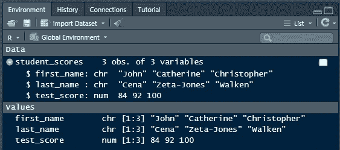
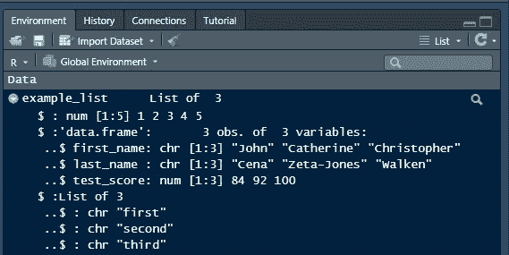
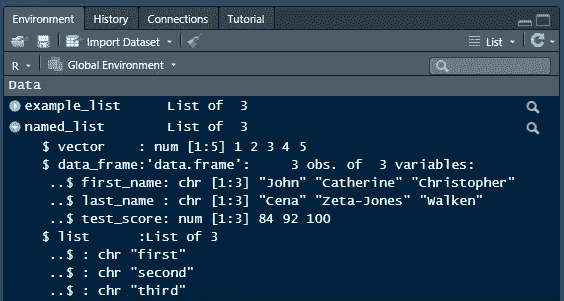

# 存储数据:R 数据结构

> 原文：<https://towardsdatascience.com/storing-data-r-data-structures-717245c6bab8?source=collection_archive---------16----------------------->

## 教程| R |数据结构

## 存放数据科学剩余产品的容器

# 数据类型的集合


照片由 [Syed Hussaini](https://unsplash.com/@syhussaini?utm_source=medium&utm_medium=referral) 在 [Unsplash](https://unsplash.com?utm_source=medium&utm_medium=referral) 上拍摄

现在你知道了不同类型的变量，让我们看看 R 收集这些变量的一些选项。我们将了解以下类型:

1.  向量
2.  矩阵
3.  数据帧
4.  列表

</storing-data-in-r-data-types-d0fa076ba5ad>  

## 向量

向量是 R 中最基本的类型之一，是许多运算的主干。虽然它们被限制为只包含一种类型的变量，但这允许它们比使用 for 循环更快地执行操作。它们也是我们将在本文后面讨论的数据帧的构建块。让我们做一些向量！

```
numbers <- c(1, 2, 3, 4, 5, 6, 7, 8, 9, 10)strings <- c("this", "is", "some", "text")bad_example <- c(1, "text", ymd_hms("2020-3-1 3:12:16"))
```

现在我知道你在想什么了。我刚才说一个向量里面只能放 1 种类型的变量，但是`bad_example`有 3 种！不完全是。如果你看一下环境面板，你会看到它是一个有 3 个元素的字符向量。将 vector 的所有元素强制或转换为同一类型。



日期由从 1970 年开始的秒数表示，所以我们得到 1583032336(作者)

一些函数在向量上使用时返回单个输出，比如`mean()`。其他的会对向量的每个元素执行一个动作，然后返回一个等长的向量，像`paste()`。

```
mean(numbers)
# 5.5paste("test", strings)
# "test this" "test is"   "test some" "test text"
```

这些函数作用于向量的方式给了 R 很大的速度。它们比编写 for 循环要快得多。通过知道所有元素都是相同的类型，R 可以消除它在 for 循环中的大量内部开销。

## 矩阵

矩阵用于存储数字网格。某些统计函数将这些作为输入或在内部使用它们来加速计算。R 中的 K-Means 聚类将一个矩阵作为其输入，用于神经网络的`nnet`包在内部使用矩阵来进行计算。下面让我们看看创建一些矩阵的选项。

创建矩阵时，我们可以向`matrix`函数传递一个包含要放入矩阵中的数字的向量。

```
long_matrix <- matrix(c(1, 2, 3, 4, 5, 6, 7, 8, 9))print(long_matrix)
#      [,1]
# [1,]    1
# [2,]    2
# [3,]    3
# [4,]    4
# [5,]    5
# [6,]    6
# [7,]    7
# [8,]    8
# [9,]    9
```

如果我们想要指定列或行的数量，我们可以使用`ncol`和`nrow`参数。

```
square_matrix <- matrix(c(1, 2, 3, 4, 5, 6, 7, 8, 9), nrow = 3, ncol = 3)print(square_matrix)
#      [,1] [,2] [,3]
# [1,]    1    4    7
# [2,]    2    5    8
# [3,]    3    6    9
```

默认情况下，R 接受输入向量并填充每一列。要填充每一行，只需添加`byrow`参数并将其设置为`TRUE`。将它与之前`square_matrix`的输出进行比较。

```
square_matrix <- matrix(c(1, 2, 3, 4, 5, 6, 7, 8, 9), nrow = 3, ncol = 3, byrow = TRUE)#      [,1] [,2] [,3]
# [1,]    1    2    3
# [2,]    4    5    6
# [3,]    7    8    9
```



RStudio 环境面板中的矩阵(鸣谢:作者)

如果你曾经上过线性代数的课程，你会知道矩阵可以相加、相乘，并且有一些特殊的性质，比如叉积和特征值。r 通过这些特殊的操作符和函数支持一系列这样的函数

```
# Add matrices
square_matrix + square_matrix
#      [,1] [,2] [,3]
# [1,]    2    4    6
# [2,]    8   10   12
# [3,]   14   16   18# Multiply matrices
square_matrix * square_matrix
#      [,1] [,2] [,3]
# [1,]    1    4    9
# [2,]   16   25   36
# [3,]   49   64   81# Find the transpose of a matrix
t(square_matrix)
#      [,1] [,2] [,3]
# [1,]    1    4    7
# [2,]    2    5    8
# [3,]    3    6    9# Find crossproduct of 2 matrices
crossprod(square_matrix, square_matrix)
#      [,1] [,2] [,3]
# [1,]   66   78   90
# [2,]   78   93  108
# [3,]   90  108  126# Find Eigenvalues of a matrix
eigen(square_matrix)
# eigen() decomposition
# $values
# [1]  1.611684e+01 -1.116844e+00 -1.303678e-15
#
# $vectors
#            [,1]        [,2]       [,3]
# [1,] -0.2319707 -0.78583024  0.4082483
# [2,] -0.5253221 -0.08675134 -0.8164966
# [3,] -0.8186735  0.61232756  0.4082483
```

## 数据帧

数据框非常类似于大多数人习惯看到的由行和列组成的表格中的数据。R 中的数据帧由向量列组成。数据框非常适合绘制数据，并用作线性和逻辑回归(K-最近邻算法)的输入。

利用我们已经学过的关于向量的知识，它们非常容易制作。如果我们创建几个等长的向量，我们可以用`data.frame`函数将它们组合在一起。

例如，让我们创建一个数据框来保存班级中学生的姓名和分数。我们将创建 3 个向量:名、姓和分数。然后我们将向量传递给数据框函数，将数据框保存为`student_scores`。

```
first_name <- c("John", "Catherine", "Christopher")
last_name <- c("Cena", "Zeta-Jones", "Walken")
test_score <- c(84, 92, 100)student_scores <- data.frame(first_name = first_name, last_name = last_name, test_score = test_score)print(student_scores)
# first_name     last_name     test_score
# <fctr>         <fctr>        <dbl>
# John           Cena          84
# Catherine      Zeta-Jones    92
# Christopher    Walken        100
```

如您所见，每个参数都是一个列名，该列中的数据是我们在`data.frame`函数中将列名设置为等于的向量。当我们打印`student_scores`时，我们得到列名、数据类型和数据。

您可能会注意到名和姓的类型是一个因素。默认情况下，R 将字符串作为因子，但是这种行为对我们的名字没有太大意义。创建数据框时添加`stringsAsFactors = FALSE`参数会将它们设置为字符。



我们的数据框和我们用来创建它的列(致谢:作者)

数据框具有一些功能，可帮助您获取有关其包含的数据的更多信息:

*   `nrow()`/`ncol()`-返回数据框中的行数或列数

```
ncol(student_scores)
# 3nrow(student_scores)
# 3
```

*   `names()`-返回数据框中的名称列名称

```
names(student_scores)
# "first_name" "last_name"  "test_score"
```

*   `head()` / `tail()` —返回数据帧的前几行或后几行。默认显示的行数是 6。使用`n`参数改变显示的行数

```
# Display up to the first 6 rows of the data frame
head(student_scores)# Display up to the last 2 rows of the data frame
tail(student_scores, n = 2)
```

*   `summary()` —返回数据帧每一列的汇总信息。数值类型将显示该列的最小值、最大值、平均值和分位数指标

```
# Display summary information about the columns of the data frame
summary(student_scores)
#  first_name         last_name           test_score 
# Length:3           Length:3           Min.   : 84  
# Class :character   Class :character   1st Qu.: 88  
# Mode  :character   Mode  :character   Median : 92  
#                                       Mean   : 92  
#                                       3rd Qu.: 96  
#                                       Max.   :100
```

同样值得注意的是，它能够提取单个列向量，并执行我们之前在向量上看到的所有相同操作。您可以使用美元符号符号(`data.frame$column_name`)或括号符号(`data.frame[2]`或`data.frame[“column name”]`)

```
# Select the last_name column
# with dollar sign ($) notation
student_scores$last_name# Select the 2nd column of the data frame
# with bracket notation
student_scores[2]# Select the first_name column of the data frame
# with bracket notation
student_scores["first_name"]
```

## 列表

列表完善了我们的 r 的基本构建块。它们的用途非常广泛，因为它们可以包含几乎任何内容，甚至不同类型的变量，甚至可以相互嵌套来组织更多的信息。它们使用起来可能有些慢，但通常用于存储线性回归等模型的输出。

让我们创建一个包含不同数据类型的列表。我们将在示例列表中添加一个矢量、数据框和另一个列表。

```
example_list <- list(c(1, 2, 3, 4, 5), student_scores, list("first", "second", "third"))print(example_list)
#[[1]]
#[1] 1 2 3 4 5#[[2]]
#   first_name  last_name test_score
#1        John       Cena         84
#2   Catherine Zeta-Jones         92
#3 Christopher     Walken        100#[[3]]
#[[3]][[1]]
#[1] "first"#[[3]][[2]]
#[1] "second"#[[3]][[3]]
#[1] "third"
```

当打印列表时，您可以看到列表中的每个元素都由一个用双括号括起来的数字表示。因为 vector 是列表的第一个元素，所以它是`[[1]]`。我们的列表中的列表元素，或者嵌套列表，用双括号中的 2 个数字表示。可以通过首先指定与嵌套列表`[[3]]`相对应的元素，然后通过嵌套列表的元素来引用它们，例如第二个元素的`[[2]]`。

```
# 2nd element of the example list
example_list[[2]]# 2nd element of the nested list (the 3rd element of the example list)
example_list[[3]][[2]]
```



我们在 RStudio 环境窗格中的示例列表(鸣谢:作者)

列表元素也可以被命名。这可以通过在创建列表时为它们指定名称来实现，与创建数据框时指定名称的方式非常相似。

```
named_list <- list(vector = c(1, 2, 3, 4, 5), data_frame = student_scores, list = list("first", "second", "third"))
```

现在，我们可以通过使用美元符号和括号符号的组合来获得列表的不同元素。

```
# Access the named element of named_list
named_list$list# Access the 2nd element of the list element of named_list
named_list$list[[2]]
```



我们在 RStudio 环境窗格中的命名列表(鸣谢:作者)

# 结论

现在，您已经开始使用 R！进行数据科学、分析或数据可视化了！了解构件将有助于你组织你的变量。了解存储在列表中相对于存储在数据框中的优势将有助于保持代码的优化，即使数据开始增长。了解用于探索和处理数据的函数将有助于您了解这些函数中存储了什么。

<https://realdrewdata.medium.com/membership> 