# 冲击 Kaggle 排行榜

> 原文：<https://towardsdatascience.com/storming-the-kaggle-leaderboard-3ed5b31bc28e?source=collection_archive---------60----------------------->

## 使用 TensorFlow 的迁移学习来提高 Kaggle 狗与猫比赛模型的准确性

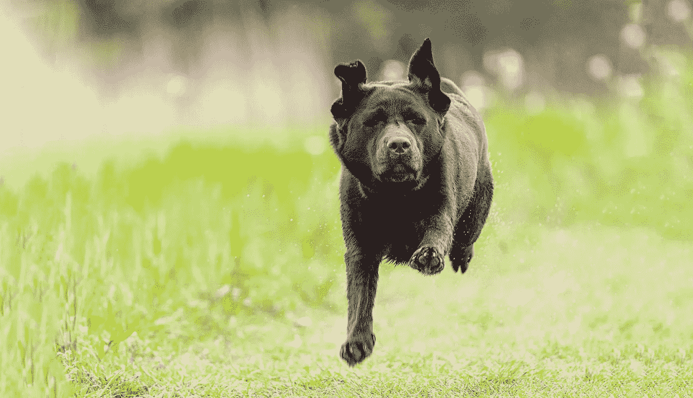

冲击 Kaggle 猫 vs 狗排行榜，图片作者

当我研究深度学习时，我喜欢通过参加 Kaggle 比赛来实践理论。之前，我用 TensorFlow 创建了一个卷积神经网络，以加入 Kaggle 上的猫与狗比赛。这个卷积神经网络让我在 Kaggle 公共排行榜上排名 833。

 [## 用张量流识别猫狗

### 使用 TensorFlow 创建一个神经网络来识别猫和狗

towardsdatascience.com](/recognizing-cats-and-dogs-with-tensorflow-105eb56da35f) 

CNN 的准确率在 90%左右。我想努力提高我的模型的准确性，并在 Kaggle 排行榜上上升。我将使用迁移学习来增强我的模型。迁移学习是一种技术，在这种技术中，您可以重用其他人训练的模型作为您的模型的起点。TensorFlow Keras 包含几个内置的预训练模型[，您可以使用](https://keras.io/api/applications/)。

源代码可以在 [Github](https://github.com/PatrickKalkman/cats_vs_dogs_tl) 上获得。我用的是 Python 3.8 和 Tensorflow 2.3。

# 迁移学习

迁移学习是一种提高模型准确性的流行技术。你拿一个别人为不同的任务训练过的模型，然后重用它。

第一次听说迁移学习，很迷茫。你如何重用一个别人为了不同的目的而训练的模型？我发现答案在于卷积网络的工作方式。

还记得我们在前一篇文章的张量流模型中有三个卷积层吗？训练过程中发生的是 TensorFlow 针对图像的特定特征训练每个卷积层。

2013 年，马特·泽勒和罗布·弗格斯发表了[《可视化和理解卷积网络》](https://arxiv.org/pdf/1311.2901.pdf)本文展示了如何可视化**在每个模型层中学习的神经网络的权重**。请看下面 CNN 第一层和最后一层的可视化。左上角的块是权重的可视化，而其余部分显示了训练期间该层的激活。

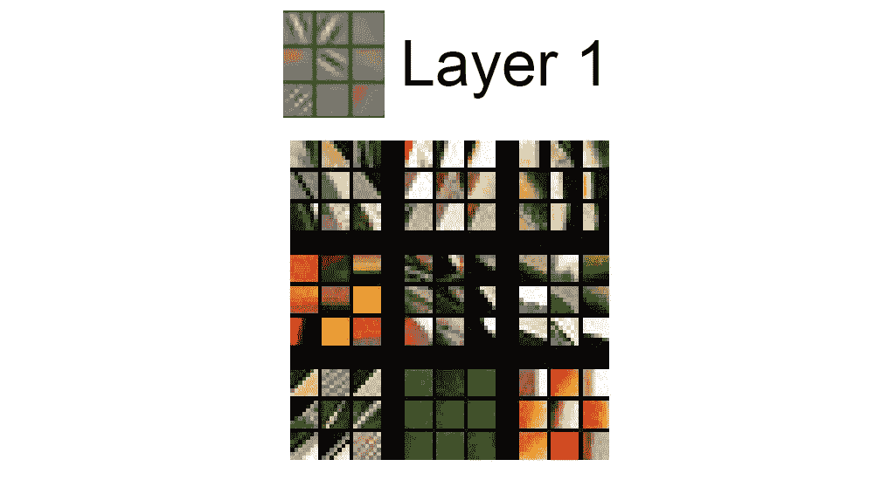

CNN 第一层的激活(马特·泽勒等)

如果你看看 CNN 可视化的其他层，你会发现每一层都检测到图像的更具体的特征。通过我们的 CNN，最后一层的可视化包含了狗或猫的特定部分。请看下面马特·泽勒报告中第五层的可视化。

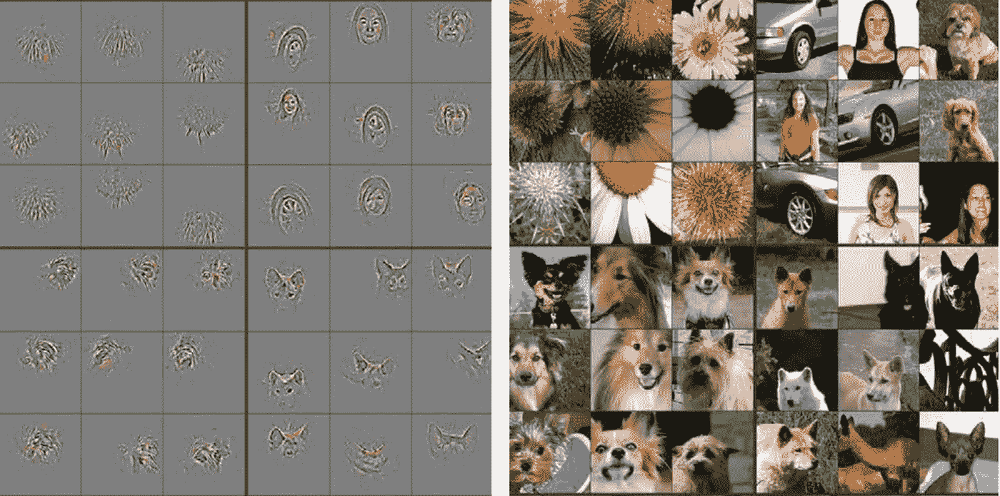

第五层的可视化重量和活化(马特·泽勒等人)

通过迁移学习，我们可以重用 CNN 模型中对所有图像通用的层。例如，这意味着我们保留现有模型的前 70 层，并添加和重新训练新的层。

现在你知道什么是迁移学习，我们将使用 TensorFlow Keras 来实现它。

# TensorFlow Keras 迁移学习

TensorFlow Keras 包含几个内置模型，可用于迁移学习。我会用 [Inception V3](https://keras.io/api/applications/inceptionv3/) 深度学习模型来改进我的模型。

Inception V3 模型包含 159 层和 2300 万个参数。这比我们自己的 CNN 模型还要大，有九层，九百万个参数。希望这能提高我们模型的准确性。

我们将创建与以前不同的模型。我们没有使用`Sequential`类，但是我们创建并使用了`InceptionV3`模型的一个实例。

创建 InceptionV3 模型

`input_shape`还是老样子(150x150x3)。为了防止重新训练现有层，我们通过将每个层的`trainable`属性设置为`False`来锁定所有层。

最后一行打印模型的摘要。你可能需要滚动很多次，因为正如我们之前所说的，这个模型由 192 层组成。

## 添加可训练层

我们必须添加额外的层来训练使用我们的猫和狗图像的模型。我们在 InceptionV3 模型的第 130 层之后添加我们的可训练层。这一层被称为“mixed7”，见打印的模型摘要。

我们使用它的名字检索这个层，然后添加我们的可训练层。

向 InceptionV3 模型添加自己的层

我们添加一个展平，隐藏密集，和密集输出层。然后，我们使用现有的构建好的`layers_out`层来创建模型。从这一部分开始，编译和训练模型与以前一样。

编译和训练模型

如您所见，我仍然使用 ImageDataGenerators 和图像增强将训练图像输入管道。详见我的[上一篇文章](/recognizing-cats-and-dogs-with-tensorflow-105eb56da35f)。

我们训练模型 100 个时期。

## 最终的训练准确度和验证准确度

我们看到，当我们将这些结果与我们的卷积网络结果进行比较时，我们看到训练和验证精度都从 0.9 比 0.6 开始变高。

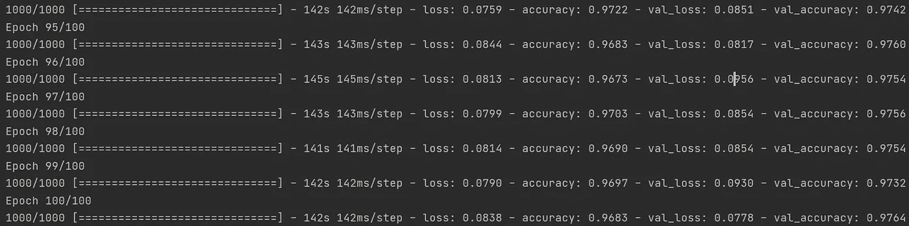

训练结果，图片由作者提供

我们还看到，验证准确度开始时高于训练准确度，但是在 60 个时期之后，它开始降低。这种模式看起来又像过度拟合。

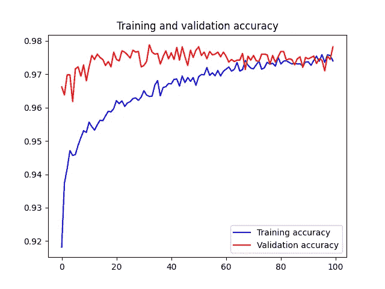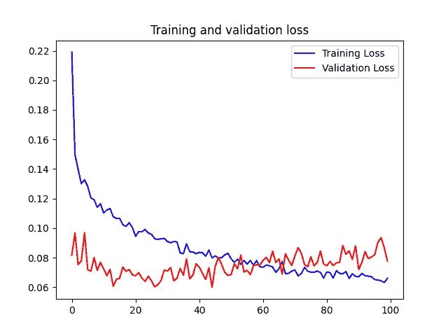

使用 InceptionV3 迁移学习时的训练和验证准确性以及训练和验证损失，图片由作者提供

## 创建和提交预测

我们看到，如果我们创建一个预测并提交给 Kaggle，我们的得分是 0.18834。使用我们的 CNN 图像增强的最佳得分是 0.26211。所以情况有所好转。这将使我们在公共排行榜上名列第 762 位。一跃 71 位！

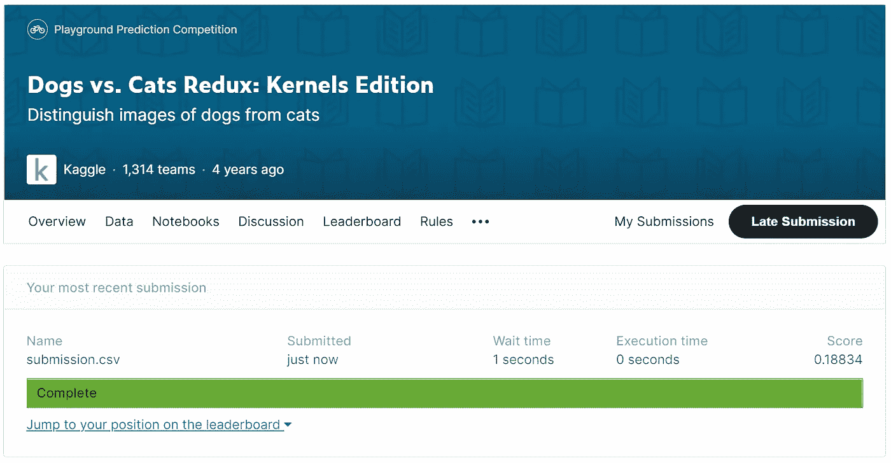

我们使用迁移学习提交的结果，图片由作者提供

# **优化模型**

我们能进一步优化模型吗？我们可以使用的一种方法是漏失层。基本思想是在训练时随机地将一些激活改变为零。这有助于防止过度配合。

该技术首先由 Nitish Srivastava 等人在[“辍学:防止神经网络过度拟合的简单方法”](http://www.cs.toronto.edu/~rsalakhu/papers/srivastava14a.pdf)中介绍。下图直观地显示了脱落层的情况。

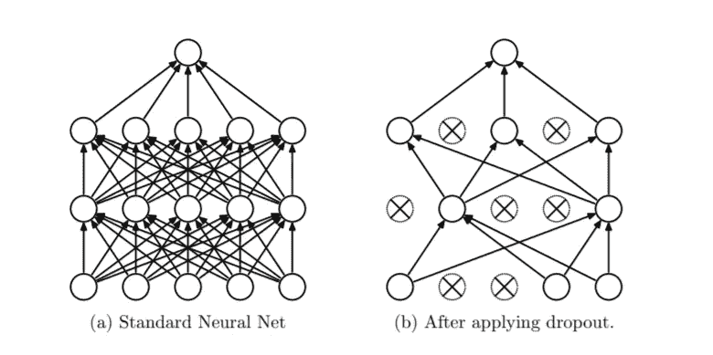

将辍学应用于神经网络的示例(Nitish Srivastava 等人)

我们在致密层之前添加了下降层。我在第九行将退出量设置为 20% (0.2)。

向我们的模型添加一个 Dropout 层

其余的代码保持不变。我们再次训练 100 个时期的模型，并可视化精度和损失。

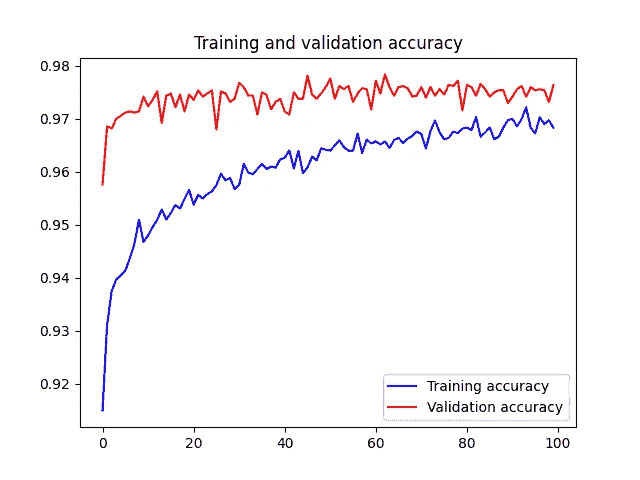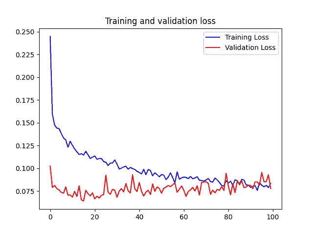

添加缺失图层时的训练和验证准确性以及训练和验证损失，图片由作者提供

训练和验证准确性都遵循相同的趋势，这表明我们正在创建一个好的模型，并且没有过度拟合。

## 创建并提交新的预测

我们看到，如果我们创建一个预测并提交给 Kaggle，我们的得分现在是 0.14293。这与没有脱落层的模型相比是相当大的改进。这使我们在 Kaggle 公共排行榜上又上升了 63 位，达到 699 位。

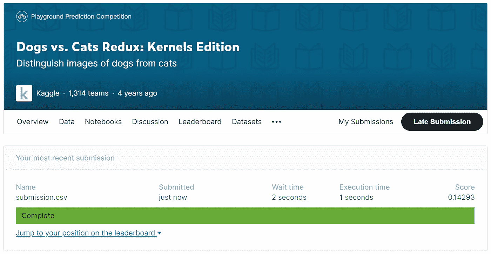

一个改进我们的分数使用辍学层，由作者的形象

在 Keras 框架中有更多的预训练模型可用。

# 进一步优化，选择不同的模型

到目前为止，我们使用 InceptionV3 作为我们的基础模型。正如您可能已经看到的，有许多 Keras 模型可以用于迁移学习。我想尝试提高我们精确度的另一个模型是`DenseRes2.01`。`DenseRes2.01`是预先训练好的密集连接卷积网络。

[研究](https://arxiv.org/abs/1608.06993)表明，如果卷积网络在靠近输入的层和靠近输出的层之间包含较短的连接，那么卷积网络会更加精确。DensRes2.01 就是这样一个密集连接的卷积网络。

随着这些预训练模型变得更大，训练一个纪元的时间也变得更长。我已经不断地训练模型大约 100 个时代了。Keras 包含回调函数，如果它检测到精度没有增加或减少，就会自动停止训练。我将使用的回调函数是`EarlyStopping`。

我们将`EarlyStopping`回调设置为`model.fit`方法的参数。创建`EarlyStopping`时，您给它一个名为`patience`的参数，该参数设置 TensorFlow 停止训练后没有改进的时期数。有时精度会轻微反弹，如果精度在一个时期后下降，耐心并不能帮助停止。见下面的例子。

将提前停止添加到培训流程中

我们增加的另一个优化技术是调整学习率。初始学习率作为参数提供给优化器使用`compile`方法。一旦精度不再提高，如果降低学习率，模型通常可以得到改善。

`ReduceLROnPlateau`可以自动降低学习率，一旦它看到几个时代没有改善。与`EarlyStopping`一样，`ReduceLRonPlateau`也是一个回调函数，作为参数提供给`model.fit`方法。

您可以在下面看到 DensRes2.01 模型的完整创建和初始化。

将提前停止和学习率调整添加到模型中

我们将`DenseNet201`模型直接添加到`Sequential`中，然后添加展平和一个隐藏的致密层。最后，我们为二进制输出添加一个带有单个单元的密集层。

我们在第 15 行和第 17 行创建了`EarlyStopping`和`ReduceLROnPlateau`实例，并将它们添加到第 26 行的回调参数中。

## 最终的训练准确度和验证准确度

在我的机器上，这个模型训练了十个纪元，直到因为提前停止而停止。

训练和验证准确率接近 0.99，而损失接近 0.025。

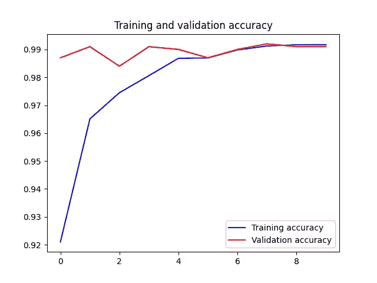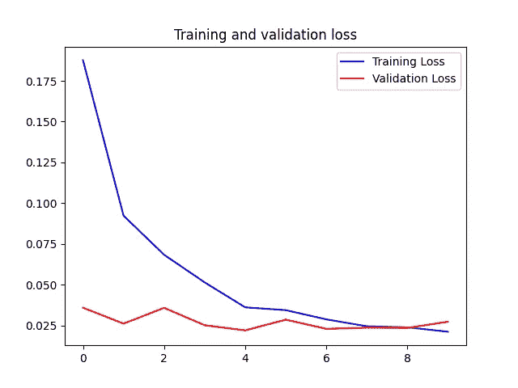

使用 DenseNet201 模型时的训练和验证精度以及训练和验证损失

## 创建并提交最后一个预测

剩下的工作就是创建预测并提交给 Kaggle。当我们提交预测时，我们看到我们的得分是 0.11625。针对 InceptionV3 模型的另一个改进，尽管这种比较并不完全真实，因为我们没有在初始阶段使用学习率调整。

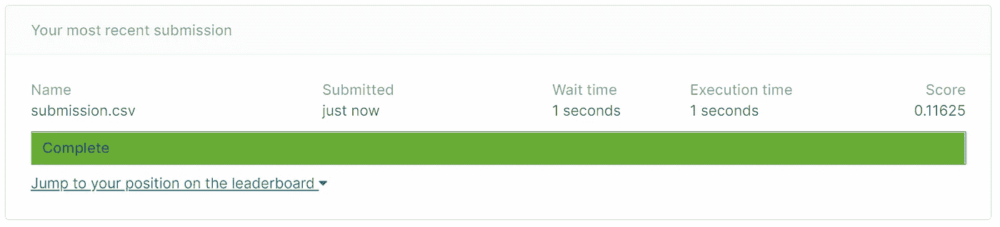

作者使用 DenseNet201 图片改进了我们的分数

得分 0.11625 使我们在公共排行榜上排名第 624 位，又上升了 75 位。

# 结论

本文描述了如何在 TensorFlow 中使用迁移学习，并将其用于 Kaggle Dogs vs. Cats 比赛。通过迁移学习，您可以重用现有模型来提高模型的准确性。您锁定大多数层以防止重新训练，并在最后添加您的自定义层。

我们从卷积神经网络开始，然后我们添加了图像增强以增加训练图像的数量。接下来，我们对 InceptionV3 模型使用迁移学习。之后，我们在 InceptionV3 模型中使用了一个 Dropout 层。

最后，我们使用 DenseNet201 模型结合自动学习率调整达到了最高分。

猫对狗的尝试及其得分概述

也许如果我们在最后一次尝试中增加一个辍学层，我们可以增加一点分数。我将把这个练习留给你，我的笔记本电脑需要冷却。

您可以在 [GitHub](https://github.com/PatrickKalkman/cats_vs_dogs/tree/master) 上找到本文的源代码。存储库很大，因为它包括所有的训练和测试图像。

感谢您的阅读！