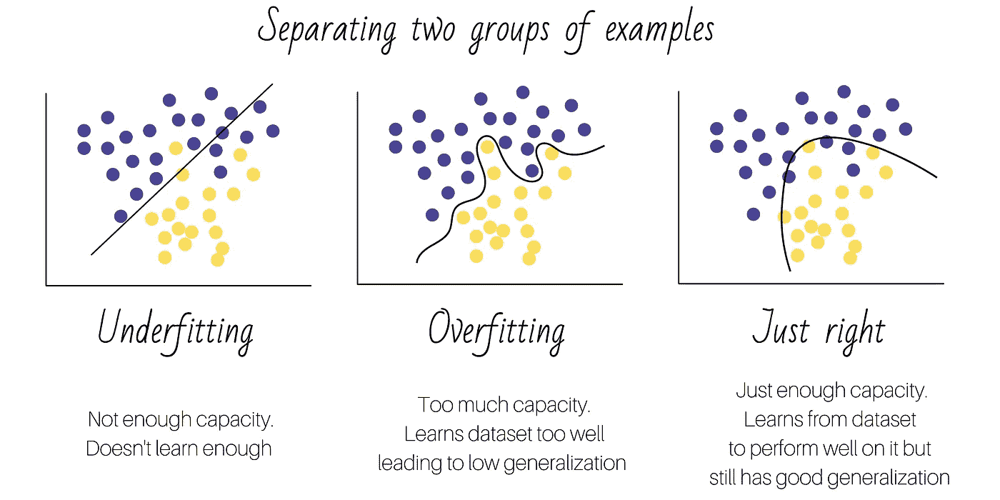

# 生物医学科学家机器学习导论

> 原文：<https://towardsdatascience.com/storytelling-machine-learning-intro-d46e339cb6de?source=collection_archive---------17----------------------->

## 机器学习和免疫系统有一些共同点:它们都从经验中学习来预测未来的 T2。

图片来自 [Unsplash](https://unsplash.com/photos/rnr8D3FNUNY)

机器学习无处不在，生物医学也不例外。从推进个性化医疗的大规模基因组数据分析到通过从氨基酸序列预测蛋白质折叠来解决生物学中 50 年的挑战，毫无疑问，机器学习正在实现突破，塑造生物医学研究的未来。但是，机器学习到底是什么？

根据亚瑟·塞缪尔的定义，机器学习(ML)是一个**“在没有明确编程的情况下赋予计算机学习能力的研究领域”**。ML 算法能够从数据中*学习*。但是，我们如何定义机器的*学习*？从形式上来说，“一个计算机程序被称为从经验 *E* 中学习关于某类任务 *T* 和性能测量 *P* ，如果它在 *T* 任务中的性能，如 *P* 所测量的，随着经验*E*E】而提高。**

作者图片

为了让生物医学科学家熟悉这一点，让我们想想免疫系统。我们的免疫系统保护我们的身体免受外界入侵，如细菌、病毒、真菌和毒素。当先天免疫反应不足以控制感染时，由 T 细胞和 B 细胞介导的*适应性*或*获得性*免疫反应被激活。让我们来看一个例子。

当抗原进入我们的身体时，抗原呈递细胞(APCs)会检测并吞噬它们。它们形成抗原的许多不同片段，并将它们运输到膜表面。一些 T 细胞通过刺激 B 细胞准备应答来应答 APCs。b 细胞然后产生称为*抗体*的蛋白质，这种蛋白质对入侵的病原体具有特异性，并结合到入侵病原体的表面，以标记其被破坏。感染后，病原体特异性 B 细胞群得以维持，因此在再次感染的情况下，免疫反应更快、更有效。

这意味着我们的免疫系统*已经学会*区分抗原的致病性，并在再次感染的情况下利用该信息。或者，换句话说，我们的免疫系统*从经验中学习*，以更好地完成*的任务——在这种情况下是*，杀死病原体。这差不多就是机器学习所做的。

给定 ML 的正式定义，我们可以定义任何机器学习算法的**的 4 个主要组成部分:一个**数据集**(经验)、一个**模型**(解决**任务**的算法)、一个**成本**或**损失函数**(衡量模型解决任务的好坏)，以及一个**优化算法**(校准模型以提高其性能)。**

让我们更详细地了解一下每一项:

## **数据集(经验)**

ML 算法可以理解为被允许体验一个**数据集**，这个数据集是很多例子的集合。根据它们在学习过程中被允许拥有的经验，ML 算法可以大致分为**无监督**或**有监督** *。*

**无监督算法**体验包含许多特征的数据集，然后学习该数据集结构的有用属性。通常，它们旨在学习生成数据集的整个概率分布，或者将数据集划分或聚类成同类组(即样本相似的组)。

**监督算法**体验包含特征的数据集，以及与每个示例相关联的*标签*或*目标*。监督算法旨在为输入示例输出正确的标签。

作者图片

## 任务(T)

ML 使我们能够处理那些用人类编写和设计的固定程序难以解决的任务[1]。学习的过程本身不是任务。学习是我们获得完成任务能力的手段。任务和数据集高度关联。有人可能会说，我们可以设置的任务类型将取决于数据集，或者相反，我们想要处理的任务类型将决定我们需要使用或收集的数据集。

例如，如果我们的起点是基于 BRCA 基因的突变状态预测乳腺癌患者是否会对化疗治疗产生良好反应的**任务**，我们需要一个具有野生型和突变型 BRCA 基因(称为**特征**)的患者数据集，以及他们对化疗治疗的结果(称为**目标/标签**)。但是，如果我们的起点是乳腺癌患者的数据集，具有特征(如 BRCA 突变状态、年龄、种族、阶段等)和化疗反应*标签*，我们可以使用*监督*方法(如我们之前介绍的)，或者我们可以使用*非监督*方法，仅分析患者特征，以找到特征驱动的聚类(组)。例如，通过后一种方法，机器可以发现所有 BRCA 野生型患者都小于 50 岁(假设)。

第一个任务对应于**分类**(识别输入属于哪个类 *k* )，第二个任务是**聚类**(识别数据集中相似示例的组)**。**其他任务的例子包括:

*   **回归。**要求算法从输入中预测一个数值。例如，预测细胞系对药物治疗的反应。
*   **机器翻译**，将一种语言的符号序列转换成另一种语言的符号序列。例如，从英语翻译成西班牙语。
*   **异常检测。**检测给定数据集中的异常实例。例如，检测欺诈性银行交易。

作者图片

## **业绩计量(P)**

为了评估我们的模型，我们必须设计一个对其性能的定量测量(我们称之为*成本或损失函数*)。性能通常使用准确性(正确输出值的比例)或其等价的错误率(模型产生错误输出的示例的比例)来衡量。损失函数有时称为 0–1 损失(在分类模型中，如果答案正确，损失函数的值为 *0* ，如果答案不正确，损失函数的值为 *1* )。

## **优化算法**

机器学习算法通常使用数值方法进行优化，以使损失函数最小化，假设损失函数的最小值意味着最大性能。

# 我们如何确保 ML 算法在未来会有良好的表现？

当我们构建一个 ML 算法时，我们的目标是让它能够预测新的数据或未知的数据。回到免疫系统的例子，我们感兴趣的是免疫系统来区分给定的抗原是否是以前见过的病原体，以便 B 细胞准备好产生针对它们的抗体。或者例如，如果我们建立一个算法来预测乳腺癌患者对化疗治疗的反应，我们希望它能够对新患者做出正确的预测，而不仅仅是我们用于模型训练的那些患者。这种属性被称为**泛化**，即*在之前未观察到的数据*上表现良好的能力。

让我们思考一下这个问题。当我们用一个数据集训练一个模型的时候，我们怎么知道它是在用良好的泛化能力学习，还是仅仅记忆数据集？要回答这个问题，我们或许应该先回答另一个问题:ML 算法是否有能力*记忆*一个数据集？答案是在大多数情况下，是的，它们是:任何具有足够容量的 ML 算法，都能够*记忆*或*学习*一个数据集。让我们看看下图中的例子。当试图通过颜色来分离 2 组示例时，对于低容量的模型，该任务是不可能的。然而，具有高容量的模型可以容易地创建任意边界来分隔点集。

作者图片

现在我们已经回答了这个问题，我们可以回到:*我们如何知道一个 ML 模型是具有良好泛化能力的学习还是仅仅记忆数据集？*我们已经知道，任何足够强大的模型都能够记住数据集，那么，**我们如何确保模型在处理看不见的数据时表现良好？**有两种主要做法可以解决这个问题。

第一个包括设计模型训练程序，以便模拟真实生活场景。这意味着*将*(即分割/分离)数据集分割成*训练、验证*和*测试*集合。该算法在训练期间可以访问*训练*和*验证*集合，并且在*测试*集合中的最终模型性能被用作未知新数据中的性能的代理。

作者图片

在实践中，该模型通过更新其内部参数值来学习，以便在每次训练迭代后其预测变得更好。在每次迭代中，模型从*训练*集合中学习，其性能在*验证*集合中测试。最佳模型状态将是在验证集中性能最大的模型状态。训练后，在*测试*集中的最终模型性能给出了它在新数据中表现如何的指示。

通常，我们会多次重复这个过程，将样本分配到不同的集合，这样我们就可以获得对模型性能的更可靠的评估。最典型的方法叫做 **k 倍交叉验证**，将数据集分成 k 组(叫做*倍*，过程重复 k 次，每次保留一倍作为测试集，其余数据作为训练+验证集(见下图)。此设置有许多变体，例如，可以在交叉验证文件夹中对每个 train+val 集合执行交叉验证，从而产生一个*嵌套交叉验证。*也可以省去一个唯一的测试集，对 train+val 集进行 k 重交叉验证。

作者图片

第二种做法是选择一款*容量正好*的型号。回到分离示例集的任务，我们将选择一个模型，该模型具有足够的能力从数据集学习并具有良好的泛化能力，但没有太大的能力来记忆训练集并在测试集中表现不佳(**过拟合**)，或者太小的能力以至于根本无法学习(**欠拟合**)。这在实践中并不那么直截了当，有时是由试错法决定的。

# TLDR

机器学习和免疫系统有一些共同点:它们都从经验中学习来预测未来。任何机器学习算法都有 4 个基本要素:一个**数据集**，一个**模型**，**，**，一个**性能**，**度量**，以及一个**优化算法**。**数据集**是模型用来学习的*经验*。**模型** 的选择将取决于要解决的任务(回归、分类等)。在训练期间，一个**性能测量**指示模型解决任务的情况。对于要学习的 ML 算法来说，它需要有恰到好处的**容量**，并且实验设计应该是这样的，即它的最终**性能**是在 ***看不见的*** **数据**(训练期间看不见的数据)上测试的。

**欢迎在评论区提出任何问题**

感谢 Andrea Gonzalez Pigorini 博士对本文医学部分的贡献，感谢 Matias Mikkola 校对本文并提供建议。

## 参考

伊恩·古德菲勒、约舒阿·本吉奥和亚伦·库维尔。2016.深度学习。麻省理工学院出版社。

[2]免疫系统笔记来自:OpenStax，生物学。OpenStax CNX。2021 年 9 月 18 日[https://opentextbc . ca/biology/chapter/23-2-adaptive-immune-response/](https://opentextbc.ca/biology/chapter/23-2-adaptive-immune-response/)

[3]机器学习和深度学习笔记来自:*【1】*