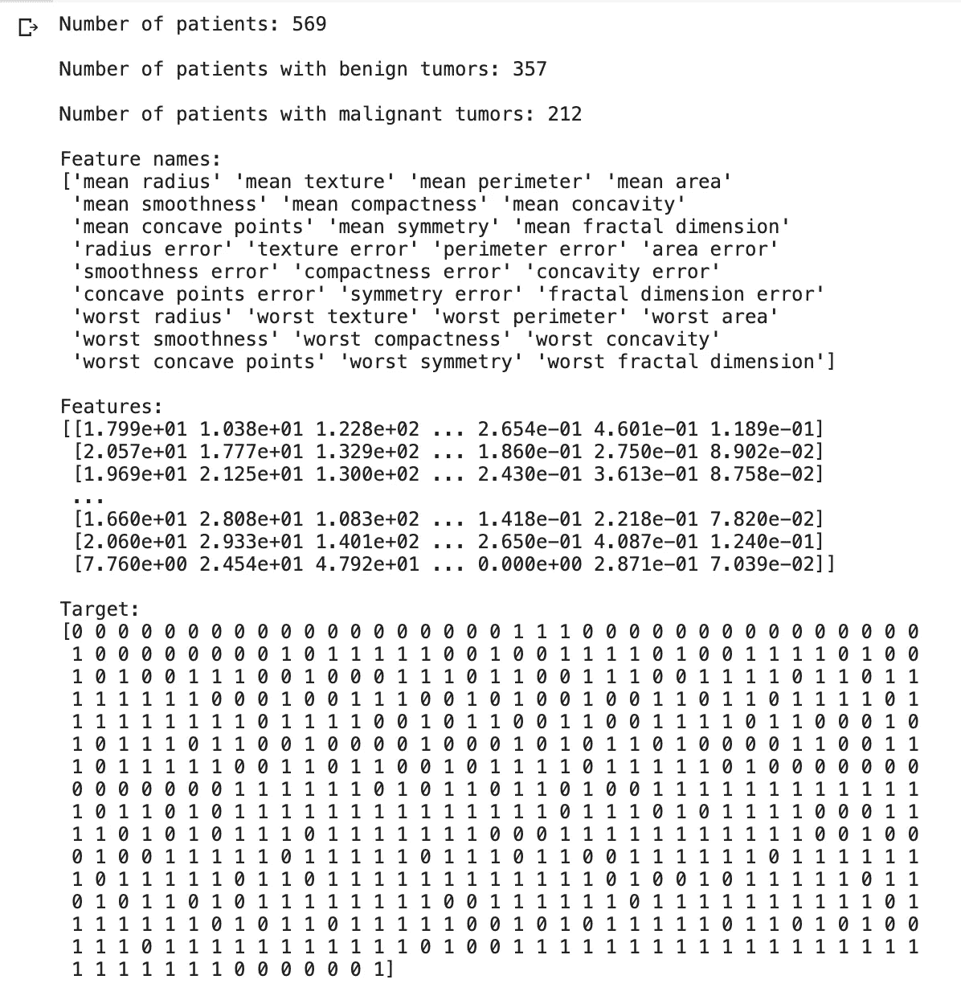
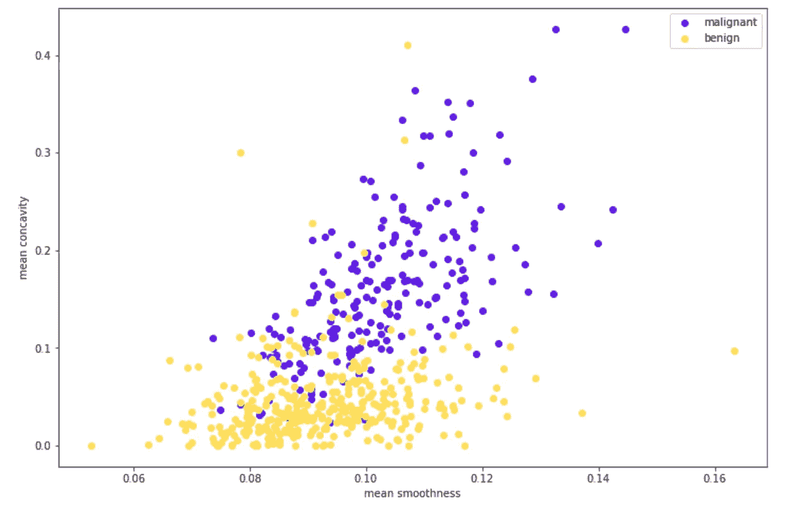
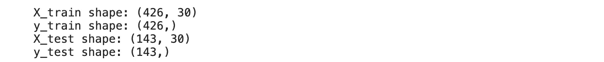
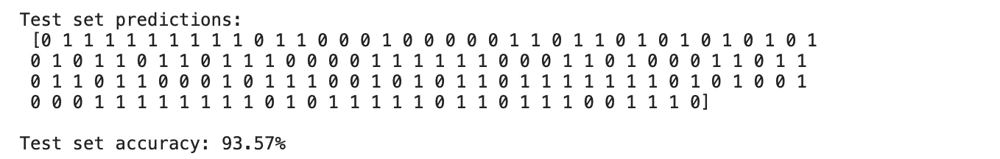
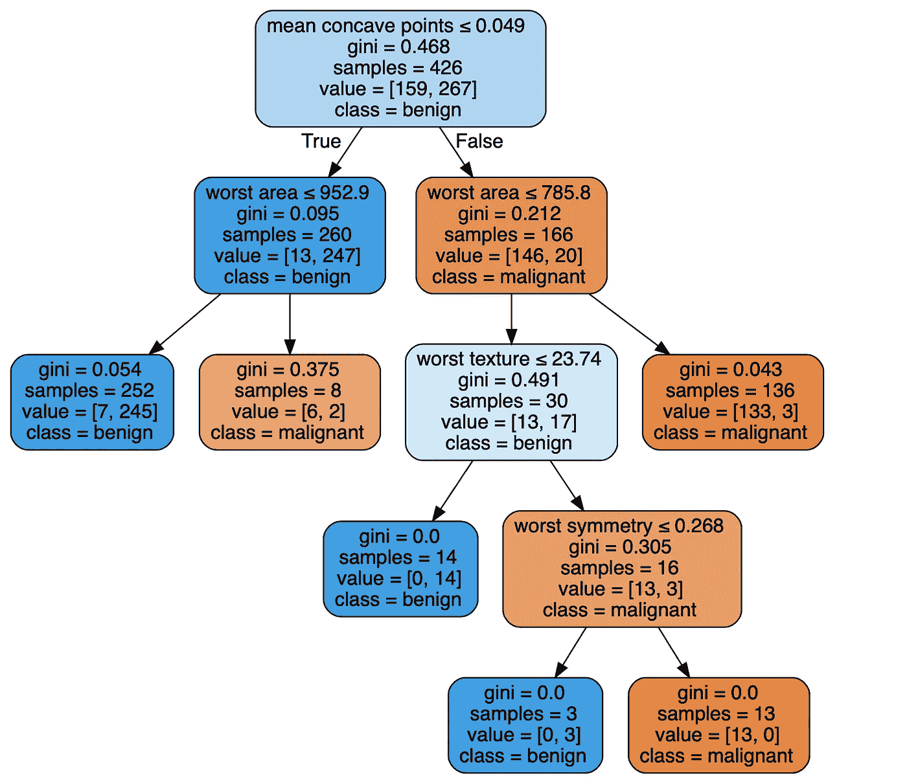

# 生物医学科学家机器学习导论——第二部分:实践教程

> 原文：<https://towardsdatascience.com/storytelling-machine-learning-intro-part-ii-hands-on-coding-tutorial-b3fc9dc8ae07?source=collection_archive---------25----------------------->

## 生物医学科学家的 ML 介绍:动手编码教程

图片来自 [Unsplash](https://unsplash.com/photos/rnr8D3FNUNY)

这是帖子[的第二部分，介绍生物医学科学家的机器学习](/storytelling-machine-learning-intro-d46e339cb6de)，它为生物医学科学家介绍了机器学习(ML)的概念。在本帖中，我们将获得使用生物医学数据的实践编码教程。

你可以在谷歌实验室[这里](https://colab.research.google.com/drive/1u30tFot_JROnrdZYB-yIhZQBcETefZAW?usp=sharing)轻松运行这个教程

我们将建立一个模型来预测乳腺肿块患者的诊断。我们将使用的[数据集](https://goo.gl/U2Uwz2)是由美国威斯康辛州麦迪逊市威斯康辛大学医院的医生威廉·h·沃尔伯格博士创建的。为了创建数据集，沃尔伯格博士使用了取自乳腺实性肿块患者的液体样本，并使用图形计算机软件来计算样本中细胞的特征。数据集包含 30 个像元特征，其中包括:

*   半径(从中心到周边各点的平均距离)
*   纹理(灰度值的标准偏差)
*   周长
*   区域
*   平滑度(半径长度的局部变化)
*   紧凑性(周长/面积— 1.0)
*   凹度(轮廓凹陷部分的严重程度)
*   凹点(轮廓凹陷部分的数量)
*   对称
*   分形维数(“海岸线近似值”-1)

**首先，让我们加载所有的包和数据集:**

输出:

[图片由作者提供]

如我们所见，该数据集包含 569 名患者，其中 212 名为恶性乳腺肿块，357 名为良性乳腺肿块。诊断(恶性/良性)编码在*目标*中，作为二进制指示器(即 0 代表恶性诊断，1 代表良性诊断)。

**现在让我们想象几个特征:**

输出:

[图片由作者提供]

我们在这里可以看到的一件事是，具有恶性诊断的患者倾向于具有较高凹度值(y 轴)的乳房肿块，而具有较低平滑度值(例如，低于 0.08；x 轴)倾向于良性诊断。看到这种情况，我们可能会想，‘嗯，我们可以探索所有的特征，并创建*边界*来对患者进行分类，对吗？".当然，我们有可能遍历所有的特征，并找到*边界*来分离这些组。但是如果我们有 100 个或者 1000 个特征呢？即使只有 30 个特征，这个过程也是棘手和耗时的。相反，让我们转向 ML 来为我们做这件事。我们将使用一个决策树分类器，它会自动执行这个过程。

**首先，我们将数据分成训练集和测试集:**

输出:

我们在训练集中有 426 名患者，在测试集中有 143 名患者。

**现在，我们实例化该模型，并使用三重交叉验证对其进行训练:**

**和我们在测试集中的表现:**

输出:

我们可以看到，测试集中 93.57%的患者被正确诊断

**我们可以看到为诊断患者而创建的树:**

输出:

[图片由作者提供]

在每一层上，该算法找到将患者分类成不同组的界限。在这种情况下，它从特征*开始表示凹点。*如果患者的*平均凹点* ≤ 0.049，则沿左侧路径，进入*良性*组，而*平均凹点>* 0.049 的患者则相反。在下一个级别，对每个组重复这个过程。这一过程被优化以最小化*基尼系数*。基尼系数是一个量化群体纯度的指标。大于零的基尼系数意味着包含在该节点内的样本属于不同的类别。基尼系数为零意味着该组是纯的，在该组中只存在一类样本。通过探索生成的决策树，我们能够解释算法做出的决策。

有了这个，我们就完事了！

**欢迎在评论区提出任何问题**