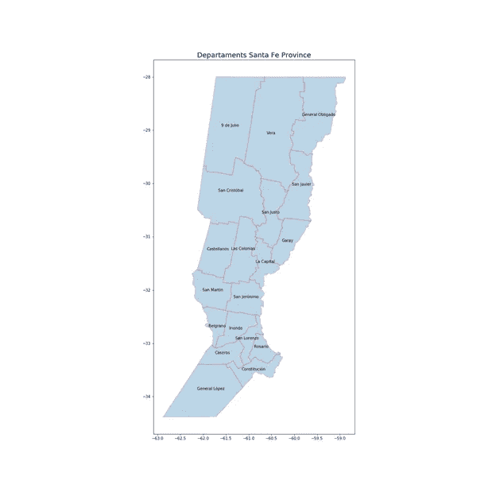
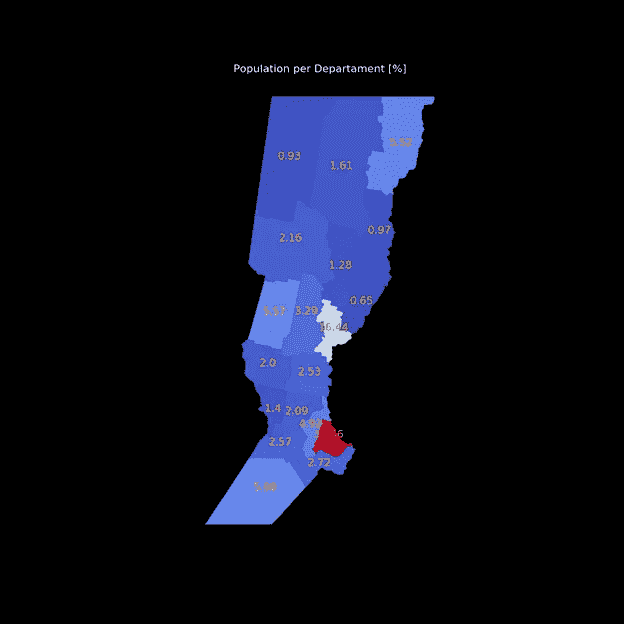
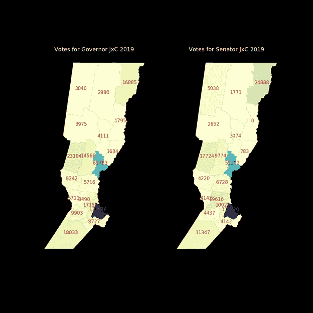
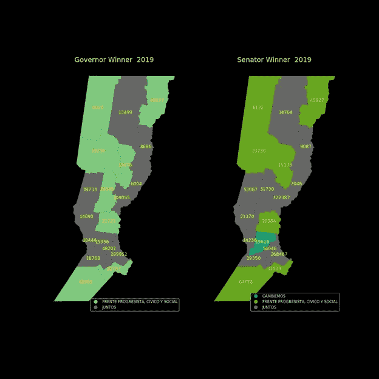
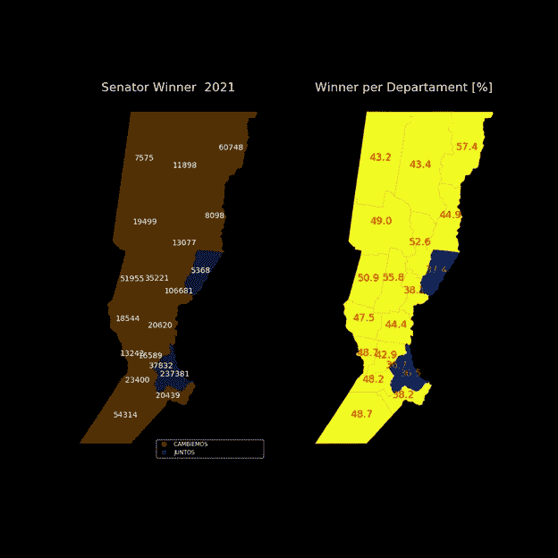

# 用地图讲故事:圣达菲省的选举

> 原文：<https://towardsdatascience.com/storytelling-with-maps-elections-in-santa-fe-province-69b5354e6400?source=collection_archive---------25----------------------->

## 地理空间数据开源免费软件


图片来自 Unsplash 的 Arnaud Jaegers

# **地图**

地图被定义为在二维表面上对一个区域的图形表示。它们还被定义为代表某一地区特征的示意图或布局，如其尺寸、坐标、地理特征或其他相关方面。我们通常称之为地方地图、地区地图、大陆地图或世界地图，这取决于所代表的地域范围。

根据其目的或功能，有不同类型的地图。我们对三种地图特别感兴趣:政治地图；人口地图；和专题地图。

**政治地图**:在这种类型的地图中，没有物理元素被表现出来，而是仅仅通过将地区划分为国家、自治区、省或者**部门**来表示领土的行政划分。

人口地图:这种类型的地图通过百分比、居民数量、统计或人口普查来研究人口。这些地图的研究对象可以是生育率、死亡率、迁徙运动或人口密度。

**专题地图**:它们是为了反映所定义的地理区域的特定方面而制作的。他们可以关注物理、社会、**、政治、**文化、经济、社会学以及任何其他与特定领域相关的变量。顾名思义，它们**是为特定的目的而设计的，或者是为了说明一个特定的主题。**在专题地图的制作中，一般地图用于为前者所描述的现象发生的位置提供准确的基线参考。

# **用 Python 绘制地图**

能够以简单的方式在地图上显示地理信息和专题信息，并且速度比桌面 GIS 更快，这使得许多数据科学家的工作变得更加容易。这可以通过几行 Python 代码并使用两个著名的库来实现，比如 matplotlib 和 geopandas。

Matplotlib 是一个面向数据可视化的扩展函数库。这个图书馆是由美国神经生物学家[约翰·d·亨特](https://en.wikipedia.org/wiki/John_D._Hunter)在其神经生物学博士后研究期间创建的，用于可视化[癫痫](https://en.wikipedia.org/wiki/Electrocorticography)患者的皮层脑电图数据。遗憾的是，亨特于 2012 年 8 月 28 日因结肠癌去世。

Matplotlib 是一个基于 Python 的*开源库*，已经成为数据科学 Python 用户使用最广泛的绘图库。受 **MATLAB** 的启发，Matplotlib 使用三个主要元素工作:*轴、图形、*和*图*。Matplotlib 有几个专门用于不同技术领域的模块，这推动了它越来越多的使用。

**Geopandas** 是另一个基于 Python 的*开源库*，其目标是方便使用**地理空间数据。** Geopandas 由[凯尔西·乔达尔](https://github.com/kjordahl)于 2013 年创立；他在 2014 年 7 月的一次 Scipy 会议上发布了 0.1.0 版本。该项目目前由乔里斯·范登博舍领导。

GeoPandas 以熊猫为原型。它扩展了 Pandas 数据类型，以包含几何列并执行空间操作。GeoPandas 依赖于几个库，如 [Shapely](https://pypi.org/project/Shapely/) ，它允许对与数据相关的几何图形执行地理空间操作， [Fiona](https://pypi.org/project/Fiona/) 用于文件访问，以及 **Matplotlib 用于绘图**。地理数据框架是主要的数据结构，扩展了著名的熊猫数据框架。

# **圣达菲省选举**

圣达菲是位于阿根廷**东北部的一个农业-工业省份。**面积 133，007 平方公里，人口(2010 年人口普查)33.69 亿。该省在政治上分为 **19 个省**。人口最多的两个城市是罗萨里奥省的罗萨里奥市(948，312 人，2010 年人口普查)和首都省的圣达菲市(484，000 人，2010 年人口普查)。

圣达菲是该国选民人数第三多的地区，有 2768525 人有资格投票，占总数的 8.06%，仅次于布宜诺斯艾利斯省(37%)和科尔多瓦省(8.69%)。

2021 年 11 月 14 日，举行大选，重新选举 9 名全国众议员和 3 名全国参议员。这是一次至关重要的选举，因为这可能意味着执政党在参议院中失去法定人数。

从历史上看，在最近的选举中，三个选举联盟在不同的省份占主导地位:1。- **进步阵线** (FAP)，社会民主取向；2.- **Cambiemos** (JxC)，自由民主取向；3.——**Frente de Todos**(FdeT，Juntos)，民族主义民粹主义取向。

让我们看看如何使用专题地图来说明最近的选举结果，并在 2019 年与之前的选举进行比较。

# **用地图讲故事**

我们使用了三个数据集:1 . [- *arg_adm2.shp* ，](https://www.ign.gob.ar/NuestrasActividades/InformacionGeoespacial/CapasSIG)阿根廷共和国各省地图(1)；2.-[*pobl _ deptos _ SF . CSV*](https://www.santafe.gov.ar/index.php/web/content/view/full/111738/(subtema)/93664)，圣达菲省各省居民(2)；3.-[*generales 2019 CSV . CSV*](https://www.santafe.gov.ar/tribunalelectoral/resultados-escrutinio-definitivo-elecciones-generales-2019/)，圣达菲省大选最终选举结果日期 06/16/2019 (3)。

首先，我们导入 pandas 库作为 *pd，* numpy 作为 *np* ，geopandas 作为 *gpd* ，matplotlib 作为 *plt:*

```
import pandas as pd
import numpy as np
import geopandas as gpd
import matplotlib.pyplot as plt 
```

我们使用命令 *geopandas.read_file()* 读取 ESRI 形状文件并返回一个*地理数据框架对象*。我们过滤了圣达菲省对应的数据，去掉了无用的列。然后我们做了一些编码、解码和替换的工作，因为西班牙语的口音有一些常见的问题:

```
## shapefile from Argentina
arg_sheip = gpd.read_file(path + 'ARG_adm2.shp')santa_fe = arg_sheip[arg_sheip.NAME_1 == 'Santa Fe']col_to_drop = ['ID_0', 'ISO', 'NAME_0',
               'TYPE_2', 'ENGTYPE_2', 'NL_NAME_2', 'VARNAME_2']santa_fe = santa_fe.drop(col_to_drop, axis = 1)santa_fe['NAME_2'].str.normalize('NFKD').str.encode('ascii', errors='ignore').str.decode('utf-8')santa_fe['NAME_2'] = santa_fe['NAME_2'].str.replace(u"San Martín", "San Martin")santa_fe['NAME_2'] = santa_fe['NAME_2'].str.replace('Nueve', '9')santa_fe['NAME_2'] = santa_fe['NAME_2'].str.replace(u"ó", "ó")
```

然后，我们在第二个数据集上使用 Pandas 进行 ETL(提取、转换、加载),并合并两个数据帧:

```
# file with province population
df_pop= pd.read_csv(path + 'pobl_deptos_SF.csv',
                   index_col = False, header = None, sep = ';',
                   skiprows = 8, skipfooter = 4, engine = 'python')df_pop.columns = ['NAME_2','Pop1', 'Pop2',
                  'Perc1', 'Perc2', 'Perc_Hab']df_pop['NAME_2'] = df_pop['NAME_2'].str.replace(u"San Martín", "San Martin")## merging dataframes
santa_fe2 = santa_fe.merge(df_pop, on = 'NAME_2')
```

因为我们想要指出每个部门的名称，所以我们使用 Shapely 的方法`[representative_point()](http://toblerity.org/shapely/manual.html#general-attributes-and-methods)`返回一个计算成本很低的点，该点保证在几何对象内。然后，我们向 geodataframe ( *['coords']* )添加一个新列，以便拥有一组与每个面对象(每个部门)相关的坐标。

由于 geopandas 提供了 matplotlib 库的接口，我们简单地使用了方法 *plot* ()来绘制地图。 *alpha* 参数控制不透明度，而 *edgecolor = 'r'* 用红色高亮显示部门的轮廓。

我们通过在新列(‘coords’)中遍历地理数据框架来包含相应的注释。

```
santa_fe2['coords'] =  santa_fe2['geometry'].apply(lambda x: x.representative_point().coords[:])santa_fe2['coords'] = [coords[0] for coords in santa_fe2['coords']]## First Map: Santa Fe, political subdivision of the province
f1, ax = plt.subplots(figsize =(18,18))santa_fe.plot(ax = ax, alpha = 0.3, edgecolor = 'r')ax.set_title("Departaments Santa Fe Province", fontsize = 18)##  Add annotations
for idx, row in santa_fe2.iterrows():
         plt.annotate(s=row['NAME_2'],xy=row['coords'],
                      horizontalalignment='center')
plt.show()
```

我们的第一张地图显示了该省的**政治分区**及其 19 个省，并带有相应的纬度和经度值。



图 1:作者用 Matplotlib 做的政治地图。

我们的第二张地图是人口分布图。Geopandas 通过使用 *plot()* 命令创建一个 choropleth，其中 column 参数设置为我们决定为其分配颜色值的列(下图中的 *column = 'Perc_Hab'* )。

我们设置 *legend = False* ，因为我们使用了注释来包含百分比的数值。cmap = 'coolwarm' 是一张**发散的彩色地图**以清楚地突出罗萨里奥和洛杉矶首都省组成了该省一半以上的选民。因为我们在第一张地图中显示了纬度和经度值，所以我们不需要再次显示它们，所以我们使用 *ax.set_axis_off()* 关闭它们。最后，我们决定使用深色背景以获得更好的视觉对比度。

```
## Second Map, Percentage of population in the departments
plt.style.use('dark_background')f2, ax = plt.subplots(figsize =(18,18))santa_fe2.plot(ax = ax, column = 'Perc_Hab', 
               legend = False, cmap = 'coolwarm')ax.set_title("Population per Departament [%]", fontsize = 22)
ax.set_axis_off()for idx, row in santa_fe2.iterrows():
    plt.annotate(s=row['Perc_Hab'], xy=row['coords'],
                 color = 'orange', size = 22,
                 horizontalalignment='center')plt.show()
```

我们的第二张地图显示了该省 19 个部门的人口密度:



图 2:作者用 Matplotlib 制作的人口分布图。

以下代码显示了 2019 年大选中三个主要联盟在该省不同部门的省长和参议员职位上获得的结果。

在读取了 *csv 文件*后，我们使用了 *groupby()* 方法和*。agg('sum')* 将各党在各部门获得的两类选票相加。我们再次执行了与包含地理空间数据的数据帧的合并。

```
## 2019 election results
df = pd.read_csv(path + 'generales2019CSV.csv',
                 index_col = False, header = 0,
                 sep = ';', engine='python')#...... Governor and Senator per Department & Political Partysum_df = df.groupby(['departamento', 'partido', 'nombrePartido'])
                     ['gobernador', 'senador'].agg('sum')df_sum = sum_df.reset_index()## Spanish stuff
df_sum['departamento'] = df_sum['departamento'].str.title()df_sum['departamento'] = df_sum['departamento'].str.replace(u"Constitucion",  "Constitución")df_sum['departamento'] = df_sum['departamento'].str.replace(u"San Cristobal", "San Cristóbal")df_sum['departamento'] = df_sum['departamento'].str.replace(u"San Jeronimo",  "San Jerónimo")df_sum['departamento'] = df_sum['departamento'].str.replace(u"Gral Lopez",    "General López")df_sum['departamento'] = df_sum['departamento'].str.replace(u"Gral Obligado", "General Obligado")df_sum['departamento'] = df_sum['departamento'].str.replace(u" De ",  " de ")santa_fe3 = pd.merge(santa_fe2, df_sum,
              left_on = 'NAME_2', right_on = ['departamento'],
              how = 'inner')
```

for 循环允许我们过滤三个投票最多的联盟，以便进一步绘制:

```
##.........votes per party per departament
year    = ' 2019'
list_part = [16,40,44]for partido in list_part:
    if   partido == 16:
         santa_fe4 = santa_fe3[santa_fe3.partido.isin([16])]
         sigla = ' FAP'
    elif partido == 40:
         santa_fe4 = santa_fe3[santa_fe3.partido.isin([40])]
         sigla = ' FdeT'
    elif partido == 44:
         santa_fe4 = santa_fe3[santa_fe3.partido.isin([44])]
         sigla = ' JxC'
    santa_fe4['coords'] = santa_fe4['geometry'].apply(lambda x: x.representative_point().coords[:])
   santa_fe4['coords'] = [coords[0] for coords in santa_fe4['coords']]## Third Map, governor: votes per party per departament
    f34, (ax1,ax2)  = plt.subplots(1,2, figsize =(14,14))
    col = 'gobernador'
    santa_fe4.plot(ax = ax1, column = col , legend = False, 
                   cmap = 'YlGnBu')
    ax1.set_title( "Votes for Governor" + sigla + year, 
                   fontsize = 18)
    ax1.set_axis_off()
    for idx, row in santa_fe4.iterrows():
        s =  f'{row[col]:.0f}'
        ax1.annotate(s, y=row['coords'],
                     horizontalalignment='center',
                     size = 15, color = 'red')## Fourth Map, senator: votes per party per departament
       col = 'senador'
       santa_fe4.plot(ax = ax2, column = col , 
                      legend = False, cmap = 'YlGnBu')
       ax2.set_title( 'Votes for Senator' + sigla + year, 
                      fontsize = 18)
       ax2.set_axis_off()
       for idx, row in santa_fe4.iterrows():
           s =  f'{row[col]:.0f}' 
           ax2.annotate(s,xy=row['coords'],
                        horizontalalignment='center',
                        size = 15, color = 'crimson')
       plt.show()
```

我们的第三和第四张地图显示了 2019 年 Cambiemos 联盟的票数。在第三张图中，我们使用州长的投票数来指定颜色强度。出于同样的目的，在第四个地图中，我们使用参议员的投票数列。



图 3:作者用 matplotlib 制作的 choropleth 图。

以下 choropleths 表示在 2019 年大选中哪个政党在每个省赢得了州长和参议员的职位。获得的票数包括在内。

现在我们使用了带有聚合函数*的 *groupby()* 方法。agg('max')* 用于列 *['gobernador']* 和 *['senador']* 。我们创建了两个新的数据框架，按部门列出了获胜者，并添加了一列获胜联盟的名称。**该新列将用于颜色分配。**

```
## Political party that won in each departmentdf_maxg = df_sum.groupby('departamento', as_index = False) 
                         ['gobernador'].agg('max')df_maxs = df_sum.groupby('departamento', as_index = False) 
                        ['senador'].agg('max') list_partg = []
for depart2 in df_maxg.index:
    for depart in df_sum.index: if (df_maxg['departamento'] [depart2] ==      
           df_sum['departamento'] [depart]): if (df_maxg['gobernador'] [depart2] == 
             df_sum['gobernador'] [depart]): part = df_sum['nombrePartido'][depart]           
         list_partg.append(part)df_maxg['partido'] = list_partglist_parts = []
for depart3 in df_maxs.index:
    for depart in df_sum.index: if (df_maxs['departamento'] [depart3] ==      
           df_sum['departamento'] [depart]): if (df_maxs['senador'] [depart3] == 
             df_sum['senador'] [depart]): part = df_sum['nombrePartido'][depart]           
         list_parts.append(part)df_maxs['partido'] = list_partssanta_fe5 = pd.merge(santa_fe2, df_maxg,
                     left_on = 'NAME_2', right_on = 'departamento'],
                     how = 'inner')
santa_fe5['coords']=santa_fe5['geometry'].apply(lambda x: x.representative_point().coords[:])santa_fe5['coords'] = [coords[0] for coords in santa_fe5['coords']]santa_fe6 = pd.merge(santa_fe2, df_maxs,
                     left_on = 'NAME_2',right_on= ['departamento'],
                     how = 'inner')santa_fe6['coords']=santa_fe6['geometry'].apply(lambda x: x.representative_point().coords[:])santa_fe6['coords'] = [coords[0] for coords in santa_fe6['coords']]
```

这些 chloropleths 包括**图例**标识每个部门的获胜联盟: *legend = True，marker = 'o '，legend_kwds={'loc ':'右下角' }。*

```
## Fifth and Sixth Maps, Political party that won in the departmentf56, (ax1,ax2) = plt.subplots(1,2, figsize =(14,14))santa_fe5.plot(ax = ax1, column = 'partido', marker = 'o',
               legend = True, categorical = True, cmap = 'Accent',
               legend_kwds={'loc': 'lower right'})ax1.set_title("Governor Winner " + year, fontsize = 18)
ax1.set_axis_off()col = 'gobernador'
for idx, row in santa_fe5.iterrows():
    s =  f'{row[col]:.0f}'
    ax1.annotate(s, xy=row['coords'],horizontalalignment='center',
                 size = 12, color = 'yellow')santa_fe6.plot(ax = ax2, column = 'partido', marker = 'o',
               legend = True, categorical = True, cmap = 'Dark2',
               legend_kwds={'loc': 'lower right'})ax2.set_title("Senator Winner " + year, fontsize = 18)
ax2.set_axis_off()col = 'senador'
for idx, row in santa_fe6.iterrows():
    s =  f'{row[col]:.0f}'
    ax2.annotate(s, xy=row['coords'],horizontalalignment='center',
                 size = 12, color = 'yellow')plt.show()
```



图 4:作者用 Matplotlib 制作的 choropleths 图。

圣达菲省政府尚未建立最近参议院选举正式结果的档案。因此，我们决定将 2021 年 11 月 14 日举行的选举结果手动纳入一个特定文件，以便与 2019 年的结果进行比较。

使用与前面描述的代码非常相似的代码，我们生成了两个 choropleths，一个显示每个部门的获胜者以及获得的选票，另一个显示每个部门获胜者联盟的百分比。



图 5:作者用 Matplotlib 制作的 choropleths 图。

可以清楚地观察到选民决定的深刻变化:Cambiemos 从 2019 年只赢得一个省，到最近的选举中赢得 16 个省。此外，执政联盟在其余三个省获胜，其中一个省是人口密度最高的省(罗萨里奥)，但他们的胜利是百分比值最低的省。最终结果显示，坎比埃莫斯获得 40.32%的选票，紧随其后的是 Juntos(东帝汶国防军)获得 32.20%的选票，FAP 获得 12.49%的选票。执政党失去了在参议院的法定人数。

**总结:**地图是最古老的呈现数据或讲述故事的手段之一。特别是根据观众容易理解的逻辑，用相同颜色或不同颜色的不同强度表示数据的色标。在本文中，我们打算讲述圣达菲省选民对阿根廷共和国参议院中代表他们的参议员的偏好发生深刻变化的故事。我们认为，一幅政治地图、一幅人口统计地图和几幅专题地图的结合，非常精确地传达了这个故事。

## **参考文献**

1.  IGN，Instituto geográFico Nacional(T4，阿根廷共和国国家地理研究所)，公共领域数据。
2.  圣菲省，2010 年全国人口普查:公共领域数据。
3.  圣达菲省选举法庭，result ados Escrutinio definitio Elecciones general 2019 年 6 月 16 日，*公共领域数据。*

如果你发现了这篇感兴趣的文章，请阅读我之前的(https://medium.com/@dar.wtz):

选举调查是用柱形图、堆积柱形图还是发散柱形图？

</election-surveys-with-plotly-50c904d730de>  

平行坐标图与 Plotly，规范化或标准化？

</parallel-coordinates-plots-with-plotly-dffe3f526c6b> 