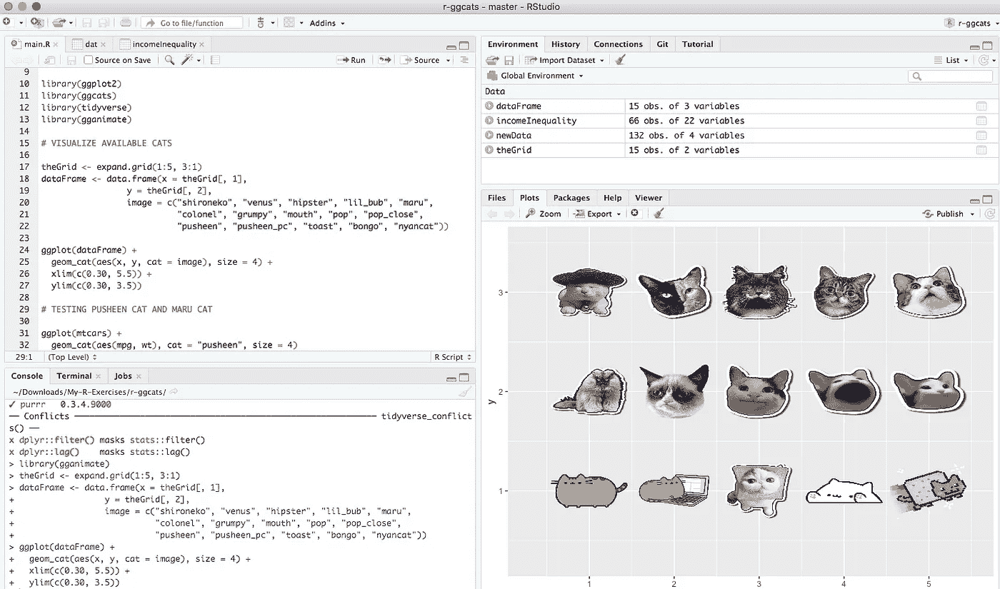
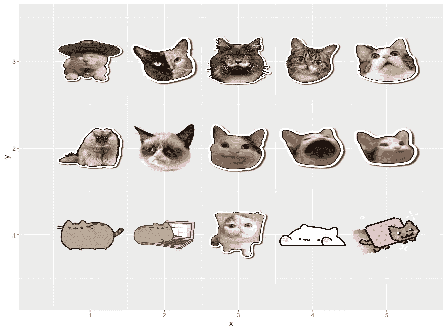
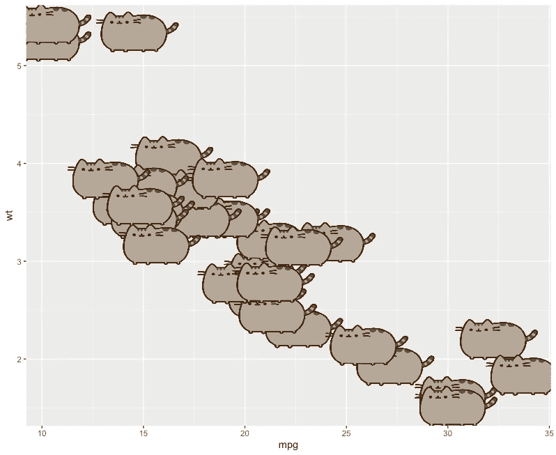
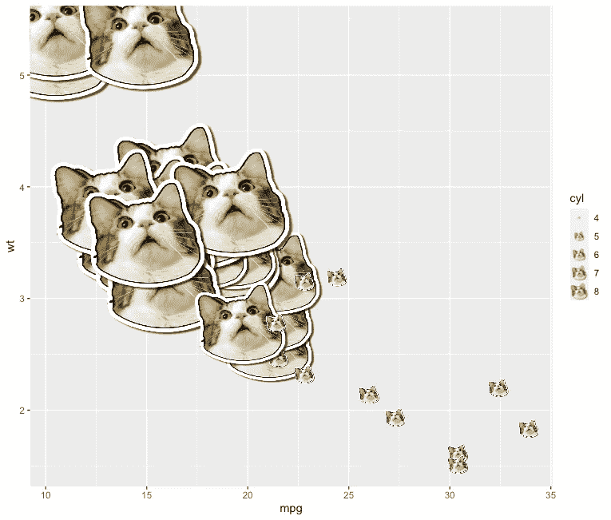
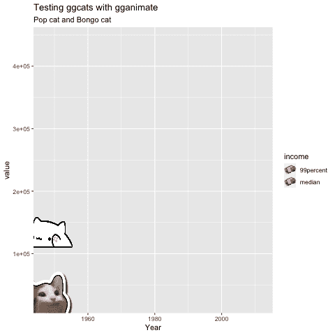

# 奇怪的事情:添加…猫？你在 R 上的阴谋

> 原文：<https://towardsdatascience.com/stranger-things-adding-cats-to-your-plots-on-r-9f46acb798bb?source=collection_archive---------14----------------------->

## 如何借助带有“ggcats”包的滑稽猫来分析和可视化数据



奇怪的事情:添加…猫？到您在 R-R studio 预览上的绘图(图片由作者提供)

许多人会认为统计分析不可能有趣。如你所知，如果你一直关注我发表的文章，你会注意到我试图分享实际的例子，但也很有趣。我开展的一项活动是教学，尤其是在今天，当我们大部分时间都在跳跃，突然一切都变得遥远时，要进行面对面的互动，需要付出额外的努力来保持学生的注意力。

你喜欢猫吗？你有一只作为宠物吗？如果我告诉你，在这些毛茸茸的朋友的帮助下，你可以让你的情节有所触动，你会对我说什么？

我想向您介绍 **"ggcats"** ，这是一个基于 **"geom_image"** 的有趣软件包，它可以帮助您在您的报告、演示和报告中保持观众的注意力，当然是非正式的。

# 软件包安装

在一个新的 R 脚本中使用它是非常容易的，首先，你必须从它的存储库中安装这个包。

```
# INSTALL GGCATS PACKAGE install.packages("remotes")
remotes::install_github("R-CoderDotCom/ggcats@main")
```

# 测试 ggcats

有十五种不同的小猫可以使用:“shironeko”、“venus”、“hipster”、“lil_bub”、“maru”、“colonel”、“grumpy”、“mouth”、“pop”、“pop_close”、“pusheen”、“pusheen_pc”、“toast”、“bongo”和“nyancat”(默认)。

您可以在一个网格中查看它们，首先查看每一个:

```
# LOAD LIBRARIESlibrary(ggplot2)
library(ggcats)
library(Ecdat)
library(tidyverse)
library(gganimate)# VISUALIZE AVAILABLE CATStheGrid <- expand.grid(1:5, 3:1)
dataFrame <- data.frame(x = theGrid[, 1],
                 y = theGrid[, 2],
                 image = c("shironeko", "venus", "hipster", "lil_bub", "maru", "colonel", "grumpy", "mouth", "pop", "pop_close", "pusheen", "pusheen_pc", "toast", "bongo", "nyancat"))ggplot(dataFrame) +
  geom_cat(aes(x, y, cat = image), size = 4) +
  xlim(c(0.25, 5.5)) + 
  ylim(c(0.25, 3.5))
```

你会发现这些都是世界各地流行的迷因中的著名小猫。



奇怪的事情:添加…猫？到 R 上的 plots 在 RStudio: grid 中生成的 Plot，用于可视化可用的猫(图片由作者提供)

# 如何将猫添加到你的情节中

你可以看到使用**“geom _ cat”**函数将它们添加到你的图中是非常容易的，例如，取 R 默认提供的数据，假设你想添加“Pusheen Cats”。

```
# TESTING PUSHEEN CAT AND MARU CATggplot(mtcars) +
  geom_cat(aes(mpg, wt), cat = "pusheen", size = 4)
```

你会得到如下图。



奇怪的事情:添加…猫？到 R 上的您的 plots 在 RStudio: pusheen cats 中生成的 plots(图片由作者提供)

或者说，你要加“丸猫”。

```
ggplot(mtcars) +
  geom_cat(aes(mpg, wt, size = cyl), cat = "maru")
```

现在你会得到一个如下图所示的图。



奇怪的事情:添加…猫？到 R 上的你的情节——在 RStudio: maru cats 中生成的情节(图片由作者提供)

# 更进一步…动画情节

你可以利用你有两只小猫的事实，一只张开嘴，另一只同样闭着嘴，玩 **gganimate** 包。例如:

```
# EXAMPLE GGCAT WITH GGANIMATElibrary(Ecdat)data(incomeInequality)newData <-
  incomeInequality %>%
  select(Year, P99, median) %>%
  rename(income_median = median,
         income_99percent = P99) %>%
  pivot_longer(cols = starts_with("income"),
               names_to = "income",
               names_prefix = "income_")newData$cat <- rep(NA, 132)newData$cat[which(newData$income == "median")] <- rep(c("pop_close", "pop"), 33)
newData$cat[which(newData$income == "99percent")] <- "bongo"ggplot(newData, aes(x = Year, y = value, group = income, color = income)) +
  geom_line(size = 2.5) +
  labs(title="Testing ggcats with gganimate", 
       subtitle = "Pop cat and Bongo cat") +
  geom_cat(aes(cat = cat), size = 6) +
  transition_reveal(Year)
```

你会得到如下的动画情节。



奇怪的事情:添加…猫？到 R 上的您的 plots 在 RStudio 中生成的 Plot:gg cats 和 gganimate(图片由作者提供)

剩下的就看你的创造力了，如你所见。我想继续写一些不寻常的事情，你仍然不知道你可以用 R 做什么，并继续写一系列这样的短文，让我知道你是否认为这是一个好主意。

非常感谢您的善意阅读。和我的大多数文章一样，在这里你可以找到完整的代码:[https://github.com/cosmoduende/r-ggcats](https://github.com/cosmoduende/r-ggcats)

感谢你坚持到最后，祝你分析非常愉快，可以把一切都付诸实践，对结果感到惊讶，和我一样开心！