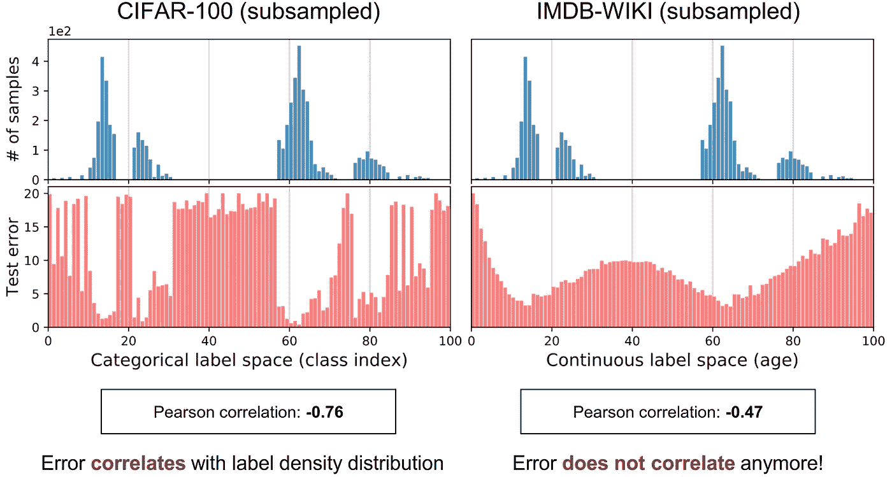

# 不平衡数据回归的策略和方法

> 原文：<https://towardsdatascience.com/strategies-and-tactics-for-regression-on-imbalanced-data-61eeb0921fca?source=collection_archive---------2----------------------->

(图片由作者提供)

## [思想和理论](https://towardsdatascience.com/tagged/thoughts-and-theory)

## 深入探究深度不平衡回归(ICML 2021，龙口述)

给大家介绍一下我们的最新作品，已经被 ICML 2021 接受为 ***长篇口述*** 展示: [**深度挖掘不平衡回归**](https://arxiv.org/abs/2102.09554) 。在经典的数据不平衡问题下，本工作探索了一个非常实用但很少研究的问题:**不平衡回归**。现有的处理不平衡数据的方法大多只针对分类问题——即目标值是不同类别的离散指标；然而，许多实际任务涉及**连续**，有时甚至**无限**目标值。这项工作提升了传统不平衡分类问题的范式，将数据不平衡问题从**离散**目标扩展到**连续**目标。

我们不仅提出了两种简单而有效的方法来提高不平衡回归问题的模型性能，而且还为计算机视觉、自然语言处理和医疗保健领域的常见现实任务建立了五个新的基准不平衡回归数据集。代码、数据和模型已经在 GitHub 上开源:[https://github.com/YyzHarry/imbalanced-regression](https://github.com/YyzHarry/imbalanced-regression)。

首先，我想先总结一下本文的主要贡献:

*   **新任务**:我们正式定义了现实环境中出现的*深度不平衡回归(DIR)* 任务。DIR 旨在从具有连续目标的不平衡数据中学习，处理某些区域的潜在缺失数据，并推广到整个目标范围。
*   **新技术**:我们开发了两种简单、有效、可解释的 DIR 寻址算法:*标签分布平滑(LDS)* 和*特征分布平滑(FDS)* ，它们利用了标签和特征空间中邻近目标之间的相似性。
*   **新基准**:我们为*计算机视觉*、*自然语言处理*和*医疗保健*中常见的现实世界任务策划和基准测试大规模 DIR 数据集。它们的范围从*单值*预测，如年龄、文本相似性得分、健康状况得分，到*密集值*预测，如深度。新的数据集可以支持实际评估，并有助于不平衡回归的未来研究。

接下来，我们将进入正文。我将首先介绍非平衡回归问题的背景(与非平衡分类相比)，以及目前的一些研究现状。那我就介绍一下我们的思路和方法，省略不必要的细节。

# 背景和动机

数据不平衡在现实世界中是普遍存在和固有的。数据不是在每个类别上保持理想的均匀分布，而是经常呈现带有长尾的偏斜分布，其中某些目标值的观察值明显较少。这种现象给深度识别模型带来了巨大的挑战，并激发了许多解决数据不平衡的现有技术。

特别是过去的解决方案大致可以分为*基于数据的*和*基于模型的*解决方案。基于数据的解决方案要么对少数类进行过采样，要么对多数类进行欠采样，例如 SMOTE 算法，该算法通过对同一类中的样本进行线性插值来为少数类生成合成样本。基于模型的解决方案包括重新加权、调整损失函数和利用相关的学习范式，如迁移学习、元学习和两阶段训练。更详细的回顾可以在我的[上一篇文章](/struggling-with-data-imbalance-semi-supervised-self-supervised-learning-help-4de8b8f23490)中找到。

然而，现有的从不平衡数据中学习的解决方案集中在具有**分类指数**的目标上，基本上目标是**不同的类别**。例如，下图显示了一个用于地点分类的典型真实数据集，该数据集是不平衡的，具有长尾标注分布，并且标注是不同的类，例如住宅、森林和博物馆。类似地，一个用于物种分类的现实世界不平衡数据集，称为 iNaturalist，目标也是分类的，并且具有硬边界，不同类别之间没有重叠。

现有的不平衡学习方案主要针对具有类别索引的目标。目标具有硬边界，不同类别之间没有重叠。(图片由作者提供)

然而，许多现实世界的任务可能涉及**连续**，有时甚至**无限**的目标值。例如，在视觉应用中，人们经常需要根据不同人的视觉外观来推断他们的年龄。在这里，年龄是一个连续的目标，在整个目标范围内可能是高度不平衡的。例如，这里有一个真实世界的年龄估计数据集，它在不同年龄之间有一个倾斜的标签分布。在这种情况下，将不同的年龄视为不同的阶层不太可能产生最好的结果，因为它没有利用年龄相近的人之间的相似性*。*

左图:一个计算机视觉应用程序，我们根据不同人的视觉外观来推断他们的年龄。右图:大规模年龄估计数据集 IMDB-WIKI 在不同年龄之间存在偏态标签分布。(图片由作者提供)

类似的问题也发生在医疗应用中，我们希望推断患者人群中不同的健康指标，如心率、血压和氧饱和度。这些指标也是连续的，并且通常在患者人群中有偏斜的分布。

不平衡回归问题在医疗保健领域也很常见。左图:大多数健康指标，如心率、血压和氧饱和度，都是连续的目标，通常在患者群体中高度不平衡。右图:真实世界数据集 SHHS 的健康状况评分的偏态标签分布。(图片由作者提供)

此外，许多重要的现实世界应用(如经济学、危机管理、故障诊断或气象学等。)也有类似的要求。在这些应用中需要预测的连续目标变量往往有许多罕见的极值。这种连续域中的不平衡问题在线性和深度模型中都存在。在深度模式下更为严重。这是为什么呢？因为神经网络预测往往过于自信，而这种数据失衡问题被严重放大。

因此，在这项工作中，我们定义并研究了*深度不平衡回归(DIR)* ，从这种具有连续目标的不平衡数据中学习。具体而言，给定具有连续目标值的数据集，DIR 旨在从这种具有不平衡和偏斜分布的数据中学习，处理某些目标区域的潜在缺失数据，并推广到整个支持的目标范围。特别是，我们感兴趣的是推广到在连续目标值的整个范围内平衡的测试集，这为 DIR 提供了全面和无偏见的评估。这也符合不平衡分类的设置。

深度不平衡回归(DIR)旨在从具有连续目标的不平衡数据中学习，处理某些区域的潜在缺失数据，并推广到整个目标范围。(图片由作者提供)

# 不平衡回归的挑战

然而，我们注意到，DIR 带来了不同于其分类对应物的新挑战。

**(I)** 首先，给定连续且潜在无限的目标值，**类之间的硬边界不再存在**。当直接应用诸如重新采样和重新加权的传统不平衡分类方法时，这可能导致模糊。

**(II)** 此外，**连续标签固有地拥有目标之间有意义的距离**，这暗示了我们应该如何解释连续设置中的数据不平衡。例如，假设有两个目标标签 *t1* 和 *t2* ，它们在训练数据中都有同样少量的观察值。然而， *t1* 处于高代表邻域，如图所示其邻域范围内样本较多，而 *t2* 处于弱代表邻域。在这种情况下， *t1* 不会遭受与 *t2* 相同水平的不平衡。

连续标记固有地拥有目标之间有意义的距离，这暗示了我们应该如何解释连续设置中的数据不平衡。例如，即使 t1 和 t2 具有相同数量的观察值，t1 也不会遭受与 t2 相同程度的不平衡。(图片由作者提供)

**(III)** 最后，与分类问题不同，在 DIR 中，**某些目标值可能根本没有数据**，这也激发了对目标**外推**和**插值**的需求。

在不平衡回归中，某些目标值可能根本没有数据，这也激发了对目标外推和内插的需求。(图片由作者提供)

综上所述，与传统的不平衡分类相比，DIR 有着新的困难和挑战。那么，应该如何进行深度不平衡回归呢？在接下来的两个部分中，我们提出了两种简单有效的方法，分别是标签分布平滑(LDS)和特征分布平滑(FDS ),通过利用在**标签空间**和**特征空间**中附近目标之间的相似性。

# 标签分布平滑(LDS)

我们首先展示一个例子来说明当不平衡出现时分类和回归之间的区别。

**激励示例**:我们采用了两个不同的数据集，(1) CIFAR100，这是一个 100 类分类数据集，以及(2)IMD b-WIKI 数据集，这是一个大规模图像数据集，用于根据视觉外观进行年龄估计。这两个数据集具有本质上不同的标签空间:CIFAR-100 展示了**分类标签空间**，其中目标是类别索引，而 IMDB-WIKI 具有**连续标签空间**，其中目标是年龄。我们将年龄范围限制为 0~99，以便两个数据集具有相同的标签范围。此外，我们对两个数据集进行二次抽样，以模拟数据不平衡，同时确保它们具有完全相同的标签密度分布。我们使两个测试集平衡。

(图片由作者提供)

然后，我们在两个数据集上训练一个简单的 ResNet-50 模型，并绘制它们的测试误差分布。如第一幅图所示，在 CIFAR-100 上，我们观察到**误差分布实际上与标签密度分布**相关。具体而言，作为类别索引函数的测试误差与分类标签空间中的标签密度分布(即 0.76)具有高度负皮尔逊相关性。这种现象是意料之中的，因为拥有更多样本的多数班比少数班学得更好。

(图片由作者提供)

然而有趣的是，IMDB-WIKI 的误差分布非常不同，它具有**连续的**标签空间，即使标签密度分布与 CIFAR-100 相同。特别是，误差分布更加平滑，并且**不再与**和标签密度分布(0.47)相关。

这种现象表明，对于连续标签，经验标签密度不能准确反映模型或神经网络所看到的不平衡。因此，在连续的情况下，经验标签分布不能反映真实的标签密度分布。这是因为邻近标签处的数据样本之间的相关性(例如，接近年龄的图像)。

**标签分布平滑(LDS)** :事实上，在统计学中有一个重要的文献是关于在这种情况下如何估计期望密度的。因此，标签分布平滑(LDS)提倡使用核密度估计来学习对应于连续目标的数据集中的有效不平衡。给定连续的经验标签密度分布，LDS 将对称核 *k* 与经验密度分布卷积，以提取核平滑版本，该版本考虑了附近标签的数据样本的信息重叠。由 LDS 计算得到的有效标签密度分布与现在的误差分布有很好的相关性，Pearson 相关系数为 0.83。这表明 LDS 抓住了影响回归问题的真正不平衡。

(图片由作者提供)

既然有效标签密度是可用的，用于解决类不平衡问题的技术可以直接适用于 DIR 上下文。例如，一种直接的适应可以是成本敏感的重新加权方法，其中我们通过将损失函数乘以每个目标的 LDS 估计标签密度的倒数来重新加权损失函数。

# 特征分布平滑(FDS)

我们已经证明了可以有效地利用标签空间中的连续性来寻址 DIR。我们进一步受到直觉的激励，即目标空间中的**连续性应该在特征空间**中产生相应的连续性。也就是说，如果模型工作正常并且数据平衡，人们期望对应于附近目标的**特征统计**彼此接近。同样，我们用一个说明性的例子来强调数据不平衡对 DIR 中特征统计的影响。

**激励示例**:同样，我们使用在 IMDB-WIKI 数据集中的图像上训练的简单模型来从视觉外观推断一个人的年龄。我们关注已学习的特征空间，即图中的 *z* 。我们为标签空间引入了一个额外的结构来进行分析，其中我们将它分成具有相等间隔的仓。我们使用 *b* 来表示目标值的组索引。这里，在年龄估计中，箱的长度被定义为 1，表示感兴趣的最小年龄差为 1。现在，使用这种结构，我们将具有相同目标值的要素分组到相同的条柱中。然后，我们针对每个箱中的数据计算特征统计量(即，**均值**和**方差**)。

(图片由作者提供)

现在我们准备好可视化特征统计之间的相似性。首先，我们选择一个锚仓，表示为 *b0* ，并且我们有这个锚仓的特征统计。此外，我们还计算了其他面元的统计量，最后，我们计算了 *b0* 和所有其他面元之间的特征统计量的**余弦相似度**，并汇总了锚年龄的结果，如下图所示为 30。该图还使用紫色、黄色和粉红色显示了具有不同数据密度的区域。

(图片由作者提供)

有趣的是，我们发现锚仓周围的特征统计与它们在锚仓的值高度相似。具体来说，25 至 35 岁之间的所有箱的*特征均值*和*特征方差*的余弦相似性与它们在 30 岁(锚年龄)时的值相差几个百分点。我们注意到仓 30 处的锚年龄落在多次拍摄区域中。因此，该图证实了当有足够数据时**的直觉，并且对于连续目标，特征统计类似于附近的面元**。

然而，有趣的是，该图还显示了数据样本非常少的地区的问题，如年龄范围为 0 至 6 岁的地区。请注意，这个范围内的平均值和方差显示出与 30 岁时出乎意料的高相似性。**这种不合理的相似性是由于数据不平衡**。具体来说，由于没有足够的 0 到 6 岁的图像，因此该范围从具有最大数据量的范围(大约 30 岁的范围)继承其先验。

**特征分布平滑(FDS)** :受这些观察的启发，我们提出了特征分布平滑(FDS)，它在特征空间上执行分布平滑，基本上在附近的目标箱之间转移特征统计。该程序旨在校准特征分布*的潜在有偏估计，尤其是针对代表性不足的目标*。因此，我们有了一个将输入数据映射到连续预测的模型。现在，通过首先估计每个箱的统计来执行 FDS。不失一般性，我们用协方差代替方差来反映 *z* 内特征元素之间的关系。给定特征统计，我们再次采用对称核 *k* 来平滑特征**均值**和**协方差**在目标仓上的分布。这导致统计数据的平滑版本。现在，有了估计和平滑的统计数据，我们就可以按照标准的**白化和重着色**过程来校准每个输入样本的特征表示。通过在最终特征地图后插入一个**特征校准层**，FDS 的整个管道被集成到深度网络中。最后，为了在训练期间获得特征统计的更稳定和准确的估计，我们采用跨每个时期的运行统计的动量更新。

(图片由作者提供)

我们注意到，FDS 可以与任何神经网络模型相结合，以及任何过去在改善标签不平衡方面的工作。

# 基准 DIR 数据集和实验

为了支持不平衡回归方法的实际评估，并促进未来的研究，我们策划了五个 DIR 基准，涵盖**计算机视觉**、**自然语言处理**和**医疗保健**。它们从单值预测(如年龄、文本相似性得分、健康状况得分)到密集值预测(如深度)不等。

策划了五个基准 DIR 数据集。(图片由作者提供)

*   **IMDB-WIKI-DIR (vision，age)** :第一个叫做 IMDB-WIKI-DIR，包含人脸图像和对应的年龄，用于年龄估计。我们使验证和测试集达到平衡。
*   **AgeDB-DIR(视力，年龄)**:类似地，第二个数据集，称为 AgeDB-DIR，也是根据单个输入图像的年龄估计。请注意，AgeDB-DIR 的标签分布不同于 IMDB-WIKI-DIR，即使它们展示了相同的任务。
*   **NYUD2-DIR (vision，depth)** :此外，尽管是单个目标值预测，我们也采用 NYU2 数据集进行深度估计，这是一个密集值预测任务，并为不平衡回归评估建立 NYUD2-DIR 数据集。
*   **STS-B-DIR (NLP，文本相似度得分)**:我们还构造了一个 NLP 领域的 DIR 基准，叫做 STS-B-DIR。任务是推断两个输入句子之间的语义文本相似度得分。分数在 0 到 5 的范围内是连续的，并且具有不平衡的分布。
*   **SHHS-DIR(医疗保健，健康状况评分)**:最后，我们在医疗保健领域创建了一个 DIR 基准，称为 SHHS-DIR。任务是推断一个总的健康分数，该分数在 0 到 100 之间连续分布，分数越高，健康状况越好。输入是每个患者在整个晚上睡眠期间的高维多导睡眠图信号，包括 ECG 信号、EEG 信号和呼吸信号。如图所示，分数分布也不均衡。

所有的数据和模型都在 [**我们的 GitHub repo**](https://github.com/YyzHarry/imbalanced-regression) 开源。在评估过程中，我们在平衡的测试集上评估每种方法的性能。我们进一步将目标空间分成几个不相交的子集:多镜头、中镜头和少镜头区域，反映训练数据中不同数量的样本。对于基线，由于文献中只有一些关于 DIR 的建议，除了过去使用合成样本的非平衡回归工作，我们采用了一些非平衡回归分类方法，并提出了*一组强基线*(有关更多详细信息，请参考[我们的论文](https://arxiv.org/abs/2102.09554))。

**实验**:由于实验较多，这里只展示 IMDB-WIKI-DIR 上有代表性的结果(所有结果请参考[论文](https://arxiv.org/abs/2102.09554))。我们首先根据使用的基本策略将不同的方法分为 4 个部分。在每个组中，我们进一步将 LDS、FDS 以及 LDS 和 FDS 的组合应用于基线方法。最后，我们报告了 LDS+FDS 相对于普通模型的绝对改进。如表所示，无论使用哪种基础训练技术，LDS 和 FDS 都取得了显著的成绩。特别是，对于少炮区域，我们可以通过**获得比基线模型**多 40%的相对改进。

(图片由作者提供)

**理解 FDS** 的分析:我们仔细看看 FDS，分析它是如何影响网络训练的。类似于之前的设置，我们绘制锚年龄为 0 的特征统计相似性。如图所示，由于目标箱 0 中的样本非常少，特征统计可能具有较大的偏差，即年龄 0 与区域 40≁80 具有较大的相似性。相比之下，当添加 FDS 时，统计数据得到更好的校准，导致仅在其邻域中具有高相似性，并且随着目标值变大，相似性得分逐渐降低。我们在训练期间进一步可视化运行统计和平滑统计之间的 L1 距离。有趣的是，随着训练的进行，平均 L1 距离**变得越来越小，并逐渐减少**。这表明模型学习生成即使没有平滑也更准确的特征，并且最终可以在推断期间移除平滑模块。

(图片由作者提供)

**外推分析&插值**:最后，在现实世界的 DIR 任务中，某些目标值**可以根本没有数据**。例如，回想一下 SHHS-DIR 和 STS-B-DIR 基准测试中的标签分布。这激发了对目标外推和内插的需求。我们从 IMDB-WIKI-DIR 的训练集中筛选出几个子集，这些子集在某个区域没有训练数据，但是在原始测试集上进行评估，用于零镜头泛化分析。这里，我们将我们的方法相对于普通模型的绝对 MAE 增益可视化。如上所述，我们的方法提供了对多、中、少以及零触发区域的综合处理，在整个频谱上实现了显著的性能增益，并且对不同的不平衡标签分布是鲁棒的。

(图片由作者提供)

# 结束语

在这篇文章的结尾，我们提出了(1)一个称为深度不平衡回归的**新任务**，和(2) **新技术**，标签分布平滑和特征分布平滑，以解决具有连续目标的学习不平衡数据，和(3)五个**新基准**以促进未来的研究。也请查看我们的代码、数据和论文。感谢您的聆听。我们的工作填补了实际不平衡回归问题的基准和技术的空白。这些结果可能会引起更广泛的不同应用领域的兴趣。最后，我附上了几个与本文相关的链接；感谢阅读！

**代码**:[https://github.com/YyzHarry/imbalanced-regression](https://github.com/YyzHarry/imbalanced-regression)

**项目页面**:http://dir.csail.mit.edu/