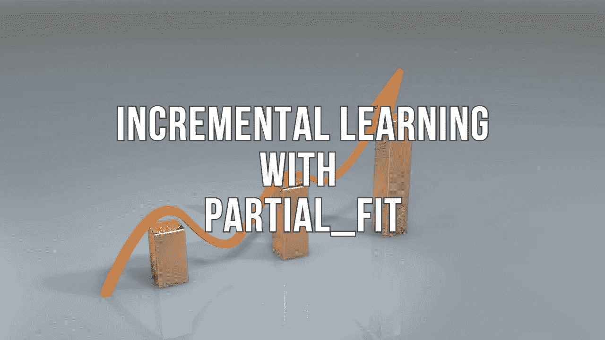

# 如何使用 Scikit-learn 训练内存不足的数据

> 原文：<https://towardsdatascience.com/strategies-to-train-out-of-memory-data-with-scikit-learn-7b2ed15b9a80?source=collection_archive---------10----------------------->

## 使用 partial_fit API 进行增量学习的基本指南

图片来自 [PublicDomainPictures](https://pixabay.com/users/publicdomainpictures-14/?utm_source=link-attribution&amp;utm_medium=referral&amp;utm_campaign=image&amp;utm_content=163464) 来自 [Pixabay](https://pixabay.com/?utm_source=link-attribution&amp;utm_medium=referral&amp;utm_campaign=image&amp;utm_content=163464)

Scikit-learn 是数据科学社区中流行的 Python 包，因为它提供了各种[分类](https://en.wikipedia.org/wiki/Statistical_classification)、[回归](https://en.wikipedia.org/wiki/Regression_analysis)和[聚类](https://en.wikipedia.org/wiki/Cluster_analysis)算法的实现。人们可以使用 scikit-learn 包用几行 Python 代码训练一个分类或回归机器学习模型。

Pandas 是另一个流行的 Python 库，它在将数据提供给 scikit-learn 模型之前提供对数据的处理和预处理。人们可以使用 Pandas 和 Scikit-learn 包轻松处理和训练内存中的数据集(可以放入 RAM 内存的数据)，但当处理大型数据集或内存外的数据集(无法放入 RAM 内存的数据)时，它会失败，并导致内存问题。

Scikit-learn 提供了 API 选项，如`**warm_start**`和`**partial_fit**` 来扩展计算。在本文中，我们将讨论如何读取、处理和训练内存不足的数据集。

# 什么时候需要增量学习？

对于机器学习任务来说，新的一批数据随着时间的推移而出现，用以前和新的一批数据重新训练模型是一个计算量很大的过程。因此，人们可以采用增量学习方法，而不是用整个数据集来重新训练模型，其中将恢复模型的过去学习，并用新的一批数据来训练相同的模型。

此外，对于内存不足(大型)的数据集，不可能一次将整个数据加载到 RAM 中，可以分块加载数据，并为每个数据块拟合训练模型。

# 部分拟合:

为了执行增量学习，Scikit-learn 附带了 partial_fit API 选项，它能够从一批实例中进行增量学习。当整个数据集太大而无法一次放入内存时,`partial_fit`非常有用。该方法预计将在数据集的不同块上连续调用几次，以便实现核外学习。

`partial_fit`具有一定的数值稳定性和性能开销，因此建议对相当大批量的数据(适合内存)调用 partial_fit 函数，以克服开销的限制。

## 实施:

其思想是以块的形式读取大型数据集(第 8 行),并对每个数据块执行特征工程。此外，使用具有逻辑回归模型的增量学习(第 11 行)来训练每个单独的数据块。

(作者代码)

对于分类任务，必须将可能的目标类标签列表传递给`**classes**`参数，以处理第一批数据中未出现的目标类。

实施`partial_fit`所带来的估算器列表如下:

*   分类:[多项式分类器](https://scikit-learn.org/0.15/modules/generated/sklearn.naive_bayes.MultinomialNB.html#sklearn.naive_bayes.MultinomialNB)，[伯努利分类器](https://scikit-learn.org/0.15/modules/generated/sklearn.naive_bayes.BernoulliNB.html#sklearn.naive_bayes.BernoulliNB)，[SGD 分类器](https://scikit-learn.org/0.15/modules/generated/sklearn.linear_model.SGDClassifier.html#sklearn.linear_model.SGDClassifier)，[被动积极分类器](https://scikit-learn.org/0.15/modules/generated/sklearn.linear_model.PassiveAggressiveClassifier.html#sklearn.linear_model.PassiveAggressiveClassifier)，[感知器](https://scikit-learn.org/0.15/modules/generated/sklearn.linear_model.Perceptron.html#sklearn.linear_model.Perceptron)
*   回归: [SGDRegressor](https://scikit-learn.org/0.15/modules/generated/sklearn.linear_model.SGDRegressor.html#sklearn.linear_model.SGDRegressor) ，[passiveaggressiverregressor](https://scikit-learn.org/0.15/modules/generated/sklearn.linear_model.PassiveAggressiveRegressor.html#sklearn.linear_model.PassiveAggressiveRegressor)
*   聚类:[迷你批处理方式](https://scikit-learn.org/0.15/modules/generated/sklearn.cluster.MiniBatchKMeans.html#sklearn.cluster.MiniBatchKMeans)
*   分解:[minibatchdictionaryllearning](https://scikit-learn.org/0.15/modules/generated/sklearn.decomposition.MiniBatchDictionaryLearning.html#sklearn.decomposition.MiniBatchDictionaryLearning)，[minibatchkman](https://scikit-learn.org/0.15/modules/generated/sklearn.cluster.MiniBatchKMeans.html#sklearn.cluster.MiniBatchKMeans)

## “温暖状态”和“部分适合”有什么不同？

如前所述，`**partial_fit**` API 用于对小批量数据进行增量学习，保持估计器常数的超参数。另一方面，`**warm_state**` 不用于增量学习，因为它是在估计器的超参数变化的相同数据集上训练的。

**根据**[**Scikit-学会文档**](https://scikit-learn.org/stable/glossary.html#term-warm_start) **:**

> `[**partial_fit**](https://scikit-learn.org/stable/glossary.html#term-partial_fit)`也保留了调用之间的模型，但是有所不同:在`[**warm_start**](https://scikit-learn.org/stable/glossary.html#term-warm_start)`中，参数会改变，而对`**fit**`的调用之间的数据(或多或少)是恒定的；使用`**partial_fit**`，小批量的数据变化和模型参数保持不变。

# 结论:

`**partial_fit**`是一个方便的 API，可用于在小批量的内存不足数据集上执行增量学习。使用`**warm_state**`的主要目的是在用不同组的超参数值拟合同一数据集时减少训练时间。通过重用从先前的参数值学习的模型的方面，它可以用于优化网格搜索实现。

# 参考资料:

[1.] Scikit-Learn 文档:[https://sci kit-Learn . org/0.15/modules/scaling _ strategies . html](https://scikit-learn.org/0.15/modules/scaling_strategies.html)

*喜欢这篇文章吗？成为* [*中等会员*](https://satyam-kumar.medium.com/membership) *继续无限制学习。如果你使用下面的链接，我会收到你的一小部分会员费，不需要你额外付费。*

<https://satyam-kumar.medium.com/membership>  

> 感谢您的阅读