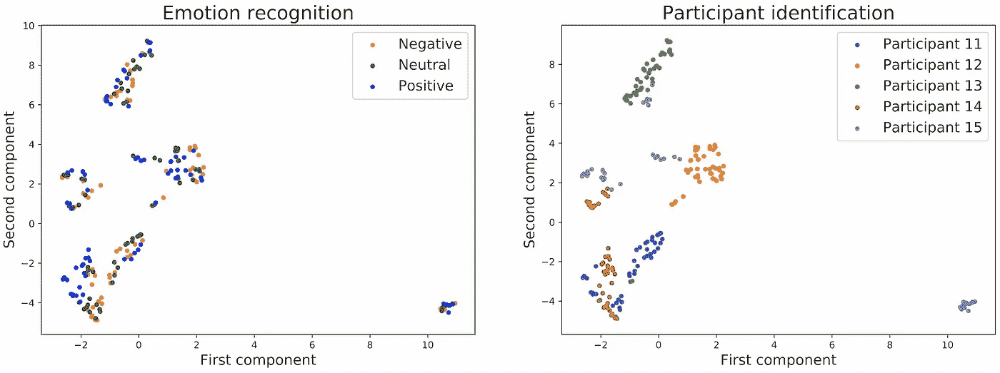
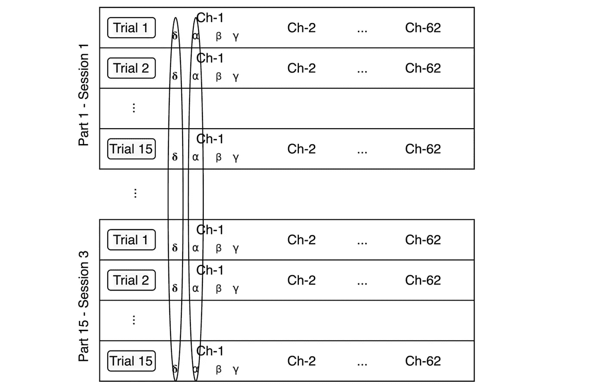
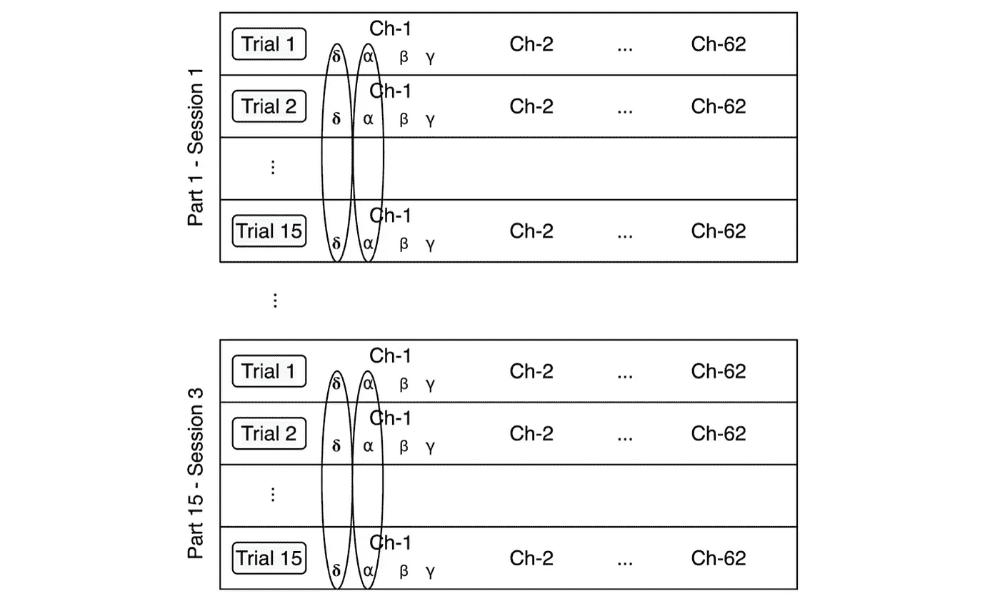
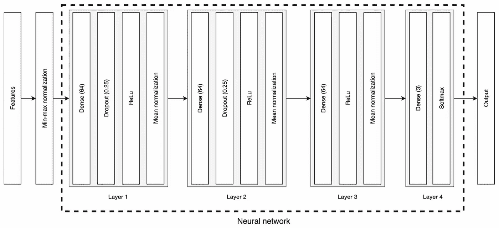
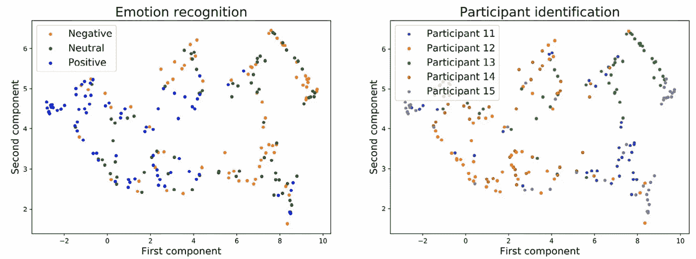
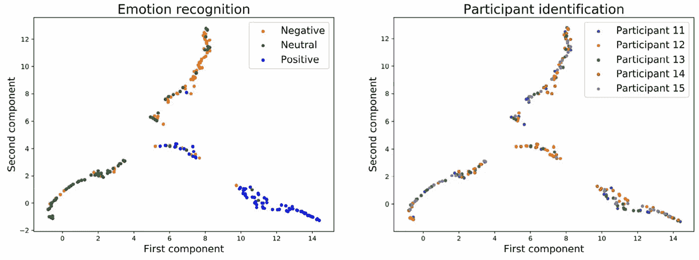

# 分层归一化:使用附加信息提高神经网络的性能

> 原文：<https://towardsdatascience.com/stratified-normalization-using-additional-information-to-improve-the-neural-networks-performance-f755021f0ae?source=collection_archive---------43----------------------->

## [思想和理论](https://towardsdatascience.com/tagged/thoughts-and-theory)

## 一种新的基于脑电的情感分类数据集的深度神经网络归一化训练方法。

照片由[像素](https://www.pexels.com/photo/grayscale-photo-of-computer-laptop-near-white-notebook-and-ceramic-mug-on-table-169573/)上的[负空间](https://www.pexels.com/@negativespace)拍摄

几个月前，当我迅速面临开发脑成像方法时最具挑战性的问题:参与者之间 EEG 活动的不均匀性时，我开始研究如何使用 EEG 记录对诱发的情绪进行分类。使用图 1 可以很容易地解释这个问题，在图 1 中，首先提取每个视频和参与者的每个 EEG 记录的特征，然后实施降维工具 [UMAP](https://umap-learn.readthedocs.io/en/latest/) 来嵌入数据。在左边，颜色代表情感；在右边，颜色表示数据对应于谁。因此，如果我们直接尝试使用一个经过训练的模型来对四个参与者的情绪进行分类，并尝试推断第五个参与者的情绪，结果将非常糟糕，因为没有说零。

为了解决这个问题，最常用的解决方案是使用校准阶段来预训练 AI 模型。然而，这非常耗时，因此许多研究人员一直在试图寻找替代解决方案。

> 虽然本文主要关注脑成像方法，但同样的问题也发生在许多其他领域，如图像识别、语音识别或面部表情。

图一。嵌入脑电图记录。在左边，颜色表示情绪，而在右边，颜色表示参与者。

在过去的几年中，已经有多个研究人员提出了解决这个问题的方案。对于脑成像，大多数提出的解决方案是基于选择鲁棒的特征。然而，(1)用这些特征训练的与参与者无关的模型的分类器性能仍然低于与参与者相关的模型，以及(2)这些特征是与任务相关的，这不仅阻碍了跨任务的健壮解决方案，也阻碍了跨领域的健壮解决方案。

因此，我们研究了一种新的基于参与者的归一化方法，称为*分层归一化*，用于训练深度神经网络。

> 该方法的主要思想是将附加信息按比例分配给神经网络以改善其性能。需要提醒的是，这些额外的信息需要与我们试图推断的信息不同。例如，在我们的数据集中，我们试图对情绪进行分类，因此使用的附加信息是每个数据的会话和参与者。

我们的分析是关于从 EEG 信号进行跨主题情绪分类的任务，结果表明，用分层归一化训练的网络明显优于用批量归一化训练的标准网络。

为了简要介绍我们的论文，我将重点介绍所提出的方法，并将它与众所周知的批处理规范化方法进行对比。此外，为了澄清解释，我将首先简要说明我用于分析的数据集。最后，我将展示我们的结果，并以一个小结论结束。

## 资料组

使用的数据集是[种子数据集](http://bcmi.sjtu.edu.cn/home/seed/)，是由[鲁保良](http://bcmi.sjtu.edu.cn/~blu/)教授领导的 [BCMI 实验室](http://bcmi.sjtu.edu.cn/)提供的脑电数据集集合。这个数据集和 [DEAP 数据集](http://www.eecs.qmul.ac.uk/mmv/datasets/deap/)是基于脑电图的影响计算中最重要的两个数据集。

它包含从 15 名参与者那里收集的 62 通道脑电图数据，这些参与者对相同的 15 个电影剪辑进行了三次训练。对于每个电影剪辑，通过平均 20 名参与者的评级来分配情感评级(积极、中立或消极)，这些参与者被要求在观看后指出三个关键词中的一个。

总而言之:

*   参加者:15 名参加者
*   会议 x 视频:3 x 15(每个参与者 45 个视频)

## 批量标准化

[Ioffe 和 Szegedy (2015)](https://www.frontiersin.org/articles/10.3389/fnins.2021.626277/full#B19) 首次引入批量标准化，以解决*内部协变量移位*的问题，这是学习过程导致的神经元激活分布的不必要漂移。它是神经网络中实现最多的归一化，并且在多个应用中表现出很好的性能。

正如下面进一步解释的，我们为了我们的目的稍微修改了这个方法。图 2 说明了我们的批处理规范化方法的实现。对于这种方法，对每批的每个特征进行归一化。

图二。批量标准化方法。数据按特征标准化，独立于参与者和会话。

## 分层标准化

分层归一化是所提出的方法，并且由每个参与者和会话的特征归一化组成。图 3 详细描述了分层归一化方法的实现。

与先前的归一化方法相比，该方法归一化每个特征、参与者和会话的数据。与批处理规范化相比，主要缺点是要么需要包含一个大的批处理集，要么需要研究每个批处理中每个类有多少数据。

图 3。分层归一化法。数据按特征、参与者和会话进行标准化。

## 结果和结论

使用图 4 所示的架构，结果如图 5 和图 6 所示。

图 4。分类器的体系结构。

图 5 和图 6 显示了预测值在神经网络输出层的嵌入。结果表明，在输出层，采用分层归一化训练的模型情感识别准确率较高，参与者识别准确率较低。事实上，这一次，分层归一化比批量归一化在 UMAP 上的嵌入更紧凑，情绪评级比参与者数量更容易识别——对于参与者数量，颜色的分布似乎表明大部分大脑签名确实消失了。

这些结果表明分层归一化对于跨主体情绪识别任务的高度适用性，表明该方法不仅可以应用于其他 EEG 分类数据集，还可以应用于需要域自适应算法的其他应用。

图 5。用批量标准化和三种情感类别嵌入神经网络的输出。

图 6。用分层归一化和三种情感类别嵌入神经网络的输出。

作为参考，这里我留下了包含本文中解释的所有内容以及许多其他细节的论文。如果你有任何问题或想法，请不要犹豫写评论或联系我。

 [## 基于分层归一化神经网络的跨主体脑电情感识别

### 由于大量的潜在应用，最近已经进行了大量的努力来创造机器…

www.frontiersin.org](https://www.frontiersin.org/articles/10.3389/fnins.2021.626277/full) 

***如果你喜欢这个帖子，请考虑*** [***订阅***](https://javiferfer.medium.com/membership) ***。你将获得我所有的内容+所有其他来自牛逼创作者的文章！***