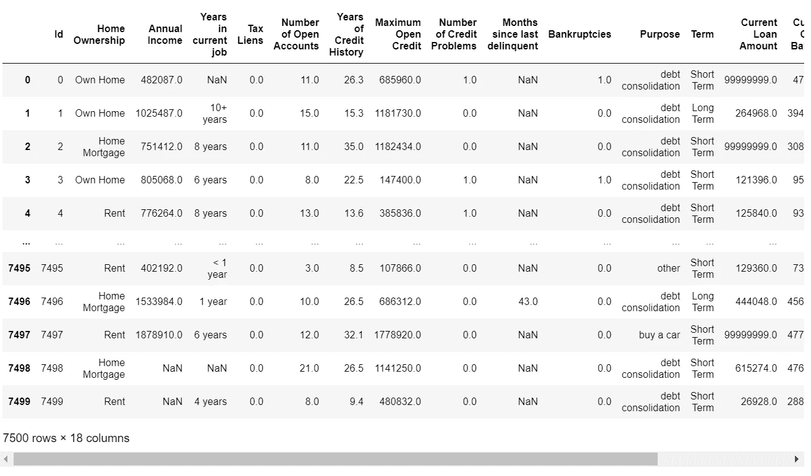
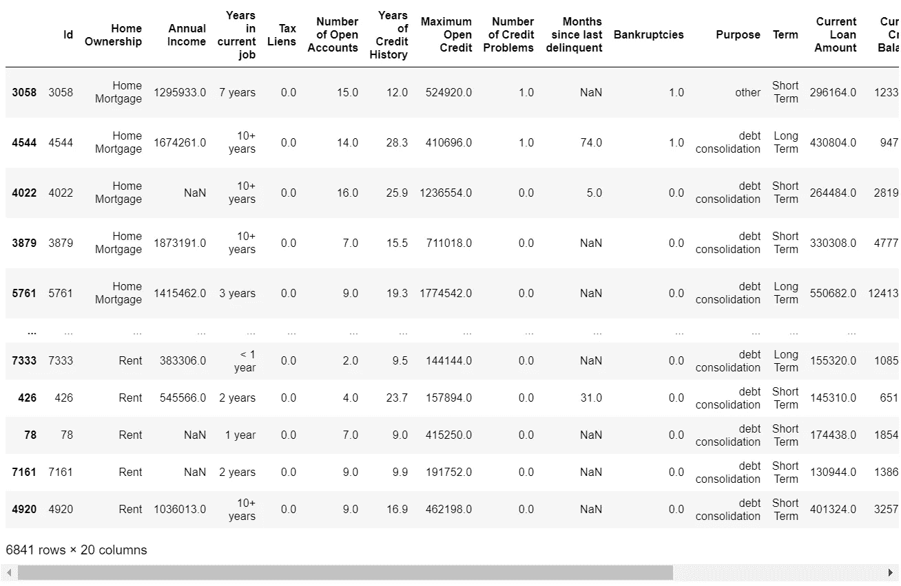

# 使用 Python 和 Pandas 进行分层随机抽样

> 原文：<https://towardsdatascience.com/stratified-random-sampling-using-python-and-pandas-1c84f0362ebc?source=collection_archive---------2----------------------->

## 如何对样本数据进行分层以匹配总体数据，从而提高机器学习算法的性能


查尔斯·德鲁维奥在 [Unsplash](https://unsplash.com/s/photos/computer-code?utm_source=unsplash&utm_medium=referral&utm_content=creditCopyText) 上拍摄的照片

# 介绍

有时，数据科学家得到的样本数据并不符合我们对更广泛的人口数据的了解。例如，假设数据科学团队收到了调查数据，我们注意到调查受访者中 60%是男性，40%是女性。

在现实世界中，英国总人口中男性比例接近 49.4%，女性比例接近 50.6%(资料来源:https://tinyurl.com/43hpe5e4[)，当然不是 60% / 40%。](https://tinyurl.com/43hpe5e4)

我们 60%的男性样本数据可能有很多解释。一种可能性是数据收集方法可能有缺陷。也许营销团队在他们的营销活动中意外地击中了更多的男性，导致了不平衡。

如果我们可以确定样本数据应该更好地反映总体情况，那么我们就可以对数据进行“分层”。这将涉及对样本数据进行重新采样，以使比例与总体相匹配(更多信息，请参见[https://www . investopedia . com/ask/answers/041615/what-are-advantage-and-missions-layered-random-sampling . ASP](https://www.investopedia.com/ask/answers/041615/what-are-advantages-and-disadvantages-stratified-random-sampling.asp))。

更复杂的是，可能涉及到多个特性列。本文中的示例显示了如下两个因素的组合

*   男大学生=人口的 45%
*   女大学生=人口的 20%
*   男性研究生=人口的 20%
*   女研究生=人口的 15%

如果我们的样本数据有 70%的男大学生，它将不能代表人口。

在机器学习算法中，这可能会导致问题。如果我们继续在样本数据上训练我们的模型，而样本数据具有错误的比例，那么模型很可能会过度拟合训练数据，并且当我们根据真实世界或测试数据以正确的比例运行模型时，它也很可能表现不佳。

此示例显示了如何对样本数据进行重新采样，以使其反映有可能提高机器学习模型准确性的总体

# 入门指南

让我们首先导入所需的库并读入一些从[https://www . ka ggle . com/c/credit-default-prediction-ai-big-data/overview](https://www.kaggle.com/c/credit-default-prediction-ai-big-data/overview)下载的数据



作者图片

# 设置测试数据

为了使示例有意义，我将简化“房屋所有权”特性，使其具有两个最常见的值，并添加一个名为“性别”的新特性，其中约 60%为“男性”,约 40%为“女性”,然后快速查看结果…

```
(Home Mortgage    0.531647
 Rent             0.468353
 Name: Home Ownership, dtype: float64,
 Male      0.601813
 Female    0.398187
 Name: Gender, dtype: float64)
```

# 准备分层

在我们的示例中，我们希望对样本数据进行重新采样，以反映性别和房屋所有权的正确比例。

我们需要做的第一件事是创建一个包含我们想要分层的所有数据的单一要素，如下所示…

```
Male, Home Mortgage      0.321737
Male, Rent               0.280076
Female, Home Mortgage    0.209911
Female, Rent             0.188277
Name: Stratify, dtype: float64
```

现在我们有了，我们在样本数据中有一组比例，我们打算用它们来训练我们的模型。然而，我们与我们的营销团队核实，他们向我们保证人口比例如下…

*   男性，住房抵押贷款=人口的 45%
*   男性，房租=人口的 20%
*   女性，住房抵押贷款=人口的 20%
*   女性，房租=人口的 15%

…两个团队同意，他们必须对数据进行重新采样，以匹配这些比例，从而建立一个准确的模型，该模型将在未来的真实世界数据中很好地工作。

# 将数据分层

下面是一个函数，它使用`DataFrame.sample`从源数据中用正确的值精确地采样正确数量的行，这样结果将按照参数中指定的那样精确地分层...

# 测试

以下代码指定了根据所需比例对数据进行分层的值和比例，即-

*   男性，住房抵押贷款=人口的 45%
*   男性，房租=人口的 20%
*   女性，住房抵押贷款=人口的 20%
*   女性，房租=人口的 15%

…并查看新分层的数据集…



作者图片

为了确保我们得到了正确的结果，让我们来看看`Stratify`专题专栏的整体比例...

```
((6841, 20), (6841, 20))
```

```
Male, Home Mortgage      0.449934
Female, Home Mortgage    0.199971
Male, Rent               0.199971
Female, Rent             0.150124
Name: Stratify, dtype: float64
```

# 结论

我们首先指出，数据收集过程中的缺陷有时会导致样本数据与总体数据的已知比例不同，这可能会导致过度拟合的模型在遇到比例正确的测试或实时数据时表现不佳。

我们继续探索如何对训练数据进行分层和重新采样，使其达到正确的比例，从而解决问题并提高生产算法的性能。

然后，我们选择了一个对两个要素进行分层的复杂示例，要素将这两个要素设计到一个新列中，并定义了一个执行计算并返回分层数据集的函数。

最后，我们检查了结果，以确保计算是正确的。

完整的源代码可以在 GitHub 上找到:

[](https://github.com/grahamharrison68/Public-Github/blob/master/Resampling/Stratified%20Sampling.ipynb) [## grahamharrison68/Public-Github

### GH 公共项目库。通过在…上创建帐户，为 grahamharrison68/Public-Github 开发做出贡献

github.com](https://github.com/grahamharrison68/Public-Github/blob/master/Resampling/Stratified%20Sampling.ipynb) 

# 感谢您的阅读！

如果你喜欢读这篇文章，为什么不看看我在 https://grahamharrison-86487.medium.com/的其他文章呢？

此外，我很乐意听到您对这篇文章、我的任何其他文章或任何与数据科学和数据分析相关的内容的看法。

如果你想联系我讨论这些话题，请在 LinkedIn 上找我—【https://www.linkedin.com/in/grahamharrison1 或者发电子邮件到[ghar rison @ Lincoln college . AC . uk](mailto:GHarrison@lincolncollege.ac.uk)。