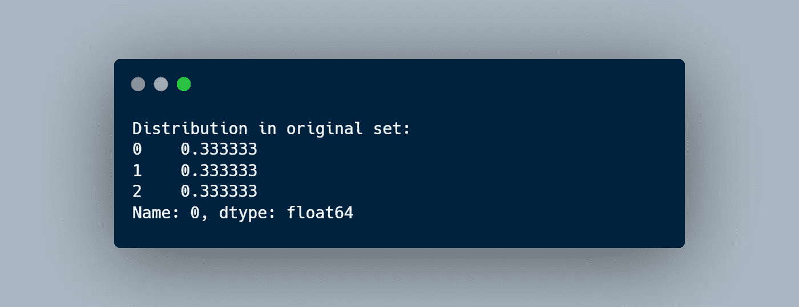
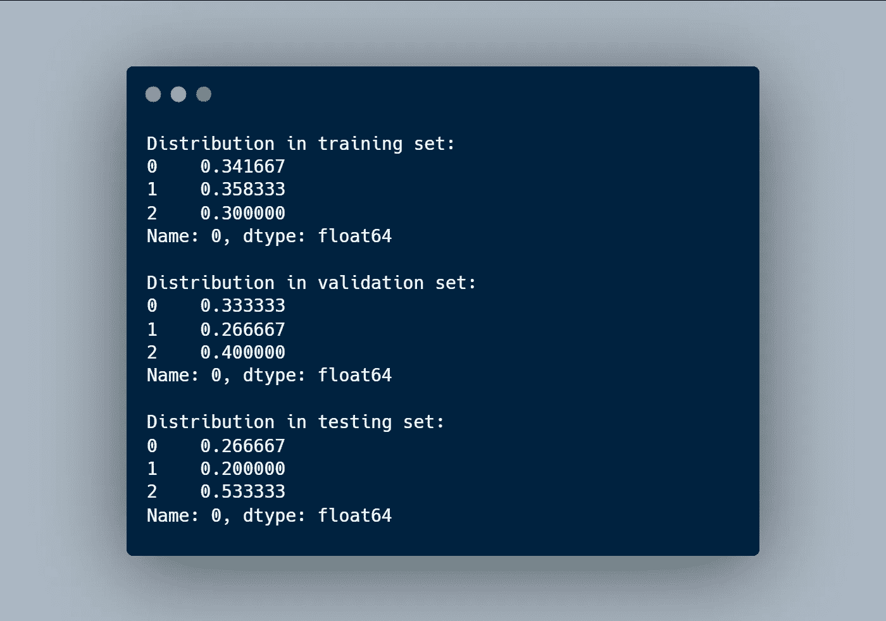
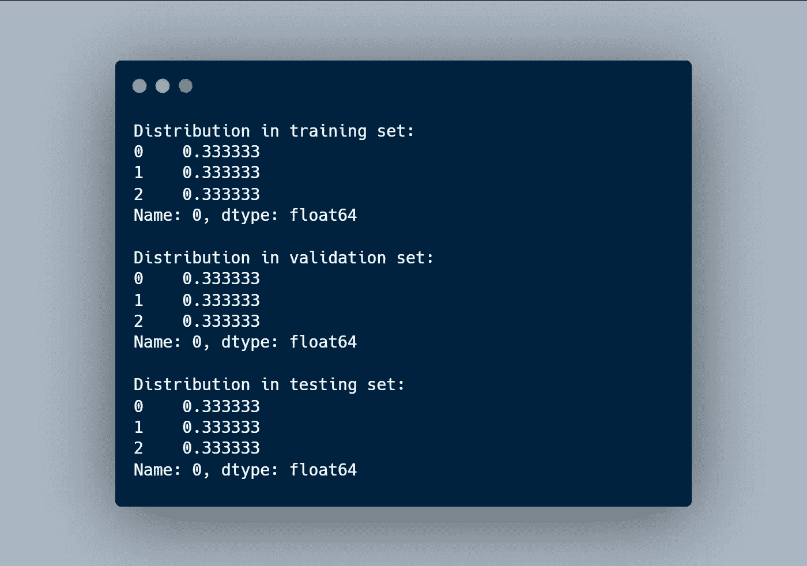

# 分层抽样:你可能完全错误地分割了你的数据集

> 原文：<https://towardsdatascience.com/stratified-sampling-you-may-have-been-splitting-your-dataset-all-wrong-8cfdd0d32502?source=collection_archive---------17----------------------->

## 随机生成数据集的分割并不总是最佳解决方案，因为目标变量中的比例可能会有很大差异。让我向您介绍 Python 中的分层验证。

照片由 [Testalize.me](https://unsplash.com/@testalizeme?utm_source=medium&utm_medium=referral) 在 [Unsplash](https://unsplash.com?utm_source=medium&utm_medium=referral) 上拍摄

在机器学习模型的开发过程中，[通常会将数据集分为训练和测试，甚至验证拆分](/how-to-split-a-tensorflow-dataset-into-train-validation-and-test-sets-526c8dd29438)以获得更具代表性的结果。然而，在生成这些分割时，有一些东西可能会影响预测的质量，这是最常被遗忘的:目标变量的分布。

这些数据集划分通常是根据目标变量随机生成的。但是，这样做时，不同分割中目标变量的比例可能会有所不同，尤其是在小数据集的情况下。这意味着我们是在异质子群中训练和评估，会导致预测误差。

解决方法很简单:**分层抽样**。该技术包括强制目标变量在不同分割中的分布相同。这一微小的变化将导致在被评估的同一人群中进行训练，从而实现更好的预测。

# 履行

为了说明分层的优势，我将展示在将一个数据集分为训练集、测试集和验证集(有或没有分层采样)时，目标变量分布的差异。举个极端的例子，使用的输入将是[虹膜数据集](https://scikit-learn.org/stable/auto_examples/datasets/plot_iris_dataset.html)。

请注意，对于这两种情况，目标变量的分布如下:

## 传统拆分

在不考虑目标变量的情况下，通过将 150 条记录划分为训练、测试和验证，发现了每个部分中的以下比例。

数据集越小，在不同分割中发现目标变量的不同比例的可能性就越大。正如你在这个例子中看到的，亚群体是非常不同的。

## 分层分裂

另一方面，当在生成分割之前考虑目标变量并按其分组时，得到的分布是:

## Python 代码

这个例子可以在 [Gist](https://gist.github.com/angeligareta/b42785185ee245e846455cf2d6b343ff) 上公开获得，在这里我提供了一个实用方法*get _ dataset _ partitions _ PD*，你可以用它轻松地生成熊猫数据帧的分层分割。

## 最后的话

尽管认为在准备用于训练机器学习模型的数据时只需要随机分割，但事实是数据集分割的随机生成并不总是导致每个数据子集具有相同的目标变量分布，这可能会显著影响结果。

在本文中，我向您介绍一个简单的解决方案:分层抽样；以及如何在 Python 上实现。此外，一个使用分层抽样和不使用分层抽样的例子显示了一个小数据集，说明了在分裂的目标变量比例的巨大差异。

如果你想发现更多像这样的帖子，你可以在下面找到我:

*   [GitHub](https://github.com/angeligareta)
*   [领英](https://www.linkedin.com/in/angeligareta/)
*   [个人网站](https://angeligareta.com/)