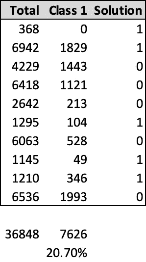
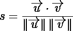
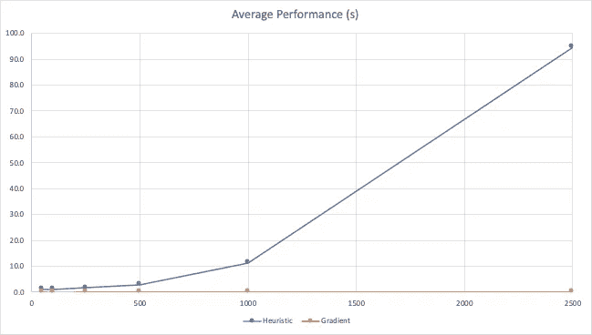

# 使用优化的分组数据集的分层分裂

> 原文：<https://towardsdatascience.com/stratified-splitting-of-grouped-datasets-using-optimization-bdc12fb6e691?source=collection_archive---------15----------------------->

## 本文解释了如何将一个分组数据集分层分割成训练集和验证集

斯科特·韦伯在 [Unsplash](https://unsplash.com?utm_source=medium&utm_medium=referral) 上拍摄的照片

机器学习管道中最常见的步骤之一是将数据分成训练集和验证集。这是所有从业者在解决任何问题之前必须掌握的必要技能之一。拆分过程需要对数据进行随机洗牌，然后使用预设阈值进行分区。在分类变体上，您可能希望使用分层来确保两个集合上的类分布相同。处理时间序列数据时，您可能希望跳过混排，并保留对训练集的最早观察。您可能还对数据进行了分组，在这种情况下，您可能希望在任一数据集上将组放在一起。最后，你可能很幸运地遇到了以上几种情况的混合，却没有现成的解决方案，就像我遇到的那样。

本文介绍了我为处理*分组数据*的*分层分割*而设计的解决方案，要求各组在任意一个数据集上保持在一起。

# 背景

我最近从事一个针对几千台工业设备的预测性维护项目。这些设备通过无线连接将遥测数据传输到后端系统，在那里进行存储和进一步处理。所有设备都要进行定期的预防性维护，这不足以避免偶然的意外故障。由于这些故障的破坏性，设备制造商决定创建一套预测性维护模型，以尝试和预测下一个维护周期之前不合时宜的设备故障的概率。

我的团队被指派研究一个特定的设备组件，并设计一个预测性维护模型来估计未来一段时间内的故障概率。我们选择使用分类模型，并经历了建立管道的整个过程。当我们进入数据集分割阶段时，我们决定不在训练集和验证集之间分割设备数据。每个设备数据要么在前者上，要么在后者上，从不在两者之间划分。我们还决定做分层分割，确保两组有相同比例的正面观察。

此时此刻，我们明白没有任何成文的方法来解决这个问题。 [Scikit-Learn](https://scikit-learn.org/stable/index.html) 包实现了对[分割成组数据集](https://scikit-learn.org/stable/modules/generated/sklearn.model_selection.GroupShuffleSplit.html)或执行[分层分割](https://scikit-learn.org/stable/modules/generated/sklearn.model_selection.train_test_split.html#sklearn.model_selection.train_test_split)的解决方案，但不能同时实现两者。稍微思考一下，这是有意义的，因为这是一个多目标的优化问题。您必须沿组边界拆分数据，确保请求的拆分比例，同时保持整体分层不变。

不用说，管道的这一部分是手动的，使用一个随机数生成器和一些试验。不，我并不以此为荣，因此写了这篇文章。

# 问题陈述

给定一个经过标记和分组的数据集，我们希望将其分成训练集和验证集，同时保持标签分布在完整性和组完整性方面尽可能接近。将数据分成两个数据集后，这些组必须保持其完整性，分配给任一数据集，而不是在它们之间拆分。此外，拆分过程应严格遵守强制拆分比例和标签分层。

此问题的预期结果是，给定一个输入数据集，分配给每个数据集的组列表，确保训练/验证分割和分层尽可能接近指定值。

# 解决方案研究

我开始从经典的优化包中寻求帮助，比如 Google 的[或者-Tools](https://developers.google.com/optimization) 。不幸的是，我在那里没有找到解决办法。实现的优化解决方案似乎接近我所需要的，但仍然没有雪茄。我在寻找一个可以从 Python 管道中使用的解决方案，所以一些著名的基于 Java 的优化器似乎遥不可及。为什么不自己卷呢？

几年前，我参与开发了一个车辆路径优化器，这让我学到了很多关于离散优化算法的知识。我在下面的文章中总结了我的心得。

</of-taboos-neighbors-and-optimization-2955b72fbdf>  

在回顾了所有这些想法之后，我决定为这个问题开发一个基于 Python 的优化解决方案。我现在展示的是一个概念验证的代码，这个概念验证可能会导致一个独立的 Python 包。让我们从回顾问题模型开始。

# 问题模型

为了解决这个问题，我们不需要处理整个数据集，只需要处理它的计数。我们只需要确定不同组的数量和每个组的班级数。为了激发对问题模型的讨论，让我们看一个玩具例子，我们想要强加一个 70/30 的分割。

上图描述了一个玩具问题的例子，以及一个可能的解决方案。行包含十个组的计数，第一列包含总计数，第二列包含一类样本的数量。最后一列是建议的解决方案，值 1 表示对验证数据集的赋值。(图片来源:作者)

上图展示了一个基本问题的模型和解决方案。每个表行包含一个组的描述，第一列是大小，第二列是一类样本的数量，第三列表示验证集的包含性(建议的解决方案)。您可以在底部看到列总数，以及第一类样本的计算比例(20.70%)。

那么，提议的解决方案表现如何呢？为了检查是否符合 70/30 分割，我们需要将第一列中所有标记为(值 1)的值添加到第三列中，作为属于验证集的值。部分和(10960)占总数的 29.74%，非常接近要求的 30%。为了检查分层，我们做同样的事情，但在第二列。总和(2328)是上次计数的 21.24%，这意味着我们非常接近所需的 20.70%。

值得注意的是，问题和解决方案的表示都非常简单。我们可以将一个解表示为一个布尔数组，这是非常紧凑的。

那么，我是如何找到解决方案的呢？

# 优化模型

如前所述，我们希望找到一个既接近分割目标又接近分层目标的解决方案。请注意，如果您有两个以上的类，分层将有多个目标。

优化过程从使用组的随机排列生成初始近似解开始。

## 最初的解决方案

最初的解决方案是我们对问题的第一次尝试，是搜索过程中的一个辅助。为了让优化过程快速开始，我们将只关注训练/验证比例*和*，并从随机洗牌开始。如您所见，下面的函数使用随机排列的组大小来选择所需比例的近似值，不考虑地层。一旦验证集超出其所需容量，该过程就会停止。

上面的代码使用训练/验证比例作为唯一的停止标准来生成初始解决方案。(图片来源:作者)

既然我们有了解决方案，我们可以尝试改进它。我们将通过对解决方案做一些小的改动来做到这一点，实质上就是翻转解决方案数组中的位。但是我们如何知道我们正在改进解决方案呢？我们如何衡量改进？进入成本函数。

## 成本函数

成本函数测量从现有解决方案到理论最优的“距离”。我们从问题陈述中知道这个最优值，并希望生成一个解决方案数组，该数组与分割和地层比例最匹配。下面的函数计算与给定解决方案阵列相关的成本，并使用 [Numba](https://numba.pydata.org/) 进行 JIT 编译以提高性能。

优化过程使用上述成本函数评估所有解决方案，较低的成本等同于较好的解决方案。如您所见，成本函数考虑了请求的数据集分割比例与评估的解决方案的分割比例之间的差异。接下来，对于问题的层次和解决方案的层次比例之间的差异也是如此。

现在我们有了一个成本函数，我们如何生成解决方案来评估它呢？我们从开发初始解决方案开始，然后从它开始迭代。

## 搜索过程

搜索过程基于先前的解决方案迭代地生成新的解决方案，并对它们进行评估。在这个特殊的例子中，我们通过翻转一点解决方案向量来创建一个解决方案，从而将一个组移入或移出验证集。我们必须小心不要创建先前生成的解决方案，以免我们将优化搜索过程送进无限循环。

为了避免循环，我们和[阿里阿德涅](https://en.wikipedia.org/wiki/Ariadne)在她的迷宫里做的一样；我们标出走过的路。我们不使用线程，而是使用 Python 集合来存储搜索空间的访问状态。但是为每一步保留整个状态数组既不节省内存也不快速。为了加快集合包含测试的速度，我们必须首先将状态数组转换成一个更紧凑的表示，即一个字符串。Python 处理字符串散列非常有效，并且我们还通过压缩状态表示而获益。下面的函数展示了如何将一个状态数组转换成一个 ASCII 字符串。注意，这个过程每个字符只使用 6 位，并且是使用 Numba 进行 JIT 编译的。

这个函数通过每六位聚合将一个解向量转换成一个 ASCII 字符串。(图片来源:作者)

## 现有解决方案

我们总是将目前为止最好的解决方案，即*现任*解决方案放在手边，并在优化过程结束时将其作为最终方案。每当流程产生一个成本更低的更好的解决方案时，它就会用更好的解决方案替换现有的解决方案。这样，优化器总是有一个现成的答案，与选择的终止标准无关。

优化过程使用特定的标准，通过翻转先前生成的解决方案的单个位来生成新的解决方案。在这里，我们将探讨这一过程的两种不同的方法。第一种方法使用试探法来产生新的解决方案，并且非常类似于在通知搜索算法中使用的方法。第二种方法使用成本函数的梯度来确定下一个最佳解决方案，并且在精神上类似于梯度下降。

## 启发式方法

基于启发式的优化器的主循环从通过翻转所有父解位来生成可能的派生状态列表开始。然后，它使用一个存储字符串编码的二进制状态数组的集合过滤掉已经访问过的状态(就像一个没有任期的[禁忌列表](/optimization-techniques-tabu-search-36f197ef8e25))。正如您从下面的函数中看到的，生成新的解决方案只是迭代位数组，翻转每个位数组，并过滤掉已经探索过的解决方案。

上述函数为给定的解决方案生成所有可能的移动。(图片来源:作者)

然后，该过程使用成本函数评估每个新生成的状态，并相应地对它们进行排序。该是流程选择下一个扩展候选对象的时候了，也是它使用启发式算法的时候了。很简单，最佳候选人是成本最低的候选人。这种方法使优化过程在成本空间中寻找更接近前一个的更好的解决方案。在离散优化问题上，发现局部极小值非常接近是很常见的，所以这种方法是有意义的。在专业文献中，它被称为*强化*。

需要注意的是，我们不一定要通过选择成本最低的解决方案来改进现有的解决方案。我们只是从生成的列表中选择成本最低的解决方案，但这可能比我们迄今为止的最佳方案成本更高。通过这样做，我们正在进行所谓的“T4”爬山打个比方，你可以想象一个滑雪者爬上一座小山，希望找到一个更陡的斜坡从对面下来。

然而，使用这种策略，我们有被困在当地高海拔山谷的风险。优化程序跟踪它上坡的频率，并在预定数量的降低现任成本的失败尝试后，它采取不同的行为。回到滑雪者的比喻，想象一下，她在试图找到一个好的斜坡时感到无聊，于是呼叫她的私人直升机带她去邻近的更有希望的山峰。运气好的话，她可能会找到一条更刺激的赛道。

这种策略被称为“*多样化，*”。搜索过程不是使用最低的成本，而是在感觉到一个谷底时寻找最高的成本。这种策略允许优化过程搜索不同的路径，直到难以捉摸的全局最小值。

下面是使用启发式搜索解决优化问题的函数。

上述函数使用试探法搜索最佳训练/验证分割。(图片来源:作者)

如您所见，在每次迭代中，该函数都会生成一个可能解决方案的列表，并且只使用其中一个作为下一步。对于有很多组的问题，这种方法在实际应用中会变得太慢。

## 梯度方法

我们可以尝试通过遵循成本函数梯度来选择最佳扩展，作为前面方法的替代方案。通过查看成本函数，我们可以快速导出它的梯度。下面的代码将成本函数梯度计算为一个向量。注意，梯度向量仅包含沿着成本的每个维度的计数的差异。

上面的函数计算成本函数梯度。(图片来源:作者)

我们现在可以使用这个向量来搜索对解决方案的最佳修改。请记住，我们仅仅是在训练集和验证集之间移动组，所以我们希望使用成本梯度来确定哪个移动将最大地影响成本值。注意，当验证集计数低于其期望值时，成本向量的第一个分量(上面的第 14 行)是正的。为了降低成本，我们应该向验证集添加另一个组。地层成分也是如此。如果优化过程获得具有正元素的成本梯度向量，则它应该从训练集中选择一个组，并将其移动到验证集中。另一方面，如果所有成本梯度分量都具有负值，我们应该从验证集中移除一个组，并将其放回训练集中。对于中间所有其他情况的决定将取决于向量相似性，如下所述。

优化过程应该如何选择在数据集之间传输的最佳组？这里，我们必须使用向量相似性来将成本梯度向量与问题矩阵中的每个向量进行匹配，选择的度量标准是[余弦相似性](https://en.wikipedia.org/wiki/Cosine_similarity)。

余弦相似度是两个向量的内积和它们的范数的乘积之比。(图片来源:作者)

余弦相似性来源于两个向量之间的内积的定义，并且当两个向量指向相同方向时最大，当相反方向时最小。下面的代码实现了余弦相似性计算，对我们的问题进行了修改，反转了验证组向量的符号。

通过反转验证向量的符号(上面的第 11 行)，该算法确保这些向量将更接近于成本梯度，该成本梯度指向与训练数据集的移动相反的方向。

现在我们可以使用余弦相似度来生成下一步棋。下面的代码包含基于余弦相似性标准产生下一个最佳解决方案的函数。

解生成函数计算在来自问题矩阵的每个组向量和计算的成本梯度向量之间计算的余弦相似性得分的向量。下一个最佳解决方案对应于翻转问题向量中得分最高的位。请注意，对于多样化变动，我们使用最低分数。

上面的函数使用成本梯度搜索最佳训练/验证分割。(图片来源:作者)

# 代码

本文的所有代码都可以在附带的 [GitHub 资源库](https://github.com/joaofig/strat-group-split)中找到。它存在于单个 Python 文件中，您可以从命令行或您喜欢的 IDE 中运行该文件。有一组独立的函数和两个类，每个都实现了上面描述的一种优化方法。两个解算器不断循环，直到满足停止条件。目前，他们使用最小成本值或无改进的最大迭代次数作为停止标准。

## 搜索求解器

这个类的求解器方法将当前解扩展到所有允许的状态。然后根据成本值对它们进行排序，并选择最低的进行下一次扩展。该求解器收敛到一个解的速度可能非常慢，因为扩展过程可能需要很长时间来运行许多组的问题。我们可以通过人为地限制扩展的数量，同时增加一点随机性(这里不做)来规避这个缺点。

## 梯度求解器

梯度求解器使用每个解决方案的成本梯度来选择下一个最佳移动。该求解器不是扩展所有允许的解决方案，而是通过选择最佳解决方案来“直奔主题”。如前所述，该求解器使用余弦相似度来寻找成本梯度向量和组向量之间的最佳匹配。这种设计大大加快了求解器的速度，使它在几乎每个问题实例上都优于搜索求解器。

# 结果

为了比较这两种方法的性能，我进行了一系列实验，改变了组的数量并测量了运行时间。对于每个组大小，我对这两种方法都执行了十次代码，并在几秒钟内取平均值。除了组的数量，我保持所有其他参数不变。

下图显示了两种优化方法在时间上的表现，作为问题定义中的组数的函数。正如您所看到的，启发式优化器的性能是超线性的，而梯度似乎是线性的。

该图表显示了两种优化方法的时间性能比较，作为组数的函数。(图片来源:作者)

请注意，这些结果应该只是给你一个关于这两种方法性能的提示，因为优化质量(以最终成本值衡量)变化很大。更好的性能比较可能需要限制两种方法在一个窄的时间间隔内报告结果。然而，我总是更喜欢使用梯度法而不是启发式方法。

# 结论

在本文中，我们研究了将分组的机器学习数据集分割成训练和验证的问题，同时考虑了所需的分割比例和固有的标签分层。我们已经从标准 Python 库中寻找了可能的解决方案，当没有明显的解决方案时，我们决定推出自己的解决方案。我们把这个问题作为一个离散的优化过程，并设计了两个可能的解决方案。第一种解决方案来自于使用启发式的知情搜索，而第二种解决方案使用成本函数梯度来最小化解决方案成本。基于梯度的方法比启发式方法表现出更好的执行性能。

# 未来的工作

正如我之前所说的，你在这里看到的工作仍然是一个概念验证。我已经展示了如何使用离散优化方法解决分组数据集的分层分割。下一步将是使用 [Cython](https://cython.org/) 编译将这段代码转换成一个具有改进性能的成熟 Python 包。

这个想法的另一个可能的扩展将是使分层的 [K 倍](https://en.wikipedia.org/wiki/Cross-validation_(statistics))分裂成为可能。

# 资源

[GitHub 资源库](https://github.com/joaofig/strat-group-split)

joo Paulo Figueira 在葡萄牙里斯本的戴姆勒卡车和公共汽车公司 [tb.lx 担任数据科学家。](https://tblx.io/)