# 使用 OCI 流和 Oracle 数据库进行流分析

> 原文：<https://towardsdatascience.com/stream-analytics-using-oci-streaming-and-oracle-database-ab10e91fa35d?source=collection_archive---------15----------------------->

高容量数据流无处不在，无论是服务器日志、web 点击数据、消息、媒体等。Oracle Cloud infra structure Streaming service 为实时接收和使用大容量数据流提供了一个全面管理、可扩展和持久的解决方案。

获取这些数据流后的下一步是将它们分析成有意义的结果，这些结果可用于做出关键的业务和设计决策。Oracle 工具和服务可用于构建端到端的管道；从流到结果的可视化。

OCI 流媒体完全兼容阿帕奇卡夫卡。如果你熟悉卡夫卡式的建筑，它主要有生产者在生产信息。这些消息以数据流的形式(跨主题)存储在 Kafka 集群中。然后，消费者可以从集群中获取数据。

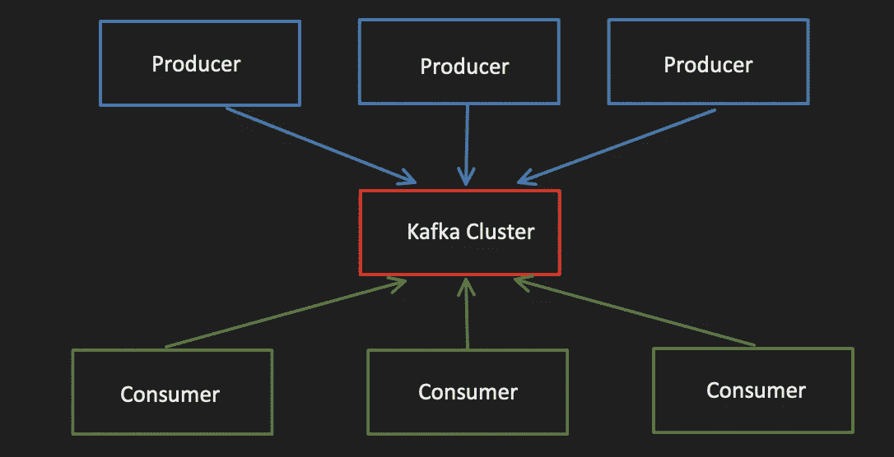

Oracle 帮助我们使用这种简化的方式。OCI 流有流池，你可以考虑取代卡夫卡集群。每个流池都有流，按照上面的架构，这些流是主题。消费者将是 Oracle SQL 数据库。


对 Kafka 或 OsaK 的 Oracle SQL 访问是一个 Oracle PL/SQL 包。它是一个外部表预处理器。您可以通过以下两种方式读取和处理来自 Kafka topic 的实时事件和消息:

*   使用 Oracle SQL 访问 Kafka 启用的视图
    在这种情况下，数据不需要存储在数据库中。每次你调用它，它都会从 Kafka topic 中读取最新的数据
*   对 Kafka powered 表的 Oracle SQL 访问
    在这种情况下，数据实际上存储在数据库中

使用 OSaK 有多种好处:

*   运行实时流分析作业。直接从流服务读取，无需移动到外部数据源。
*   如果需要，还可以使用它将数据从流服务移动到数据库。
*   OSaK 处理偏移管理，消除丢失或重新读取流记录。Oracle SQL 只是消费者。
*   来自测井/传感器等的实时数据。通常是加密的。您可以将它与传统的 SQL 表数据集成，以生成未加密的有意义的仪表板。

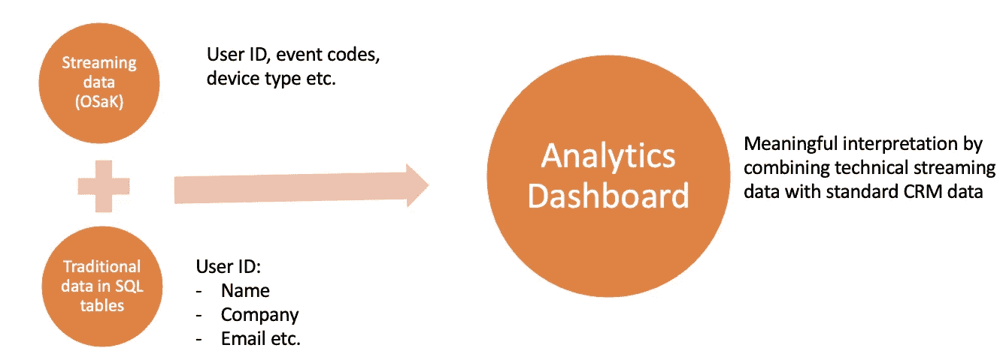

在这篇博客中，我将重点介绍启用 OSaK 的视图:

*   它是一个 Oracle 视图，是一个 Kafka 客户端应用程序
*   它被绑定到 Kafka 集群、组、主题、分区
*   它从 Kafka 主题中读取一组记录，并将它们转换成由 Oracle 视图定义抽象的一组 SQL 表行
*   对 OSaK 视图的查询访问同一个主题分区，并从每个分区读取记录
*   在查询启动时，提取分区中现有的行，直到分区中的最新记录

让我们进入设置的实际部分，并开始接收流数据。

第一步:登录你的 OCI 帐户/租赁，并设置一个流服务流池。然后在流池中创建一个流。

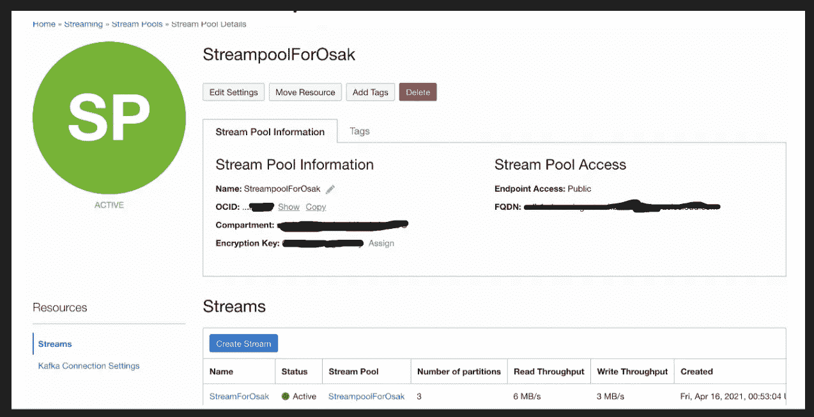

从 OSaK 的角度来看，流实际上是 3 分区的卡夫卡主题。

步骤 2:在控制台上进入身份->用户，创建一个新用户。

步骤 3:用户需要通过流服务认证自己(使用 Kafka APIs)。为此，单击您刚刚创建的用户并生成 auth-token。OSaK 需要用户名和认证令牌来使用 Kafka 消费者 API 访问流服务。

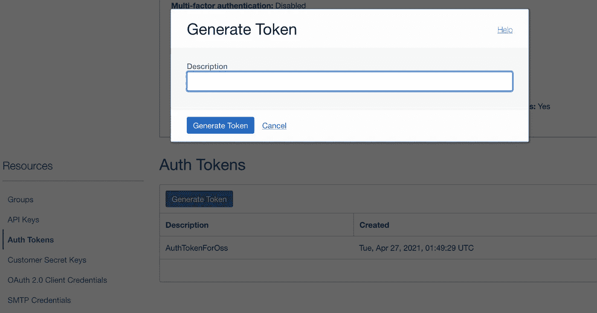

一旦生成，这是您唯一可以查看或复制身份验证令牌的时间。请复制它，因为我们为 OSaK 配置 Kafka 集群时会用到它。

步骤 4:创建一个用户组。将您的用户添加到组中。在 OCI，用户在分配给他们所属用户组的策略的帮助下获得特权。因此，为用户组创建一个策略，以便该组中的所有用户都获得访问流服务集群的权限。

因此，当您打开群组时，您可以看到其中的用户。

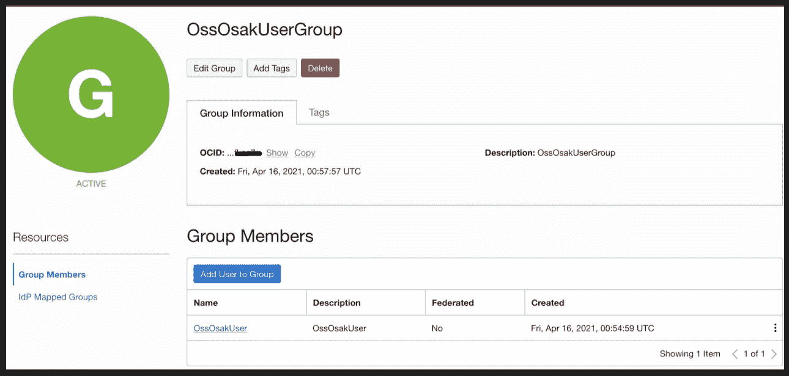

添加以下策略。您可以输入自己的组和隔离专区名称。

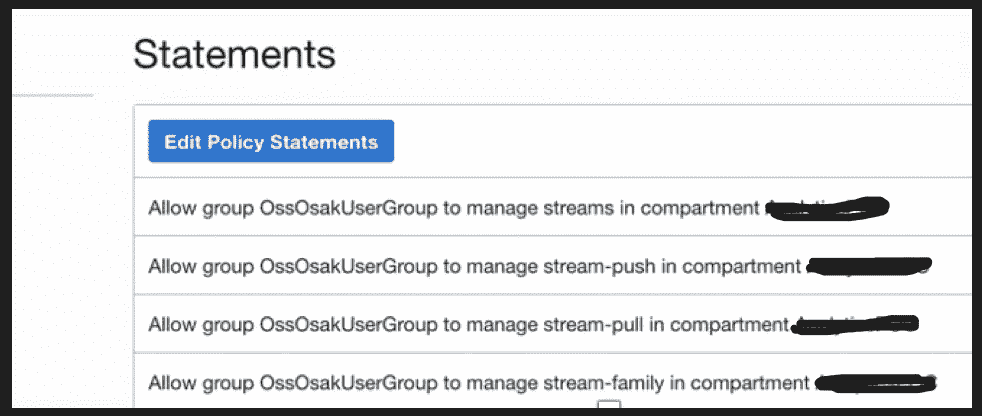

步骤 5:现在我们开始在 Oracle 数据库主机上安装 OSaK。

下载最新版本的 Oracle SQL developer。OSaK 套件随其提供。Oracle SQL 对 Kafka kit 的访问位于 orakafka.zip 文件中。

步骤 6: SSH 进入 Oracle 数据库节点，并将 orakafka.zip 移动到

```
/home/oracle
```

步骤 7:切换到 oracle 数据库主机上的 Oracle 用户。

确保您当前的工作目录是/home/oracle。

解压缩 orakafka.zip 文件

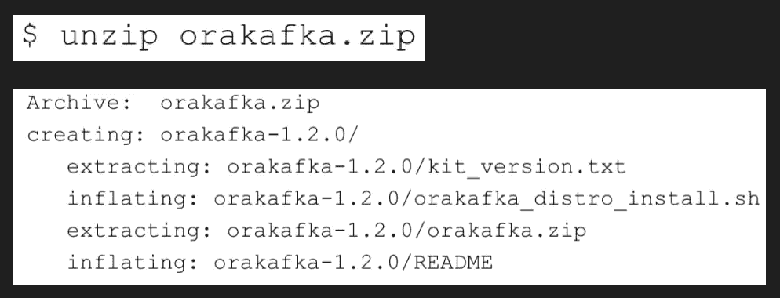

第 8 步:在/home/oracle 中创建新目录 ora_kafka_home。我们将使用它作为 OSaK 的基本目录。安装将使用*中的脚本*orakafka _ distro _ install . sh*来完成。/orakafka-1.2.0*


最后，您会收到一条消息，确认 orakafka kit 已成功安装。

步骤 9:为 OSaK 配置 JAVA_HOME

要查找 java 路径，请运行命令:

```
java -XshowSettings:properties -version 2>&1 > /dev/null | grep ‘java.home’
```

这将给出您在下一个命令中输入的路径

```
export JAVA_HOME=<Enter path here>
```

转到目录:/home/Oracle/ora _ Kafka _ home/ora Kafka/bin

然后设置


最后，您会收到一条消息，确认 JAVA_HOME 已成功配置。

您可以通过运行命令来验证安装:

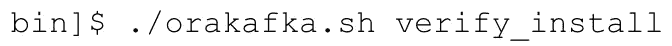

这将产生:


步骤 10:将我们之前设置的流服务流池添加到 OSaK。

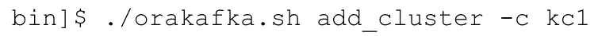

在这种情况下，kc1 是集群的名称。您可以随意命名集群。

步骤 11:将流服务流的安全属性添加到/home/Oracle/ora _ Kafka _ home/app _ data/clusters/KC1/conf/ora Kafka . properties

您可以在之前设置的流池下的“Kafka 连接设置”中获得这些属性。


您可以在配置文件中取消对这些特定字段的注释，并填写 Kafka 连接设置中的值:

```
security.protocol=SASL_SSLsasl.mechanism=PLAINsasl.jaas.config=org.apache.kafka.common.security.plain.PlainLoginModule required username=”<YOUR_TENANCY_NAME>/<YOUR_OCI_USERID_HERE>/<YOUR_OCI_STREAMPOOL_OCID>” password=” YOUR_AUTH_TOKEN”;sasl.plain.username=”<YOUR_TENANCY_NAME>/<YOUR_OCI_USERID_HERE>/<YOUR_OCI_STREAMPOOL_OCID>”sasl.plain.password =”YOUR_AUTH_TOKEN”;
```

第 12 步:以 sysdba 身份登录 SQL，将容器设置为您的 PDB 并运行

```
@/home/oracle/ora_kafka_home/app_data/scratch/orakafka_create_KC1_CONF_DIR.sql
```

这将创建目录 KC1 _ CONF _ 目录。

步骤 13:验证您的 Kafka 集群正在工作。转到/home/Oracle/ora _ Kafka _ home/ora Kafka/bin 并运行此命令。您使用-c 参数传递集群名称，使用-b 参数传递引导服务器。

```
./orakafka.sh test_cluster -c kc1 -b <Enter bootstrap server here>
```

您应该得到您的主题列表以及它们的分区作为输出。

步骤 14:为 Kafka 集群配置一个 Oracle 数据库用户。

如果您没有现有用户，则需要在 PDB 级别创建一个。然后在/home/Oracle/ora _ Kafka _ home/ora Kafka/bin 中运行:

```
./orakafka.sh adduser_cluster -c kc1 -u <Enter username here>
```

以 sysdba 身份登录 SQL，并将容器设置为您的 PDB。然后运行:

```
@/home/oracle/ora_kafka_home/app_data/scratch/orakafka_adduser_cluster_KC1_user1.sql
```

这将授予您的用户对 KC1 _ CONF _ 目录的权限。

步骤 15:为这个用户的数据传递父目录，这些数据与他被添加到的 Kafka 集群上的 OSaK 活动相关。

在/home/Oracle/ora _ Kafka _ home/ora Kafka/bin 中，运行:

```
./orakafka.sh install -u <Enter username> -r /home/oracle/ora_kafka_home/<Username>_user_data_dir
```

这将生成 2 个包含 SQL 命令的 todo 任务，首先您需要以 sysdba 身份运行(在您的 PDB 中)

```
@/home/oracle/ora_kafka_home/app_data/scratch/setup_db_dirs_user1.sql
```

这将创建目录对象 <username>_KAFKA_LOC_DIR 和 <username>_KAFKA_DEF_DIR。</username></username>

第二个 todo 任务将作为您在 PDB 的用户运行。这将在您的用户模式中安装 OSaK 及其对象。

```
@/home/oracle/ora_kafka_home/app_data/scratch/install_orakafka_user1.sql
```

该输出将确认一切设置成功:

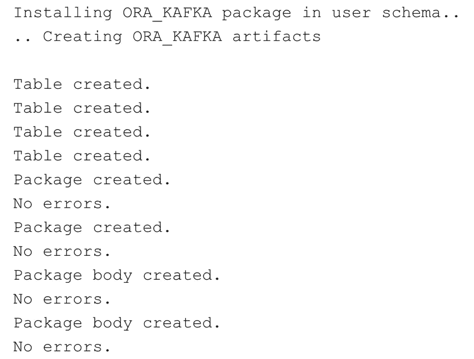

步骤 16:在 PDB 中的用户下，用 OSaK 过程 ORA_KAFKA 注册集群。寄存器 _ 集群

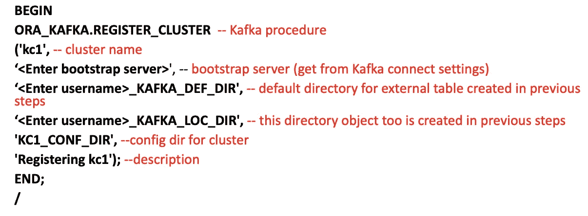

步骤 17:创建 oracle 数据库表——它需要与我们 Kafka 主题中的消息具有相同的模式。如果您的邮件是 CSV 格式，则这一步是必需的。

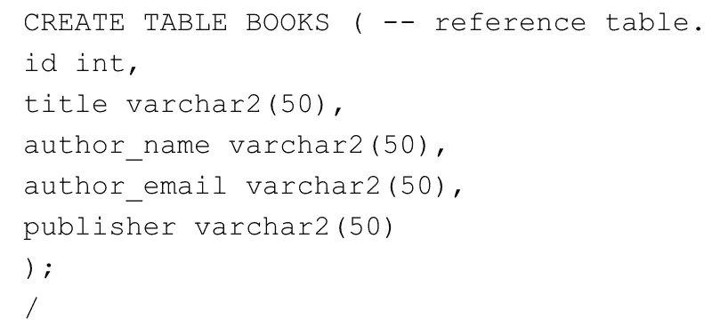

步骤 18:为 Kafka 主题创建视图

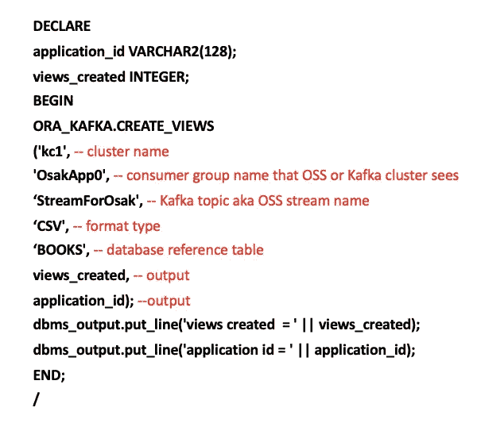

由于我设置了 3 个分区，我看到了以 KV_ <cluster_name>_ <group_name>_TOPIC_ <num_of_partition>格式创建的三个视图:</num_of_partition></group_name></cluster_name>

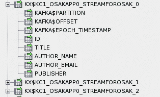

步骤 19:产生数据流

在 web 控制台上，转到您的流并单击生成测试消息


以您设置的模式形式输入 csv，然后单击“生成”

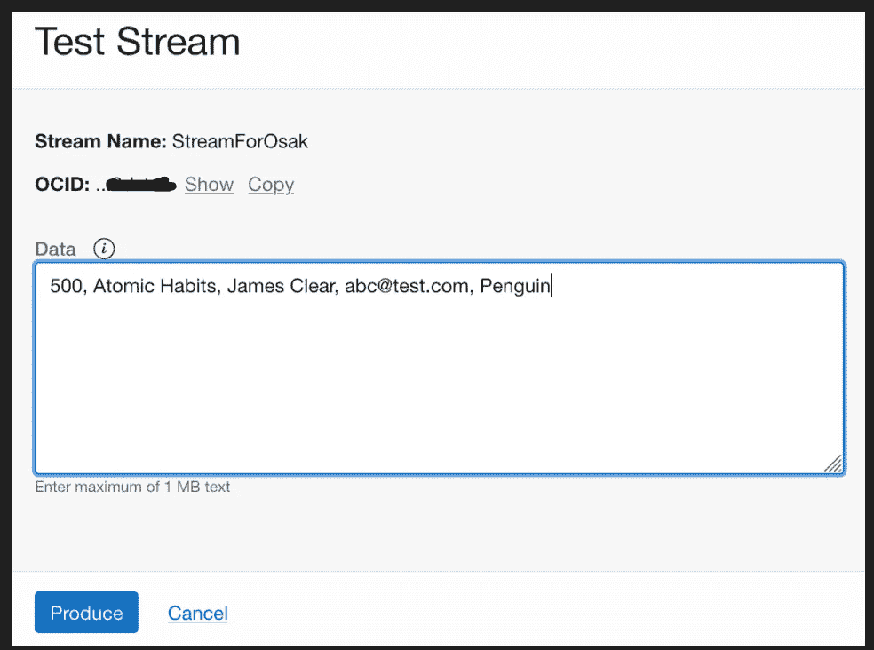

单击 load message，您将看到消息被加载到哪个分区

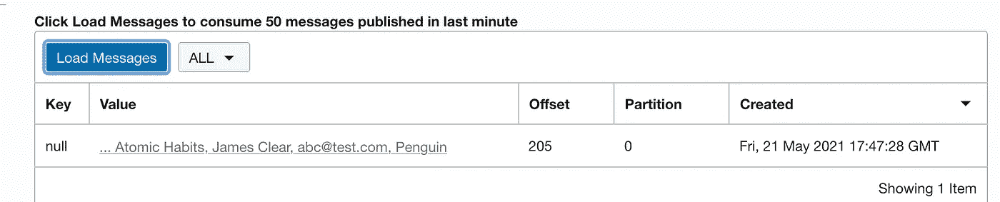

你可以看到这是在分区 0。转到 SQL dev 并打开分区 0 的视图。

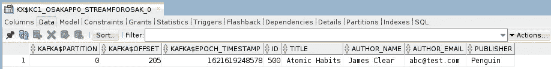

您还可以使用 Java/Python 或 OCI SDK 中的标准 Kafka Producer API 进行流服务，以向流服务流生成消息

每条消息在视图中都有自己的一行，但数据不会持久化。

OSaK 获取并存储元数据信息，如消息的偏移量、它的分区以及附加列中的时间戳。

OSaK 也支持 JSON 格式。如果要输入 JSON 格式的数据，就不需要引用表了。在这种情况下，您可以使用这种格式为 Kafka 主题创建视图:

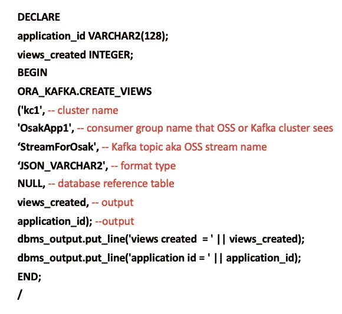

输出将以键、值:

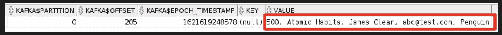

该值将只存储整个输入—在该输入的情况下是 json blob。

这篇博客介绍了 OSaK 的设置和从数据流中读取数据。在下一篇文章中，我将探索更多关于使用 Python 生成 OCI 流和创建实时分析仪表板的内容。

快乐流媒体！