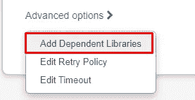

# 使用 Spark 3 将您的 Cosmos DB 更改传输到 Databricks

> 原文：<https://towardsdatascience.com/stream-your-cosmos-db-changes-to-databricks-with-spark-3-8044b237b853?source=collection_archive---------10----------------------->


图片来自[皮克斯拜](https://pixabay.com/?utm_source=link-attribution&utm_medium=referral&utm_campaign=image&utm_content=1756274)

## Azure Cosmos DB Apache Spark 3 OLTP 连接器使用 Python 在 Databricks DBR 8.0+中实现

Cosmos DB 越来越受欢迎，因为它的低延迟响应使它更适合作为事务数据库解决方案。然而，Cosmos DB 中的数据也可能需要用于数据分析和报告。在这种情况下，我们需要使用更合适的工具。Spark 通常被认为是大数据分析的最佳选择。

Databricks 作为一个现代化的云数据平台，构建在 Spark 之上，提供了许多很酷的功能，以改善开发体验和实际的数据处理性能。因此，它被各行各业的许多公司所使用。

微软曾经有大量关于 Spark 2 连接器的资源和参考资料。然而，当涉及到基于 Spark 3 的 Databricks DBR (Databricks 运行时版本)8.x 时，我们必须使用相应的 Spark 3 连接器。不幸的是，还没有太多的文档和示例可供参考。

在本文中，我将提供这种场景的一个简单示例，以及我们遇到的一些常见问题及其解决方案。

# 建立结构化流


来自 [Pixabay](https://pixabay.com/?utm_source=link-attribution&utm_medium=referral&utm_campaign=image&utm_content=5765785) 的[约尔格·维耶里](https://pixabay.com/users/sonyuser-11407366/?utm_source=link-attribution&utm_medium=referral&utm_campaign=image&utm_content=5765785)的图片

结构化流是一个基于 Spark SQL 引擎的可扩展和容错的流处理引擎。您可以像表达静态数据上的批处理计算一样表达您的流计算。Spark SQL 引擎将负责增量地、持续地运行它，并随着流数据不断到达而更新最终结果。

Cosmos DB Change Feed 的官方文档建议使用 Azure 函数来接收增量数据。有了 Databricks，我们不必再增加一层，因为 Spark Streaming 是解决这一问题的完美方案。

现在，跟着我一步一步地学习这些教程。这并不困难，你可以在 10 分钟内将你的火花传送到 Cosmos DB change feed。

## 1.准备连接详细信息

我们需要拥有 URI 端点和我们将要读取的来自 Cosmos DB 的密钥。建议使用只读键，因为我们不会将任何内容写回 Cosmos DB。授予最低要求的权限总是一种好的方式。

这个 URL 可以在 Azure 门户的 Cosmos DB 概述页面上找到。


在同一个页面上，您还需要记下数据库的名称。


然后，可以在“密钥”选项卡中找到只读密钥。


还强烈建议将这些连接详细信息放入 Azure Key Vault，这样我们就不会将它们作为明文代码放在 Databricks 笔记本中，这将成为一个严重的安全漏洞。

## 2.安装 Cosmos DB Spark 3 连接器

在使用连接器之前，我们需要将库安装到集群上。转到 Databricks 工作区中的“Compute”选项卡，选择要使用的集群。然后，导航到“库”选项卡，并单击“安装新的”。


之后选择 Maven 作为库源，输入坐标:

```
com.azure.cosmos.spark:azure-cosmos-spark_3-1_2-12:4.0.0
```


请注意，根据您阅读我的文章的时间，版本可能会有所不同:)最好从 Azure 文档中查看最新版本。

## 3.在 Databricks 中配置 Cosmos DB 连接的读取

一旦我们将 Cosmos DB 只读密钥放入 Azure Key Vault，我们需要在 Databricks 工作区中创建一个秘密范围。这不是本文的重点，所以我将跳过它。如果您不知道如何创建 Databricks secret 作用域，请遵循以下文档。

<https://docs.microsoft.com/en-us/azure/databricks/security/secrets/secret-scopes>  

在创建 Python 字典作为变更提要配置对象之前，我们需要从 Azure Key Vault 中读取连接细节。

```
cosmosDatabaseName = dbutils.secrets.get('YOUR-KEY-VAUL', 'DB_NAME')
cosmosContainerName = dbutils.widgets.get("container_name")
cosmosEndpoint = dbutils.secrets.get('YOUR-KEY-VAUL', 'URI_ENDPOINT')
cosmosMasterKey = dbutils.secrets.get('YOUR-KEY-VAUL', 'READ-ONLY-KEY')
```

是否使用`widgets`作为容器名称是可选的。在我的例子中，我希望参数化容器名，以便以后可以重用这个笔记本。

现在，我们可以构造配置对象了。

```
# Initiate Cosmos Connection Config Object
changeFeedCfg = {
  "spark.cosmos.accountEndpoint": cosmosEndpoint,
  "spark.cosmos.accountKey": cosmosMasterKey,
  "spark.cosmos.database": cosmosDatabaseName,
  "spark.cosmos.container": cosmosContainerName,
  "spark.cosmos.read.partitioning.strategy": "Default",
  "spark.cosmos.read.inferSchema.enabled" : "false",
  "spark.cosmos.changeFeed.startFrom" : "Now",
  "spark.cosmos.changeFeed.mode" : "Incremental"
  "spark.cosmos.changeFeed.maxItemCountPerTriggerHint" : "50000"
}
```

一些配置对象需要一些解释:

*   `spark.cosmos.read.partitioning.strategy`

这是为了定义所使用的分区策略(默认、定制、限制或主动)。通常，我们可以使用默认设置，以便动态计算分区数量，从而保持优化。

*   `spark.cosmos.read.inferSchema.enabled`

我建议不要启用推断模式，尽管它看起来很聪明。当我们在 Cosmos DB 中有相对大量的文档时，推断出的模式很有可能是错误的。此外，如果 Cosmos 容器的模式不一致，几乎肯定会导致模式错误。

我们可以读取原始的 JSON 字符串，然后使用 PySpark 对其进行处理。

*   `spark.cosmos.changeFeed.startFrom`

此项告诉连接器从哪里开始。通常，我们可以将它设置为“Beginning ”,这样流的第一批将从表的开头开始。

然而，如果我们从一个巨大的容器中阅读。更聪明的做法是从“现在”开始读取，并在单独的作业中加载历史数据，以提高性能和健壮性。

*   `spark.cosmos.changeFeed.mode`

这必须设置为`Incremental`,因为我们将从更改提要中读取。

*   `spark.cosmos.changeFeed.maxItemCountPerTriggerHint`

这是可选的。但是，如果您在 Cosmos DB 端的更新不一致，这将非常有用。例如，有些批次很小，而有些批次很大。该选项将尝试每个触发器处理有限数量的项目，以便当有非常大的一批项目到达时，不会立即破坏您的集群。

## 4.配置流数据帧的写入

为了简化本教程，我们不必为 Spark 流编写复杂的配置对象。我们唯一需要的是检查站的位置。

```
writeCfg = {
  "checkpointLocation": "/FileStore/checkpoints/"
}
```

检查点非常重要，因为如果我们的 Spark 流被计划或非计划地停止，它会记住检查点，以便我们可以从那里读取。

Cosmos Spark 连接器将创建一个子目录，这样我们就不必为当前正在读取的特定容器指定名称。

## 5.创建一个表来接收数据

我们需要创建一个表，然后才能写入从 Cosmos DB Change Feed 接收到的增量数据。如果您没有像我一样使用推断模式特性，那么该表应该定义如下。

```
CREATE TABLE IF NOT EXISTS <schema_name>.<table_name> (
  _rawBody STRING,
  id STRING,
  _ts LONG,
  _etag STRING
)
USING DELTA
LOCATION '<dbfs_location>';
```

如果您使用推断模式，您将需要用相应的列定义表。

## 6.建立火花流

现在我们可以使用配置对象来建立流。以下代码将建立流，并将其读入 Spark 数据帧。

```
df = spark.readStream.format("cosmos.oltp.changeFeed").options(**changeFeedCfg).load()
```

您可能想对数据帧进行一些转换。之后，我们可以将它写入刚刚创建的表中。

```
df.writeStream.format('delta').outputMode('append').options(**writeCfg).table('<schema_name>.<table_name>')
```

# 创建数据块作业


图片由 [www_slon_pics](https://pixabay.com/users/www_slon_pics-5203613/?utm_source=link-attribution&utm_medium=referral&utm_campaign=image&utm_content=2539844) 发自 [Pixabay](https://pixabay.com/?utm_source=link-attribution&utm_medium=referral&utm_campaign=image&utm_content=2539844)

我们实际上已经完成了笔记本。如果您运行它，它将建立 Spark 流，并开始接收来自 Cosmos DB 的任何更改，并将其写入表中。

但是，强烈建议将所有内容都放在一个作业中，这样我们就可以使用作业集群，而不是与所有其他活动共享的交互式集群。此外，如果我们将流作为一项工作来运行，它在可靠性方面会更有信心。

导航到 Databricks 工作区中的“作业”。输入任务名称，并选择我们刚刚创建的笔记本。


不要忘记添加连接器作为依赖库。



# 解决纷争


由[免费提供的图像-来自](https://pixabay.com/photos/?utm_source=link-attribution&utm_medium=referral&utm_campaign=image&utm_content=1209011)[像素](https://pixabay.com/?utm_source=link-attribution&utm_medium=referral&utm_campaign=image&utm_content=1209011)的照片

在我们的开发过程中，因为连接器在文档方面相对不成熟，我们发现了以下两个问题。希望如果你也遇到他们，这能帮你节省一些时间。

## 1.火花流总是从开始开始

如果您在 cosmos DB 中有一个相对较大的容器，您可能希望在当前时间戳开始流传输，并在单独的活动中加载历史数据。

但是，如果更改源已设置为`Beginning`，并且检查点未被清除，则流可能无法从“现在”开始，因为检查点“告诉”它:“嘿，您应该从我们之前到达的地方开始！”

```
"spark.cosmos.changeFeed.startFrom" : "Beginning"
# v.s.
"spark.cosmos.changeFeed.startFrom" : "Now"
```

解决方案是从 DBFS 手动删除检查点，或将检查点更改为新路径。然后，论点“现在”将正确地发挥作用。

## 2.异常:readtimeout 异常

在流运行一定时间后，您可能会看到此异常。

```
azure_cosmos_spark.io.netty.handler.timeout.ReadTimeoutException
```

出现此异常的原因之一可能是群集的当前运行节点太少，因此可用性将成为瓶颈。此外，如果突然有一个大批量进入，一个相对较小的集群将无法按时完成处理。

因此，解决方案有两个步骤。

首先，我们可以将“最低工资”增加到至少 2 人。如果你真的在处理高速运动，那就给它更多。


第二个解决方案是为作业添加重试策略。因此，当作业失败时，它将在一段时间后重新运行。

我们可以在“高级选项”中找到重试策略


然后，由您决定设置重试的次数以及等待重试的时间。


# 摘要


图片由 [StartupStockPhotos](https://pixabay.com/users/startupstockphotos-690514/?utm_source=link-attribution&utm_medium=referral&utm_campaign=image&utm_content=593333) 来自 [Pixabay](https://pixabay.com/?utm_source=link-attribution&utm_medium=referral&utm_campaign=image&utm_content=593333)

在本文中，我使用了一个简单的例子来演示如何使用 Azure Cosmos DB Spark 3 OLTP 连接器建立 Spark 结构化流来读取 Cosmos DB change feed。我相信这是将增量变化从 Cosmos DB 读入 Databricks workspace 进行进一步数据分析的最简单方法。

<https://medium.com/@qiuyujx/membership>  

**如果你觉得我的文章有帮助，请考虑加入灵媒会员来支持我和成千上万的其他作家！(点击上面的链接)**