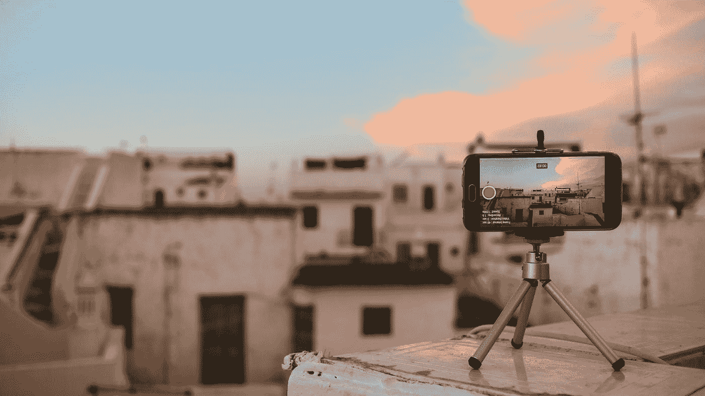
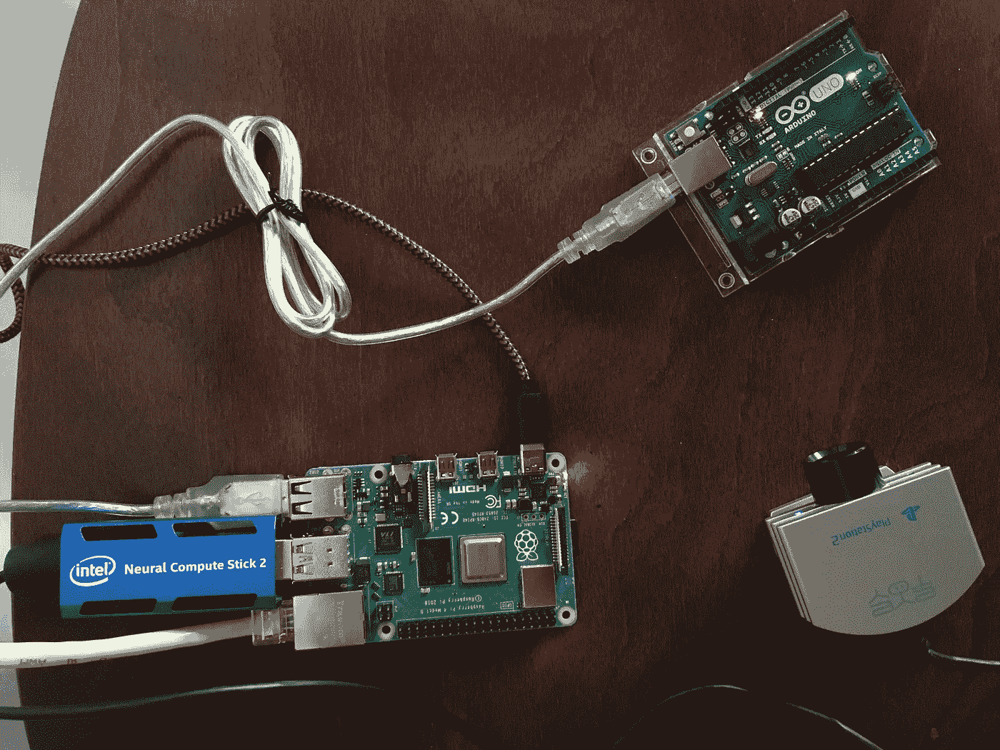
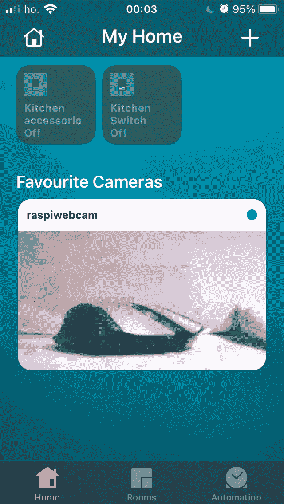
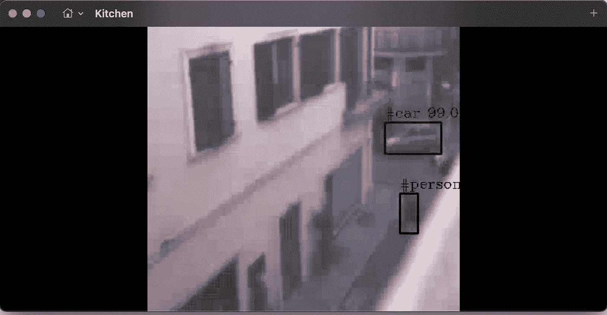

# 通过自定义人工智能层流式传输到 Apple Home

> 原文：<https://towardsdatascience.com/streaming-to-apple-home-with-a-custom-ai-layer-b8ccebfc09?source=collection_archive---------30----------------------->



由[马克·德容](https://unsplash.com/@mrmarkdejong?utm_source=medium&utm_medium=referral)在 [Unsplash](https://unsplash.com?utm_source=medium&utm_medium=referral) 上拍摄的照片

## 如何将旧网络摄像头用作现代安全摄像头

# 介绍

家庭自动化系统如今变得越来越受欢迎。智能家居中可以实现的一个功能是安全摄像头。

我选择不花钱买一个全新的摄像头，而是使用一个简单的网络摄像头，并将其传输到远程控制应用程序。

有趣的是，使用这种**定制**解决方案，可以很容易地在图像上添加**层**信息**，并且对于我们数据科学家来说，限制是天空(或相机分辨率)。**

# 设置

在这里，我将描述一个简单的设置，一个网络摄像头和一个 RaspberryPi 连接到一个[神经计算棒](https://software.intel.com/content/www/us/en/develop/hardware/neural-compute-stick.html)。

它们可以组装在一起，构建一个集成了人工智能的网络服务器。硬件连接很简单，人们只需注意将 NCS 连接到 Raspberry 的 *USB3.0* 端口，即可获得**更好的性能**。

网络摄像头记录视频，Pi 获取帧，并使用计算棒**在它们上面添加一些信息**。



设置。图片作者。

# 流式传输帧:网络服务器

我们需要发送帧，为此我们将使用一个简单的 web 服务器，通过 http 将 ffmpeg 兼容的帧发送到给定的端口。

webserver 的核心在下面的代码中:每次调用 enerator 时，捕捉一个帧，调用一个模型并提供结果图像，这一切都非常快。

```
def generator():    
    import io
    global model
    cap = cv2.VideoCapture(0)
    while True:
        ret, frame = cap.read()
        frame = model.process(frame)
        encode_return_code, image_buffer = cv2.imencode('.jpg', frame)
        io_buf = io.BytesIO(image_buffer)        yield (b'--frame\r\n'+               b'Content-Type: image/jpeg\r\n\r\n' + io_buf.read() + b'\r\n')@app.route("/video")
def video():
    return Response(generator(), mimetype='multipart/x-mixed-replace; boundary=frame')
```

使用 [Flask](https://flask.palletsprojects.com/en/2.0.x/) 和 [OpenCV](https://flask.palletsprojects.com/en/2.0.x/) 可以从通过 USB 连接到 RPi 的摄像机获取视频帧序列，然后将它们流式传输到可以使用许多不同工具访问的网页。

# 人工智能层

当捕捉到帧时，可以使用图像分类模型对其进行解析，并将关于图像中存在哪个对象的信息添加到帧中。

使用 openVINO，分类过程将像

```
exec_net.infer(inputs={self.input_blob: images})
```

另一个更有趣的可能性是使用 YOLO 模型。经典方法将模型应用于多个位置和尺度的图像。图像的高分区域被认为是检测。

YOLO 采用了一种完全不同的方法。它将一个**单个**神经网络应用于整个图像。该网络将图像分成多个区域，并预测每个区域的边界框和概率。因此，**可以非常高效地识别一幅**图像**中的多个物体**。

在这里，我描述了两个例子:一个**分类器**和 **YOLO** ，但是，当然你也可以运行任何模型，只要简单地[将它转换成与神经计算棒](/convert-a-tensorflow2-model-to-openvino-c498f526c60b)兼容的格式。

# 向移动设备发送视频:Homebridge

一个人有了视频帧，就有可能**将它们流式传输到其他设备**，我最喜欢的方法是将其流式传输到专门用于家庭管理的应用程序，这样它们最终可以与其他设备集成。在这种情况下，我使用了 **Homebridge** 。

Homebridge 是一个非常强大的工具，可以连接各种设备，甚至是定制设备，我们很快就会看到苹果家庭基础设施。

  

## ffmpeg 插件

在这个例子中，我选择了一个使用 [ffmpeg](https://ffmpeg.org) 来读取这些帧的插件。

<https://github.com/Sunoo/homebridge-camera-ffmpeg>  

这应该被配置为从端口 *:5000* (或者配置在 Flask 中的端口)上的*本地主机*读取帧。也可以为设备和其他设置选择名称。

```
"accessories": [
{
            "name": "Camera FFmpeg",
            "cameras": [
                {
                    "name": "raspiwebcam",
                    "videoConfig": {
                        "source": "-f mjpeg -i [http://localhost:5000/video](http://localhost:5000/video)"
                    }
                }
            ],
            "platform": "Camera-ffmpeg"
        }
    ]
```

# 苹果 Home 应用

当 **Homebridge** 设置好后，服务器**启动并运行**我们就可以在 [Apple Home app](https://www.apple.com/ios/home/) 中检查来自网络摄像头的图像了。

正如你在下面的截图中所看到的(我知道来自网络摄像头的图像质量很差)

[基于初始的图像分类器](https://github.com/fvalle1/ai_server/blob/master/server/classify.py)可以添加关于模型当前正在看到哪个对象的信息。



苹果首页截图。图片作者。

# 跑步 yolo

<https://pjreddie.com/darknet/yolo/>  

一个简单的脚本可以用来处理帧和检测帧上的物体



苹果主页上的 yolo。图片作者。

现在我们已经准备好在相机上捕捉[每一个有趣和可爱的东西](https://twitter.com/search?q=%23CaughtOnNestCam&src=typed_query)！

# 密码

https://github.com/fvalle1/ai_server/tree/raspbian 的[是一个仓库，里面有让所有这些正常工作所需的所有脚本和代码片段。](https://github.com/fvalle1/ai_server/tree/raspbian)