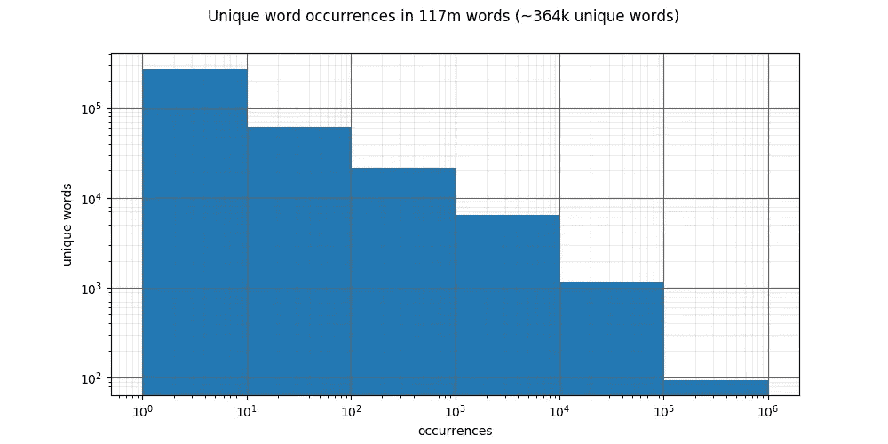
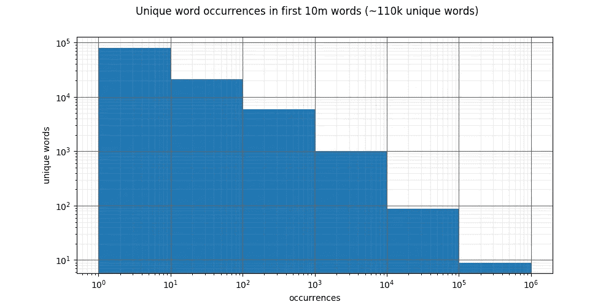
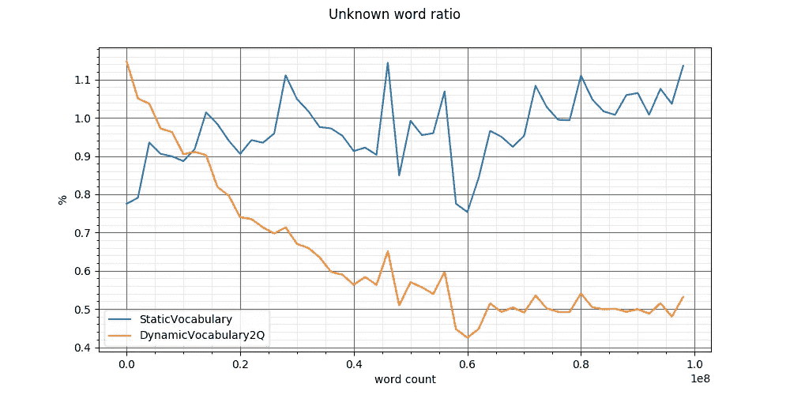
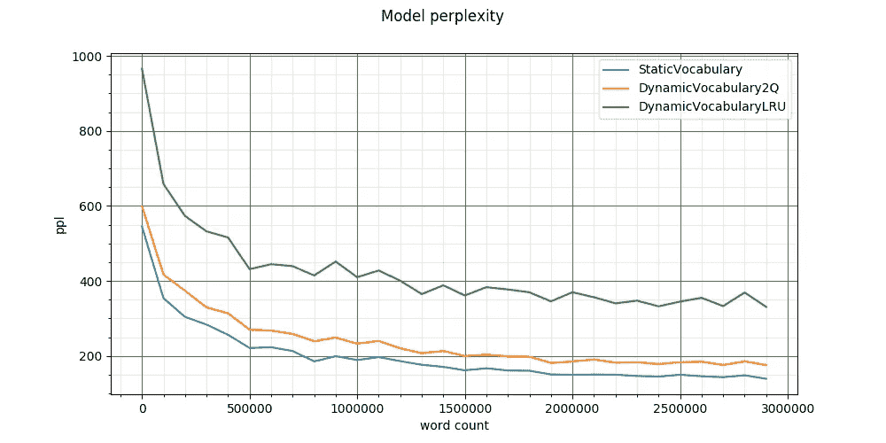
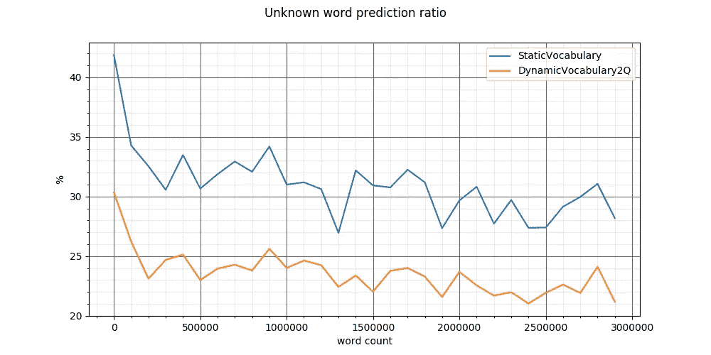

# 自然语言建模的流式词汇:动态单词替换

> 原文：<https://towardsdatascience.com/streaming-vocabulary-for-natural-language-modeling-dynamic-words-replacement-efa5b04cad81?source=collection_archive---------26----------------------->

## [实践教程](https://towardsdatascience.com/tagged/hands-on-tutorials)

图片由 [Eli Digital Creative](https://pixabay.com/users/elifrancis-1160677/) 来自 [Pixabay](https://pixabay.com/)

最近，我一直在研究如何在我的网页内容推荐系统中使用递归神经网络模型。虽然这似乎是 RNN 的一个自然应用:人们一个接一个地访问 web 文档，并且在这些序列中可能存在可消化的因果关系，但一个巨大的挑战初看起来变得显而易见。新文档不断出现，而模型的词汇是不可变的。为了应对这种情况，一种可能性是训练模型推荐最近几天访问过的文档，部署并开始发布推荐，在下一次训练迭代之前忽略所有新发布的文档，在下一次训练迭代之后，必须从头开始训练另一个模型。另一种可能性是找到一种方法来替换模型词汇表中的文档 id，用新文档替换不再被访问的旧文档。后者的巨大优势是培训过程的连续性。也就是说，一个单一的模型可以持续很多年，不断更新，并记住更长期的模式。我发现了一个有趣的方法来实现这一点。让我分享一下我的发现。

# 流式自然语言模型

我要换个方式，用一个自然语言模型来说明我的发现。虽然乍看起来，这个主题似乎与推荐系统无关，但两者有一些重要的共同点。推荐系统中的令牌(“单词”)是可以被推荐的项目，“文本”是由单个人消费(观看)的项目序列。在这种情况下，预测“文本”中的下一个“单词”是推荐系统的目标。动态令牌替换在两个域中都适用。我选择了自然语言建模，因为它更受欢迎，也更容易验证。

我将建立一个简单的 LSTM 模型，它不断地接受新闻文章，将学会预测文本中的下一个单词。为什么是“流”？我不会在同一个数据集上训练 epochs，相反，我会假设文本数据是无限的，并且没有办法预先检查它。重要的是，我将比较具有静态词汇表的基线模型与具有动态词汇表的相同模型的性能。

但是首先，让我定义一下什么是静态和动态词汇表。

完整的代码可在[这里](https://github.com/grinya007/streaming_rnn)找到

当静态词汇足够大，并且您有足够的资源来训练具有大量类的神经网络时，模型很可能会表现良好。但重要的不仅仅是字数。有时，新词会出现。例如，如果你碰巧在 2018 年训练了一个超大质量的 10 亿字模型，它不会知道“covid”这个词，不是吗？从某种程度上来说，其他很多词也是如此。单词出现，变得频繁，变得不频繁，不断消失。当然(与推荐系统不同，在推荐系统中，被推荐的不是单词，而是项目)在 NLP 中，这个问题并不是很饱和。但是它是存在的，如果有一种方法可以根据最新的趋势改变词汇，那将会很方便。如果过程是自动化的，那就更好了。

当谈到维护最频繁访问的有限对象集时，首先想到的是广泛使用的 [LRU](https://en.wikipedia.org/wiki/Cache_replacement_policies#Least_recently_used_(LRU)) 缓存回收算法。

完整的代码可在[这里](https://github.com/grinya007/streaming_rnn)

尽管这个实现解决了新单词的起源问题，但是它有一个严重的缺陷。具有低范围频率的单词必须竞争获得索引。这导致许多单词消失，并在词汇表中以不同的索引重新出现。反过来，这在神经网络中产生大量噪声，并最终导致模型的更高复杂度。当然，根据应用的不同，这可能不是一个大问题。但是有一种更好的动态单词替换方法。

将第二个队列添加到动态词汇表的想法同样源于缓存算法。特别是 1994 年提出的 [2Q 算法](http://www.vldb.org/conf/1994/P439.PDF) (PDF)。如今，2Q 算法已经过时了。自适应替换算法(例如 [ARC](https://en.wikipedia.org/wiki/Adaptive_replacement_cache) )以类似的计算成本输出更高的命中率。但在词汇应用中，命中率并不靠前。这里更重要的特性是 2Q 相似算法能够阻止非频繁项在主队列中的驻留。这意味着，与 DynamicVocabularyLRU 中不同，一个在整个宇宙中一个世纪才发音一次的单词(如“kakorrhaphiophobia”)不会通过从词汇表中驱逐其他更频繁的单词来获得索引。

完整的代码可在[这里](https://github.com/grinya007/streaming_rnn)

在这种实现中，未知单词的概念获得了新生。这不一定是件坏事。根据应用程序的不同，较低的模型复杂度可能会超过对更高的词汇表多样性的需求。直观上，两者是有联系的。在其他条件相同的情况下，你可以通过缩小词汇量和让更多的不常用词保持未知来降低困惑。

就数据而言，在快速搜索了大量新闻文本后，我发现了 Kaggle 的所有新闻数据集。它包含 143，000 篇新闻文章，时间跨度约为 3 年。这足以说明*新频繁出现的词语*的问题。我下载了数据集，将 3 个 CSV 文件连接在一起，按“日期”列进行排序，并将整个数据集保存为一个文件。然后我编写了一个适合数据集的基本标记器，并开始研究它的特性。

完整的代码可在[这里](https://github.com/grinya007/streaming_rnn)

对于自然语言来说，词频分布看起来相当标准。在整个数据集中出现 100k 到 1m 次的有 90 个词，出现 1 到 10 次的有 250k 个词。

在数据集的前 10m 个单词中，词频分布的比例看起来非常相似。

这就是为什么我一直在看前 1000 万个单词。当我使用数据集的 1000 万个单词时，文本生成器停在了日期为 2016 年 2 月 19 日的文章上。让我们想象这一天就是今天。我们被要求创建一个模型，提供今天的所有新闻，预测明天的股票价格。手头的数据是去年 14k 篇新闻文章中的这 1000 万字和股价历史(实际上，时间跨度更大，但这都是假设的情况)。该模型应该从今天开始预测，并随着时间的推移不断从实际数据中学习。为了学会将今天的词汇映射到明天的价格，首先，我们建立一个全面的词汇。

我在数据集的其余部分比较了 static vocabulary 2q 和 DynamicVocabulary2Q 的性能。这两个词汇表都被输入了来自数据集中前 1000 万个单词的全部 110 万个唯一单词，然后被询问 1 亿次数据集中的每个下一个单词是否都出现在单词 2idx 中。

在 DynamicVocabulary2Q 稳定在大约 0.5%的未登录词之前，需要相当大量的文本。但更有趣的是，统计词汇中未知词的比例有明显的增长趋势。这证明了语言的核心是随着时间而变异的。由于这种现象，使用静态词汇的长期自然语言模型的性能不可避免地会下降。

现在来看看实际的模型。不幸的是，我负担不起上述价格预测器的建立和训练，以至于其结果与上述发现相吻合。本节的重点是说明动态词汇表的灵活性是以模型的更高复杂度为代价的。我建立了一个更小的模型，它没有任何特殊用途，只是学习预测文章中的下一个单词。

完整的代码可在[这里](https://github.com/grinya007/streaming_rnn)获得

超参数如下:词汇表的大小是 10k 个单词，嵌入层输出的维数是 256，隐藏状态的维数是 256，有两个 LSTM 层，其间有 0.2 的下降。

用三种不同的词汇对 RNN 进行了三次训练:静态词汇、动态词汇和动态词汇。为了实验的纯粹性，所有条件都是相同的:我跳过了前 50k 篇新闻文章(为了达到文章在发表日期方面更密集的程度，以避免不必要的噪音)，消耗 500k 个单词来预热词汇(或者填充，在静态词汇的情况下)，然后在接下来的 3m 个单词上训练网络，单词序列的大小为 10，一批的大小为 100。平均困惑度每 1000 批储存一次。[这里](https://github.com/grinya007/streaming_rnn/blob/main/train.py)上面两段是用 Python 写的。

正如所料，由于词汇表的高度不稳定性，具有 DynamicVocabularyLRU 的模型表现出最差的性能。其他两者的表现相当接近，静态词汇如预期的那样占优势。虽然，这样的比较不能只基于困惑的衡量。如果我们设想一种退化的情况，其中词汇表由单个标记组成:UNK(未知单词)，这样的模型在一系列 UNK 之后立即学习以 100%的概率预测 UNK。它的困惑度将会是 1。当一个词汇表包含一个 UNK 和 10k 个在文本中从未使用过的垃圾单词时，也会出现类似的情况。这样的模型在猜测下一个单词时也很快变得非常确定。将它的困惑与一个拥有同样规模的更有意义的词汇的模型进行比较是不公平的。

出于好奇，我看了看 UNK 在整个训练中有多少次成为最热门的预测。我排除了 DynamicVocabularyLRU，它从不预测 UNK，因为它“知道”所有的单词。

尽管两个词汇表的大小相同，但 UNK 成为最佳猜测的频率在静态词汇表中明显更高。动态词汇模型的语言更加多样化，因此具有更高的复杂性。

总结一下，DynamicVocabulary2Q 有效地遵循了语言的核心，而后者随着时间而变化。它温和地驱逐那些不再流行的单词，而不会在神经网络中产生太多噪音。输出的措辞更加多样化。该模型可以训练很长时间而不会过时。所有这些都是以更高的困惑为代价的。