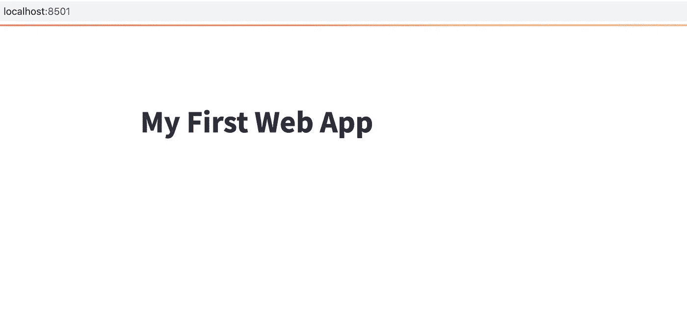
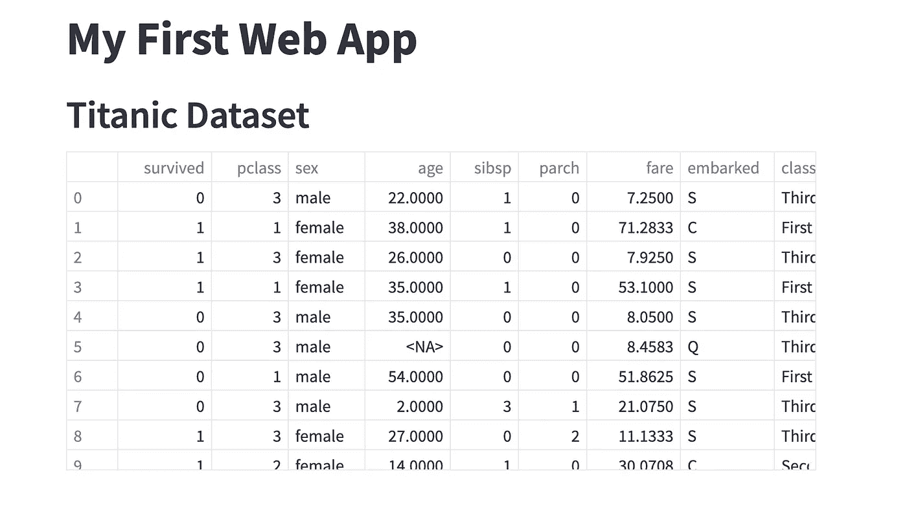
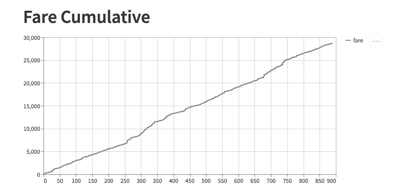
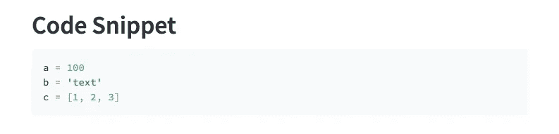
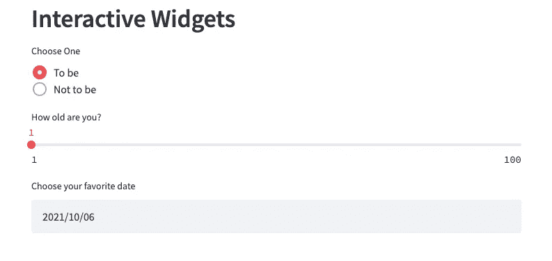
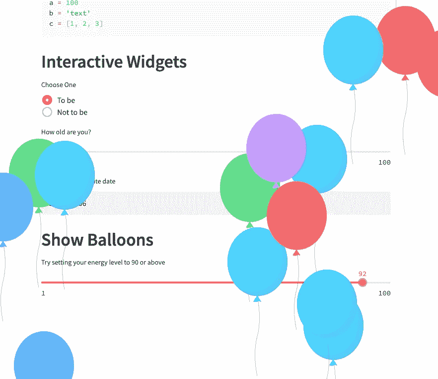

# Streamlit 1.0 刚刚登陆——5 分钟教程

> 原文：<https://towardsdatascience.com/streamlit-1-0-just-landed-a-5-minute-tutorial-8eb00d6e5ff8?source=collection_archive---------8----------------------->

## 数据科学 web 应用变得简单


照片由阿莱西奥·弗尔兰在 [Unsplash](https://unsplash.com?utm_source=medium&utm_medium=referral) 上拍摄

网络应用仍然是任何公司或任何项目的重要渠道之一。原因很简单——web 应用程序是跨平台的，现在几乎不需要学习曲线。对于数据科学家来说，我们没有接受过 web 开发人员的培训，制作 web 应用对我们来说从来都不是最简单的事情。幸运的是，已经有一系列 web 框架可以使 web 应用程序的开发变得更加容易。

其中， [streamlit](https://streamlit.io/) 是一颗冉冉升起的新星，尤其是在数据科学领域，大多数用户将 Python 作为他们的日常工作语言。值得注意的是，streamlit 是完全 Python 友好的，因为您可以仅使用 Python 创建 web 应用程序。

几天前，streamlit 通过发布其官方 1.0 版本达到了一个里程碑，正如其官方博客所报道的那样。随着来自多个投资者的支持越来越多，我们可以预计 streamlit 会发展得更好。

无论如何，本教程是为你提供一个快速入门，我希望你只需要几分钟就可以启动你的第一个 web 应用程序。

不信？让我们把手弄脏吧。

## 装置

假设您使用 Python 已经有一段时间了，那么您应该熟悉创建虚拟环境和安装 Python 包。我习惯使用 conda 来管理虚拟环境，所以我们从使用 conda 创建虚拟环境开始。在终端中(如果您使用 Mac)，导航到您想要放置虚拟环境的目录，并运行以下命令。

1.  创建名为`st_web`的虚拟环境:

```
conda create -n st_web
```

2.激活虚拟环境:

```
conda activate st_web
```

3.安装 streamlit 软件包。虽然 conda 可以通过 conda-forge 安装 streamlit，但我遇到了一些问题。因此，我建议使用 Python 的官方包安装管理器`pip`，运行以下命令:

```
conda install pippip install streamlit
```

4.通过简单地找出安装的版本来检查安装。

```
streamlit --version
```

如果您发现您的版本不是 1.0.0，您可以通过运行以下命令来更新您的版本:

```
pip install -U streamlit
```

## 创建并启动您的应用程序

在目录中，让我们创建一个名为`st_first_app.py`的 Python 脚本文件。在该文件中，从以下代码行开始:

```
import streamlit as st

st.title("My First Web App")
```

在终端中，可以通过运行:`streamlit run st_first_app.py`来运行 web app。您将看到 web 应用程序在默认的 web 浏览器中自动弹出。



截图 Web 应用程序

## 显示数据集

熊猫是许多数据科学家的首选图书馆。作为关键数据结构，`DataFrame`用于处理类似电子表格的数据。让我们尝试在应用程序中显示一个`DataFrame`。如果您还没有在虚拟环境中安装 pandas，您可以通过运行`pip install pandas`来完成。

现在，我们的剧本变成了这样:

显示数据帧的代码

这是显示数据集的 web 应用程序的屏幕截图。



显示数据帧

## 展示身材

图表是展示信息的最佳方式，因为它们可以让用户对数据集有一个直观的印象。Streamlit 本身提供了不同种类的绘图，如折线图、面积图和条形图。为了简单起见，我们只添加下面几行代码:

```
st.header("Fare Cumulative")
fare = df['fare'].cumsum()
st.line_chart(fare)
```

这样，网络应用程序将会显示:



流线图

## 显示代码片段

有时，您希望显示特定操作的相关代码。您可以向 web 应用程序添加代码片段:

```
st.header("Code Snippet")
st.code("""a = 100
b = 'text'
c = [1, 2, 3]""")
```

这样，你会在应用程序上看到一个代码片段。



代码片段

## 交互式小工具

Streamlit 包括许多常用的 web 小部件，如单选按钮、滑块、文本字段、多选等等。为了简单起见，让我们通过将下面几行代码添加到脚本文件来查看一些小部件。

```
st.header("Interactive Widgets")
st.radio("Choose One", ["To be", "Not to be"])
st.slider("How old are you?", min_value=1, max_value=100)
st.date_input("Choose your favorite date")
```

您将在应用程序上看到这些微件。



交互式小工具

## 复活节彩色蛋

这是我必须提到的事情。你可以认为这是一个复活节彩蛋。只需将以下内容添加到您的脚本中。

```
st.header("Show Balloons")
your_energy = st.slider(
    "Try setting your energy level to 90 or above",
    min_value=1, 
    max_value=100
)
if your_energy >= 90:
    st.balloons()
```

你会看到一堆漂亮的气球！



气球

## 结论

在本文中，我向您展示了一些可以添加到 streamlit web 应用程序中的常见元素。正如你所看到的，所有的元素都很好地显示在网页上，你不用担心任何元素的布局。重要的是，它可能包括了构建数据科学或机器学习应用程序所需的所有元素。

没试过 Streamlit？是时候了！

感谢阅读这篇文章。通过[注册我的简讯](https://medium.com/subscribe/@yong.cui01)保持联系。还不是中等会员？使用我的会员链接，通过[支持我的写作。](https://medium.com/@yong.cui01/membership)