# 简化动手操作:增强应用程序用户体验的功能和技巧

> 原文：<https://towardsdatascience.com/streamlit-hands-on-features-and-tips-for-enhanced-app-user-experience-aef7be8035fa?source=collection_archive---------21----------------------->

## 通过真实的使用案例和完整的代码示例提升您的 Streamlit 技能

图片来源: [Pixabay](https://pixabay.com/photos/coding-programming-working-macbook-924920/)

# 介绍

[Streamlit](https://streamlit.io/) 是一个免费、开源的全 python 框架，使数据科学家能够快速构建交互式仪表盘和 web 应用，无需前端 web 开发经验。它于 2019 年首次引入数据科学世界，此后迅速在数据科学从业者和爱好者中流行起来。

我已经使用 Streamlit 几个月了，我的大部分数据可视化工作都是如此，我非常喜欢这个工具，以至于我甚至写了一个初学者教程 [*Streamlit Hands-On:从零到你的第一个出色的 Web 应用*](/streamlit-hands-on-from-zero-to-your-first-awesome-web-app-2c28f9f4e214) 。在该教程中，我向您展示了有关 Streamlit 的所有基础知识，并通过一个实际操作的示例向您展示了如何构建一个简单的交互式仪表板，以可视化美国各州的房地产市场洞察。

你的学习之旅不应该就此止步。现在，您已经了解了基础知识，并有了一些使用框架的经验，让我们通过学习和应用各种可以极大地增强您的应用程序用户体验的功能和技巧，将您的 Streamlit 技能提升到一个新的水平。

# 关于我们正在构建的应用程序

在本教程中，我们将构建一个住房市场洞察应用程序(类似于我们在[初学者教程](/streamlit-hands-on-from-zero-to-your-first-awesome-web-app-2c28f9f4e214)中构建的应用程序，但使用县级数据)。在构建这款应用的过程中，我们将详细讨论以下概念/功能，这些概念/功能可以极大地提高我们应用的可用性:

*   使用 *st.sidebar* 来组织输入小部件，使应用程序界面更加整洁
*   使用 *st.forms* 和 *st.form_submit_button* 一起批量输入小部件，并使用一个按钮提交
*   为输入小部件添加工具提示，为应用程序用户提供有用的信息
*   使用 *st.expander* 将一个容器插入您的应用程序，该容器仅在展开时显示额外信息
*   使用 *st.image* 将您的品牌标志添加到应用程序中

我们正在构建的住房市场应用程序将如下所示:

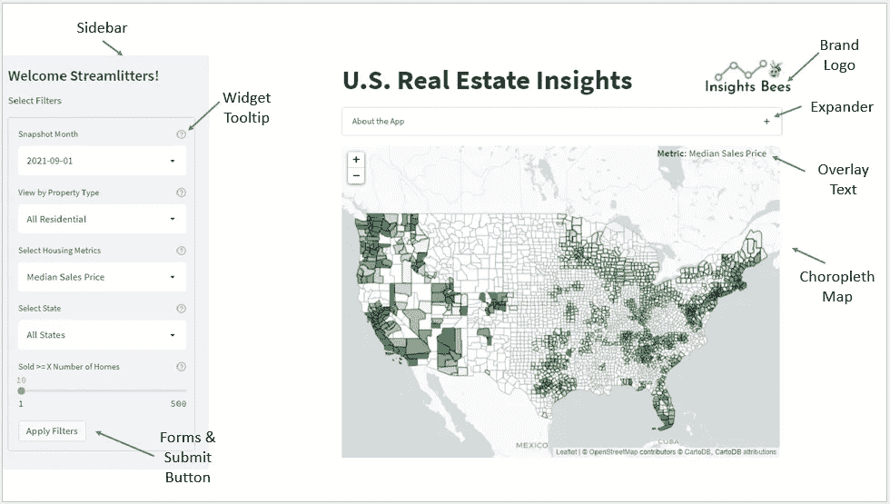

图片作者。数据来源: [Redfin 数据中心](https://www.redfin.com/news/data-center/)

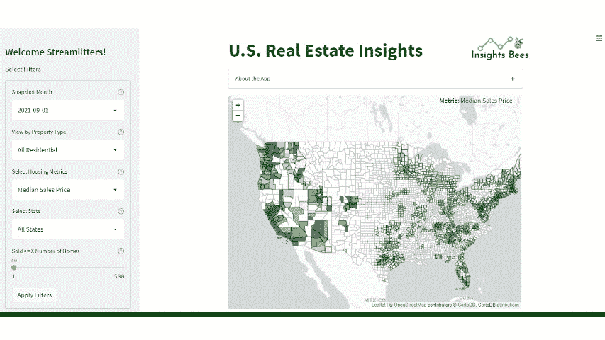

住房市场洞察应用程序演示(图片由作者提供。数据来源: [Redfin](https://www.redfin.com/news/data-center/)

# 下载数据

转到 [Redfin 的数据中心](https://www.redfin.com/news/data-center/)，向下滚动到“它如何工作”部分，并下载“县”一级的区域数据。该数据集包含自 2012 年 1 月以来县级的月度住房市场指标。

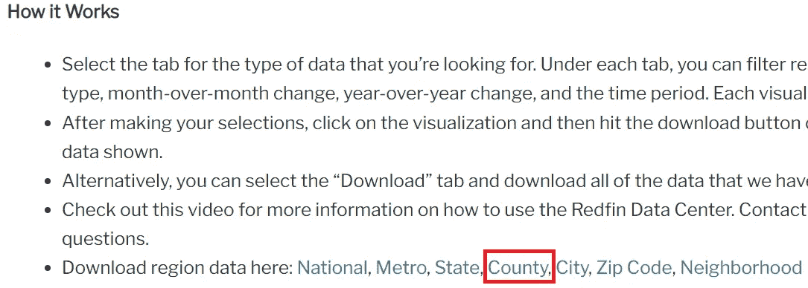

从 [Redfin 数据中心](https://www.redfin.com/news/data-center/)下载数据(图片由作者提供)

由于我们将在应用程序中创建一个交互式 choropleth 地图，我们还需要获得定义每个县的地理边界的 geojson 文件，以便在地图上绘制县。你可以进入[public.opendatasoft.com](https://public.opendatasoft.com/explore/dataset/georef-united-states-of-america-county/export/?disjunctive.ste_code&disjunctive.ste_name&disjunctive.coty_code&disjunctive.coty_name&sort=year)，向下滚动到“地理文件格式”部分，下载美国县界的 geojson 文件。

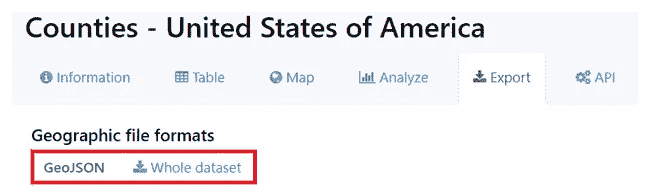

图片作者(数据来源:[https://public.opendatasoft.com/](https://public.opendatasoft.com/explore/dataset/georef-united-states-of-america-county/export/?disjunctive.ste_code&disjunctive.ste_name&disjunctive.coty_code&disjunctive.coty_name&sort=year))

需要注意的一点是，不幸的是，redfin 县级数据集没有县 FIPS 代码列，这是每个县的唯一标识符，稍后我们需要使用它作为与 geojson 文件连接的键。因此，我们需要下载第三个文件，该文件同时包含县名和 FIPS 代码。您可以从[nrcs.usda.gov](https://www.nrcs.usda.gov/wps/portal/nrcs/detail/national/home/?cid=nrcs143_013697)获取数据，并将其复制粘贴到一个. csv 文件中。

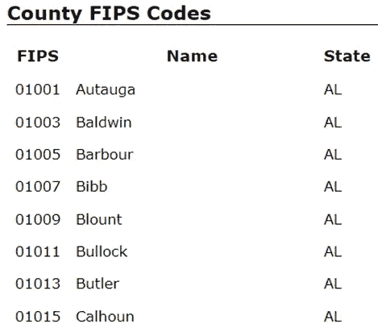

作者图片(数据来源:[美国农业部](https://www.nrcs.usda.gov/wps/portal/nrcs/detail/national/home/?cid=nrcs143_013697))

# 启动 Streamlit 并准备数据

本教程的目标是通过构建我们在[初学者教程](/streamlit-hands-on-from-zero-to-your-first-awesome-web-app-2c28f9f4e214)中创建的应用程序来探索和学习 Streamlit 的各种功能，因此我们不会花太多时间来解释数据准备部分是如何完成的(例如，使用 *@st.cache* 进行缓存，为什么以及如何使用 geojson 文件等)。)*。*这些概念已经在初学者教程中介绍过了。

但是，我在下面的代码中加入了注释，简要解释了代码的作用，以确保您阅读了注释并理解了数据准备过程。

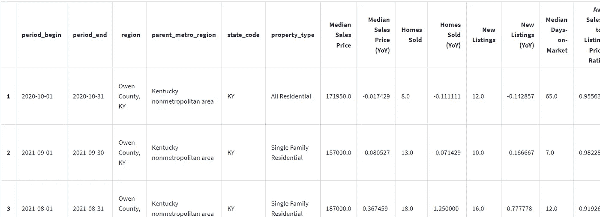

df_final(图片由作者提供)

# 向应用程序添加边栏

现在我们准备开始构建我们的应用程序！我们将首先向应用程序添加一个侧边栏，其中包含一条欢迎消息“欢迎简化者”。侧边栏功能非常适合在一个部分中组织所有的交互式输入小部件，并且可以扩展/折叠，以允许用户专注于应用程序中的内容。

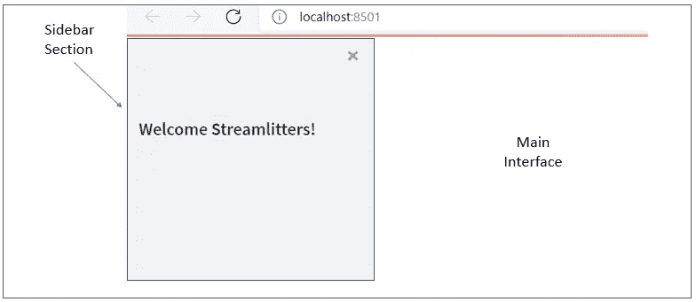

作者图片

# 向应用程序添加过滤器/输入部件

我们将在侧边栏部分添加一些过滤器，以便用户可以通过以不同方式分割数据来与我们的应用程序进行交互。这是通过使用各种 streamlit 输入小部件实现的，如 *st.selectbox、st.radio、st.slider* 等。要将小部件添加到侧边栏部分而不是主界面，我们只需使用 *st.sidebar.selectbox、st.sidebar.radio 等。*

为了帮助用户更好地理解每个过滤器的含义以及如何使用它们，我们还将通过在 *st.sidebar.selectbox()* 小部件中包含语法 *help='tooltip text'* 来为每个小部件添加一个工具提示。

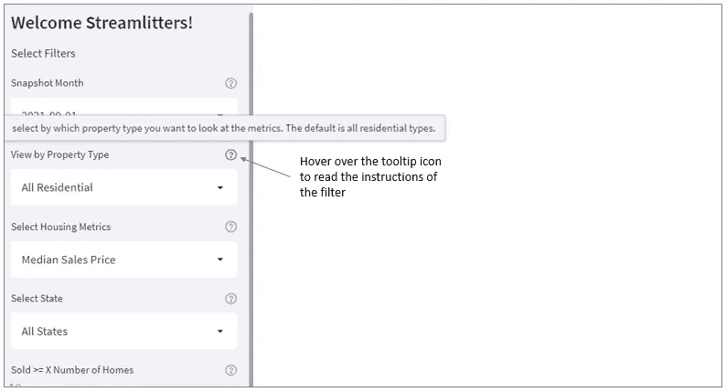

作者图片

现在让我们将这些过滤器/用户输入传递到数据框中，并检查它们是否正常工作。

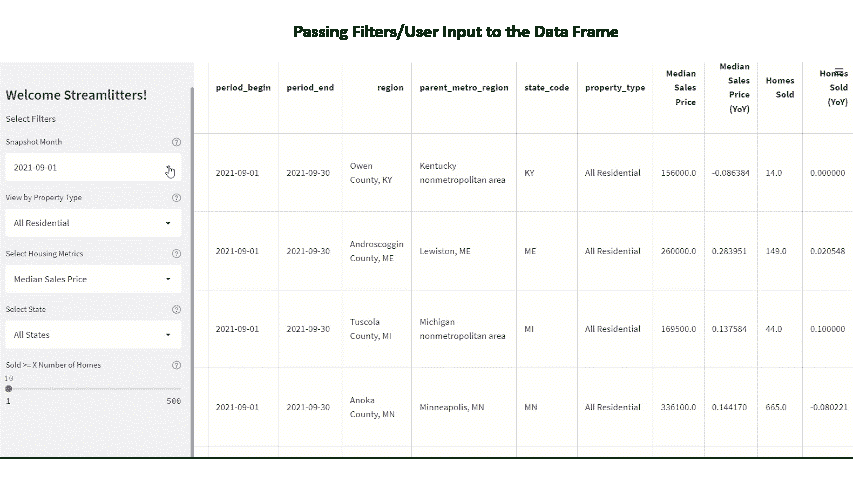

作者图片

这个看起来不错！需要注意的一点是，每次用户与小部件或过滤器交互时，应用程序都会重新运行并更新数据。如果您只有几个过滤器或者您的数据框不是很大，这可能不是什么大问题。然而，想象一下，当你有一个复杂的机器学习模型，有许多输入小部件和非常大的数据时，这可能会导致糟糕的用户体验。

那么我们如何解决这个问题呢？幸运的是，几个月前 Streamlit 引入了一对名为 *st.form* 和 *st.form_submit_button* 的命令来专门解决这个问题。您可以使用这些命令批量输入小部件，并通过单击一个按钮提交小部件值，这只会触发整个应用程序的一次重新运行！

# 带有提交按钮和表单的批量输入部件

让我们看看如何调整代码来使用表单和提交按钮来批量输入小部件。可以使用带有语句的*来声明表单，并且可以在一个表单中包含多个小部件。*

以下代码创建了一个包含 5 个小部件和一个名为“应用过滤器”的提交按钮的表单。用户可以随心所欲地与小部件进行交互，而不会导致重新运行。完成选择后，用户应该点击表单的提交按钮来更新应用程序。

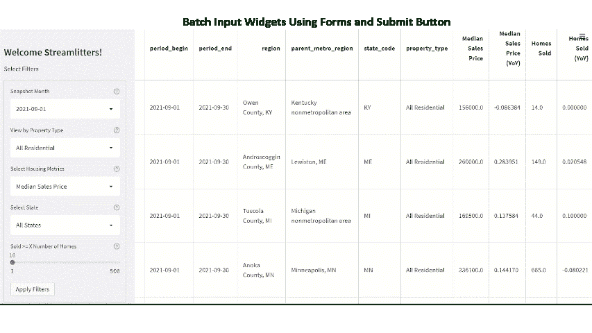

作者图片

# 构建应用程序的主界面

我们现在继续构建应用程序的主界面，我们将在其中添加应用程序的标题、品牌徽标(可选)、扩展器，最后是可视化县级住房市场指标的 choropleth 地图。

## 添加标题和品牌标志(并排)

*St.columns* 是一个非常有用的命令，它可以让你插入并排排列的容器。我们将使用 *st.columns* 创建两列，以便我们可以并排添加标题和品牌标志。

## 在标题下添加一个扩展器

我们还可以在标题下添加一个扩展器来提供关于应用程序的信息。扩展器可以扩展或折叠，以提供更多的细节，同时节省应用程序的空间，这是一个可以利用的巧妙功能。

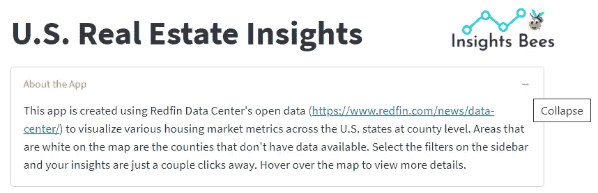

作者图片

## 将 Choropleth 地图添加到应用程序

现在让我们在应用程序中绘制 choropleth 地图。您可以按照下面的代码使用 follow 创建 choropleth 映射。该地图通过月份、财产类型和住房市场指标(例如，销售价格中值、售出房屋、销售与上市比率等)来可视化美国住房市场数据。)，取决于用户的输入。

在上面的代码中，第 4 行到第 20 行启动一个空的美国地图，并将地图的默认中心位置设置为(40，-96)。然后，它根据用户在“metrics”参数上的输入创建一个 choropleth 地图，该地图确定每个县的阴影。第 24 到 65 行向地图添加定制的工具提示。第 67 行将 choropleth 地图添加到应用程序的主界面。

需要注意的一件小事是，在代码的第 20 行，我使用了 *.geojson.add_to(us_map)* 而不是*。添加到(美国地图)。*这是我发现的一个小窍门，可以隐藏地图中的图例。如果用*。add_to(us_map)，*图例出现在地图中，但比例编号重叠，因此我从地图中移除了图例。

最后，我们将使用 *st.columns* 布局将一些文本覆盖到 choropleth 地图上。该文本显示在地图的右上角，指示 choropleth 地图显示的指标，具体取决于用户在侧栏的“选择住房指标”过滤器中的选择。这是使用第 2、3、69 和 70 行实现的。

图片作者(数据来源: [Redfin](https://www.redfin.com/news/data-center/) )

这就是县级住房市场洞察应用程序！借助 Streamlit 中各种简洁的功能和技巧，它比我们在初学者教程中创建的基本应用程序更加复杂和用户友好。感谢阅读，我希望你喜欢这篇文章。快乐学习！

*本教程使用的数据源:*

1.  [Redfin 数据中心](https://www.redfin.com/news/data-center/) : Redfin 月度房市数据——县级。这是由[*Redfin*](https://www.redfin.com/news/data-center/)*一家全国性的房地产经纪公司提供的一个开放数据集，你可以免费下载，也可以引用供你自己使用。*
2.  *[public.opendatasoft.com](https://public.opendatasoft.com/explore/dataset/georef-united-states-of-america-county/export/?disjunctive.ste_code&disjunctive.ste_name&disjunctive.coty_code&disjunctive.coty_name&sort=year):美国各县的边界。这是一个由[public.opendatasoft.com](https://public.opendatasoft.com/explore/dataset/georef-united-states-of-america-county/export/?disjunctive.ste_code&disjunctive.ste_name&disjunctive.coty_code&disjunctive.coty_name&sort=year)提供的开放数据集，你可以免费下载。*
3.  *[nrcs.usda.gov](https://www.nrcs.usda.gov/wps/portal/nrcs/detail/national/home/?cid=nrcs143_013697):FIPS 县代码。这是一个由美国农业部(USDA)提供的开放数据集，您可以免费下载。*

*[*你可以通过这个推荐链接报名 Medium 来支持我。通过这个链接注册，我将收到你的会员介绍费的一部分。谢谢大家！*](https://medium.com/@insightsbees/membership)*